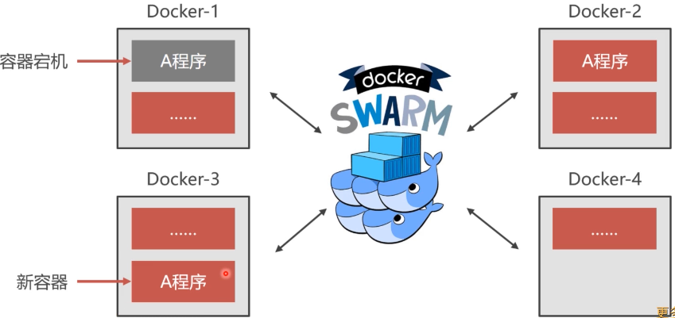
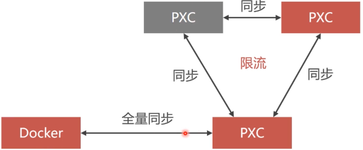
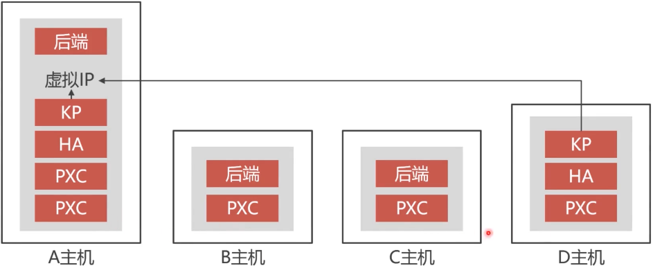
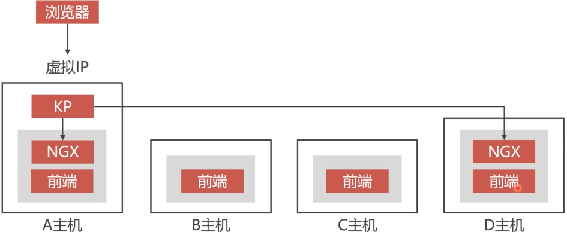

## Docker Swarm集群

```bash
#创建集群
docker swarm init
--listen-addr ip:port #管理者节点
--advertise-addr ip #广播地址,加入Swarm

#加入集群
docker swarm join-token manager
docker swarm join-token worker
#复制返 回结果语句，在需要加入集群的主机上执行

#查看Swarm集群节点和网络
docker node ls
docker network ls

#创建共享网络
docker network create -d overlay --attachable swarm_test

```

#### 4个主机安装5个pxc

```bash
docker pull percona/percona-xtradb-cluster
#重命名镜像
docker tag percona/percona-xtradb-cluster pxc
docker rmi percona/percona-xtradb-cluster

#创建挂载卷
docker volume create v1
docker volume create backup

#第一台主机部署两个节点
#剩下的三个主机部署三个节点 ，通过docker swarm join-token worker加入swarm集群
#通过swarm_test进行通讯
docker run -d -p 3306:3306 -e MYSQL_ROOT_PASSWORD=abc123456 -e CLUSTER_NAME=PXC -e XTRABACKUP_PASSWORD=abc123456 -v v1:/var/lib/mysq1 -v backup:/data --privileged --name=node1
--network=swarm test pxc

#同样创建其他几个节点
```

#### 容器集群



#### 和负载均衡的区别

haproxy除了负载均衡外还提供高可用的切换方案，一个节点挂了，还可以将请求路由到其他节点上，相对比较智能。

swarm没有那么智能，不提供负载均衡，仅仅提供容器状态的管理，保证可用容器的数量。

上图Docker-1中A程序挂了，可以在Docker-3中新增一个A程序运行。

#### 容器集群使用场景

* 容器集群不适合有状态程序，例如数据库、缓存等等

 

全量同步造成读写非常缓慢

#### 退出Swarm集群

```bash
docker swarm leave --force
#Manageri退出集群必须要使用-force参数
```

#### 删除集群节点

```bash
docker node demote 9v8gylomthgukkcuyi2cj3w6b
docker node rm 9v8gylomthgukkcuyi2cj3w6b #删除节点信息
#删除任何的节点必须要先停止它的Docker服务,service docker stop
#Manager-节点必须先降级成Worker Manager-节点，然后再去删除
```

#### docker图形界面

portainer

```bash
docker pull portainer/portainer
#开放Docker网络管理端口
vi /etc/sysconfig/docker
#在配置文件结尾添加开放Docker开发2375端口的参数OPTIONS='-Htcp://0.0.0.0:2375-H unix:///var/run/docker.sock
service docker restart

docker run -d -p 9000:9000 portainer/portainer -H tcp://192.168.99.104:2375 548b08c1a821887221d4ab9b22703f2e5c20b789 dcadb550416bfb0ecd0e5339
```

#### 四台主机之上PXC部署方案

**后端部署方案，都在proxy_test网络里，不用映射到公网**



**前端部署方案**



宿主机上设置虚拟IP，这样浏览器可以访问这个网段了。KP负责转发

