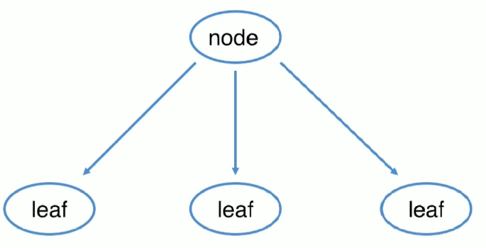

## 组合模式

* 定义：将对象组合成树形结构以表示”部分-整体”的层次结构
* 组合模式使客户端对单个对象和组合对象保持一致的方式处理
* 类型：结构型



#### 适用场景

* 希望客户端可以忽略组合对象与单个对象的差异时
* 处理一个树形结构时

#### 优点

* 清楚地定义分层次的复杂对象，表示对象的全部或部分层次
* 让客户端忽略了层次的差异，方便对整个层次结构进行控制
* 简化客户端代码
* 符合开闭原则

#### 缺点

*  限制类型时会较为复杂
* 使设计变得更加抽象

#### 相关设计模式

* 访问者模式

coding

课程 目录 价格

```java
 public abstract class CatalogComponent {
    public void add(CatalogComponent catalogComponent){
        throw new UnsupportedOperationException("不支持添加操作");
    }

    public void remove(CatalogComponent catalogComponent){
        throw new UnsupportedOperationException("不支持删除操作");
    }

    public String getName(CatalogComponent catalogComponent){
        throw new UnsupportedOperationException("不支持获取名称操作");
    }

    public double getPrice(CatalogComponent catalogComponent){
        throw new UnsupportedOperationException("不支持获取价格操作");
    }

    public void print(){
        throw new UnsupportedOperationException("不支持打印操作");
    }
}
```

```java
public class Course extends CatalogComponent {
    private String name;
    private double price;

    public Course(String name, double price) {
        this.name = name;
        this.price = price;
    }

    @Override
    public String getName(CatalogComponent catalogComponent) {
        return this.name;
    }

    @Override
    public double getPrice(CatalogComponent catalogComponent) {
        return this.price;
    }

    @Override
    public void print() {
        System.out.println("Course Name:"+name+" Price:"+price);
    }

}
```

```java
public class CourseCatalog extends CatalogComponent {
    private List<CatalogComponent> items = new ArrayList<CatalogComponent>();
    private String name;
    private Integer level;


    public CourseCatalog(String name,Integer level) {
        this.name = name;
        this.level = level;
    }

    @Override
    public void add(CatalogComponent catalogComponent) {
        items.add(catalogComponent);
    }

    @Override
    public String getName(CatalogComponent catalogComponent) {
        return this.name;
    }

    @Override
    public void remove(CatalogComponent catalogComponent) {
        items.remove(catalogComponent);
    }

    @Override
    public void print() {
        System.out.println(this.name);
        for(CatalogComponent catalogComponent : items){
            if(this.level != null){
                for(int  i = 0; i < this.level; i++){
                    System.out.print("  ");
                }
            }
            catalogComponent.print();
        }
    }

}
```

测试类

```java
public class Test {
    public static void main(String[] args) {
        CatalogComponent linuxCourse = new Course("Linux课程",11);
        CatalogComponent windowsCourse = new Course("Windows课程",11);

        CatalogComponent javaCourseCatalog = new CourseCatalog("Java课程目录",2);

        CatalogComponent mmallCourse1 = new Course("Java电商一期",55);
        CatalogComponent mmallCourse2 = new Course("Java电商二期",66);
        CatalogComponent designPattern = new Course("Java设计模式",77);

        javaCourseCatalog.add(mmallCourse1);
        javaCourseCatalog.add(mmallCourse2);
        javaCourseCatalog.add(designPattern);

        CatalogComponent imoocMainCourseCatalog = new CourseCatalog("慕课网课程主目录",1);
        imoocMainCourseCatalog.add(linuxCourse);
        imoocMainCourseCatalog.add(windowsCourse);
        imoocMainCourseCatalog.add(javaCourseCatalog);
        imoocMainCourseCatalog.print();

    }
}
```

> Container, arrayList addAll()