### Review of Linear Algebra

#### Graphics' Dependencies

* ##### Basicmathematics

  * lnearalgebra, calculus, statistics

* ##### Basic physics

  * Optics, Mechanics

* ##### MiSC

  * Signal processing
  * Numerical analysis

* ##### And a bit of aesthetics

#### An Example of Rotation

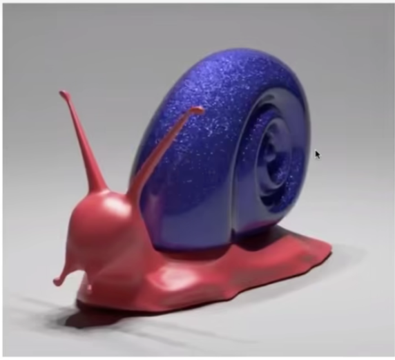

#### Vectors

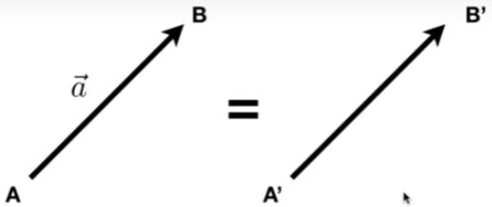

* Usually written as $$\vec{a}$$ or in bold **a**
* Or using start and end pants $$\overrightarrow{AB} = B-A$$
* Direction and length
* No absolute starting position
* Magnitude (length) of a vector written as $$\begin{Vmatrix}\vec{a}\end{Vmatrix}$$
* Unit vector
  - A vector with magnitude of 1
  - Finding the unit vector of a vector (normalization):$$\widehat{a} = \vec{a}/\begin{Vmatrix}\vec{a}\end{Vmatrix}$$
  - Used to represent directions

#### Vector Addition

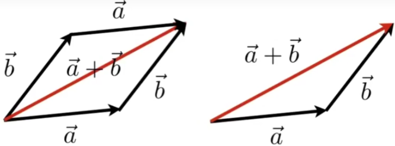

* GeometricalIy: Parallelogram law & Triangle law
* Algebraically: Simply add coordinates

#### Cartesian Coordinates

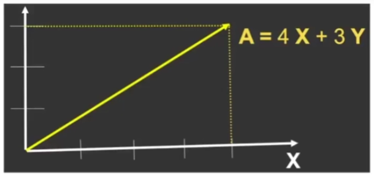

* $$X$$ and $Y$ can be any (usually orthogonal unit) vectors

  $$A = \begin{pmatrix} x \\y \end{pmatrix}$$    $$A^T = \begin{pmatrix} x,y \end{pmatrix}$$   $$\begin{Vmatrix}A\end{Vmatrix} = \sqrt{x^2+y^2}$$

  

### Vector MuItipIication

* Dot product
* Cross product
* Orthonormal bases and coordinate frames

#### Dot  (scalar) Product

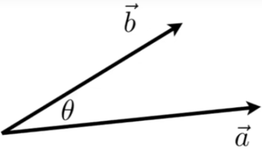

$$\overrightarrow{a} \cdot \overrightarrow{b} = \begin{Vmatrix}\overrightarrow{a}\end{Vmatrix}\begin{Vmatrix}\overrightarrow{b}\end{Vmatrix}\cos\theta$$

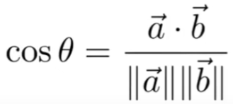

* For unit vectors

  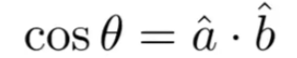

* Properties

  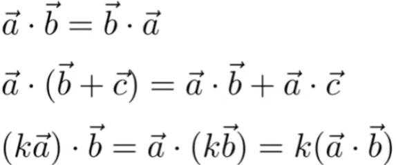

#### Dot Product in Cartesian Coordinates

* Component-wise multiplication, then adding up

  * in 2D

    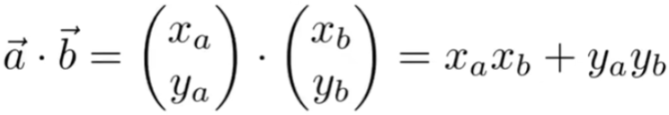

  * In 3D

    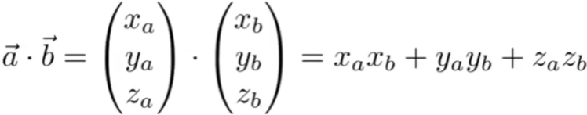

#### Dot Product in Graphics

* Find angle between two vectors
  (e.g. cosine of angle between light source and surface)
* Finding projection of one vector on another

#### Dot Product for Projection

#### Dot Product in Graphics

* Measure how close two directions are
* Decompose a vector
* Determine forward/ backward

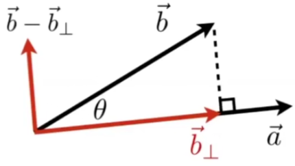

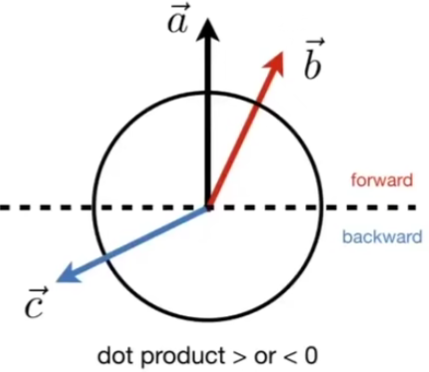

方向是否一致

#### Cross (vector) Product

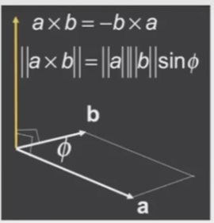

* Cross product is orthogonal to two initial vectors
* Direction determined by right-hand rule
* UsefuI in constructing coordinate systems (later)

#### Cross product: Properties

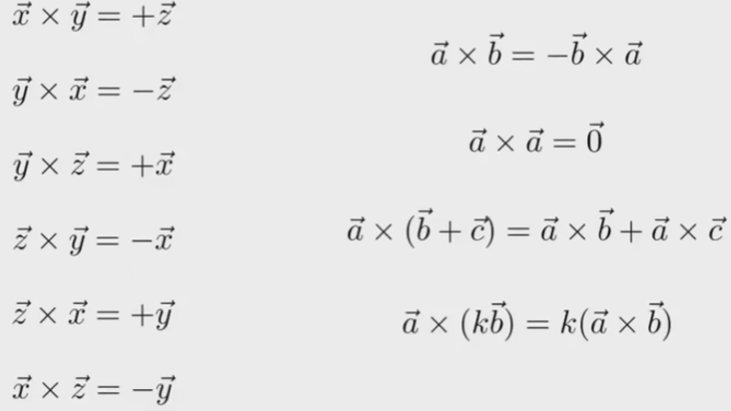

opengl 是左手坐标系

#### Cross Product: Cartesian FormuIa?

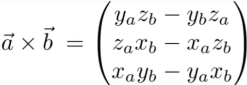

* Later in this lecture

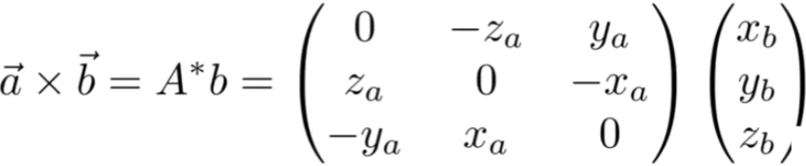

#### Cross Product in Graphics

* Determine left / right
* Determine inside / outside

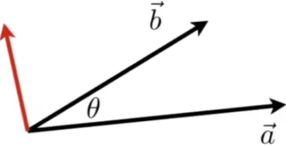

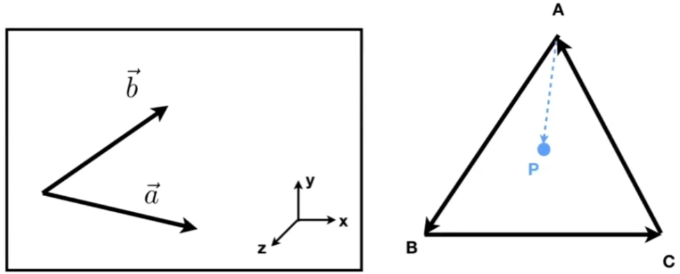

#### Orthonormal Bases / Coordinate Frames

* lmportant for representing points, positions, locations
* often, many sets of coordinate systems
  - GIobaI, local，world, model, parts of model (head,
    hands,...）
* CriticaI issue is transforming between these systems/
  bases
  - Atopic for next week

#### Orthonormal Coordinate Frames

* Anyset of 3 vectors (In 3D) that

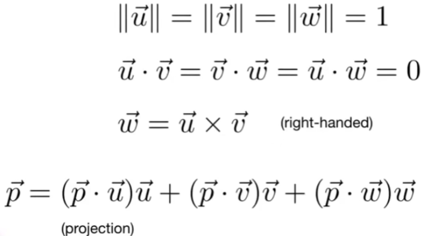

### Matrices

* Magical 2D arrays that haunt in every CS course
* ln Graphics, pervasively used to represent transformations 
  * Translation，rotation，shear, scale
    (more details in the next lecture)

#### What is a matrix

* Array Of numbers (m×n=m rows，n columns)

  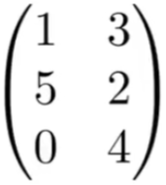

* Addition and multiplication by a scalar are trivial:
  element by element

#### Matrix-Matrix MuItipIication

* \# (number of)columns in A must =\# rows in B
  (MxN)(NxP)=(MxP)

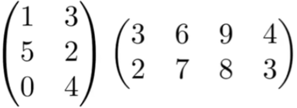

* EIement(i，j) in the product is
  the dot product of row **i** from A and column **j** from B

* Properties
  - **Non-commutative**
    (**AB** and **BA** are different in general)
  - Associative and distributive （结合律和分配率）
    * (AB)C=A(BC)
    * A(B+C)=AB+AC
    * (A+B)C=AC+BC

* Treat vector as a column matrix (m x 1)
* Key for transforming points (next lecture)

* OfficiaI spoiler:2D reflection about y-axis

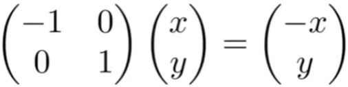

#### Transpose Of a Matrix

* Switch rows and columns (ij > ji)

* Property

  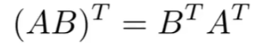

#### ldentity Matrix and lnverses

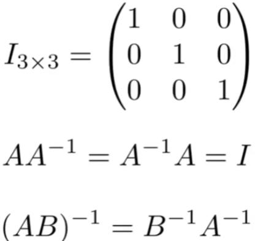

#### Vector multiplication in Matrix form

* Dot product?

  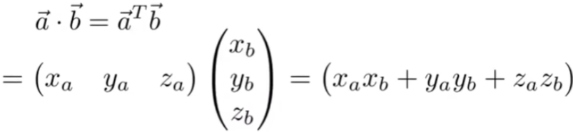

* Cross product?

  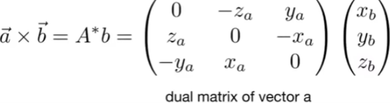

  

