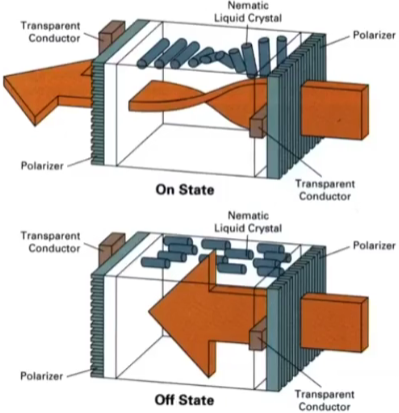
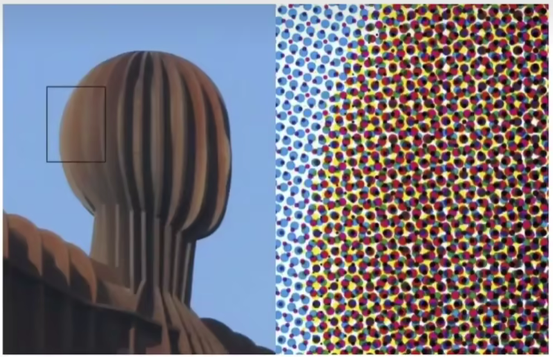

### Rasterization 1 (Triangles)

* What's near plane's l，r，b，t then?
  * If explicitly specified , good
  * Sometimes people prefer:
    vertical field-of-view (fovY) and aspect ratio
    (assume symmetry i.e. l=-r，b=-t )


* How to convert from fovY and aspect to  l,  r，b，t?

 

#### What's after MVP?

* ModeI transformation (placing objects)
* View transformation (placing camera)
* ProJection transformation
  * Orthographic projection (cuboid to "canonical” cube $[-1，1]^3$）
  * Perspective projection (frustum to "canonical” cube)


#### CanonicaI Cube to Screen

* What is a screen?
  * An array of pixels
  * Size of the array : resolution
  * A typical kind of raster display
* Raster \==screen in German
  * Rasterize \== drawing on to the screen
* Pixel(FYI，short for picture element")
  * For now: A pixel is a little square with uniform color
  * CoIor is a mixture of (red,  green, blue)
*   Defining the screen space
  * Slightly different from the "tiger book"

 

Pixels indices are in the form Of（x，y), where both x and Y are integers
Pixels，indices are from（0，0）to (width-1，height-1)
Pixel (x，y) is centered at  (x+0.5，y+0.5）
The screen covers range （0，0）to ( width, height ) 


* lrrelevant to z
* Transform in xy plane:$[-1,1]^2$ to [0，width] x [0，height]
* View port transform matrix.

$$M_{viewport} = \begin{pmatrix}\frac{width}2 & 0 & 0 & \frac{width}2\\ 0 & \frac{heiht}2 & 0 & \frac{height}2\\ 0& 0& 1 &0 \\ 0&0&0&1\end{pmatrix}$$

#### Television-Raster Display CRT


隔行扫描，视觉暂留

####  Frame Buffer:Memory for a Raster Dislay

  

#### Flat Panel Displays


#### LCD (Liquid Crystal Display) Pixel

Principle.block or transmit light by twisting polarization
lllumination from backlight (e.g.fluorescentorLED)
lntermediate intensity levels by partial twist




#### LED Array Display


Light emitting diode array


#### Electrophoretic (Electronic Ink) Display


#### Triangle Meshes

3D


2D


#### Triangles-Fundamental Shape Primitives

Why triangles?

* Most basic polygon

  * Break up other polygons

* Unique properties

  * Guaranteed to be planar

  * Well-defined interior

  * WeIl-defined method for interpolating values at vertices over triangle (barycentric interpolation)


#### Sampling a Function

Evaluating a function at a point is sampling.
We can discretize a function by sampling


####  What Pixel Values Approximate a Triangle?


Input: Position of triangle vertices projected on screen

Output: set of pixel values approximating triangle

```c++
for (int x = 0 ;x <xmax ; ++x)
    output[x] = f(x);
```

Sampling is a core idea in graphics
We sample time（1D), area（2D), direction (2D), volume (3D) ...

#### Sample if each pixel center is inside Triangle


####  Define Binary Function: inside (tri , x, y)

x,y not necessarily integers


$$ inside(t,x,y)=\begin{cases}1 & Point (x,y)\ in\ triangle\ t \\ 0& otherwise\end{cases}$$


####  Rasterization = Sampling A 2D Indicator Function

```c++
for(int x = 0; x <xmax ; ++x)
    for(int y = 0; y < ymax ;++y)
        images[x][y] = inside(tri,x+0.5,y+0.5);
```


#### Inside? Three Cross Products!


P1P2 x P1Q  叉乘判断是在P1和P2的左侧和右侧

依次


#### Edge Cases (Literally)

ls this sample point covered by triangle1，triangle2，or
 both?


要么不做处理，要么做特殊处理（上边和左边则内）


#### Checking All Pixels on the Screen?


#### Incremental Triangle Traversal (Faster?)


#### Real LCD Screen Picels (Closeup)


bayer(right)

绿点比蓝点多


#### Aside: What About Other Display Methods?



Color print: observe  half-tone pattern

#### Assume Dispaly Pixels Emit Square of light


#### So,If We Send the Display the Sampled Signal


 

Jaggies!


锯齿一直是光栅化图形学待解决的问题

抗锯齿，反走样

