### Rasterization 2 (Antialiasing and Z-buffering)

##### Sampling is Ubiquitous in Computer Graphics

#### Photograph = Sample Image Sensor Plane

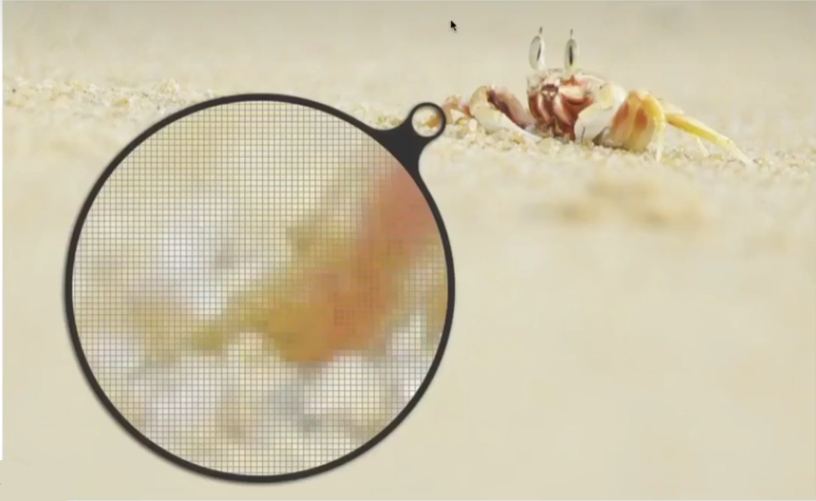

#### Video = Sample Time

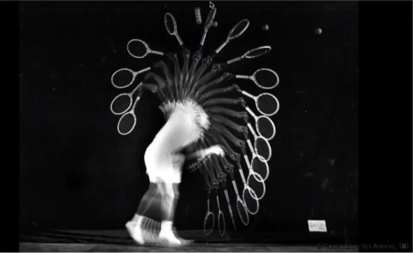

#### Sampling Artifacts (Errors / Mistakes / lnaccuracies) in Computer Graphics

#### Moire Patterns in Imaging

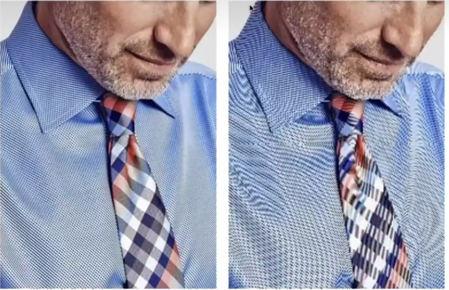

Skip odd rows and columns

#### Wagon Wheel Illusion (False Motion)

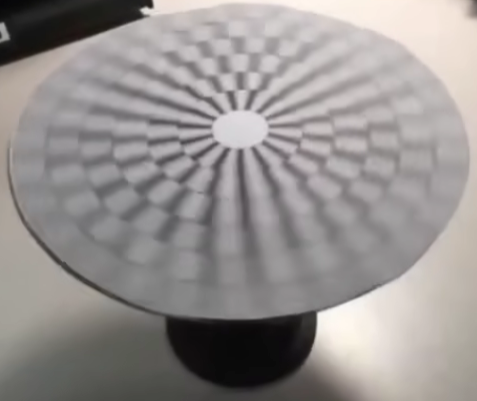

有的圈正转，有的反转，人眼采样跟不上

#### Sampllng Artifacts in Computer Graphics

Artifacts due to sampling - "Aliasing

* Jaggies一sampling in space
* Moire一undersampling images
* Wagon wheel effect一sampling intime
* [Many more]...

Behind the Aliasing Artifacts

* Signals are changing too fast (high frequency),
* but sampled too slowly

### Antialiasing Idea: Blurring (Pre-Filtering) Before Sampling

####   Rasterization: Point Sampling in Space

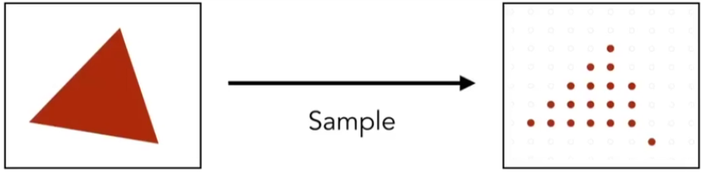

Note Jaggies in rasterized triangle where pixel values are pure red or white

 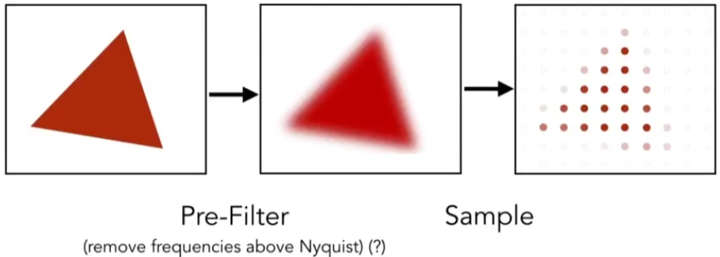

Note antialiased edges in rasterized triangle where pixel values take intermediate values

#### Antialiasing vs Blurred Aliasing

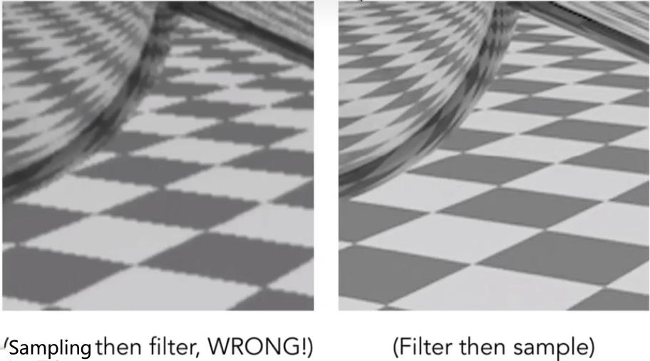

### Frequency Domain 频域

 Frequencies Cos2πfx

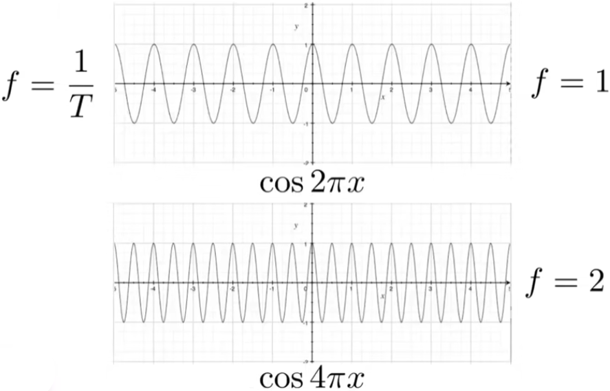

#### Fourier Transform

Represent a function as a weighted sum Of sines and
cosmes

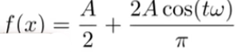

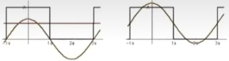

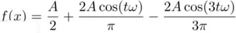

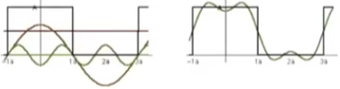

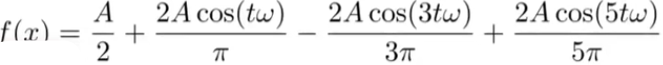

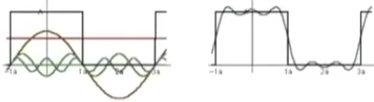

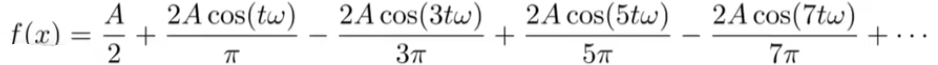

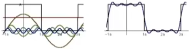

。。。

#### Fourier Transfor Decomp A Signal Into Frequencies

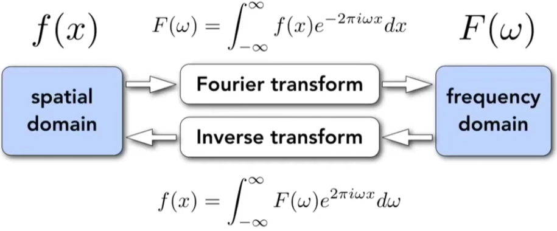

Recall $e^{ix} = cos\ x + i\ sin\ x$

#### Higher Frequencies Need Faster Sampling

 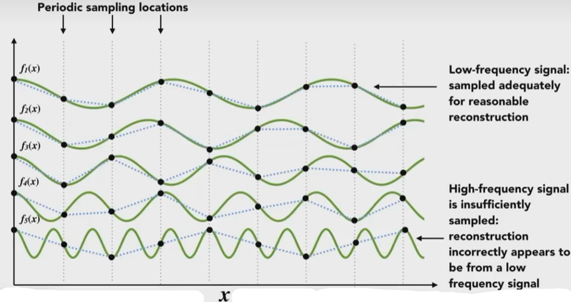

 

#### UnderSampling Creates Frequency Aliases

  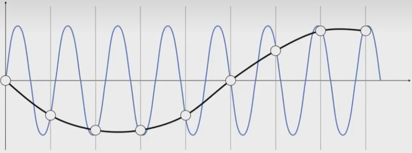

High-frequency signal is insufficiently sampled : samples erroneously appear to be from a low-frequency signal

Two frequencies that are indistinguishable at a given sampling
T are called "aliases"

两个完全不同的函数，得到的采样结果完全一样

#### Filtering = Getting rid of certain frequency contents

#### Visualizing Image Frequency Content

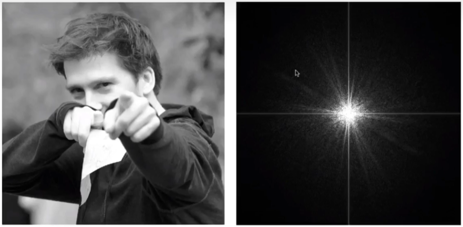

中心低频，周围高频

亮度决定信息量

#### Filter Out Low Frequencies Only (Edges)

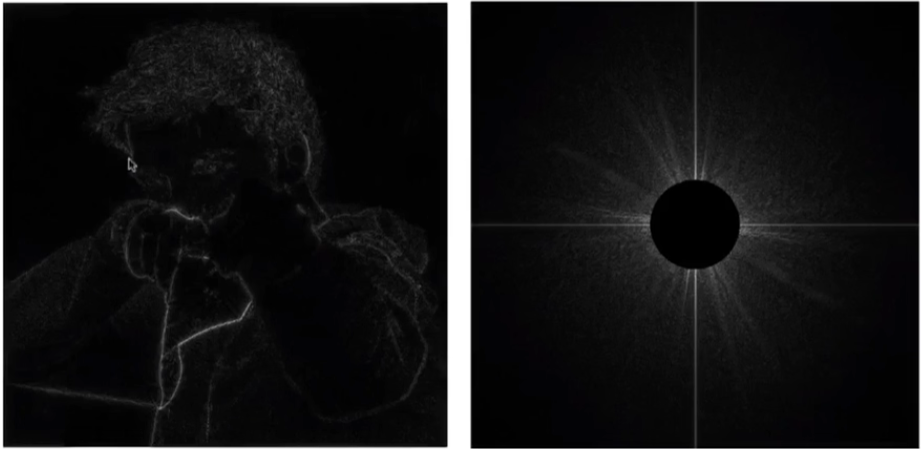

 High-pass filter

高频看出来是边界

 Filter Out High Frequencies (Blur)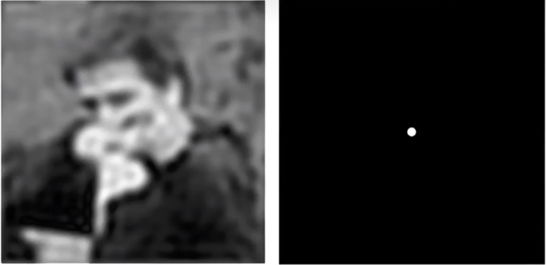

Low-pass filter

#### Filter Out Low and High Frequencies

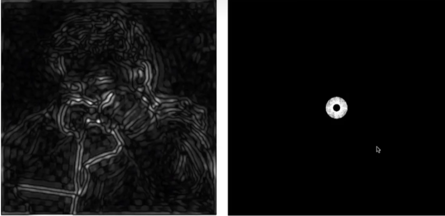

水波纹

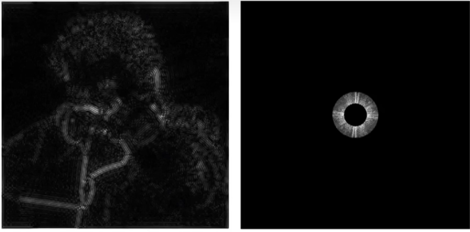

数字图像处理

现在多数通过机器学习来做了

 

#### Filtering = Convolution（= Averaging)

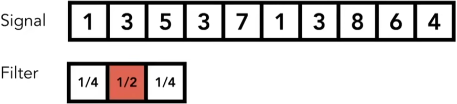

Point-wise local averaging in a " sliding window"

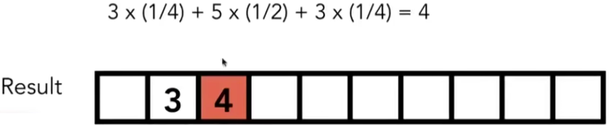

#### Convolution Theorem

Convolution in the spatial domain is equal to multiplication
in thefrequency domain,and Vice versa
Option1，

* Filterbyconvolutioninthespatialdomain

Option2：

* Transform to frequency domain (Fourier transform)
* Multiply by Fourier transform of convolution kernel
* Transform back to spatial domain(inverse Fourier)

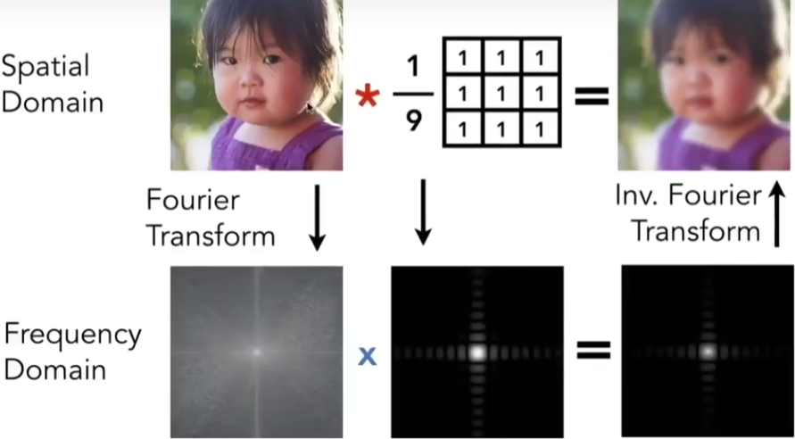

低通滤波 

时域上乘积 等于 频域上卷积

Box Filter

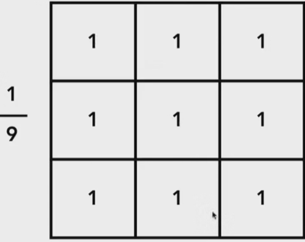

1/9 不影响图像整体亮度

Wider Filter Kernel = Lower Frequencies

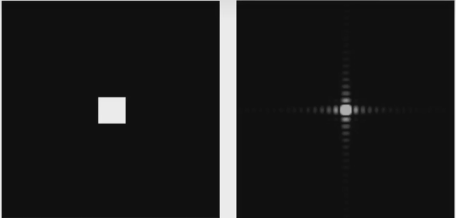

#### Sampling=Repeating Frequency Contents

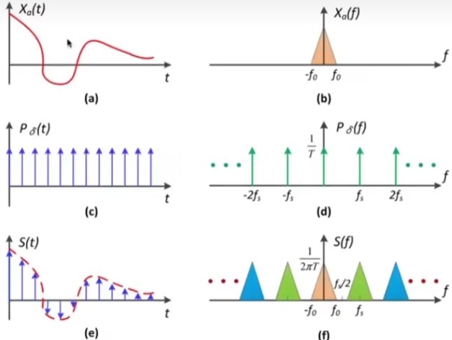

#### Aliasing = Mixed Frequency Contents

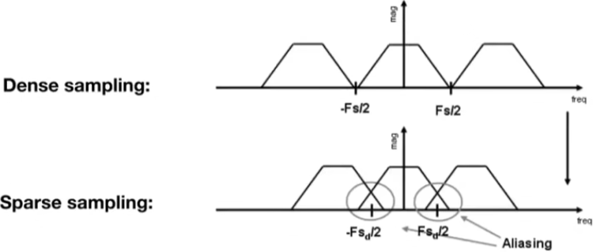

采样间隔变大（稀疏），频谱会变小，走样

 

How Can We Reduce Aliasing Error?

Option1：lncrease sampling rate

* Essentially ncreasing the distance between replicas in the Fourier domain
* Higher resolution displays, sensors, frame buffers
* But:costly & may need very high resolution

Option 2：Antialiasing

* Making Fourier contents “narrower" before repeating
* i.e.Filtering out high frequencies before sampling

模糊低通滤波

Antialiasing= Limiting, then repeating

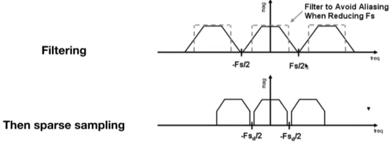

A Practical Pre-Filter

A 1 pixel-width box filter ( low pass , blurring)

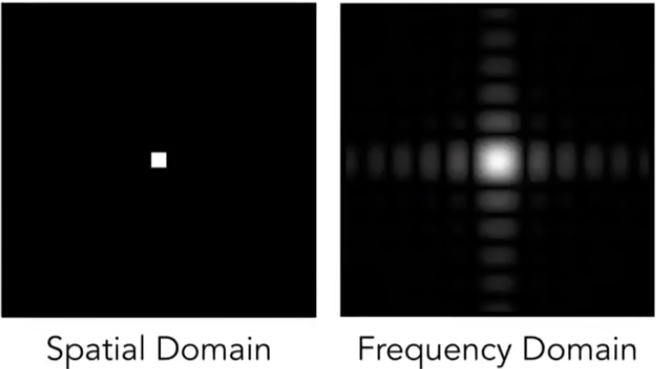 

#### Antialiasing By Averagin Values in Pixel Area

Solution:

* Convolvef(x,y)bya1-pixelbox-blur
  * Recall:convolving=filtering=averaging
* Then sample at every pixel's center

#### Antialiasing By  Computing Average Pixel Value

ln rasterizing one triangle, the average value inside a pixel
area of f(x，y) = inside(triangle, x, y) is equal to theareaof the
pixel covered by the triangle

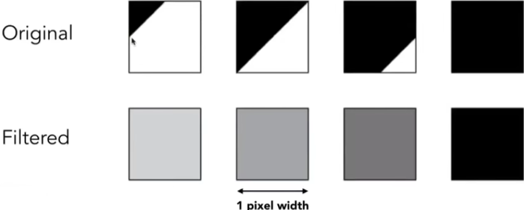

### Antialiasing By Supersampling (MSAA)

####  Supersampling

Approximate the effect of the 1-pixel box filter by sampling multiple locations within a pixel and averaging their values.

#### Point Sampling : One Sample Per Pixel

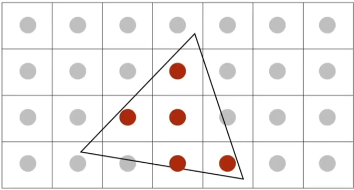

#### Supersampling:Step 1

Take NxN Samples in each pixel.

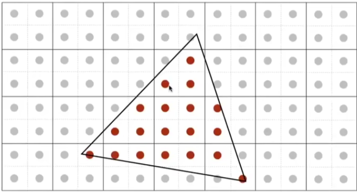

#### Supersampling:Step 2

Average the NXN samples "inside" each pixel.

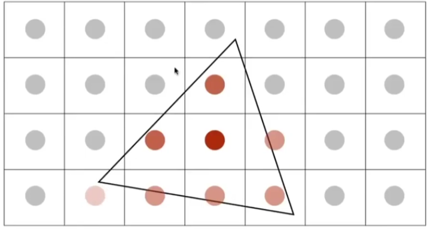

SupersampIing:Step 2

This is the corresponding signal emitted by the display

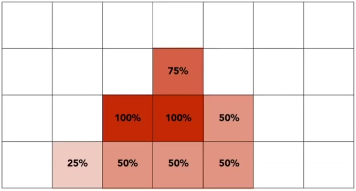

No free lunch!

* What's the cost of MSAA?

Milestones (personal idea)

* FXAA (Fast Approximate AA) 换边界
* TAA (Temporal AA)   复用上一帧

 Super resolution / super sampling

* From low resolution to high resolution
* Essentially still "not enough samples" problem
* DLSS (Deep Learning Super Sampling) （猜测）

