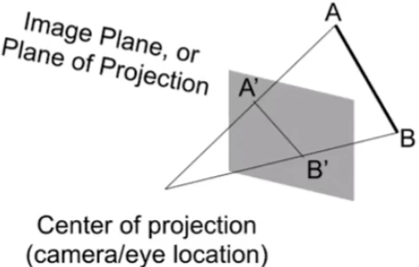

### Transformation Cont

 旋转相反的方向,

 矩阵的转置等于矩阵的逆，

正交矩阵

 

#### 3D Transformations

##### Use homogeneous coordinates again:

 

 

 

#### 3D Rotations

#### Rodrigues' Rotation Formula

旋转矩阵不适合做插值， ->四元数

####  View / Camera Transformation

* What is view transformation?
* Think about how to take a photo
  * Find a good place and arrange people (model transformation)
  * Find a good "angle" to put the camera (view transformation)
  * Cheese! (proJection transformation)

* How to perform view transformation?

* Define the camera first

    

* Key observation
  * If the camera  and all objects move together, the "photo" will be the same

* How about that we always transform the camera to
  * The origin, up at Y , look at -Z
  * And transform the objects along with the camera

* Transform the camera by $M_{view}$
  * SO it's located at the origin, up at Y look at -Z

* $M_{view}$ in math?
  * TransIates e to origin
  * Rotates g to -Z
  * Rotates t to Y
  * Rotates (g x t) To X
  * Difficult to write！

 

* $M_{view}$ in math?

  * Let's write $M_{view} = R_{view}Y_{view}$

  * Translate e to origin

    $$T_{view}=\begin{bmatrix}1&0&0&-x_{e}\\ 0&1&0&-y_{e}\\0&0&1&-z_{e}\\0&0&0&-1\\\end{bmatrix}$$

  * Rotate g to -Z ,t to Y, (g x t) To X

  * Consider its inverse rotation :X to ( g x t )，Y to t，Z to -g

$$R^{-1}_{view}=\begin{bmatrix}x_{\widehat{g}\times\widehat{t}}&x_{t}&x_{-g}&0\\ y_{\widehat{g}\times\widehat{t}}&y_{t}&y_{-g}&0\\z_{\widehat{g}\times\widehat{t}}&z_{t}&z_{-g}&0\\0&0&0&1\\\end{bmatrix}$$

$$\Downarrow$$

$$R_{view}=\begin{bmatrix}x_{\widehat{g}\times\widehat{t}}&y_{\widehat{g}\times\widehat{t}}&z_{\widehat{g}\times\widehat{t}}&0\\ x_{t}&y_{t}&z_{t}&0\\x_{-g}&y_{-g}&z_{-g}&0\\0&0&0&1\\\end{bmatrix}$$

相机移到原点

* **Summary**
  * Transform objects together with the camera
  * Until camera's at the origin,up at Y ,look at -Z
* Also known as Model View Transformation
* But why do we needthis ?
  For projection transformation !

#### Projection Transformation

* Projection in Computer Graphics
  * 3D to 2D
  * Orthographic projection
  * Perspective projection

正交投影不会带给人近大远小，透视投影会

 

#### Orthographic Projection

* A simple way of understanding
  * Camera located at origin, looking at -Z，up at Y (Iooks familiar?)
  * Drop Z coordinate
  * Translate and scale the resulting rectangle to $\begin{bmatrix}-1,1\end{bmatrix}^2$

* lngeneral
  * We want to map a cuboid $[l,r]\times[b,t]\times[f,n]$ to
    the"canonical（正则、规范、标准）" cube$[-1,1]^3$
* Slightly different orders (to the "simple way")
  * Center cuboid by translating
  * Scale into "canonical” cube
* Transformation matrix?
  * Translate (center to origin) first, then scale (length/width/height to 2）

* Caveat
  * Looking at / along -Z is making near and far not intuitive(n>f)
  * FYI that's why OpenGL (a Graphics API ) uses left hand coords.

* Most common in Computer Graphics, a，visual system
* Further objects are smaller
* Parallel lines not parallel; converge to single point

#### Perspective Projection

* Before we move on
  Recall:property of homogeneous coordinates
  -(x, y ，z，1),(kx，ky，kz, k != 0) ,(xz, yz, $z^2$, z != 0）all represent the same point(x,y,z) in 3D
  * e.g.（1，0，0，1）and（2，0，0，2）both represent（1，0，0)
* Simple, but useful

* How to do perspective projection
  * First "squish" the frustum into a cuboid(n->n，f->f)($M_{persp\rightarrow ortho}$->)
    DOorthographicprojection（$M_{ortho}$，already known!)

* lnorder to find a transformation
  * RecaIl the key idea: Find the relationship between transformed points$(x',y',z')$and the original points（x，y，z)

* So the "squish" (persp to ortho) projection does this 

  

* Already good enough to figure out part of $M_{persp\rightarrow ortho}$

  

* How to figure out the third row of $M_{persp\rightarrow ortho}$
  * Any information that we canuse?
* Observation:the third row is responsible for z
  * Any point on the near plane will not change
  * Any point's z on the far plane will not change
* Any point on the near plane will not change

* So the third row must be of the form (0 0 A B)

  

* What do we have now?

* Any point's z on the far plane will not change

* Solve for A and B

* Finally,every entry in $M_{persp\rightarrow ortho}$ is known！
* What's next?
  * Do orthographic projection $M_{ortho}$ to finish
  * $M_{persp} = M_{ortho}M_{persp\rightarrow ortho}$

