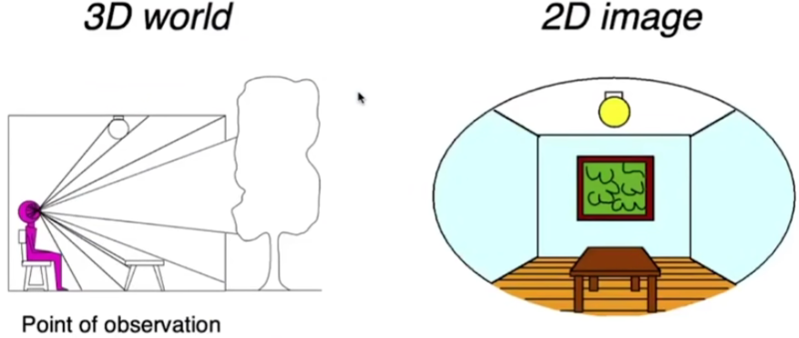
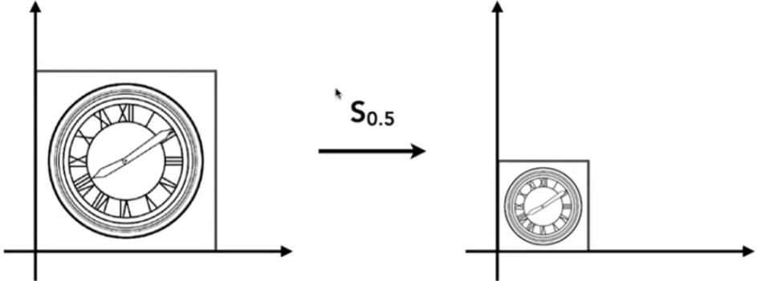
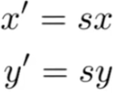
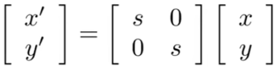
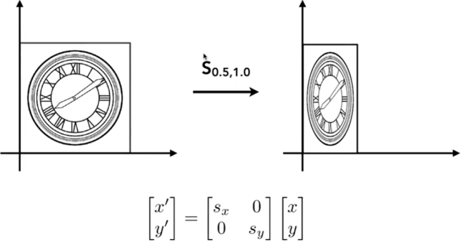

#### Transformation 

####  Why Transformation?

 

Viewing: (3D to 2D) projection

#### Scale Matrix

 

#### Scale (Non-Uniform)

#### Reflection Matrix

####  Shear Matrix

 

#### Linear Transforms = Matrics

#### Transiation

#### Why Homogeneous Coordinates

* Translation cannot be represented in matrix form

(So,translation is Not linear transform!)

* But we don‘t want translation to be a special case
* ls there a unified Way to represent all transformations?
  (and what's the cost?)

#### Solution:Homogenous Coordinates

Add a third coordinate ( w-coordinate )

#### Matrix representation Of translations

#### Valid operation if w-coordinate Of result is 1 or 0

* vector+vector=vector
* point - point=vector
* point + vector = point
* point + point = ??

#### ln homogeneous coordinate:

#### Affine Transformations

##### Affine map = linear map + translation

##### Using homogenous coordinates:

#### 2D Transformation

#### Inverse Transform

$$M^{-1}$$

$$M^{-1}$$is the inverse Of transform M in both a matrix and geometric sense

#### Transiate then Rotate

 

#### TransformOrdering Matters!

#### Matrix multiplication is not commutative

 

#### Note that matrices are applied right to left.

#### Composing  Transforms

Sequenceofaffinetransforms$A_{1}$,$A_{2}$,$A_{3}$,…

* Composebymatrixmultiplication
  * VeryimportantfOrperformance!

#### Decomposing Complex Transforms

How to  rotate around a given point c?

1. Translate center to origin

2. Rotate

3. Translate back

#### Matrix representation?

#### 3D Transformations

Use homogeneous coordinates again:

#### 3D Transformations

Use 4×4 matrices for affine transformations

