### Shading 3 (Texture Mapping Cont.)

#### interpolation Across Triangles

Why do we want to interpolate?

* Specify values at vertices
* Obtain smoothly varying values across triangles

What do we want to interpolate?

* Texture coordinates, colors, normal vectors , ...

How do we interpolate?

* Barycentric coordinates 

barycentric Coordinates
A coordinate system for triangles ( α,β, γ)  均非负

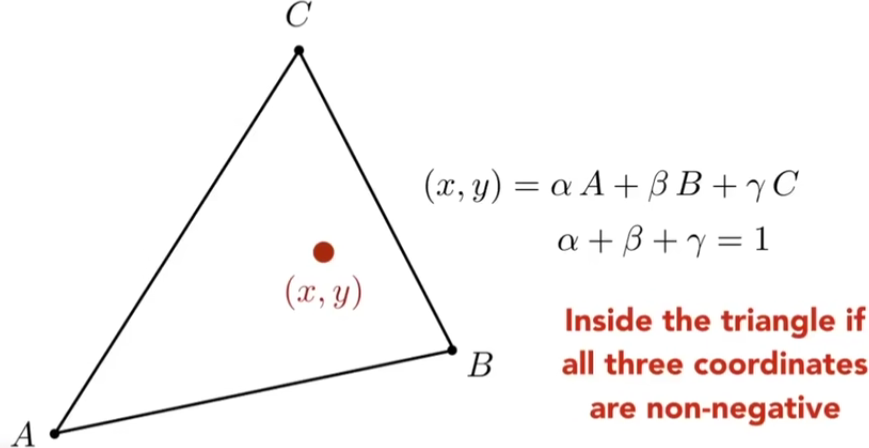

What's the barycentric coordinate of A?

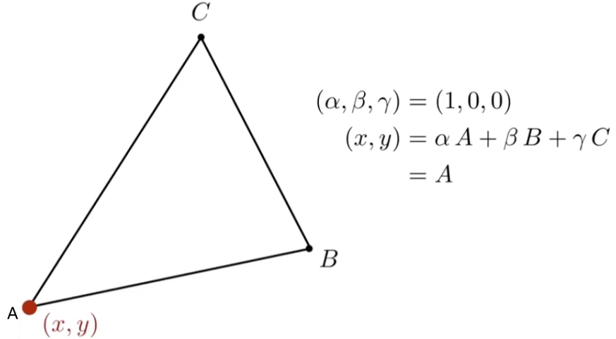

#### barycentric Coordinates

Geometric viewpoint — proportional areas

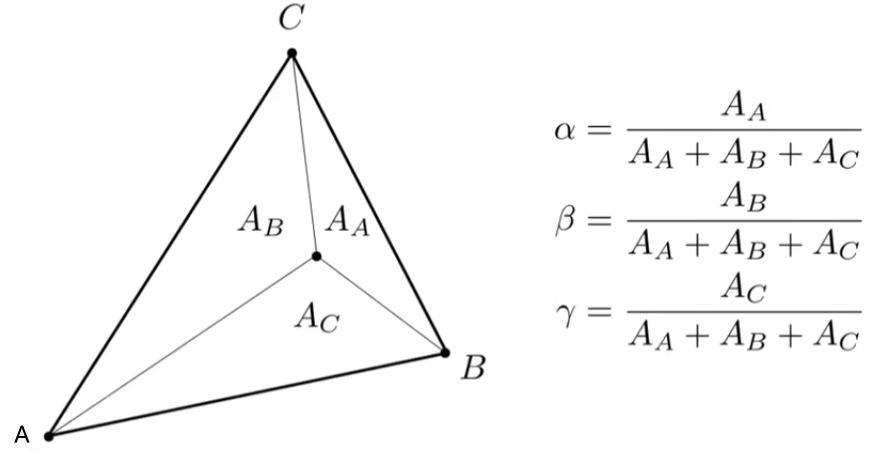

What's the barycentric coordinate of the centroid?

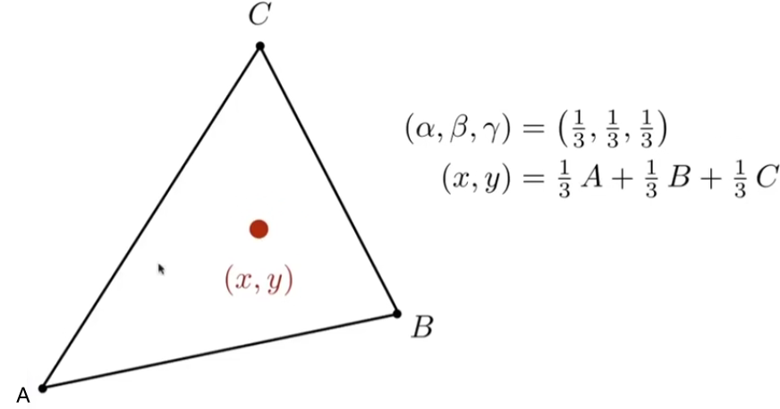

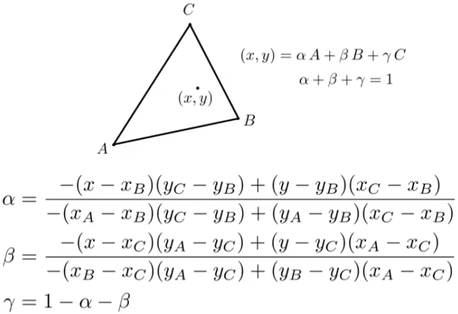

#### Linearly interpolate values at vertices

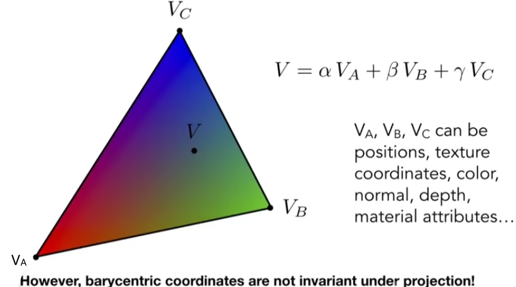

投影后位置会变化，取三维位置信息计算。

#### Simpie Texture Mapping: Diffuse Color

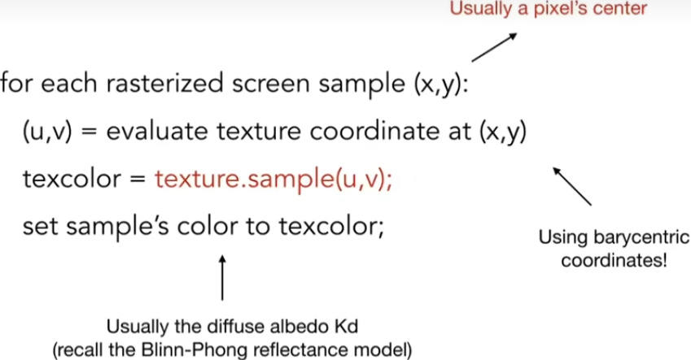

### Texture Magnification

### (What if the texture is too small?)

#### Texture Magnification - Easy Case

Generally don't want this — insufficient texture resolution
A pixel on a texture — a texel(纹理元素、纹素)

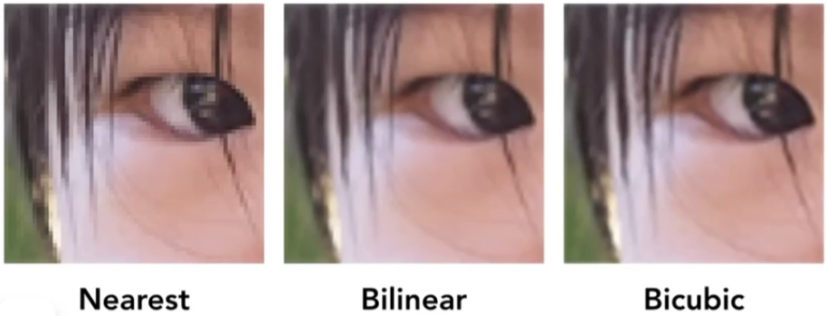

#### Bilinear interpolation 

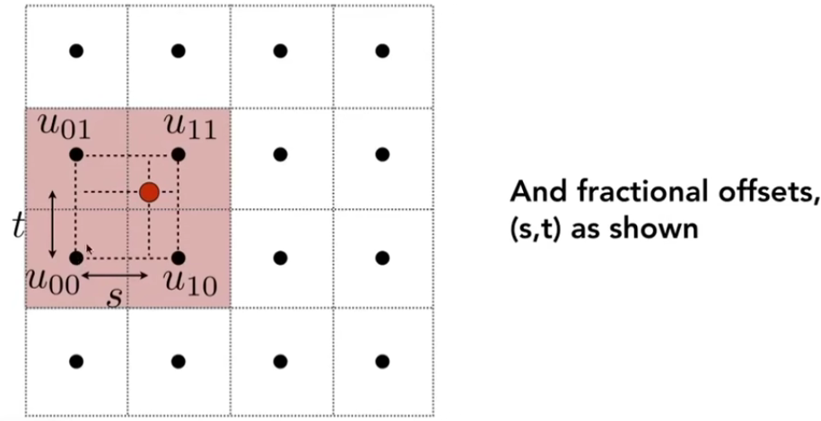

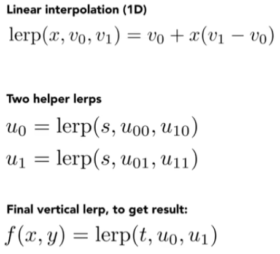

Bilinear interpolation usually gives pretty good results
at reasonable costs

bicubic 临近16个点

### Texture Magnification (hard case)

### (What if the texture is too large?)

Point barnpling Textures — Problem

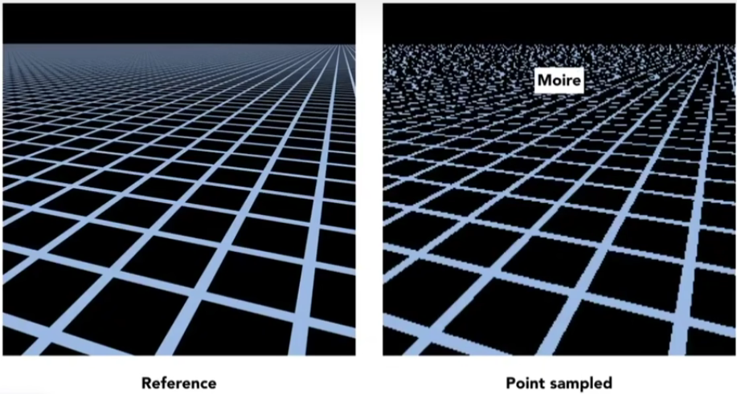

#### Screen Pixel " Footprint" in Texture

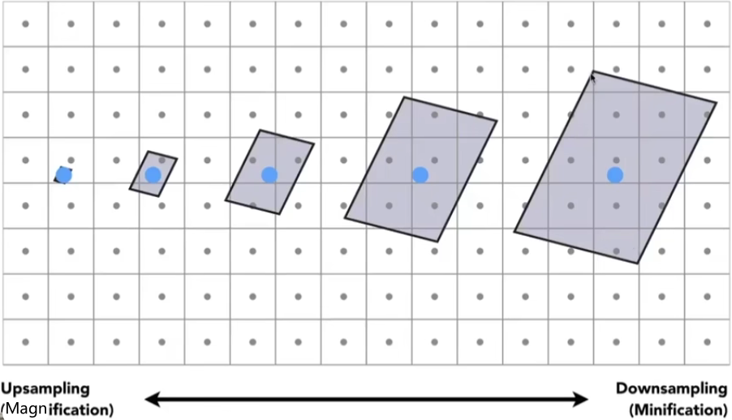

#### Antiaiiaslng — Supersampling?

Will supersampling work?

* Yes, high quality, but costly
* When highly minified, many texels in pixel footprint
* Signal frequency too large in a pixel
* Need even higher sampling frequency

Let's understand this problem in another way

* What if we don't sample?

* Just need to get the average value within a range!

#### Point Query vs. (Avg.) Range Query

#### Mipmap

#### Allowing (fast, approx., square) range queries

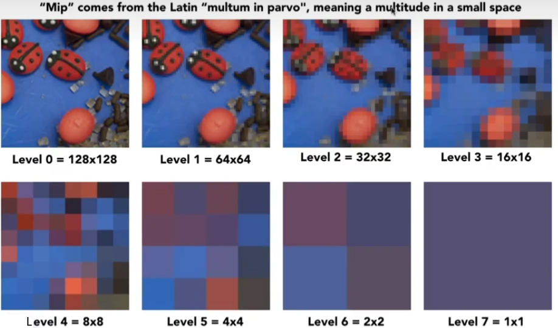

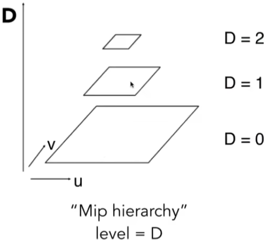

图像金字塔同理 ， 额外存储量，多了1/3

what is the storage overhead of a mipmap?

#### Compuling Mipmap Level D

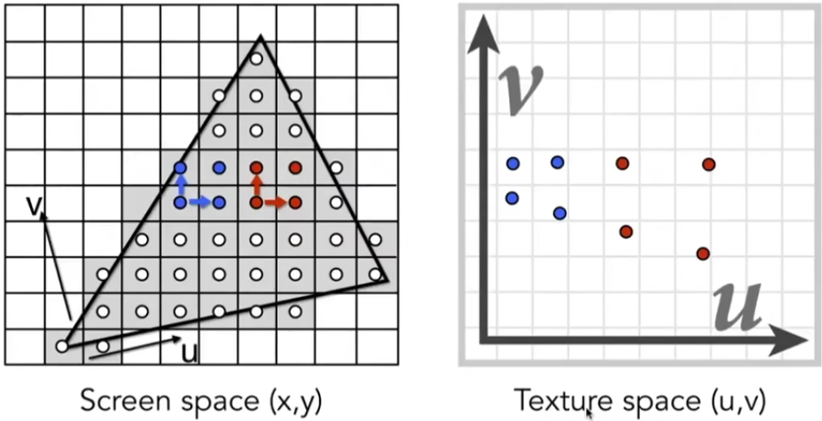

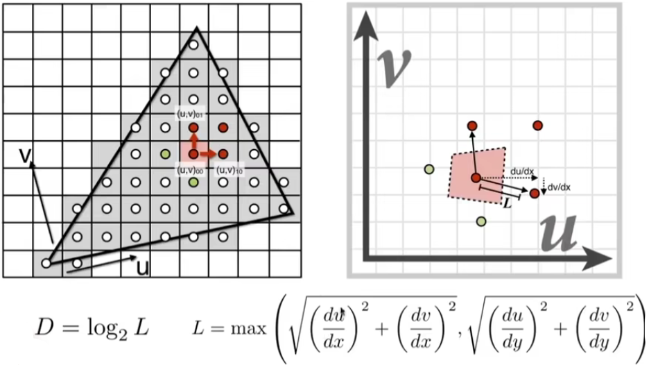

在第几层查uv texture值

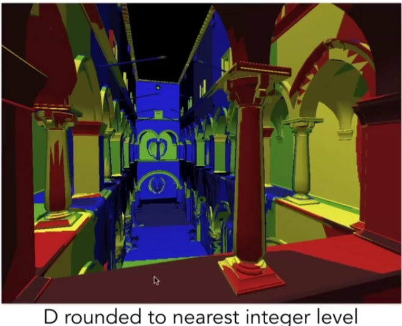

#### Trilinear interpolation

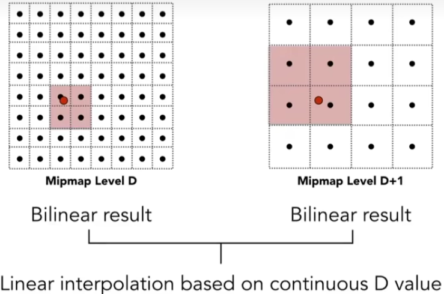

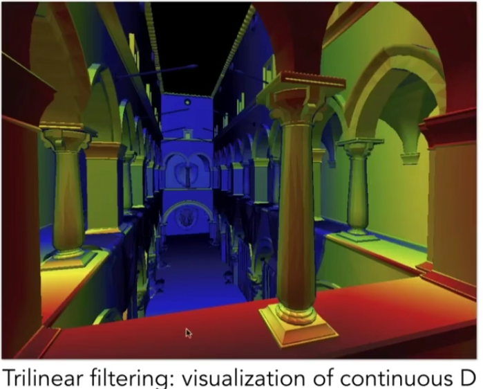

#### Mipmap Limitations

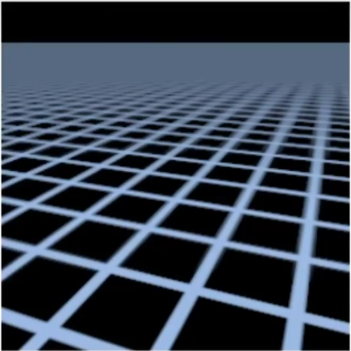

Overblur Why?          Mipmap trilinear sampling

#### Anisotropic Filtering（各向异性过滤）

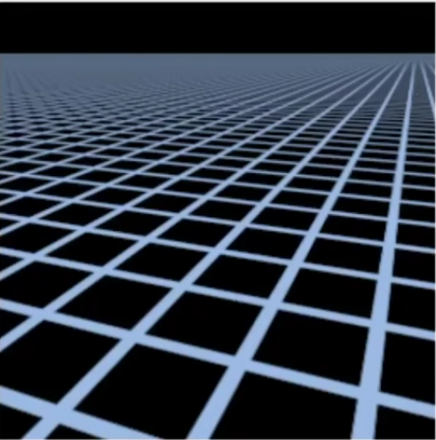

##### Better than Mipmap!

Ripmaps and summed area tables

* Can look up axis-aligned

* rectangular zones
*  Diagonal footprints still a problem

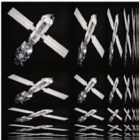

#### Irreguiac Pixel Footprint in Texture

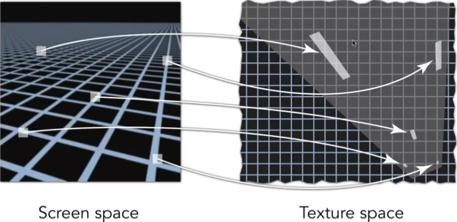

EWA filtering

* Use multiple lookups
*  Weighted average
* Mipmap hierarchy still helps
* Can handle irregular footprints

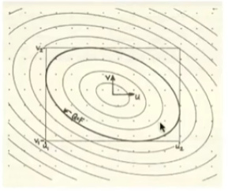