### Shading1(Illumination,Shading and Graphics Pipeline)

#### Painter's Algorithm

Inspired by how painters paint
Paint from back to front, overwrite in the framebuffer

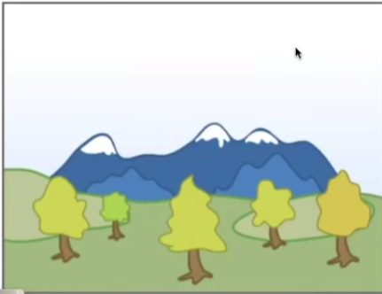

 正方体，四个侧面画的顺序，得到的结果不同，

Requires sorting in depth (O(n log n) for n triangles)
Can have unresolvable depth order

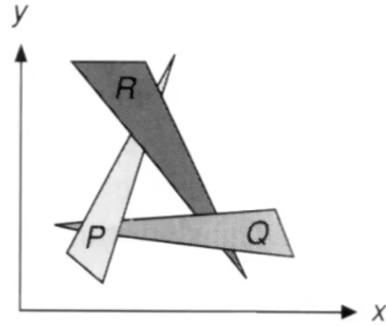

互遮挡


#### Z-Buffer

This is the algorithm that eventually won.
Idea:

* Store current min. z-value for each sample (pixel)
* Needs an additional buffer for depth values
  * frame buffer stores color values
  * depth buffer (z-buffer) stores depth

IMPORTANT: For simplicity we suppose
                          z is always positive
                          (smaller z -> closer, larger z -> further)


#### Z-Buffer Example

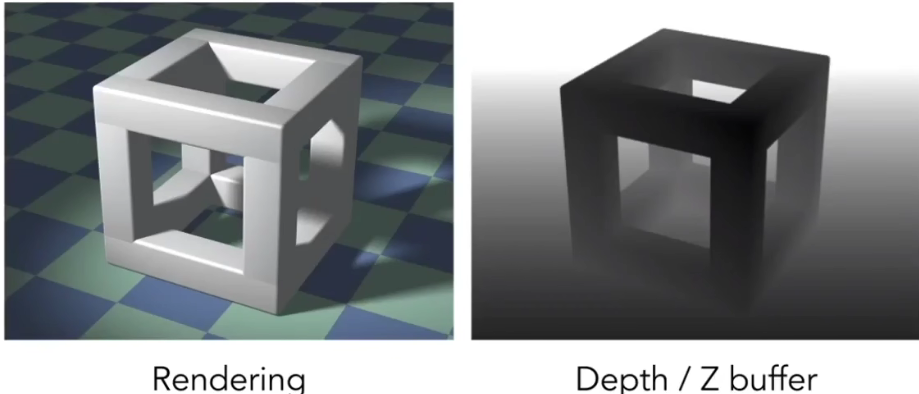


#### Z-Buffer Algorithm

Initialize depth buffer to
During rasterization:

```c++
for (each triangle T)
	for (each sample (x,y,z) in T)
	if (z < zbuffer[x,y])    // closest sample so far
    {
        	framebuffer[x,y] = rgb;   // update color
	zbuffer[x,y] = z;  // update depth
    }
else
    ;    // do nothing, this sample is occluded

```

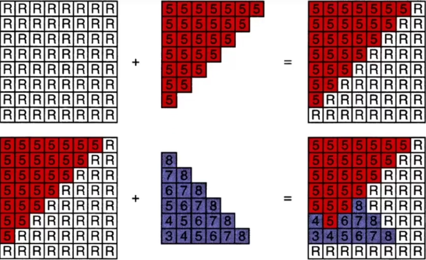


#### Z-Buffer Complexity

Complexity

* O(n) for n triangles (assuming constant coverage)
* How is it possible to sort n triangles in linear time?

 

#### Drawing triangles in different orders?

* Implemented in hardware for all GPUs


#### What We've Covered So Far

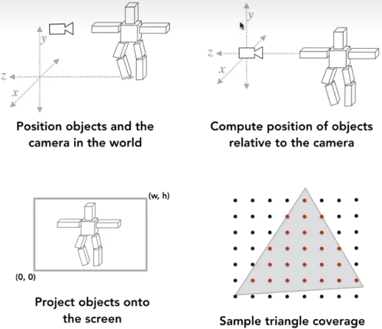


#### Rotating Cubes(Now You Can Do)

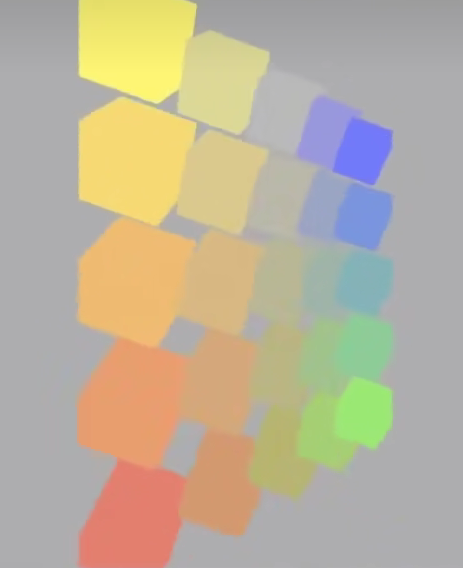 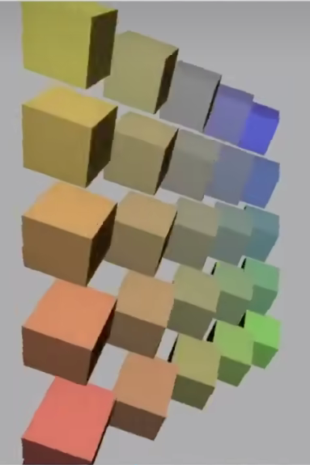

着色

#### What Else Are We Missing?


#### Shading

Shading: Definition
* In Merriam-Webster Dictionary
  shad•ing, , noun
  The darkening or coloring of an illustration or
  diagram with parallel lines or a block of color

* In this course
  The process of applying a material to an object.

  

#### A Simple Shading Model

#### (Blinn-Phong Reflectance Model)


#### Perception Observations

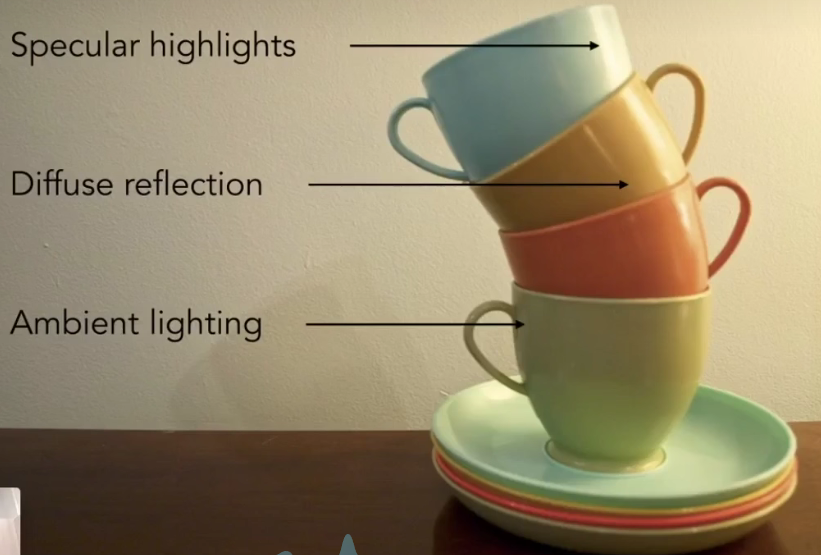

 高光

漫反射

间接光照，环境反射光


Shading is Local

Compute light reflected toward camera
at a specific shading point
Inputs:

* Viewer direction, v
* Surface normal, n
* Light direction, I
* (for each of many lights)
* Surface parameters (color, shininess, ...)

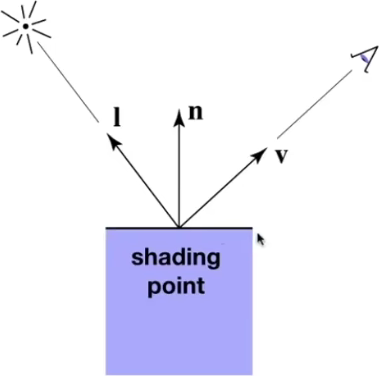

Shading is Local

No shadows will be generated! (shading ≠ shadow)

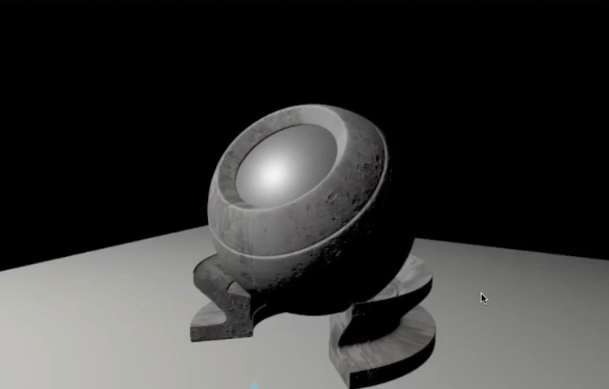

作色不考虑其他点存在，只考虑其它点自己


#### Diffuse Reflection

Light is scattered uniformly in all directions

- Surface color is the same for all viewing directions

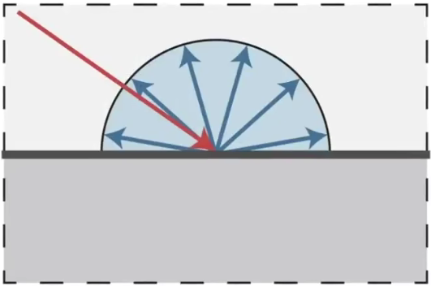

But how much light (energy) is received?

- Lambert's cosine law

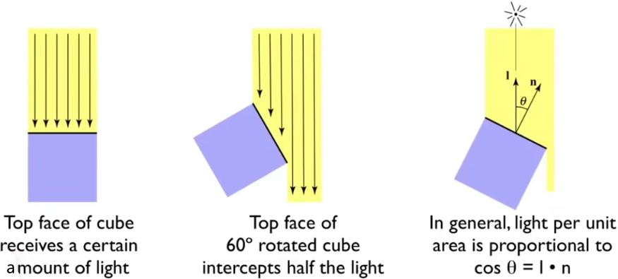

单位面积接收的光照


Light Falloff

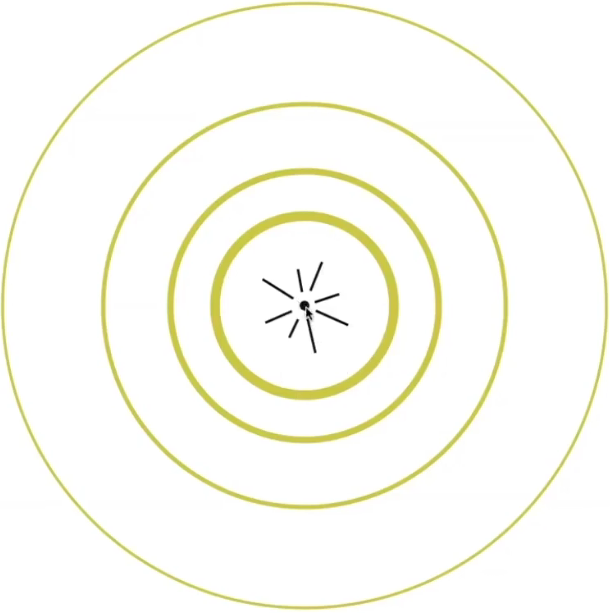

光源强度 

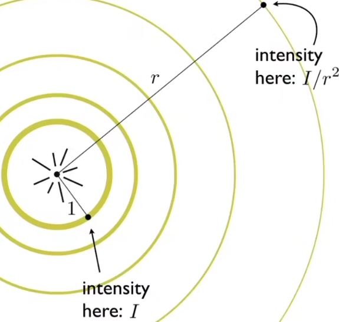

光照强度与$r^2$ 成反比


#### Lambertian (Diffuse) Shading

 Shading independent of view direction

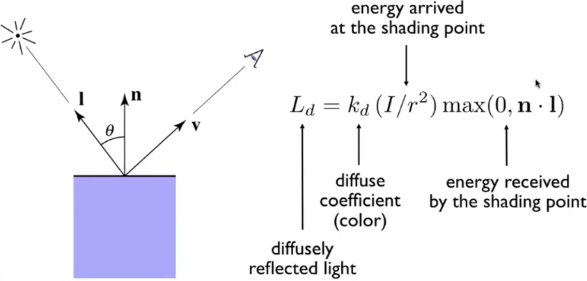

不同点存在对光的不同吸收率$k_{d}$


漫反射光照强度和观测角度完全没关系

Produces diffuse appearance

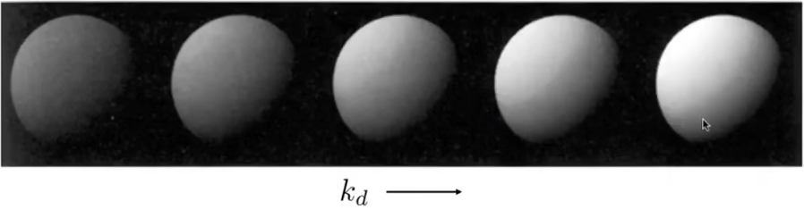

### 