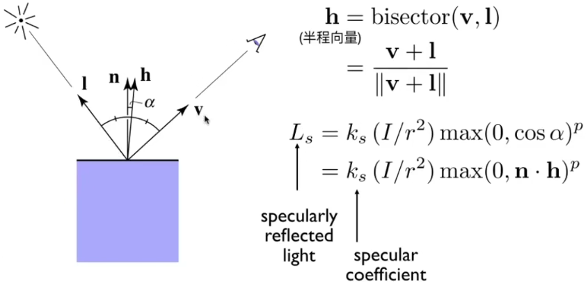
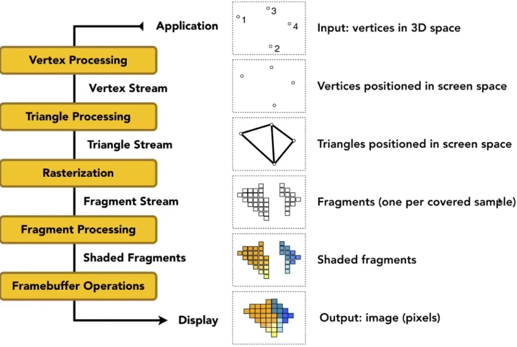

### Shading 2 (Shading, Pipeline and Texture Mapping) 

#### Specular Term (Blinn-Phong)

* Bright near mirror reflection direction


V close to mirror direction $\rightleftharpoons$ half vector near normal

* Measure "near" by dot product of unit vectors



能不能看到高光，看 n 和 h是不是接近

点乘结果

高光白色

为什么指数p

#### Cosine Power Plots

Increasing p narrows the reflection lobe


p  取值100~200


#### Ambient Term

Shading that does not depend on anything

* Add constant color to account for disregarded
  illumination and fill in black shadows
* This is approximate / fake!


#### Blinn-Phong Reflection Model


#### Shading Frequencies

What caused the shading difference?


####  Shade each triangle (flat shading)

Flat shading

* Triangle face is
  flat — one normal
  vector
* Not good for
  smooth surfaces


#### Shade each vertex (Gouraud shading)

* Gouraud shading
  Interpolate colors
  from vertices across
  triangle
* Each vertex has a
  normal vector (how?)


#### Shade each pixel (Phong shading)

Phong shading

* Interpolate normal
  vectors across each
  triangle
*  Compute full shading
  model at each pixel
*  Not the Blinn-Phong
  Reflectance Model （频率）

 


#### Shading Frequency: Face, Vertex or Pixel


####  Defining Per-Vertex Normal Vectors

Best to get vertex normals from the underlying geometry

* e.g. consider a sphere


Otherwise have to infer vertex normals from triangle faces

* Simple scheme: average surrounding face normals


#### Defining Per-Pixel Normal Vectors

Barycentric interpolation (introducing soon) of vertex normals


### Graphics (Real-time Rendering) Pipeline

实时渲染管线

#### Graphics Pipeline




#### Shader Programs

* Program vertex and fragment processing stages
* Describe operation on a single vertex (or fragment)

Example GLSL fragment shader program

```c++
// uniform 全局变量
uniform sampler2D myTexture; // program parameter
// 光照方向
uniform vec3 lightDir;   // program parameter

varying vec2 uv;   // per fragment value (interp. by rasterizer)
// 顶点法线
varying vec3 norm;  // per fragment value (interp. by rasterizer)

void diffuseShader()
{
  vec3 kd;
kd = texture2d(myTexture, uv);  // material color from texture
kd clamp(dot(—lightDir, norm), 0.0, 1.0);  // Lambertian shading model
gl_FragColor = vec4(kd, 1.0);   // output fragment color
}

```

* Shader function executes once per fragment.
*  Outputs color of surface at the current fragment's screen sample position.
*  This shader performs a texture lookup to obtain the surface's material color at this point, then performs a diffuse lighting calculation.

opengl 图形API，每个顶点执行这个 通用shader ，不需要写for 循环，只需要管一个顶点，一个fragment，

写的顶点就叫vertex shader 顶点着色器

写的像素 就叫Fragment color 或者 pixel color


#### Snail Shader Program


 

#### Goal: Highly Complex 3D Scenes in Realtime

* 100's of thousands to millions of triangles in scéne
* Complex vertex and fragment shader  computations
* High resolution (2-4 megapixel + Supersampling)
* 30-60 frames per second (even higher for VR)

  

#### Graphics Pipeline Implementation: GPUs

Specialized processors for executing graphics pipeline computations


着色器，可编程

#### GPU: Heterogeneous, Multi-Core Procesor


### Texture Mapping

#### Diffelenc Colors at Different Places?


#### Surfaces are 2D

Surface lives in 3D world space
Every 3D surface point also has a place
where it goes in the 2D image (texture)


#### Texture Applied to Surface


####   Visuaiizdtion of Texture Coordinates

Each triangle vertex is assigned a texture coordinate (u,v)

 

u，v 范围 都是 0 到 1


 

纹理可以重复多次，无缝衔接


