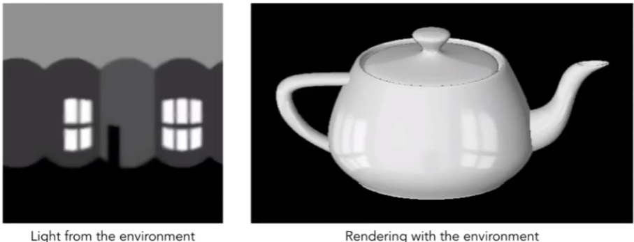

### Geometry 1 (Introduction)

#### Many, Many Uses for Texturing

In modern GPUs, texture = memory + range query (filtering)

* General method to bring data to fragment calculations

Many applications

* Environment lighting
* Store microgeometry
* Procedural textures
* Solid modeling
* Volume rendering
* ...

#### Environment Map

#### Environmental Lighting

#### Sphecicdl Environment Map

#### Sphecical Map— Problem

#### Cube Map

A vector maps to cube point along that direction.
The cube is textured with 6 square texture maps.

#### Textures can affect shading!

Textures doesn't have to only represent colors
- What if it stores the height / normal?
- Bump / normal mapping（凹凸贴图，假法线）
- Fake the detailed geometry

#### Bump Mapping

 Adding surface detail without adding more triangles
• Perturb surface normal per pixel
(for shading computations only)
• "Height shift" per texel defined by a texture

• How to modify normal vector?

#### How to perturb the normal (in flatland)

* Original surface normal n(p) = (0, 1)
* Derivative at p is dp = c * [h(p+l) - h(p)]
* Perturbed normal is then n(p) = (-dp, 1).normalized()

#### How to perturb the normal (in 3D)

* Original surface normal n(p) = (0, 0, 1)
* Derivatives at p are
  * dp/du = cl * [h(u+l) - h(u)]
  * dp/dv = c2 * [h(v+l) - h(v)]
* Perturbed normal is n = (-dp/du, -dp/dv, 1).normalized()
* Note that this is in local coordinate!
  More will be elaborated in FAQ of HW3

#### Textures can affect shading!

* Displacement mapping — a more advanced approach
  - Uses the same texture as in bumping mapping
  - Actually moves the vertices （位移贴图）

####  3D Procedural Noise + Solid Modeling

#### Provide Precomputed Shading

#### 3D Textures and Volume Rendering

#### Examples of Geometry

大型，城市，存储？，渲染？

#### Many Ways to Represent Geometry

Implicit

* algebraic surface
* level sets
* distance functions
* ...

Explicit

* point cloud
* polygon mesh
* subdivision, NURBS

Each choice best suited to a different task/type of geometry

#### impiicit" Representations of Geometry

Based on classifying points

* Points satisfy some specified relationship

E.g. sphere: all points in 3D, where $x^2+y^2+z^2 = 1$

More generally ,f(x,y,z) = 0

#### implicit Surface — Sampling Can Be Hard

 

implicit Surface — Inside/Outside Tests Easy

Just  plug it in:

f(x,y,z) = -1/8 < 0

Yes, inside

implicit representations make some tasks easy

#### "Explicit" Representations of Geometry

All points are given directly or via parameter mapping

#### Explicit Surface — Sampling Is Easy

What points lie on this surface?
Just plug in (u,v) values!

Explicit representations make some tasks easy

 

#### Explicit Surface — Inside/Outside Test Hard

#### No "best" Representation — Geometry is Hard!

"l hate meshes.
I cannot believe how hard this is.
Geometry is hard."

​								— David Baraff
​									Senior Research Scientist
​									Pixar Animation Studios

#### Many implicit Representations in Graphics

Algebraic surfaces
Constructive solid geometry
Level set methods
Fractals

#### Algebraic Surfaces (Implicit)

Surface is zero set of a polynomial in x, y, z

#### Constructive Solid Geometry (Implicit)

#### CSG

Combine implicit geometry via Boolean operations

#### Distance Functions (Implicit)

Instead of Booleans, gradually blend surfaces together using
Distance functions:
giving minimum distance (could be signed distance)
from anywhere to object

#### Distance Functions (Implicit)

An Example: Blending a moving boundary

#### blending Distance Functions (Implicit)

Can blend any two distance functions dl , d2:

#### Level Set Methods (Also implicit) 

#### (水平集)

Closed-form equations are hard to describe complex shapes
Alternative: store a grid of values approximating function

Surface is found where interpolated values equal zero

Provides much more explicit control over shape (like a texture)

####  Level Sets from Medical Data (CT, MRI, etc.)

Level sets encode, e.g., constant tissue density

#### Level Sets in Physical Simulation

Level set encodes distance to air-liquid boundary

#### Fractals (implicit)  分形 自相似

Exhibit self-similarity, detail at all scales
" Language" for describing natural phenomena
Hard to control shape!

#### implicit Representations - Pros & Cons

pros:

* compact description (e.g., a function)
* certain queries easy (inside object, distance to surface)
* good for ray-to-surface intersection (more later)
*  for simple shapes, exact description / no sampling error
*  easy to handle changes in topology (e.g., fluid)

Cons:

* difficult to model complex shapes

