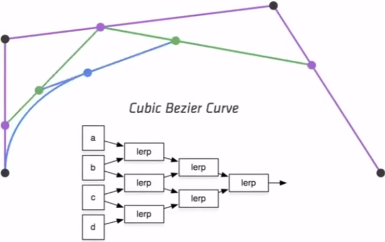
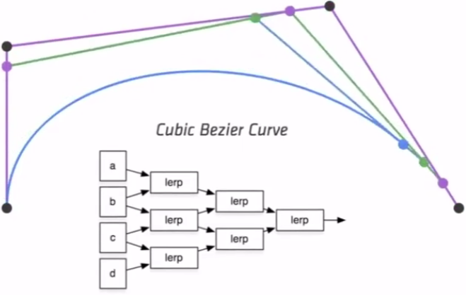

### Geometry 2（Curves and surface）

#### Explicit Representations in Computer Graphics

Many Explicit Representations in Graphics

triangle meshes
Bezier surfaces
subdivision surfaces
NURBS
point clouds

Point Cloud (Explicit)

Easiest representation: list of points (x,y,z)

Easiest representation: list of points (x,y,z)
Easily represent any kind of geometry
Useful for LARGE datasets (>>1 point/pixel)
Often converted into polygon mesh
Difficult to draw in undersampled regions

#### Polygon ivlesh (Explicit)

Store vertices & polygons (often triangles or quads)
Easier to do processing / simulation, adaptive sampling

More complicated data structures
Perhaps most common representation in graphics

#### The Wavefront Object File (.obj) Format

Commonly used in Graphics research
Just a text file that specifies vertices, normals, texture
coordinates and their connectivities

### Curves

Camera Paths

Animation Curves

#### Vector Fonts

#### The Quick Brow

#### Fox Jumps Over

#### The Lazy Dog

ABCDEFGHUKLMNOPQRSTUH\XYZ
abcdefghijklmnopqrstuvwxyz 0123456789

#### Bézier Curves (贝塞尔曲线)

Defining Cubic Bézier Curve With Tangents

P0 和P3 起点和终点

P1和P2 为控制点 ， 曲线不一定过控制点

唯一确定一条曲线

Evaluating Bézier Curves
(de Casteljau Algorithm)

#### bézier Curves — de Casteljau Algorithm

Run the same algorithm for every t in [0, 1]

#### Cubic bézier Curve — de Casteljau

Four input points in total
Same recursive linear interpolations

#### Visuaiizing de Casteljau Algorithm

点随 t 沿线段运动

### Evaluating Bézier Curves

### Algebraic Formula

#### Béziec Curve — Algebraic Formula

de Casteljau algorithm gives a pyramid of coefficients

Example: quadratic Bézier curve from three points

Bernstein form of a Bézier curve of order n:

Bernstein polynomials:

Bernstein form of a Bézier curve of order n:

These points define a Bezier curve in 3D that is a cubic polynomial in t:

Bernstein Polynomials

#### Properties of Bézier Curves

Interpolates endpoints

* For cubic Bézier:  $b(0) = b_0 ; b(1)= b_3$

Tangent to end segments

* Cubic case: $b'(0) = 3(b_1 -b_0);\ b'(1) =3(b_3-b_2)$

Affine transformation property

* Transform curve by transforming control points

Convex hull property

* Curve is within convex hull of control points

#### BTW: What's a Convex Hull

### Piecewise Bézier Curves

#### Higher-Order Bézier Curves?

Very hard to control!
Uncommon

Instead, chain many low-order Bézier curve
Piecewise cubic Bézier the most common technique

Widely used (fonts, paths, Illustrator, Keynote, ...)

#### Piecewise Bézier Curve — Continuity

Two Bézier curves

$C^0$ continuity: $a_n = b_0$

$C^1$ continuity: $a_n = b_0 = \frac{1}{2}(a_{n-1}+b_1)$

#### Other types of splines

* Spline (样条曲线)
  - a continuous curve constructed so as to pass through a given set of points and have a certain number of   ontinuous derivatives.
  - In short, a curve under control

* B-splines （极其复杂）
  * Short for basis splines
  * Require more information than Bezier curves
  * Satisfy all important properties that Bézier curves have (i.e.superset)

#### Béziec Surfaces

Extend Bézier curves to surfaces

#### Bicubic Bézier Surface Patch

Bezier surface and 4 x 4 array of control points

#### Visuaiizing Bicubic Bézier Surface Patch

不同时间t ，在不同位置上

连线

#### Evaiuating Surface Position For Parameters (u,v)

For bi-cubic Bezier surface patch,
	Input: 4x4 control points
	Output is 2D surface parameterized by (u,v) in$[0,1]^2$

#### Method. Separable 1D de Casteljau Algorithm

Goal: Evaluate surface position corresponding to (u,v)
(u,v)-separable application of de Casteljau algorithm

* Use de Casteljau to evaluate point u on each of the 4 Bezier curves in u. This gives 4 control points for the "moving" Bezier curve
* Use ID de Casteljau to evaluate point v on the "moving" curve

#### Mesh Uperations: Geometry Processing

* Mesh subdivision
* Mesh simplification
* Mesh regularization(正三角形)

