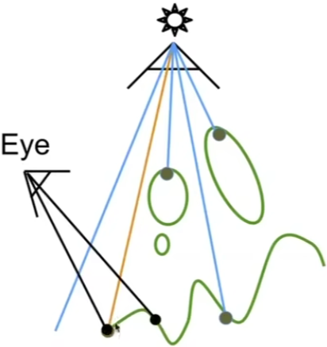

### Geometry 3

#### Mesh Suodivision (upsampling)

Increase resolution

#### Mesh Simplification (downsampling)

Decrease resolution; try to preserve shape/ appearance

#### Loop Subdivision

Common subdivision rule for triangle meshes
First, create more triangles (vertices)
Second, tune their positions

#### Split each triangle into four

* Assign new vertex positions according to weights
  - New / old vertices updated differently

#### Loop Subdivision — Update

For new vertices:

Update to:

3/8*(A+B) + 1/8*(C+D)

##### For old vertices (e.g. degree 6 vertices here):

Update to:
(1 - n*u) * original_position + u * neighbor_position_sum

**n: vertex degree**
**u: 3/16 if n=3, 3/(8n) otherwise**

#### Loop Su ivision Results

#### Catmull-Clark Subdivision (General Mesh)

在细分之前有多少个非四边形面，在细分之后，新增多少个奇异点，

一次细分之后就不再有非四边形面了（不再新增奇异点）

#### FYI: Catmuli-Clark Vertex Update Rules (Quad Mesh)

#### Face point

$f=\frac{v_1+v_2+v_3+v_4}{4}$

$e=\frac{v_1+v_2+f_1+f_2}{4}$

#### Edge point

Vertex point

$v=\frac{f_1+f_2+f_3+f_4+2(m_1+m_2+m_3+m_4)+4p}{16}$

***m***  midpoint of edge

***p***   old "vertex point"

loop细分只能用作三角形面

#### Convergence: Overall Shape and Creases

Loop with Sharp Creases

Catmull-Clark with Sharp Creases

#### Mesh Simplification

Goal: reduce number of mesh elements while maintaining the overall shape

不同情况下，选择不同

#### Collapsing An Edge

* Suppose we simplify a mesh using edge collapsing

#### Quadric Error Metrics

• How much geometric error is introduced by simplification?
• Not a good idea to perform local averaging of vertices
• Quadric error: new vertex should minimize its sum of square
distance (L2 distance) to previously related triangle planes!

#### Quadric Error of Edge Collapse

* How much does it cost to collapse an edge?
* Idea: compute edge midpoint, measure quadric error

* Better idea: choose point that minimizes quadric error More details: Garland & Heckbert 1997.

#### Simplification via Quadric Error

Iteratively collapse edges
Which edges? Assign score with quadric error metric*

* approximate distance to surface as sum of distances to planes containing triangles
* iteratively collapse edge with smallest score
* greedy algorithm... great results!

#### Quadric Error Mesh Simplification

#### Shadow Mapping

An Image-space Algorithm
- no knowledge of scene's geometry during shadow
computation
- must deal with aliasing artifacts

Key idea:
- the points NOT in shadow must be seen both
by the light and by the camera

#### Pass 1: Render from Light

* Depth image from light source

#### Pass 2B: Project to light

* Project visible points in eye view back to light source

两个视角下，重新投影回，光源视角，某个点的深度是否一致，判断遮挡阴影

(Reprojected) depths from light and eye are not the same. BLOCKED!!   红线

#### Visualizing Shadow Mapping

• A fairly complex scene with shadows

* Compare with and without shadows

* The scene from the light's point-of-view

• The depth buffer from the light's point-of-view

Comparing Dist(light, shading point) with shadow map

Green is where the distance(light, shading point) ≈ depth on the
low map

Non-green is where shadows should be

边缘瑕疵，通过两次距离是否相等判断是否可见， 浮点数判断相等比较困难，精度问题。

不判断大小，判断大于

或者引入bias

Well known rendering technique
- Basic shadowing technique for early animations (Toy
Story, etc.) and in EVERY 3D video game

#### Problems with shadow maps

• Hard shadows (point lights only)
• Quality depends on shadow map resolution

(general problem with image-based techniques)

• Involves equality comparison of floating point depth
values means issues of scale, bias, tolerance

* Hard shadows vs. soft shadows

