### Ratracing 1 (Whitted-Style Ray Tracing)

#### Why Ray Tracing?

• Rasterization couldn't handle global effects well

- (Soft) shadows
- And especially when the light bounces more than once

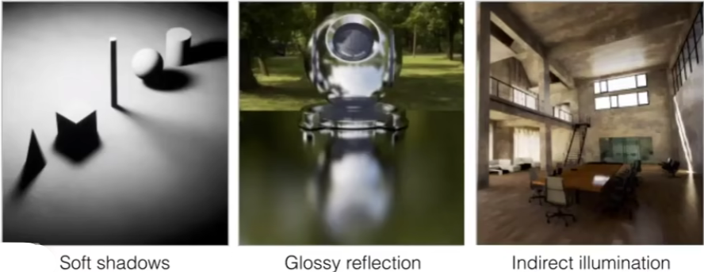

• Rasterization is fast, but quality is relatively low

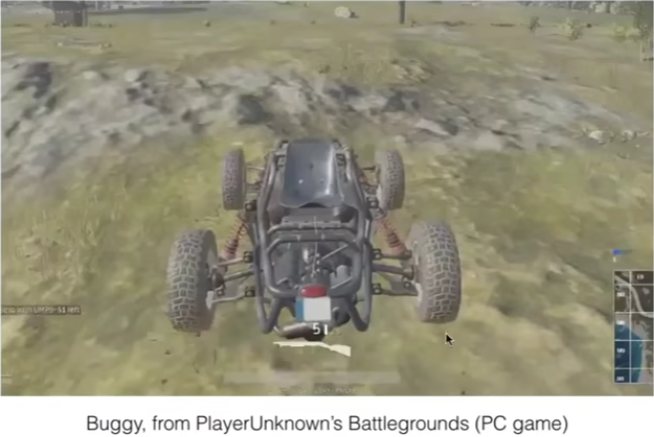

*  Ray tracing is accurate, but is very slow
  * Rasterization: real-time, ray tracing: offline
  * ~10K CPU core hours to render one frame in production

#### Light Rays

Three ideas about light rays

1. Light travels in straight lines (though this is wrong)
2. Light rays do not "collide" with each other if they cross
(though this is still wrong)
3. Light rays travel from the light sources to the eye (but
the physics is invariant under path reversal - reciprocity).

"And if you gaze long into an abyss, the abyss also gazes into you." — Friedrich Wilhelm Nietzsche (translated)

#### Emission Theory of Vision

"For every complex problem there is an answer that is clear,  imple, and wrong."
-- H. L. Mencken

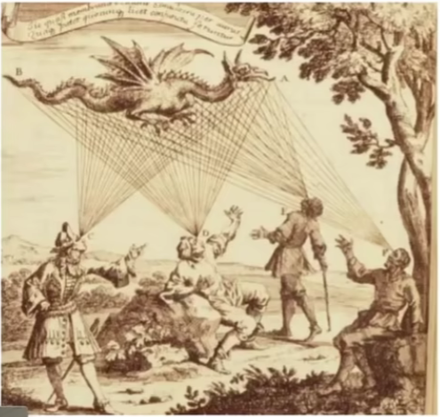

光路的可逆性

#### Ray Casting

Appel 1968 - Ray casting

1. Generate an image by casting one ray per pixel
2. Check for shadows by sending a ray to the light

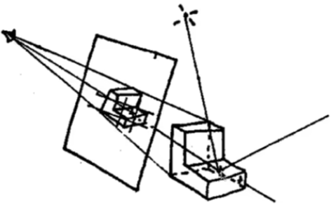

#### Ray Casting - Generating Eye Rays

Pinhole Camera Model

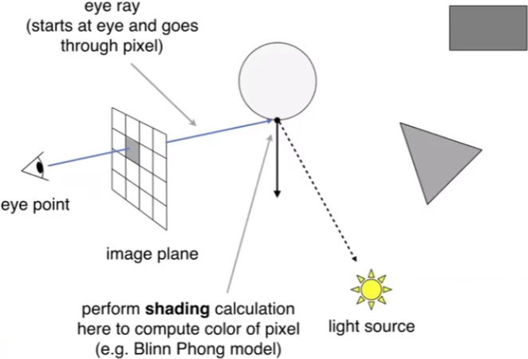

#### Recucsive (Whitted-Style) Ray Tracing

"An improved Illumination model for shaded display" T. Whited, CACM 1980
Time:
• VAX 11/780 (1979) 74 m
• PC (2006) 6 s
• GPU (2012) 1/30 s

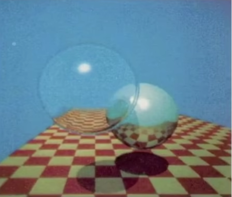

 加权叠加到像素上去

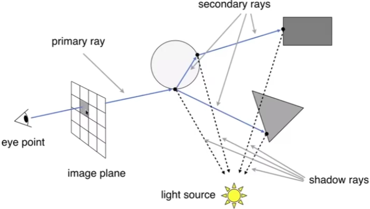

#### Ray-Surface Intersection

Ray Equation
Ray is defined by its origin and a direction vector

Example:

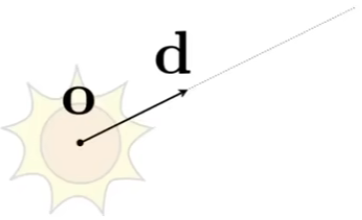

#### Ray Intersection With Sphere

Ray: r(t) = o + td , 0 ≤ t < ∞

Sphere：$p:(p-c)^{2}-R^2 = 0$

What is an intersection?
The intersection p must satisfy both ray equation and sphere equation

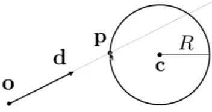

Solve for intersection:

$(o+td-c)^2-R^2 =0$

Solve for intersection:

$at^2+bt+c =0$  where

$a=dd$

$b=2(o-c)d$

$c=(o-c)(o-c)-R^2$

$t=\frac{-b±\sqrt{b^2-4ac}}{2a}$

t 得是正的，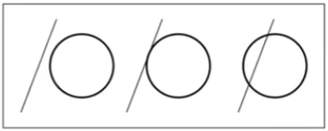

#### Ray Intersection With Implicit Surface

Ray: $r(t) = o+td , 0 ≤ t < ∞$

General implicit surface: $p:f(p) = 0$
Substitute ray equation: $f(o+td) = 0$
Solve for real, positive roots：

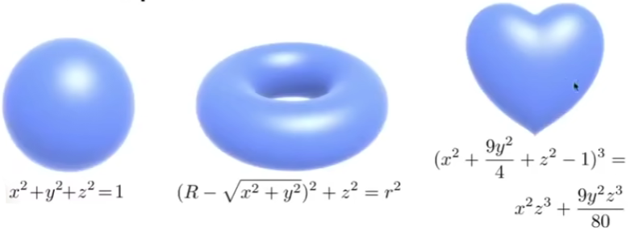

#### Ray Intersection With Triangle Mesh

Why?

* Rendering : visibility, shadows,
  lighting...
* Geometry: inside/outside test

封闭形状内点个点，形状内的点，朝任意方向发射一个射线，与形状相交的个数是奇数

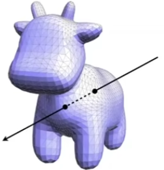

How to compute?

* Simple idea: just intersect ray with each triangle

* Simple, but slow (acceleration?)

* Note: can have 0, 1 intersections
  (ignoring multiple intersections)

#### Ray Intersection With Triangle

Triangle is in a plane

* Ray-plane intersection
* Test if hit point is inside
  triangle

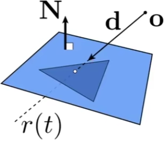

Many ways to optimize...

#### Piane Equation

Plane is defined by normal vector and a point on plane

Example:    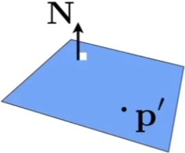

Plane Equation (if p satisfies it, then p is on the plane):

$p:(p-p')N = 0$

$ax+by+cz = 0$

#### Ray Intersection With Plane

Ray equation:

$r(t) = o + td , 0 ≤ t <∞$

Plane equation：

$p: (p-p')N = 0$

Solve for intersection

Set $p=r(t)$ and solve for t

$(p-p')N = (o+td-p')N =0$

$t = \frac{(p'-o)N}{dN} \ \ Check: 0≤t<∞$

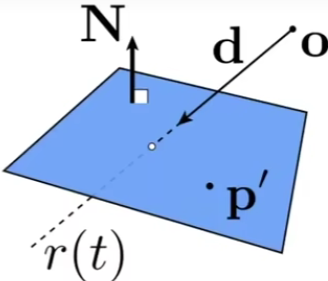

#### Möiler Trumbore Algorithm

A faster approach, giving barycentric coordinate directly
Derivation in the discussion section!

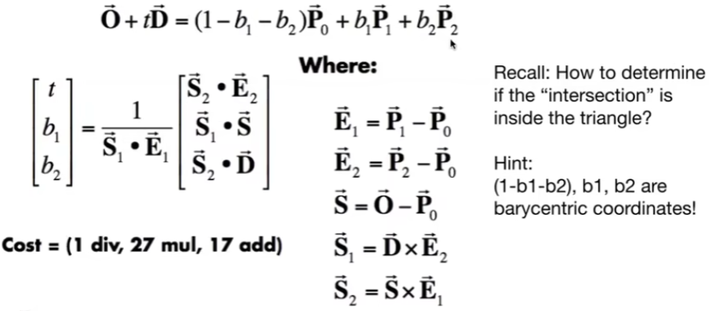

#### Ray Tracing — Performance Challenges

Simple ray-scene intersection

* Exhaustively test ray-intersection with every object
* Find the closest hit (with minimum t)

Problem:

* Naive algorithm = #pixels x #objects (x #bounces)
* Very slow!

#### Bounding Volumes

Quick way to avoid intersections: bound complex object
with a simple volume

* Object is fully contained in the volume
*  If it doesn't hit the volume, it doesn't hit the object
*  So test BVOI first, then test object if it hits

#### Ray-Intersection With Box

Understanding: box is the intersection of 3 pairs of slabs

Specifically:
We often use an Axis-Aligned Bounding Box (AABB)
i.e. any side of the BB is along either x, y, or z axis

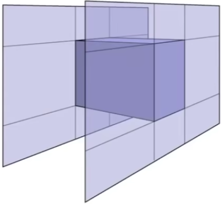

#### Ray Intersection with Axis-Aligned Box

2D example; 3D is the same! Compute intersections with slabs
and take intersection of $t_{min}/t_{max}$ intervals

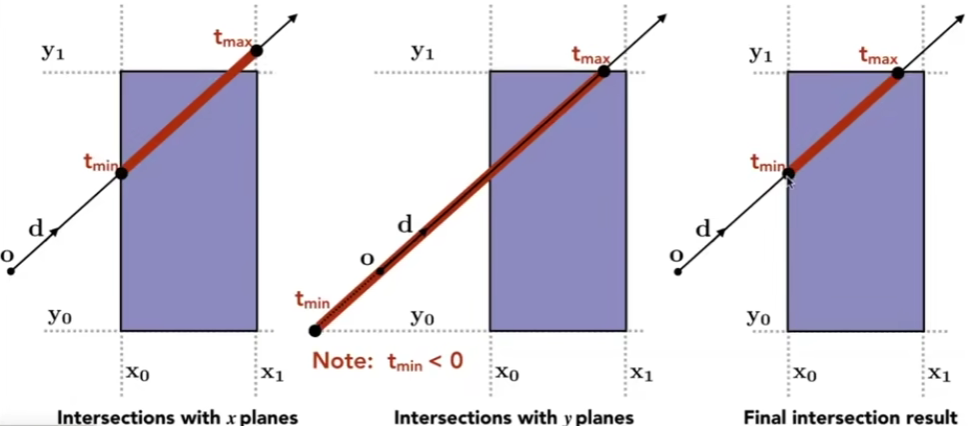

时间的交集即进出和盒子的事件

#### Ray Intersection with Axis-Aligned Box

• Recall: a box (3D) = three pairs of infinitely large slabs
• Key ideas

- The ray enters the box only when it enters all pairs of slabs
- The ray exits the box as long as it exits any pair of slabs

• For each pair, calculate the $t_{min}$ and $t_{max}$  (negative is fine)
• For the 3D box, $t_{enter} = max\{t_{min}\},t_{exit}=min\{t_{max}\}$

• If $t_{enter} < t_{exit}$, we know the ray stays a while in the box (so they mu4 intersect!) (not done yet, see the next slide) 

#### Ray Intersection with Axis-Aligned Box

• However, ray is not a line

- Should check whether t is negative for physical correctness!

What if $t_{exit} < 0$?

- The box is "behind" the ray — no intersection!

What if $t_{exit}≥0$ and $t_{enter} < 0$?

- The ray's origin is inside the box — have intersection!

In summary, ray and AABB intersect iff （当且仅当）
$ - t_{enter} < t_{exit}\ \&\&\ t_{exit} ≥ 0$

#### Why Axis-Aligned?

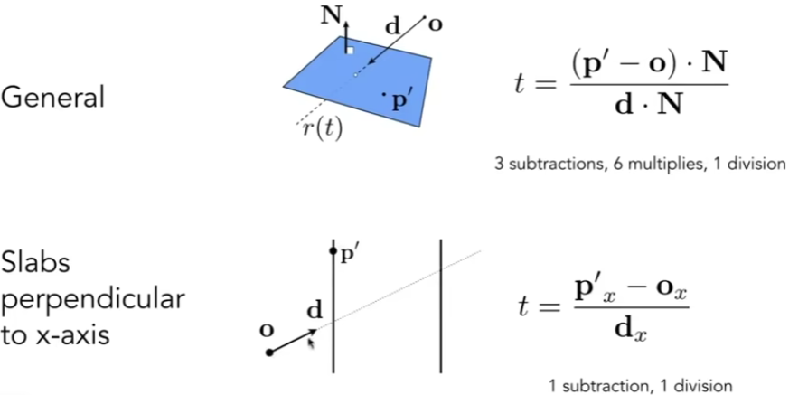

