### Ray Tracing 2 (Acceleration & Radiometry)

#### Uniform Spatial Partitions (Grids)

#### Preprocess — Build Acceleration Grid

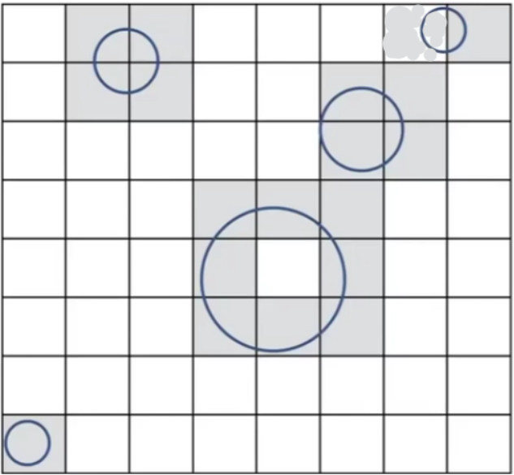

1. Find bounding box
2. Create grid
3. Store each object in overlapping cells

#### Ray-Scene Intersection

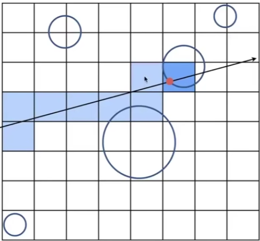

Step through grid in ray traversal order

For each grid cell Test intersection with all objects stored at that cell

二维，光线朝上打，下一个格子要么在上面，要么在右边

（如何光栅化一条直线）

#### Grid Resolution?

One cell
• No speedup

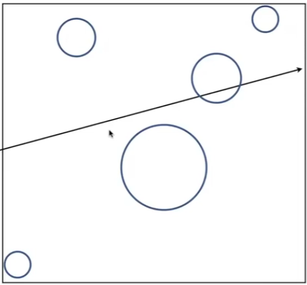

Too many cells

* Inefficiency due to extraneous grid traversal

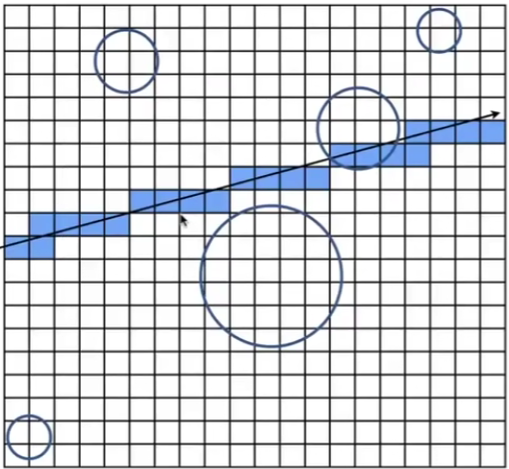

Heuristic:

* #cells = C * #Objs
* C ≈  27 in 3D

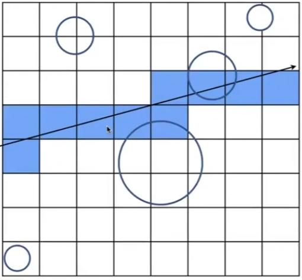

#### Unifocm Grids — When They Work Well

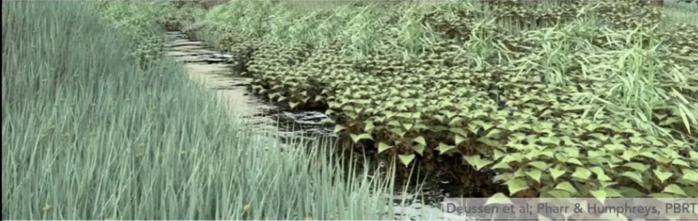

Grids work well on large collections of objects that are distributed evenly in size and space

#### Uniform Grids — When They Fail

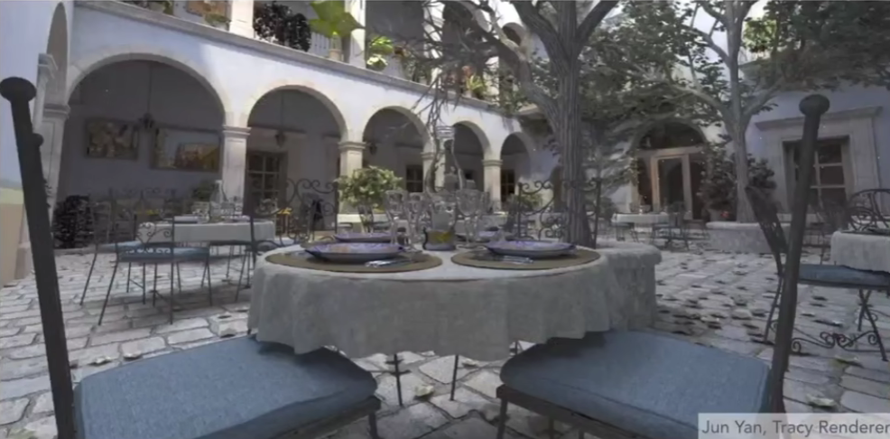

"Teapot in a stadium" problem

中空的场景， 

#### Spatial Partitions

Spatial Partitioning Examples

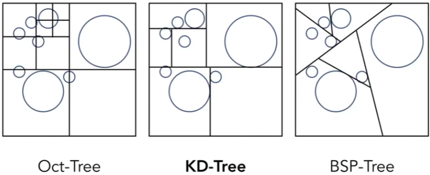

Note: you could have these in both 2D and 3D. In lecture we will illustrate principles in 2D.

#### KD-Tree Pre-Processing

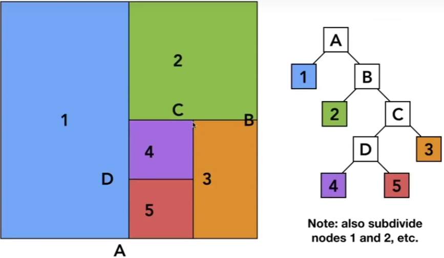

#### Data Stcucture for KD-Trees

Inteqnal nodes store

* split axis: x-, y-, or z-axis
* split position: coordinate of split plane along axis
* children: pointers to child nodes
* No objects are stored in internal nodes

Leaf nodes store
• list of objects

#### Traversing a KD-Tree

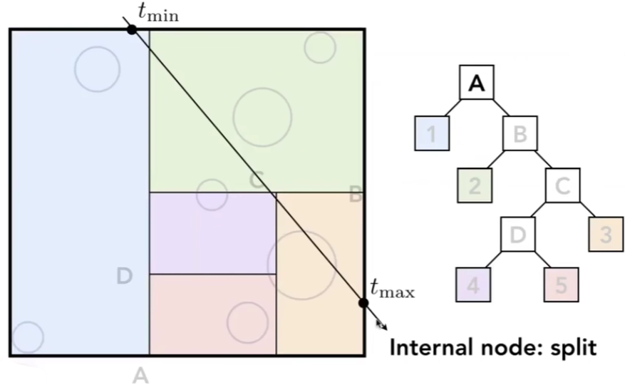

左边盒子

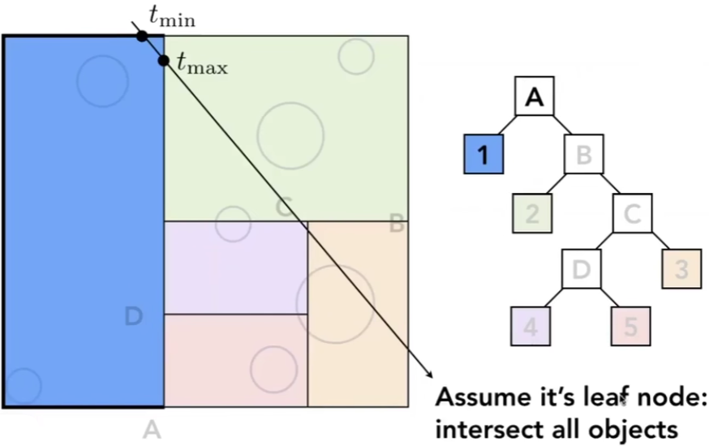

右边盒子

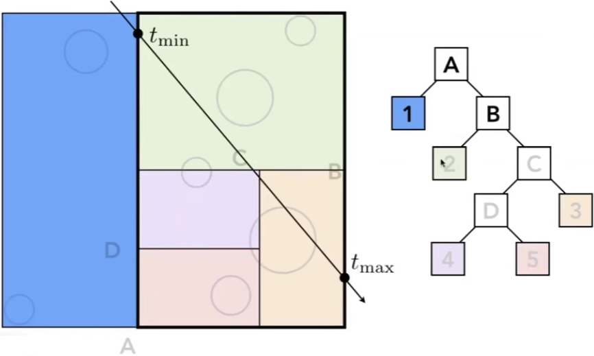

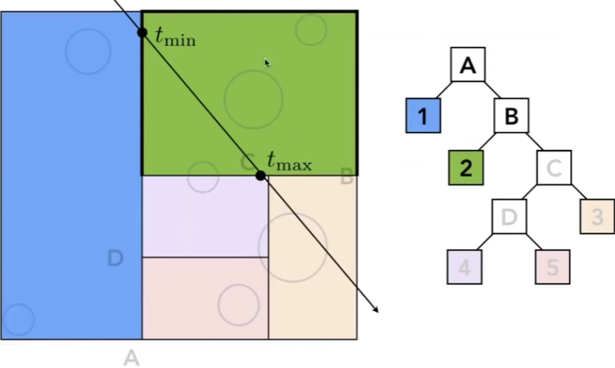

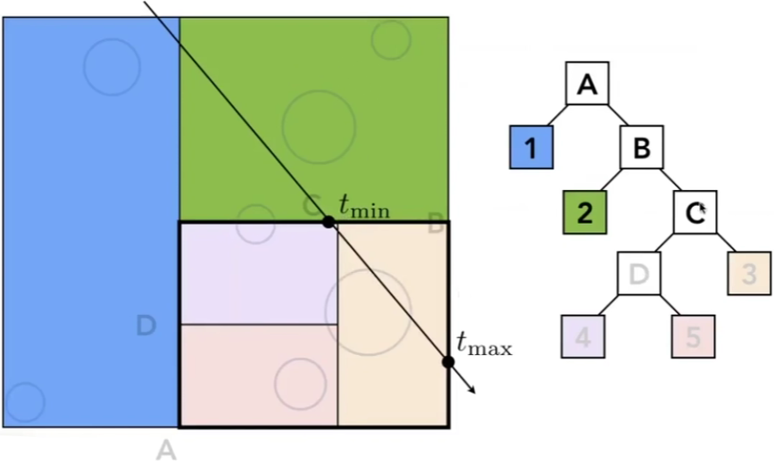

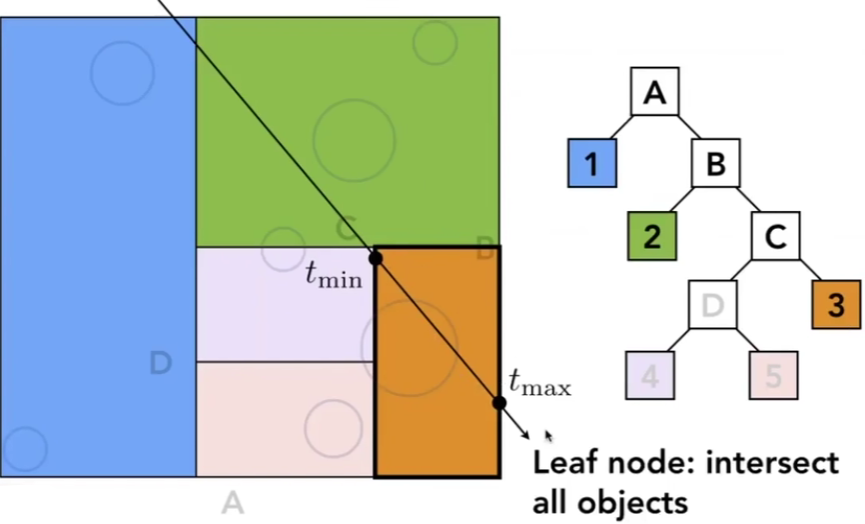

。。。

一个物体肯能存在多个AABB的盒子，需要知道三角形与盒子的求交，很难！

空间分为两部分

#### Object Partitions & 

#### Bounding Volume Hierarchy (BVH)

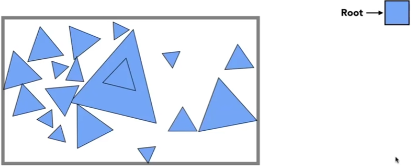

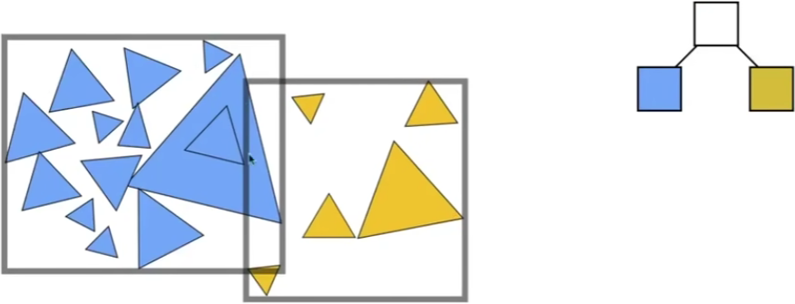

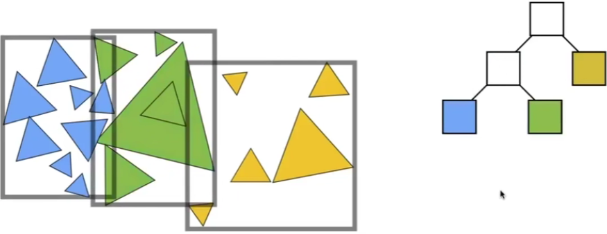

...

物体划分为两部分，求AABB box , 可以相交

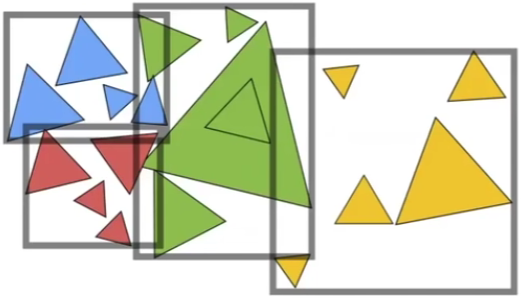

* Find bounding box
* Recursively split set of objects in two subsets
* Recompute the bounding box of the subsets
* Stop when necessary
* Store objects in each leaf node

#### Building BVHs

How to subdivide a node?

* Choose a dimension to split
* Heuristic #1 : Always choose the longest axis in node
* Heuristic #2: Split node at location of median object

Termination criteria?

* Heuristic: stop when node contains few elements (e.g. 5)

#### Data Structure for BVHs

Internal nodes store

* Bounding box
* Children: pointers to child nodes

Leaf nodes store

* Bounding box
* List of objects

Nodes represent subset of primitives in scene

* All objects in subtree

#### BVH Traversal

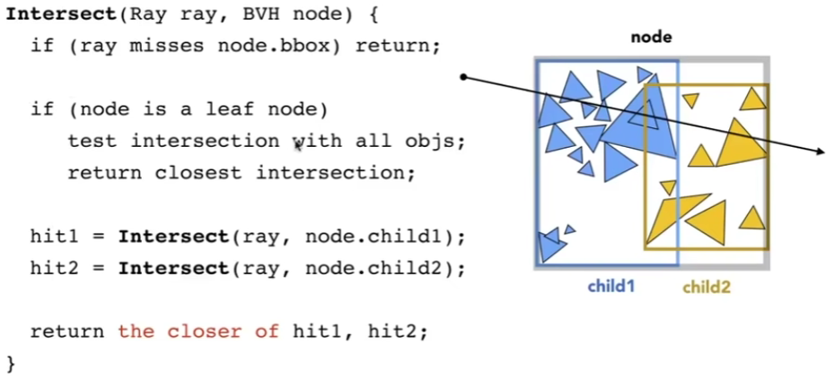

#### Spatial vs Object Partitions

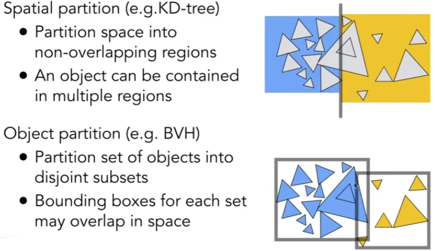

#### Radiornetry— Motivation  (辐射度量学)

Observation

* In assignment 3, we implement the Blinn-Phong model

* Light intensity I is 10, for example

**Do you think Whitted style ray tracing gives you CORRECT results?**

All the answers can be found in radiometry

• Also the basics of "Path Tracing"

Radiornetry
Measurement system and units for illumination
Accurately measure the spatial properties of light
- New terms: Radiant flux, intensity, irradiance, radiance

Perform lighting calculations in a physically correct manner

---

My personal way of learning things:

- WHY, WHAT, then HOW

#### Radiant Energy and Flux (Power)

Definition: Radiant energy is the energy of electromagnetic radiation. It is measured in units of joules, and denoted by the symbol:

Q [J = Joule]

Definition: Radiant flux (power) is the energy emitted, reflected, transmitted or recéived, per unit time.

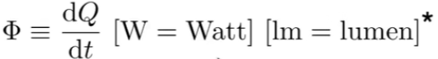

#### Flux — #pÅotons flowing through a sensor in unit time

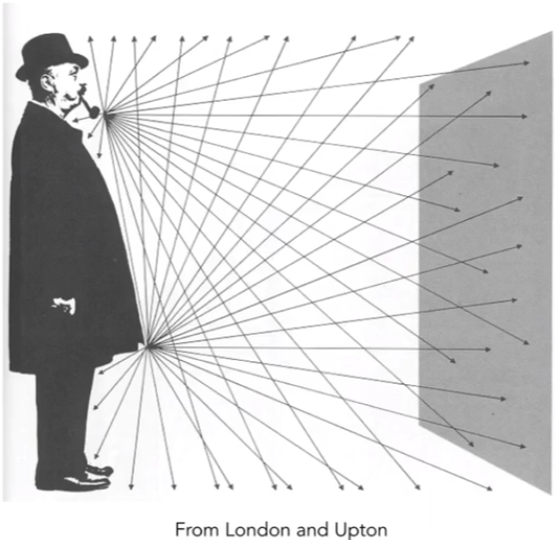

#### Impoctant Light Measurements of Interest

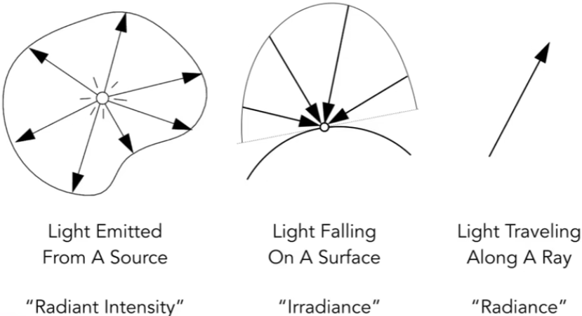

#### Radiant intensity

Definition: The radiant (luminous) intensity is the power per unit
solid angle (?)  (立体角) emitted by a point light source.

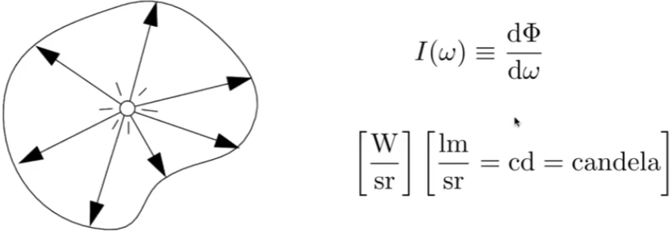

The candela is one of the seven Sl base units.

#### Angles and Solid Angles

Angle: ratio of subtended arc length on circle to radius

* $θ = \frac{l}{r}$
* Circle has 2π radians

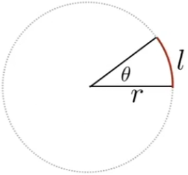

Solid angle: ratio of subtended area on sphere to radius squared

* $Ω = \frac{A}{r^2}$
* Sphere has 4π steradians

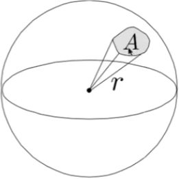

#### Differential Solid Angles

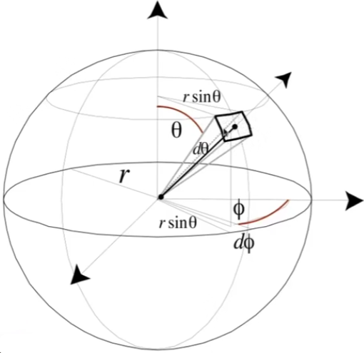

$dA = (rdθ)(rsinθdΦ)$

$=r^2sinθ dθdΦ$

$dw = \frac{dA}{r^2} = sinθdθdΦ$

$Sphere: S^2$

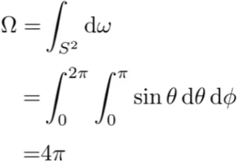

#### $ω$ as a direction vector

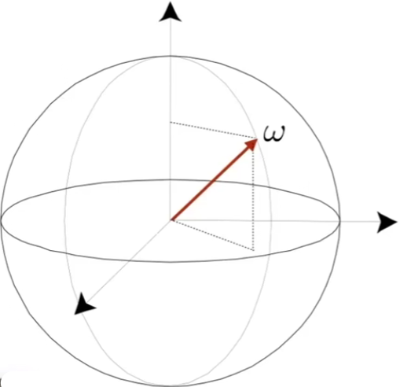

Will use ω to denote a direction vector (unit length)

#### Isotropic Point Source

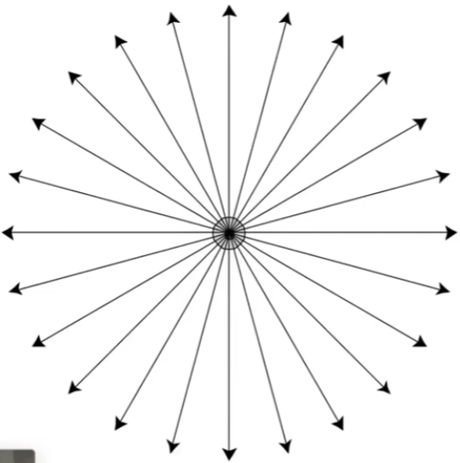                    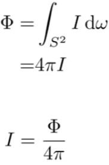

#### Modern LED Light

Output: 815 lumens (1 IW LED replacement for 60W  incandescent)

Radiant intensity?
Assume isotropic:
Intensity = 815 lumens / 4pi sr
                 = 65 candelas

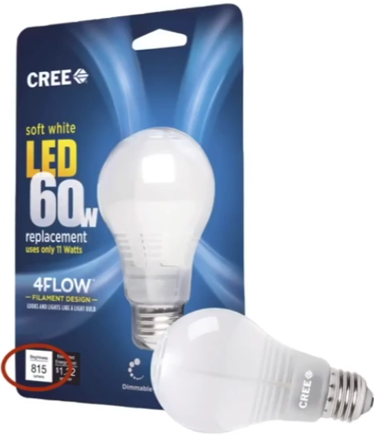

