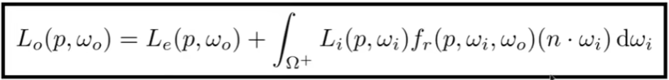

### Raytracing-3

#### Irradiance

Definition: The irradiance is the power per (perpendicular/ projected) unit area incident on a surface point.

必须垂直物体表面

#### Why Do We Have Seasons?

Earth's axis of rotation: —23.5° off axis

Radiance
Radiance is the fundamental field quantity that describes the distribution of light in an environment

* Radiance is the quantity associated with a ray
* Rendering is all about computing radiance

Light Traveling Along A Ray

Definition: The radiance (luminance) is the power emitted, reflected, transmitted or received by a surface, per unit solid angle, per projected unit area.

Recall

* Irradiance: power per projected unit area
*  Intensity: power per solid angle

So

* Radiance: Irradiance per solid angle
* Radiance: Intensity per projected unit area

#### incident Radiance

Incident radiance is the irradiance per unit solid angle arriving at the surface.

i.e. it is the light arriving at the surface along a given ray point on surface and incident direction).

#### Exiting Radiance

Exiting surface radiance is the intensity per unit projected
area leaving the surface.

e.g. for an area light it is the light emitted along a given ray point on surface and exit direction).

#### Irradiance vs. Radiance

Irradiance: total power received by area dA
Radiance: power received by area dA from "direction" dω

### Bidirectional Reflectance Distribution Function (BRDF)

Radiance from direction $ω_i$ turns into the power E that dA receives
Then power E will become the radiance to any other direction $ω_o$

#### BRDF

The Bidirectional Reflectance Distribution Function (BRDF)
represents how much light is reflected into each outgoing direction $w_r$ from each incoming direction

#### The Reflection Equation

#### Challenge: Recursive Equation

But incoming radiance depends on reflected radiance (at another point in the scene)

#### The Rendering Equation

Re-write the reflection equation:

by adding an Emission term to make it general!
The Rendering Equation

Note: now, we assume that all directions are pointing outwards!

#### Understanding the rendering equation

#### Reflection Equation

#### Rendering Equation as Integral Equation

#### Linear Operator Equation

Can be discretized to a simple matrix equation [or system of simultaneous linear equations] (L, E are vectors, K is the light transport matrix)

#### Ray Tracing and extensions

• General class numerical Monte Carlo methods
• Approximate set of all paths of light in scene

K是反射操作符

#### Shading in Rasterization

#### Probability Review

##### Randono Variables

$X$  random variable. Represents a distribution of potential values

$X~p(x)$  probability density function (PDF). Describes relative
probability of a random process choosing value $x$

Example: uniform PDF: all values over a domain are equally likely

e.g. A six-sided die
$X$ takes on values 1, 2, 3, 4, 5, 6

$p(1) = p(2) = p(3) = p(4) = p(5) = p(6)$

#### Probabilities

$n$ discrete values $x_i$

Width probability $p_i$

Requirements of a probability distribution:

                            

#### Expected Value of a Random Variable

The average value that one obtains if repeatedly drawing samples from the random distribution.

$X$ drawn from distribution withn 

$n$ discrete values $x_i$
with probabilities $p_i$

Expected value of X:     

Die example:  =  (1 +2+3+4+5 + 6)/6 = 3.5

#### Continuous Case: Probability Distribution Function (PDF)

$X$ ~ $p(x)$                      

A random variable X that can take any of a continuous set of values, where the relative probability of a particular value is given by a continuous probability density function p(x).

Conditions on p(x):            
Expected value of X:          

#### Function of a Random Variable

A function Y of a random variable X is also a random variable:

$X$~$p(x)$

$Y = f(X)$

Expected value of a function of a random variable:

