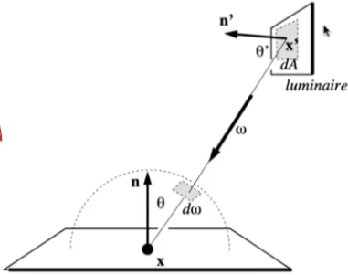

### RayTracing-4

#### Monte Carlo Integration

Why: we want to solve an integral, but it can be too difficult
to solve analytically.


Let us define the Monte Carlo estimator for the definite
integral of given function $f(x)$
Definite integral                          $\int_{a}^{b}f(x)dx$

Random variable                        $X_i \sim p(x)$


Monte Carlo estimator          


#### Example: Uniform Monte Carlo Estimator


Let us define the Monte Carlo estimator for the definite
integral of given function $f(x)$

Definite integral                          $\int_{a}^{b}f(x)dx$

Random variable                        $X_i \sim p(x)=\frac{1}{b-a}$

Basic Monte Carlo estimator    

Monte Carlo Integration


Some notes:

* The more samples, the less variance.
* Sample on x, integrate on x.


#### Motivation: Whitted-Style Ray Tracing

Whitted-style ray tracing:

- Always perform specular reflections / refractions
- Stop bouncing at diffuse surfaces


Are these simplifications reasonable?


High level: let's progressively improve upon Whitted-Style
Ray Tracing and lead to our path tracing algorithm!


Whiffed-Style Ray Tracing: Problem 1
Where should the ray be reflected for glossy materials?


The Utah teapot

#### Whiffed-Style Ray Tracing: Problem 2

No reflections between diffuse materials?


The Cornell box

color bleeding


#### Whiffed-Style Ray Tracing is Wrong

But the rendering equation is correct


But it involves
- Solving an integral over the hemisphere, and
- Recursive execution


How do you solve an integral numerically?


#### Sir-ropie Monte Carlo Solution

Suppose we want to render one pixel (point) in the following scene for direct illumination only


A Simple Monte Carlo Solution
Abuse the concept of Reflection Equation a little bit


Fancy as it is, it's still just an integration over directions
So, of course we can solve it using Monte Carlo integration!


#### A Simple Monte Carlo Solution

We want to compute the radiance at p towards the camera


Monte Carlo integration:     

What's our "f(x)"?         
What's our pdf?        

(assume uniformly sampling the hemisphere)


#### A Simple Monte Carlo Solution

So, in general


(note: abuse notation a little bit for i)


What does it mean?

A correct shading algorithm for direct illumination!


#### A Sinope Monte Carlo Solution


```
shade (p, wo)
	Randomly  choose  N  directions  wi~pdf
		Lo = 0.0
		For each wi
			Trace a ray r (p, wi)
			If ray r hit the light
				Lo += (1 / N) * L i * f r * cosine /  pdf (wi)
		Return Lo
```


#### Introducing Global Illumination

One more step forward: what if a ray hits an object?


Q also reflects light to P! How much? The dir. ilium. at Q!


#### Introducing Global Illumination

```
shade (p, wo)
	Randomly choose N directions wi—pdf
	Lo = 0.0
	For each wi
		Trace a ray r (p, wi)
		If ray r hit the light
			Lo += (1 / N) * L i * f r * cosine / pdf(wi)
		Else If ray r hit an object at q
			Lo += (1 / N) * shade(q, -wi) * f r * cosine / pdf (wi)
	Return Lo
```

done? No.

#### Path Tracing

Problem 1: Explosion of #rays as #bounces go up:


observation: #rays will not explode iff N = ????????


Path Tracing
From now on, we always assume that only 1 ray is traced at each shading point:

```
shade (p, wo)
	Randomly choose ONE direction wi—pdf (w)
	Trace a ray r (p, wi)
	If ray r hit the light
		Return L i * f r * cosine / pdf (wi)
	Else If ray r hit an object at q
		Return shade (q, —wi) * f r * cosine / pdf(wi)
```

this is path tracing! (FYI, Distributed Ray Tracing if N != 1)


#### Ray Generation

But this will be noisy!
No problem, just trace more paths through each pixel and average their radiance!


#### Ray Generation

Very similar to ray casting in ray tracing

```
ray_generation (camPos, pixel )
	Uniformly choose N sample positions within the pixel
	pixel radiance = 0.0
	For each sample in the pixel
		Shoot a ray r (campos, cam_to_sample )
		If ray r hit the scene at p
			pixel radiance += 1 / N * shade (p, sample _ to cam)
	Return pixel_radiance
```


#### Path iracjng

Now are we good? Any other problems in shade()?

```
shade (p, wo)
	Randomly choose ONE direction wi—pdf (w)
	Trace a ray r (p, wi)
	If ray r hit the light
		Return L i * f_r * cosine / pdf (wi)
	Else If ray r hit an object at q
		Return shade(q, —wi) * f_r * cosine / pdf(wi)
```

#### Path Tracing

Dilemma: the light does not stop bouncing indeed!
Cutting #bounces == cutting energy!

17 bounces   


#### Solution: Russian Roulette (RR)

Russian Roulette is all about probability
With probability 0 < P < 1, you are fine
With probability 1 - P, otherwise

 

Example: two bullets,
Survival probability P = 4 / 6


Previously, we always shoot a ray at a shading point and get the shading result Lo
Suppose we manually set a probability P (0 < P < 1) With probability P, shoot a ray and return the shading result divided by P: Lo / p
With probability I-P, don't shoot a ray and you'll get 0

In this way, you can still expect to get Lo!:
Lo = P * (LO / P) + (1 _ P) * O = Lo


```
shade (p, wo)
	Manually specify a probability P_RR
	Randomly select ksi in a uniform dist. in [0, 1]
	If (ksi > P RR) return 0.0;

	Randomly choose ONE direction wi~pdf (w)
	Trace a ray r (p, wi)
	If ray r hit the light
		Return L_i * f_r * cosine / pdf(wi) / P_RR
	Else If ray r hit an object at q
		Return shade(q, -wi) * f_r * cosine / pdf (wi) / P_RR
```


Now we already have a correct version of path tracing!
But it's not really efficient.


#### Sampiing the Light

Understanding the reason of being inefficient


there will be 1 ray hitting the light. So a lot of rays are "wasted"
if we uniformly sample the hemisphere at the shading point.


#### Sampling the Light (pure math)

Monte Carlo methods allows any sampling methods, so we can sample the light (therefore no rays are "wasted")


Assume uniformly sampling on the light:
pdf = 1 / A (because $\int pdf dA = 1$ )
But the rendering equation integrates
on the solid angle: $Lo = fLi\ fr\ cosdw$.




Recall Monte Carlo Integration:
Sample on x & integrate on x


#### Sampling the Light

Need to make the rendering equation as an integral of dA
Need the relationship between dw and dA

Easy! Recall the alternative def. of solid angle:
Projected area on the unit sphere


#### Sampiing the Light

Then we can rewrite the rendering equation as


Now an integration on the light!
Monte Carlo integration:
"f(x)": everything inside

pdf: 1/A


#### Sampling the Light

Previously, we assume the light is "accidentally" shot by uniform hemisphere sampling

Now we consider the radiance coming from two parts:

1. light source (direct, no need to have RR) other reflectors (indirect, RR)
2. other reflectors (indirect, RR)


#### Sampling the Light

```
shade (p, wo)
	# Contribution from the light source.
	Uniformly sample the light at x' (pdf_light = 1 / A)
	L_dir = L_i * f_r * cos θ * cos θ' / lx' — pl A 2 / pdf_light
	# Contribution from other reflectors.
	L_indir = 0.0
	Test Russian Roulette with probability P_RR
	Uniformly sample the hemisphere toward wi (pdf hemi = 1 / 2pi)
	Trace a ray r (p, wi)
	If ray r hit a non—emitting object at q
		L_indir= shade(q, —wi) * f_r * cos θ / pdf_hemi / P_RR
	Return L_dir + L_indir
```


One final thing: how do we know if the sample on the light is not blocked or not?

```
# Contribution from the light source.
L_dir =  0.0
Uniformly sample the light at x' Shoot a ray from p to x'
x' (pdf_light = If the ray is not blocked in the middle
L_dir = ...
```


Now path tracing is finally done!


```
shade (p, wo)
	# Contribution from the light source.
	Uniformly sample the light at x' (pdf_light = 1 / A)
	L_dir = L_i * f_r * cos θ * cos θ' / lx' — pl A 2 / pdf_light
	# Contribution from other reflectors.
	L_indir = 0.0
	Test Russian Roulette with probability P_RR
	Uniformly sample the hemisphere toward wi (pdf_hemi = 1 / 2pi)
	Trace a ray r (p, wi)
	If ray r hit a non—emitting object at q
		L_indir = shade(q, —wi) * f_r * cos 9 / pdf hemi / P_RR
	Return L_dir + L_indir
```


#### Some Side Notes

* Path tracing (P T) is indeed difficult

  * Consider it the most challenging in undergrad CS
  * Why: physics, probability, calculus, coding
  * Learning PT will help you understand deeper in these

* Is it still "Introductory"?

  * Not really, but it's "modern" :)
  * And so learning it will be rewarding also because ...

  

#### is Path Tracing Correct?

Yes, almost 100% correct, a.k.a.  PHOTO-REALISTIC


#### Ray tcacing: Previous vs. Modern Concepts

* Previous
  * Ray tracing == Whitted-style ray tracing

* Modern (my own definition)
  * The general solution of light transport, including
  * (Unidirectional & bidirectional) path tracing
  * Photon mapping
  * Metropolis light transport
    -VCM / UPBP...


#### Things we haven't covered / won't cover

*  Uniformly sampling the hemisphere
  - How? And in general, how to sample any function?
    (sampling)
* Monte Carlo integration allows arbitrary pdfs
  - What's the best choice? (importance sampling) 
* Do random numbers matter?
  - Yes! (low discrepancy sequences)


#### Things we haven't covered / won't cover

* I can sample the hemisphere and the light
  - Can I combine them? Yes! (multiple imp. sampling)

* The radiance of a pixel is the average of radiance on all
  paths passing through it
  - Why? (pixel reconstruction filter)

* Is the radiance of a pixel the color of a pixel?
  - No. (gamma correction, curves, color space)
* Asking again, is path tracing still "Introductory"?
  - This time, yes. Fear the science, my friends.


