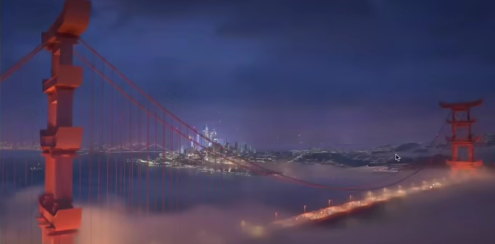
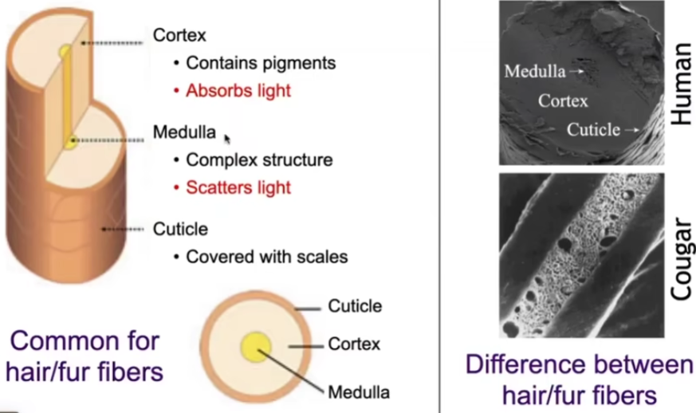
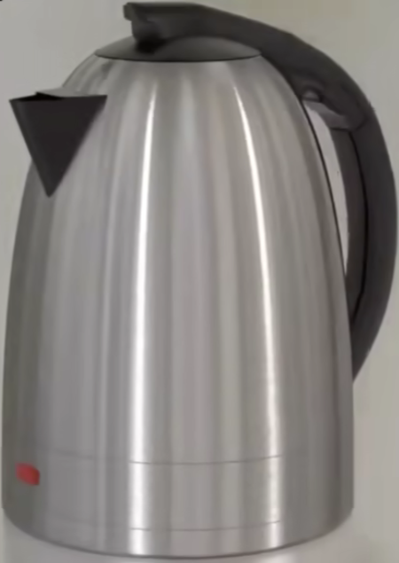
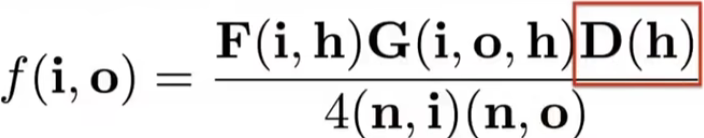

### Advanced Topics in Rendering

####  Advanced Light Transport

• Unbiased light transport methods
- Bidirectional path tracing (BDPT)
- Metropolis light transport (MLT)

Biased light transport methods

* Photon mapping
* Vertex connection and merging (VCM)

Instant radiosity (VPL / many light methods)


#### Biased vs. Unbiased Monte Carlo Estimators

* An unbiased Monte Carlo technique does not have any
  systematic error
  * The expected value of an unbiased estimator will always be
    the correct value, no matter how many samples are used
    Otherwise, biased

- One special case, the expected value converges to the
correct value as infinite #samples are used — consistent
- We'll look again at this page after introducing Photon
  Mapping

#### Bidirectional Path Tracing (BDPT)

• Recall: a path connects the camera and the light
• BDPT
- Traces sub-paths from both the camera and the light
- Connects the end points from both sub-paths


#### Bidirectional Path Tracing (BDPT)

* Suitable if the light transport is complex on the light's side

* Difficult to implement & quite slow


#### Metropolis Light Transport (MLT)

* A Markov Chain Monte Carlo (MCMC) application
  - Jumping from the current sample to the next
    with some PDF
* Very good at locally exploring difficult light paths
* Key idea
  - Locally perturb an existing path to get a new path


* #### Pros

*  Works great with difficult light path

* Also unbiased


​                                                                          caustics

specular 水面


#### Cons

* Difficult to estimate the convergence rate
* Does not guarantee equal convergence rate per pixel
* So, usually produces "dirty" results
* Therefore, usually not used to render animations


#### Photon Mapping

* A biased approach & A two-stage method
* Very good at handling Specular-Diffuse-Specular (SDS)
  paths and generating caustics


#### Photon lvlapping — Approach (variations apply)

Stage 1 — photon tracing

- Emitting photons from the light source, bouncing them
around, then recording photons on diffuse surfaces


Stage 2 — photon collection (final gathering)
- Shoot sub-paths from the camera, bouncing them around, until they hit diffuse surfaces
- Calculation — local density estimation
  - Idea: areas with more photons should be brighter
  - For each shading point, find the nearest N photons.  Take the surface area they over


密度估计


#### Pnoton Mapping


Why biased?

* Local Density estimation

  dN /dA !=  ΔN / ΔA

* But in the sense of limit

  * More photons emitted ->
  * the same N photons covers a smaller ΔA ->
  * Δ is closer to dA
  * So, biased but consistent!

* An easier understanding bias in rendering
  - Biased == blurry
  - Consistent == not blurry with infinite #samples

* Why not do a "const range" search for density estimation?

#### Vertex Connection and Merging

*  A combination of BDPT and Photon Mapping
* Key idea
  - Let's not waste the sub-paths in BDPT if their end points cannot be connected but can be merged
  - Use photon mapping to handle the merging of nearby
    "photons"


#### instant Radiosity (IR)

* Sometimes also called many-light approaches
* Key idea
  - Lit surfaces can be treated as light sources
* Approach
  - Shoot light sub-paths and assume the end point of each sub-path is a Virtual Point Light (VPL) 
  - Render the scene as usual using these VPLs


#### instant Radiosity

* Pros: fast and usually gives good results on diffuse scenes
* Cons
  - Spikes will emerge when VPLs are close to shading points
  - Cannot handle glossy materials


####  Advanced Appearance Modeling

* Non-surface models
  - Participating media
  - Hair/ fur/ fiber (BCSDF)
  - Granular material
* Surface models
  - Translucent material (BSSRDF)
  - Cloth
  - Detailed material (non-statistical BRDF)
* Procedural appearance
* 

#### Non-Surface Models

Participating Media: Fog


Participating Media: Cloud


Participating Media

* At any point as light travels through a participating medium, it can be (partially) absorbed and scattered.


Participating Media

* Use Phase Function to describe the angular distribution of light scattering at any point x within participating media.


Participating Media: Rendering

* Randomly choose a direction to bounce
* Randomly choose a distance to go straight
* At each 'shading point', connect to the light


#### Participating Media: Application



#### Hair Appearance


Kajiya-Kay Model


Kajiya-Kay Model


Marschner Model


Marschner Model

* Glass-like cylinder
* 3 types of light interactions:  (R: reflection, T: transmission)


Marschner model


#### Fur Appearance— As Human Hair

*  Cannot represent diffusive and saturated appearance


#### Human Hair vs Animal Fur



#### Imponance of Medulla


#### Impoflance of Medulla


#### Doubie Cylinder Model


#### Doubie Cylinder Model — Lobes


#### Granular Material

What is granular material?


* Can we avoid explicit modeling of all granules?
  — Yes with procedural definition.


#### Surface Models

Translucent Material: Jade


Translucent Material: Jellyfish


#### Subsurface Scattering

Visual characteristics of many surfaces caused by light exiting at different 

• Violates a fundamental assumption of the BRDF

       

#### Scattering Functions

* BSSRDF: generalization of BRDF; exitant radiance at one point due to incident differential irradiance at another point:

  

* Generalization of rendering equation: integrating over all points on the surface and all directions (!)

  


#### Dipole Approximation

* Approximate light diffusion by introducing two point sources.


#### BRDF


BSSRDF


#### BRDF  vs BSSRDF


#### BSSRDF: Application


#### Cloth

* A collection of twisted fibers!
  Two levels of twist


* Woven or knitted


#### Cloth. Render as Surface

* Given the weaving pattern, calculate the overall behavior
*  Render using a BRDF


#### Render as Surface — Limitation


#### Cloth: Render as Participating Media

* Properties of individual fibers & their distribution ->
   scattering parameters
* Render as a participating medium


#### Cloth: Render as Actual Fibers

• Render every fiber explicitly!


#### Detaiied Appearance: Motivation

• Not looking realistic, why?


#### Reai is more complicated


Why details?           Microfacet model

 


#### Recap. Microfacet BRDF


​		Surface = Specular microfacets + statistical normals

  

NDF: Normal Distribution Function


#### Statistical NDF vs. Actual NDF

Distribution of Normals (NDF)


#### Define details


#### Rendering? Too difficult!


#### Difficult path sampling problem


#### p-NDFs have sharp features


#### p-NDF shapes


#### Recent irend: Wave Optics


#### Detaiied Material under Wave Optics


#### Detaiied lvlaterial under Wave Optics


#### Wave optics


#### Procedural Appearance

Can we define details without textures?
— Yes! Compute a noise function on the fly.

— 3D noise ->
	internal structure
	if cut or broken


什么时候用什么时候查。


— Thresholding
(noise -> binary noise)

```
Example:
if noise(x, y, z) > threshold:
	reflectance = 1
else:
	reflectance = O
```


* Complex noise functions can be very powerful.


* Complex noise functions can be very powerful.


* Complex noise functions can be very powerful.

