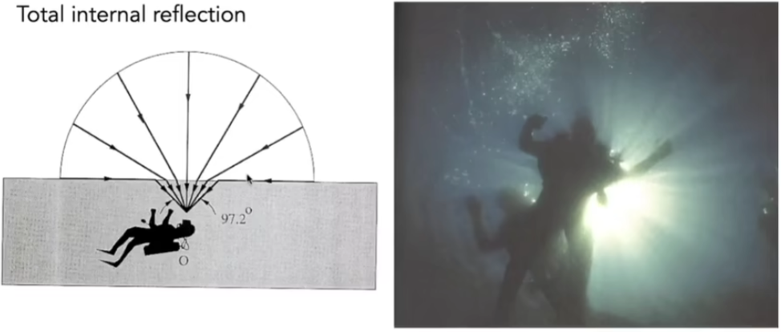
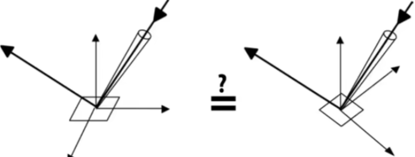

### Materials and Appearances


#### What is Material in Computer Graphics?


Material == BRDF


#### Diffuse / Lambertian Material (BRDF)


#### Diffuse / Lambertian Material

Light is equally reflected in each output direction

Suppose the incident lighting is uniform:

 

ρ反射率


#### Glossy rnaterial (BRDF)

抛光基础


#### Ideal reflective / refractive  material (BSDF*)


#### Perfect Specular Reflection


#### Perfect Specular Reflection


#### Perfect Specular Reflection BRDF


#### Specular Refraction

In addition to reflecting off surface, light may be transmitted through surface.
Light refracts when it enters a new medium.

  

Costics 海水折射


#### Snell s Law

Transmitted angle depends on
	index of refraction (IOR) for incident ray
	index of refraction (IOR) for exiting ray

 

$η_i\ sinθ_i = η_t\ sinθ_t$


#### Law of Refraction

  


##### Total internal reflection:

When light is moving from a more optically dense
medium to a less optically dense medium
Light incident on boundary from large enough angle will
not exit medium.


#### Snell s Window / Circle



全反射，折射率大的入射折射率小的


#### Fresnel Reflection / Term

Reflectance depends on incident angle (and polarization of light)


 This example: reflectance increases with grazing angle


#### Fresnel Term (Dielectric, η=1.5)


极化现象


垂直看窗户，没反射

斜着看，有反射


#### Fresnel Term (Conductor)


#### Fresnel Term— Formulae

Accurate: need to consider polarization

 

**Approximate: Schlick's approximation**


#### Microfacet Material

Microfacet Material: Motivation


#### Microfacet Theory

Rough surface

* Macroscale: flat & rough
* Microscale: bumpy & specular

Individual elements of surface act like mirrors

* Known as Microfacets
* Each microfacet has its own normal


#### Microfacet BRDF

Key: the distribution of microfacets' normals


#### Microfacet BRDF

* What kind of microfacets reflect wi to wo?
  (hint: microfacets are mirrors)


#### Microfacet BRDF: Examples


#### lsotropic / Anisotropic Materials (BRDFs)


各向同性/ 各向异性

* Key: directionality of underlying surface


#### Anisotropic BRDFs


#### Anisotropic BRDF: Brushed Metal

* How is the pan brushed?


#### Properties of BRDFs

* Non-negativity

  $f_r(ω_i\rightarrow ω_r)≥0$

* Linearity


#### Properties of BRDFs

* Reciprocity principle

  $f_r(w_r\rightarrow_i) = f_r(w_i\rightarrow_r)$

  

* Energy conservation


* Isotropic vs. anisotropic

  * If isotropic,  
  * Then, from reciprocity,

  

  


#### Measuring BRDFs: Motivation


Avoid need to develop / derive models
• Automatically includes all of the scattering effects present
Can accurately render with real-world materials
• Useful for product design, special effects ,...
Theory vs. practice:


#### Image-based BRDF Measurement


#### Measuring BRDFs: gonioreflectometer


#### General approach:

```
foreach outgoing direction wo
	move light to illuminate surface with a thin beam from wo
	for each incoming direction wi
		move sensor to be at direction wi from surface
		measure incident radiance
```


#### Improving efficiency:

* Isotropic surfaces reduce dimensionality from 4D to 3D

* Reciprocity reduces # of measurements by half

* Clever optical systems...


#### Challenges in Measuring BRDFs

* Accurate measurements at grazing angles
  * Important due to Fresnel effects
* Measuring with dense enough sampling to capture high frequency specularities
* Retro-reflection
* Spatially-varying reflectance, ...


#### Representing Measured BRDFs

Desirable qualities

* Compact representation
*  Accurate representation of measured data
* Efficient evaluation for arbitrary pairs of directions
* Good distributions available for importance sampling


#### Tabular Representation


