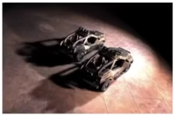
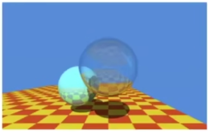
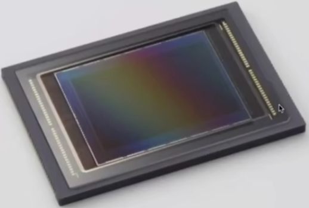

### Cameras-Lenses-and-Light-Fileds

#### Imaging = Synthesis + Capture

 

合成图像

1. 光栅
2. 光线追踪

捕捉方法成像

1. 照相（现实物品）

#### Whats Happening Inside the Camera?

#### Pinholes & Lenses Form Image on Sensor

#### Shutter Exposes Sensor For Precise Duration

#### Sensor Accumulates Irradiance During Exposure

#### Why Sensors Without Lenses?

Each sensor point would integrate light from all points on the
object, so all pixel values would be similar i.e. the sensor records irradiance

#### Pinhole Image Formation

#### Largest Pinhole Photograph

照片任何地方都是清晰的，不存在虚化

#### Effect of Focal Length on FOV

For a fixed sensor size, decreasing the focal length increases
the field of view.

#### Focal Length v. Field of View

* For historical reasons, it is common to refer to angular field of view by focal length of a lens used on a 35mm-format film (36 x 24mm)
* Examples of focal lengths on 35mm format:
  • 17mm is wide angle 1040
  • 50mm is a "normal" lens 470
  • 200mm is telephoto lens 120
* Careful! When we say current cell phones have approximately 28mm "equivalent" focal length, this uses the above convention.

#### Effect of Sensor Size on FOV

#### Sensor Sizes

#### Maintain FOV on Smaller Sensor?

To maintain FOV, decrease focal length of lens in proportion to width/height of sensor

#### Exposure

* H = T x E

* Exposure = time x irradiance
* Exposure time (T)
  - Controlled by shutter

- Irradiance (E)
  - Power of light falling on a unit area of sensor
  - Controlled by lens aperture and focal length

辐射度量学

#### Exposure Controls in Photography

Aperture size

* Change the f-stop by opening / closing the aperture (if
  camera has iris control)

Shutter speed

* Change the duration the sensor pixels integrate light

ISO gain

* Change the amplification (analog and/or digital) between
  sensor values and digital image values

####  Exposure. Aperture, Shutter, Gain (ISO)

ISO (Gain)
Third variable for exposure
Film: trade sensitivity for grain
Digital: trade sensitivity for noise

* Multiply signal before analog-to-digital conversion
* Linear effect (ISO 200 needs half the light as ISO 100)

#### ISO Gain vs Noise in Canon T2i

#### F-Number (F-Stop): Exposure Levels

Written as FN or F/N. N is the f-number.
Informal understanding: the inverse-diameter of a round aperture

#### Physical Shutter (1/25 Sec Exposure)

#### Side Effect of Shutter Speed

Motion blur: handshake, subject movement
Doubling shutter time doubles motion blur

 

#### Side Effect of Shutter Speed

Note: motion blur is not always bad!
Tip: think about anti-aliasing

Rolling shutter: different parts of photo taken at different times

扭曲，不同时间进来的光

#### Constant Exposure: F-stop vs Shutter Speed

Example: these pairs of aperture and shutter speed
give equivalent exposure

If the exposure is too bright/dark, may need to adjust f-stop and/or shutter up/down.

* Photographers must trade off depth of field (?) and motion blur for moving subjects

#### High-Speed Photography

Normal exposure = extremely fast shutter speed x (large aperture and/or high ISO)

#### High-Speed Photography

#### Long-exposure Photography

#### Thin Lens Approximation

Real Lens Designs Are Highly Complex

#### Real Lens Elements Are Not Ideal — Aberrations

Real plano-convex lens (spherical surface shape). Lens does not converge rays to a point anywhere.

 

#### Ideal Thin Lens — Focal Point

(1) All parallel rays entering a lens pass through its focal point.

(2) All rays through a focal point will be in parallel after passing the lens.

(3) Focal length can be arbitrarily changed (in reality, yes!).

棱镜组可以改变焦距

#### The Thin Lens Equation

#### Gauss' Ray Tracing Construction

$\frac{h_o}{z_o-f} = \frac{h_i}{f}$           $\frac{h_o}{f} = \frac{h_i}{z_i-f}$

#### Gauss/ Ray Tracing Construction

Gaussian Thin Lens Equation

#### Computing Circle of Confusion (CoC) Size

Circle of confusion is proportional to the size of the aperture

#### CoC vs. Aperture Size

#### Revisiting F-Number (a.k.a. F-stop)

* Formal definition: The f-number of a lens is defined as
  the focal length divided by the diameter of the aperture
* Common f-stops on real lenses:
  1.4, 2, 2.8, 4.0, 5.6, 8, 11, 16, 22, 32
*  An f-stop of 2 is sometimes written f/2, reflecting the fact that the absolute aperture diameter (A) can be computed by dividing focal length (f) by the relative aperture (N).

#### Example F-stop Calculations

#### Size of CoC is Inversely Proportional to F-stop

#### Ray Tracing Ideal Thin Lenses

#### Examples of Renderings with Lens Focus

#### Ray Tiacing for Defocus Blur (Thin Lens)

(One possible) Setup:

* Choose sensor size, lens focal length and aperture size
* Choose depth of subject of interest $z_o$
  * Calculate corresponding depth of sensor $z_i$ from thin lens equation (focusing)

Rendering:

* For each pixel x' on the sensor (actually, film (胶片))

* Sample random points x" on lens plane

* You know the ray passing through the lens will hit x"' (using the thin lens formula)

  estimate radiance on ray x" -> x"'

  

#### Depth of Field

Set circle of confusion as the maximum permissible blur spot on the image plane that will appear sharp under final viewing conditions

#### Circle of Confusion for Depth of Field

i.e. depth range in a scene where the corresponding CoC is considered small enough

#### Depth of Field (FYI)

  

$DOF = D_F - D_N$

