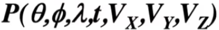
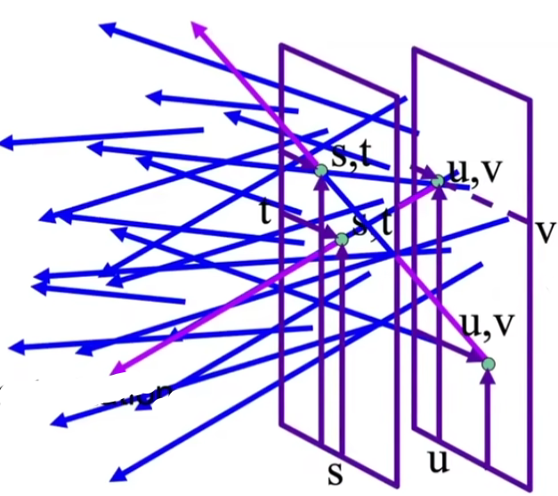
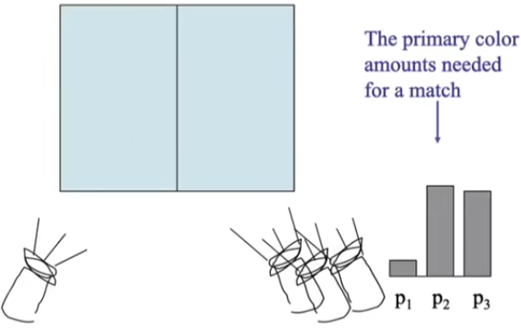

### Color and Perception

#### What do we see?

3D world

2D image

#### The plenoptic Function (全光函数)

Q: What is the set of all things that we can ever see?
A: The Plenoptic Function (Adelson & Bergen)

Let's start with a stationary person and try to rameterize everythinq that he can see...

P(θ，φ，λ，t)

is intensity of light

* Seen from a single view point
*  Over time
*  As a function of wave length

* Can reconstruct every possible view, at every moment, from every position, at every wavelength
*  Contains every photograph, every movie, everything that anyone has ever seen! it completely captures our visual reality! Not bad for a function...

#### Sampling Plenoptic Function (top view)

Just lookup -- Quicktime VR

#### Ray

Let's not worry about time and color:

#### 5D

* 3D position
* 2D direction

#### Ray Rouse

#### Infinite line

• Assume light is constant (vacuum)

#### 4D

* 2D direction
*  2D position
* non-dispersive medium

#### Only need plenoptic surface

Figure 1: The surface of a cube holds all the radiance information due to the enclosed object.

#### Synthesizing novel views

#### Lumigraph / Lightfield

Outside convex space

#### Lumigraph - Organization

2D position
2D direction

2 plane parameterization

2D position
2D position

光场参数化

Hold s,t constant
Let u,v vary
An image

#### Lumigraph / Lightfield

#### Stanford camera array

#### Interal Imaging ("Fly's Eye" Lenslets)

分光（红绿蓝）

Spatially-multiplexed light field capture using lenslets:

* Impose fixed trade-off between spatial and angular resolution

#### The Lytro Light Field Camera

Lytro: founded by Prof. Ren Ng (UC Berkeley)
Microlens design
Most significant function

* Computational Refocusing
  (virtually changing focal length & aperture size, etc. after taking the photo)

可以后期聚焦

#### Light Field Camera

Understanding

* Each pixel (irradiance) is now stored as a block of pixels (radiance)
* A close-up view of a picture taken

 

#### Light Field Camera

How to get a "regular" photo from the light field photo?

* A simple case — always choose the pixel at the bottom of each block
* Then the central ones & the top ones
* Essentially "moving the camera around"

Computational / digital refocusing

* Same idea: visually changing focal length, picking the refocused ray directions accordingly

In all, all these functionalities are available because

* The light field contains everything Any problems to light field cameras?
* Insufficient spatial resolution (same film used for both spatial and directional information)

* High cost   (intricate designation of microlenses)

* Computer Graphics is about trade-offs

####  The Fundamental Components of Light

* Newton showed sunlight can be subdivided into a rainbow with a prism 
* Resulting light cannot be further subdivided with a second prism

#### The Visible Spectrum of Light

Electromagnetic radiation
• Oscillations of different frequencies (wavelengths)

#### Spectra; Power Distribution (SPD) （谱功率密度）

Salient property in measuring light

* The amount of light present at each wavelength
*  Units:
  * radiometric units / nanometer (e.g. watts / nm)
  * Can also be unit-less
* Often use "relative units" scaled to maximum wavelength for comparison across wavelengths when absolute units are not important

#### Daylight Spectral Power Distributions Vary

#### Spectra; Power Distribution of Light Sources

Describes distribution of energy by wavelength

#### Linearity of Spectral Power Distributions

#### What is Color?

* Color is a phenomenon of human perception; it is not a
  universal property of light
* Different wavelengths of light are not "colors"

#### Biological Basis of Color

Anatorny of The Human Eye

#### Retinal I hotoreceptor Cells: Rods and Cones

Rods are primary receptors in very
low light ("scotopic" conditions),
e.g. dim moonlight

* —120 million rods in eye
* Perceive only shades of gray, no color

Cones are primary receptors in typical light levels ("photopic")

* —6-7 million cones in eye
* Three types of cones, each with different spectral sensitivity
* Provide sensation of color

#### Spectra; Response of Human Cone Cells

Three types of cone cells: S, M, and L (corresponding to peak
response at short, medium, and long wavelengths)

#### Fraction of Three Cone Cell Types Varies Widely

不同人，三种细胞分布不一样

Distribution of cone cells at edge of fovea in 12 different humans with al color vision. Note high variability of percentage of different cone pes. (false color image)

#### Spectra; Response of Human Cone Cells

Now we have three detectors (S, M, L cone cells), each with a different spectral response curve

不同人，这三个数不一样

#### The Human Visual System

Human eye does not measure and brain does not receive information about each wavelength of light
• Rather, the eye "sees" only three response values (S, M, L), and this is only info available to brain

#### Metamerism （同色异谱）

Metamers
Metamers are two different spectra (00-dim) that project to the
same (S,M,L) (3-dim) response.

* These will appear to have the same color to a human 

The existence of metamers is critical to color reproduction

* Don't have to reproduce the full spectrum of a real world
  scene

* Example: A metamer can reproduce the perceived color of a real-world scene on a display with pixels of only three
  colors

#### Metamerism

The theory behind color matching

#### Color Reproduction / Matching

Additive Color

* Given a set of primary lights, each with its own spectral distribution (e.g. R,G,B display pixels):

* Adjust the brightness of these lights and add them together:

* The color is now described by the
  scalar values:

  R,G,B

#### Additive Color Matching Experiment

#### Example Experiment1

#### Experiment 2

#### CIE RGB Color Matching Experiment

Same setup as additive color matching before, but primaries are monochromatic light (single wavelength)

The test light is also a monochromatic light

#### CIE RGB Color Matching Functions

Graph plots how much of each CIE RGB primary light must be combined to match a monochromatic light of wavelength given on x-axis

#### Coior• Reproduction with Matching Functions

For any spectrum s, the perceived color is matched by the following formulas for scaling the CIE RGB primaries

#### Standard Color Spaces

Standardized RGB (sRGB)

* makes a particular monitor RGB standard
* other color devices simulate that monitor by calibration
* widely adopted today
* gamut (?) is limited

#### A Universal Color Space: CIE XYZ

Imaginary set of standard color primaries X, Y, Z

* Primary colors with these matching functions do not exist
* Y is luminance (brightness regardless of color)

Designed such that

* Matching functions are strictly positive
* Span all observable colors

####  Separating Luminance, Chromaticity

#### CIE Chromaticity Diagram

#### Gamut

Gamut is the set of chromaticities generated by a set of color
primaries

Different color spaces represent different ranges of colors

So they have different gamuts, i.e.
they cover different regions on the chromaticity diagram

sRGB只表示了其中一个三角形

#### Perceptually Organized Color Spaces

#### HSV Color Space (Hue-Saturation-Value)

Axes correspond to artistic characteristics of color
Widely used in a "color picker"

#### Perceptual Dimensions of Color

Hue

* the "kind" of color, regardless of attributes
* colorimetric correlate: dominant wavelength
* artist's correlate: the chosen pigment color

Saturation (t@$DE)

* the "colorfulness"
* colorimetric correlate: purity
* artist's correlate: fraction of paint from the colored tube

Lightness (or value) (ÄE)

* the overall amount of light
* colorimetric correlate: luminance
* artist's correlate: tints are lighter, shades are darker

CIELAB Space (AKA L\*a\*b)
A commonly used color space that strives for perceptual
uniformity

* L* is lightness (brightness)
* • a* and b* are color-opponent pairs
  * a* is red-green
  * b* is blue-yellow

#### Opponent Color Theory 互补色

There's a good neurological basis for the color space dimensions in CIE LAB

* the brain seems to encode color early on using three axes:
  * white — black, redF green, yellow — blue
* the white — black axis is lightness; the others determine hue and saturation

#### Opponent Color Theory

* one piece of evidence: you can have a light green, a dark green, a yellow-green, or a blue-green, but you can't have a reddish green (just doesn't make sense)
  * thus red is the opponent to green
* another piece of evidence: afterimages (following slides)

 

盯着第一幅图看久后看第二幅图会变绿

#### Everything is Relative

A 和 B 颜色是一样的

#### Everything is Relative

#### CMYK: Subtractive Color Space

Subtractive color model

* The more you mix,the darker it will be Cyan, Magenta, Yellow, and Key Widely used in printing

Question:

* If mixing C, M and Y gives K, why do you need K?

打印墨水，为什么要黑色？ 墨水要成本，混合浪费墨水

