### Animation (cont)

Single Particle Simulation

First study motion of a single particle

* Later, generalize to a multitude of particles

To start, assume motion of particle determined by a
velocity vector field that is a function of position and time:

$v(x,t)$

#### Ordinary Differential Equation (ODE)

Computing position of particle over time requires solving a first-order ordinary differential 

equation:  一阶导数，速度

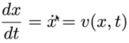

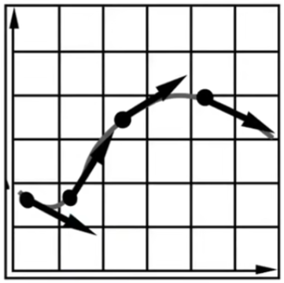

"First-order" refers to the first derivative being taken.
"Ordinary" means no "partial" derivatives, i.e. x is just a function of t

Solving for Particle Position
We can solve the ODE, subject to a given initial particle position
xo, by using forward numerical integration

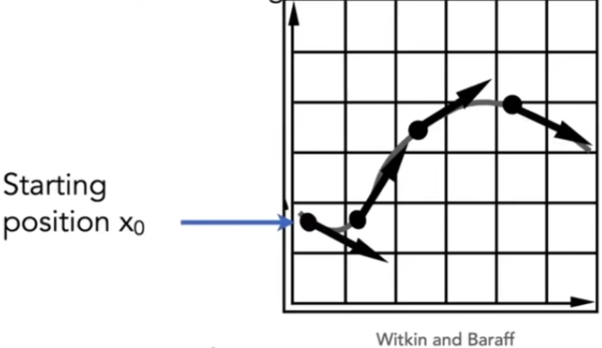

#### Euler's' Method

Euler's Method (a.k.a. Forward Euler, Explicit Euler)

* Simple iterative method
* Commonly used
* Very inaccurate
* Most often goes unstable

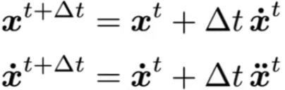

####  Eulers Method - Errors

With numerical integration, errors accumulate
Euler integration is particularly bad

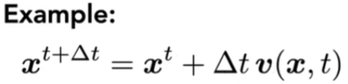

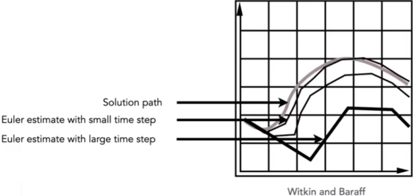

#### Instabiiidy of the Euler Method

The Euler method (explicit / forward)

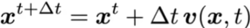

+ Two key problems:
* Inaccuracies increase as time step Δt increases
* Instability is a common, serious problem that can cause simulation to diverge

  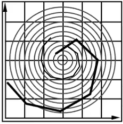      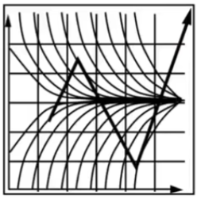

正反馈

#### Errors and Instability

Solving by numerical integration with finite differences
leads to two problems:
Errors

* Errors at each time step accumulate.

  Accuracy decreases as simulation proceeds

* Accuracy may not be critical in graphics applications

Instability

* Errors can compound, causing the simulation to diverge even when the underlying system does not 
* Lack of stability is a fundamental problem in simulation, and cannot be ignored

#### Combating Instability

#### Midpoint method

* Compute Euler step (a)
* Compute derivative at midpoint of Euler step (b)
* Update position using midpoint derivative (c)

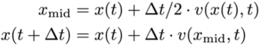 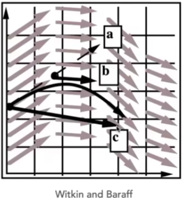

#### Modified Euler

• Average velocity at start and end of step
• Better results

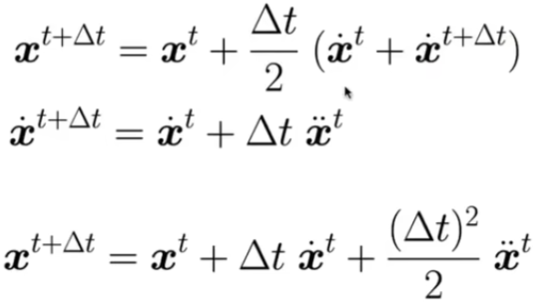

####  Adaptive Step Size

Adaptive step size

* Technique for choosing step size based on error estimate
* Very practical technique
* But may need very small steps!

 Repeat until error is below threshold:

* Compute $X_T$ an Euler step, size T
* Compute $X_{T/2}$ two Euler steps, size T/2
* Compute error II $X_T — X_{T/2}$ II
* If (error > threshold) reduce step size and try again

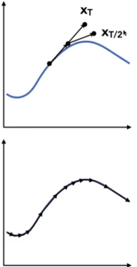

#### Implicit Euler Method

Implicit methods

* Informally called backward methods
* Use derivatives in the future, for the current step

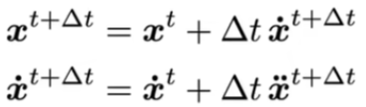

* Solve nonlinear problem for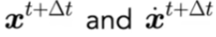
*  Use root-finding algorithm, e.g. Newton's method offers much better stability

#### Implicit Euler Method

How to determine / quantize "stability"?

* We use the local truncation error (every step) / total accumulated error (overall)

* Absolute values do not matter, but the orders w.r.t. step
* Implicit Euler has order 1, which means that
  - Local truncation error: O(h2) and 
  - Global truncation error: O(h)   (h is the step, i. e. Δt)

* Understanding of O(h)
  - If we halve h, we can expect the error to halve as well

#### Runge-Kutta Families

A family of advanced methods for solving ODEs（常微分方程）

* Especially good at dealing with non-linearity
* It's order-four version is the most widely used, a. k. a. RK4

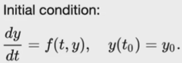 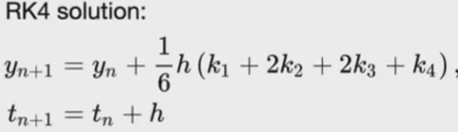

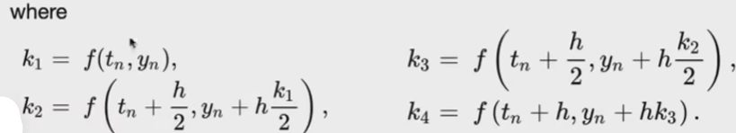

#### Position-based / Verlet Integration

Idea:

* After modified Euler forward-step, constrain positions of particles to prevent divergent, unstable behavior
* Use constrained positions to calculate velocity
* Both of these ideas will dissipate energy, stabilize

Pros / cons

* Fast and simple
* Not physically based, dissipates energy (error)

#### Rigid Body Simulation

Simple case

* Similar to simulating a particle
* Just consider a bit more properties

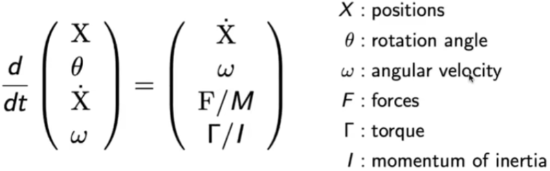

### Fluid Simulation

#### A Simple Position-Based Method

Key idea

* Assuming water is composed of small rigid-body spheres
* Assuming the water cannot be compressed (i.e. const. density)
* So, as long as the density changes somewhere, it should be "corrected" via changing the positions of particles

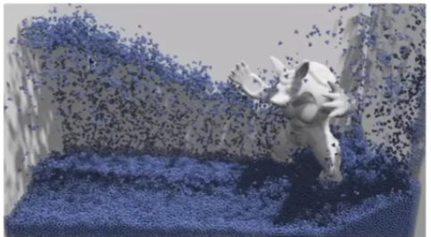

* You need to know the gradient of the density anywhere w.r.t. each particle's position

* Update? Just gradient descent!

#### Eulerian vs. Lagrangian

Two different views to simulating large collections of matters

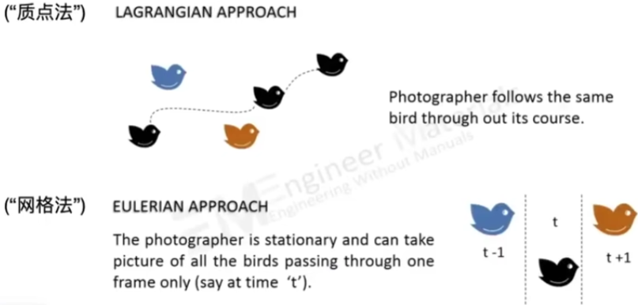

####  Mateiia; Point Method (MPM)

Hybrid, combining Eulerian and Lagrangian views

* Lagrangian: consider particles carrying material properties
* Eulerian: use a grid to do numerical integration
*  Interaction: particles transfer properties to the grid, grid performs update, then interpo-late back to particles

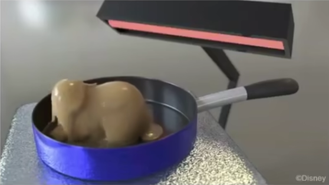

