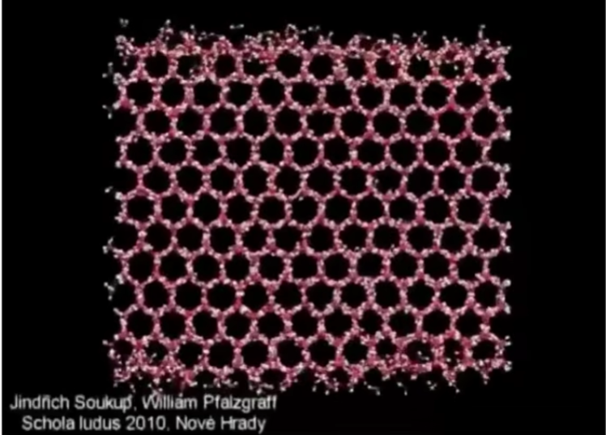

### Animation

"Bring things to life"

* Communication tool
* Aesthetic issues often dominate technical issues

An extension of modeling

* Represent scene models as a function of time

Output: sequence of images that when viewed sequentially provide a sense of motion

* Film: 24 frames per second
* Video (in general): 30 fps
* Virtual reality: 90 fps

#### Keyframe Animation

Animator (e.g. lead animator) creates keyframes
Assistant (person or computer) creates in-between frames

#### Keyframe Interpolation

Think of each frame as a vector of parameter values

#### Keyframe Interpolation of Each Parameter

Linear interpolation usually not good enough

Recall splines for smooth / controllable interpolation

#### Physical Simulation

Newton's Law

$F =ma$

#### Pnysiealiy Based Animation

Generate motion of objects using numerical simulation

Example: Cloth Simulation

Example: Fluids

#### Mass Spring System:（质点弹簧系统）

Example of Modeling a Dynamic System

Example: Mass Spring Mesh

#### A Simple Spring

Idealized spring

Force pulls points together
Strength proportional to displacement (Hooke's Law)
$k_s$ is a spring coefficient: stiffness

problem: this spring wants to have zero length

#### Non-Zero Length Spring

Spring with non-zero rest length

Problem: oscillates forever

#### Dot Notation for Derivatives

If $x$ is a vector for the position of a point of interest, we will use dot notation for velocity and acceleration:

#### Introducing Energy Loss

Simple motion damping

* Behaves like viscous drag on motion
* Slows down motion in the direction of velocity
* $k_d$ is a damping coefficient

#### Problem: slows down all motion

• Want a rusty spring's oscillations to slow down, but should it also fall to the ground more slowly?

#### Internal Damping for Spring

Damp only the internal, spring-driven motion

* Viscous drag only on change in spring length
  * Won't slow group motion for the spring system (e.g.
    global translation or rotation of the group)
* Note: This is only one specific type of damping

#### Structures from Springs

#### Structures from Springs

Behavior is determined by structure linkages

This structure will not resist shearing
This structure will not resist out-of-plane bending...

This structure will resist shearing but has anisotropic bias
This structure will not resist out-of-plane bending either...

This structure will resist shearing.
Less directional bias.
This structure will not resist out-of-plane bending either...

This structure will resist shearing.
Less directional bias.

This structure will resist out-of-plane bending Red springs should be much weaker

#### Example: Mass Spring Dress + Character

#### Aside: FEM (Finite Element Method) Instead of Springs (有限元)

受力分析

#### Particle Systems

Model dynamical systems as collections of large numbers of particles
Each particle's motion is defined by a set of physical (or non-physical) forces
Popular technique in graphics and games

* Easy to understand, implement
* Scalable: fewer particles for speed, more for higher complexity

Challenges

* May need many particles (e.g. fluids)
* May need acceleration structures (e.g. to Ind nearest particles for interactions)

#### Particle System Animations

For each frame in animation

* [If needed) Create new particles
* Calculate forces on each particle
* Update each particle's position and velocity
* [If needed) Remove dead particles
* Render particles

#### Particle System Forces

Attraction and repulsion forces

* Gravity, electromagnetism
* Springs, propulsion

Damping forces

* Friction, air drag, viscosity

Collisions

* Walls, containers, fixed objects
* Dynamic objects, character body parts

Gravida tional Attraction
Newton's universal law of gravitation

* Gravitational pull between particles

#### Example: Galaxy Simulation

先模拟，再渲染

#### Simulated Flocking as an ODE

Model each bird as a particle

Subject to very simple forces:

* attraction to center of neighbors

* attraction to center of neighbors
* repulsion from individual neighbors
* alignment toward average trajectory •of neighbors
* Simulate evolution of large particle system•numerically
  Emergent complex behavior (also seen in fish, bees，..)

#### Example: Molecular Dynamics

#### Example: Crowds + "Rock" Dynamics

#### Forward Kinematics （正逆运动学）

(Slides by Prof. James O'Brien)

Articulated skeleton

* Topology (what's connected to what)
* Geometric relations from joints
* Tree structure (in absence of loops)

Joint types

* Pin (ID rotation)
* 
* Ball (2D rotation) 

* Prismatic joint (translation)

#### Forward Kinematics

Example: simple two segment arm in 2D

 

尖端运动学

#### Kinematics Pros and Cons

Strengths

* Direct control is convenient
* Implementation is straightforward

Weaknesses

* Animation may be inconsistent with physics
* Time consuming for artists

#### inverse Kinematics

Direct inverse kinematics: for two-segment arm, can solve for parameters analytically

#### Why is the problem hard?

Multiple solutions in configuration space

Why is the problem hard?

* Solutions may not always exist

Numerical solution to general N-link 1K problem

* Choose an initial configuration
* Define an error metric (e.g. square of distance between goal and current position)
* Compute gradient of error as function of configuration
* Apply gradient descent (or Newton's method, or other optimization procedure)

#### Rigging (提线木偶模型)

Rigging is a set of higher level controls on a character that allow more rapid & intuitive modification of pose,  deformations, expression, etc.

Important

* Like strings on a puppet
* Captures all meaningful character changes
* Varies from character to character

Expensive to create

* Manual effort
* Requires both artistic and technical training

软选取，磨皮

控制点控制模型

#### Blend Shapes

Instead of skeleton, interpolate directly between surfaces 

E.g., model a collection of facial 

expressions:
Simplest scheme: take linear combination of vertex positions
Spline used to control choice of weights over time

#### Motion Capture

Data-driven approach to creating animation
sequences

* Record real-world performances (e.g. person executing an
  activity)
* Extract pose as a function of time from the data collected

#### Motion Capture Pros and Cons

Strengths

* Can capture large amounts of real data quickly
* Realism can be high

Weaknesses

* Complex and costly set-ups
* Captured animation may not meet artistic needs, requiring alterations

#### Motion Capture Equipment

#### Optical Motion Capture

* Markers on subject
* Positions by triangulation from multiple cameras
* cameras, 240 Hz, occlusions are difficult

#### Optical Motion Capture

Ronda Roussey in Electronic Arts' motion capture studio

#### Motion Data

#### Challenges of Facial Animation

Uncanny valley (恐怖谷效应)   生成的过于真实，被用来做坏事情怎么办？
• In robotics and graphics
• As artificial character  appearance approaches human realism, our emotional response goes negative, until it achieves a sufficiently convincing level of realism in expression

#### Facia; Motion Capture

#### The Production Pipeline

 

