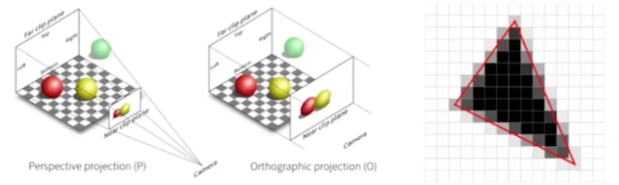
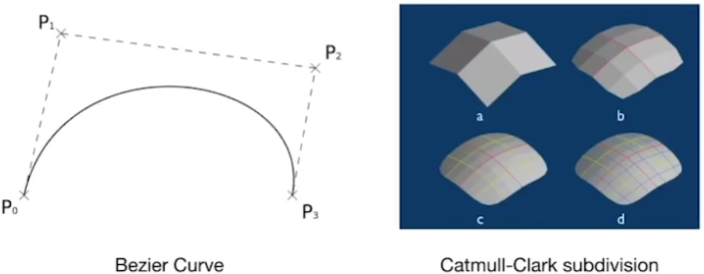
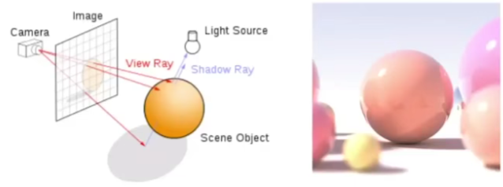
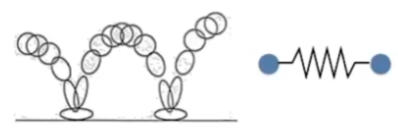
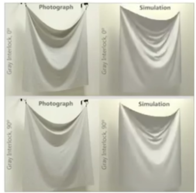
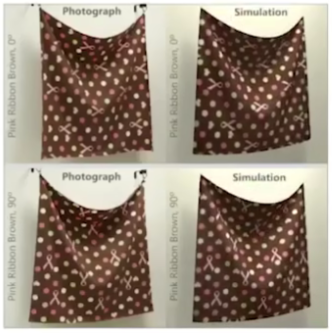
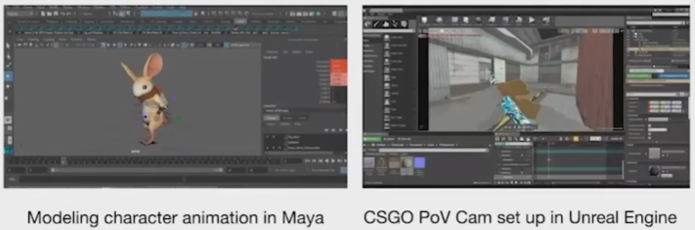
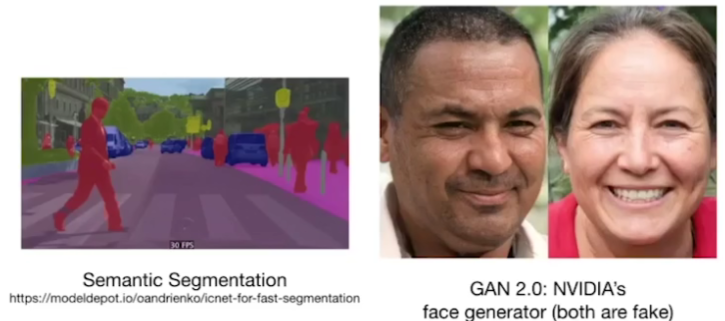
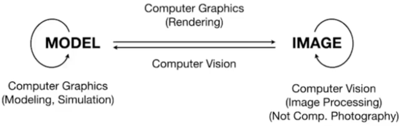

### Overview of Computer Graphics

#### Video Games

1. 全局光照 

#### Movies

特效

面部动作捕捉技术

#### Animation

人能看到东西，光线进入人眼。

模拟粒子运动，碰撞

#### Design

#### Visualization

#### Virtual Reality

#### Digital Illustration

photoshop

#### Simulation

#### Graphical User Interface

#### Typography

矢量图，放大缩小清晰问题

#### Why Study Computer Graphics？

* FundamentaI lntellectual Challenges
  - Creates and interacts with realistic virtual World
  - Requires understanding Of all aspects 0f physical world
  - New computing methods, displays, technologies

* TechnicaIChallenges

  * Math Of(perspective) projections, curves，surfaces
  * Physics Of lighting and shading
  * Representing/operatingshapesin3D
  * Animation/simulation
  * 3D graphics software programming and hardware

* Forget about the previous reasons

  #### Computer Graphics is AWSOME！

* CourseTopics(mainly4parts)

  * Rastenzation（光栅化）
  * CurvesandMeshes（曲线和曲面）
  * RayTracing（光线追踪）
  * Animation/Simulation（动画与模拟）

  

#### Rasterization 

* Project geometry primitives (3D triangles / polygons) onto the screen
* Break projected primitives into fragments (pixels)
* GoId standard in Video Games (ReaI-time Applications)

real time refer  > 30 FPS

#### Curves and Meshes

* How to represent geometry in Computer Graphics

  

#### Ray Tracing

* Shoot rays from the camera though each pixel
  * Calculate intersection and shading
  * Continue to bounce the rays till they hit light source
* GoId standard in Animations / Movies (OffIine AppIications)

#### Animation / SimuIation

* Key frame Animation
* Mass-spring System

#### GAMES101 is NOT about

* Using OpenGL / DirectX / Vulcan
* The syntax Of Shaders
* We learn Graphics,not Graphics APls!
* After this course，you'll be able to learn these 
  by yourself (I promise)
* 3D modeling using Maya / 3DS MAX / Blender，or
  VR / game development using Unity / Unreal Engine
  (where can I learn them?)

* Computer Vision / DeepLearning topics, e.g. XYZ-GAN
  (where can I learn them?)

cv  需要猜测推理

#### Differences?

* Personal Understanding

* No clear boundaries
* And I can't define Computer Graphics

#### General Information

* Modern Course
  * Comprehensive but without hardware programming!
  * Pace / contents subject to change 
* Course Website
  - http://www.cs.ucsb.edu/~lingqi/teaching/gamesl01.html
  - Has all the needed information
  - Syllabus, slides, reading materials, etc.

#### Use An IDE 

* IDE: lntegrated DeveIopment Environment
* Helps you parse a entire project
  - and gives hints on Syntax / usages of member functions，etC.

* Recommended IDEs
  - Visual Studio (Windows only) / Visual Studio Code (Cross platform)
  - Qt Creator (personal)

