### C++基础语法

* 机器(Machine)语言，汇编语言等 （0,1序列，难移植

* 编译型语言，如C++, C 等 （ 跨平台

* 解释型语言，如Basic，Python等  

* 脚本语言，如bash / csh等  

  

### 编程语言的层次和类型

编译型语言一般需要经历一才能变成真正可执行的程序

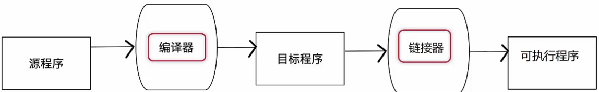

* 编译，链接的大致过程

  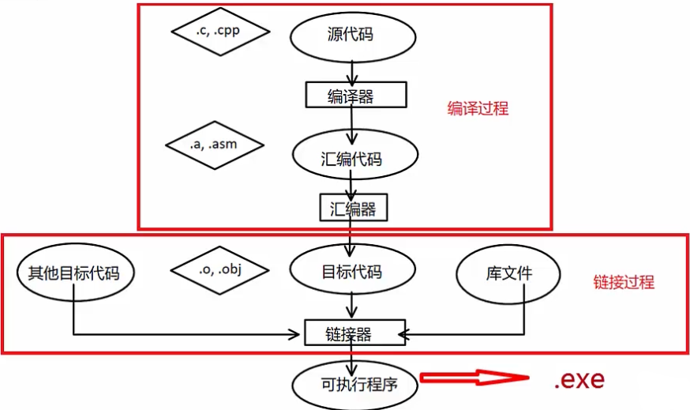

####  一个简单的例子

一个1+1=2 的例子，代码如下·

int sum;      //定义整型变-integer

int m = 1；//定义整型变量

int n = 1 ；

Sum=m+n;   //求和赋值

#### 数据类型的内部结构

* C++中的每个变量都有其数据类型，数据类型决定这变量所占内存空间的大小和布局方式、该空间能存储的值的范围，以及变量能参与的运算。

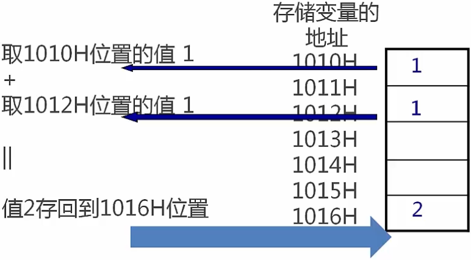

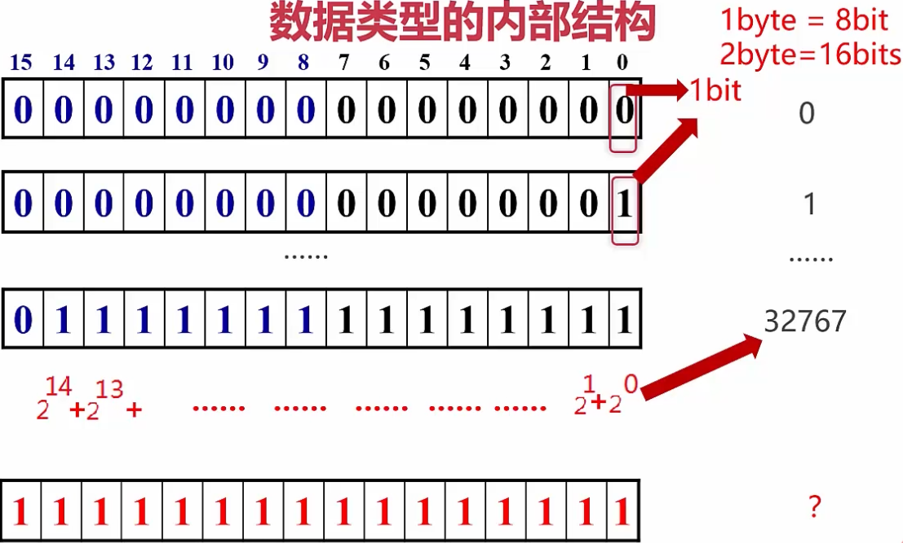

#### 进制的表示

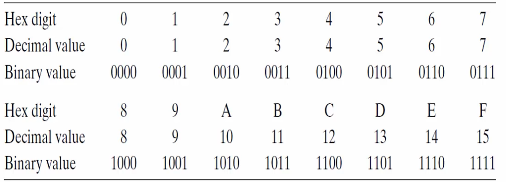

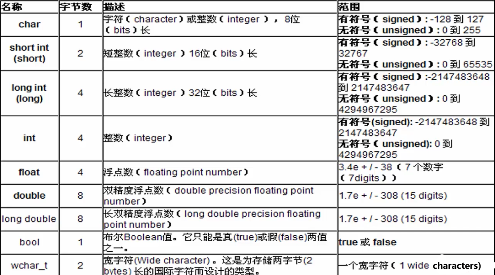

#### 常见的数据类型的定义

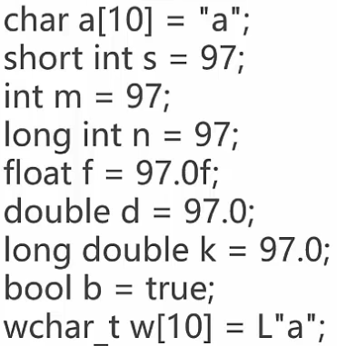

#### 开发环境

Visual Studio 的安装与使用

集成开发环境Integrated DeveIopment Environment

Windows visual studio

#### 标识符，关键字一标识符

* C++中标识符是用来标识变量、函数、类、模块，或任何其他用户自定义项目的名字，
* 一个标识符以字母A-Z或a-z或下划线开始，后跟零个或多个字母、下划线和数字（0一9）；如buttonemail1
* 一个标识符不允许使用数字开头，如lbutton,
* 一个标识符内不允许出现标点字符，比如@、&和％，

* 不能将大小写混淆，C++一勺编程语言比如，在C++中，HelloWorld和helloworld是两个不同的标识符；
* 不能使用C++关键字，原贝刂上不允许长度超过32位；

#### 标识符，关键字

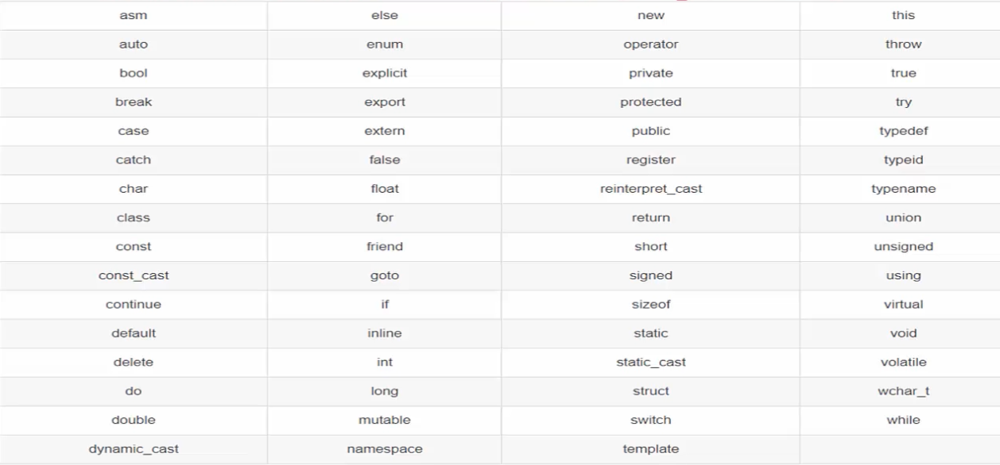

C++11

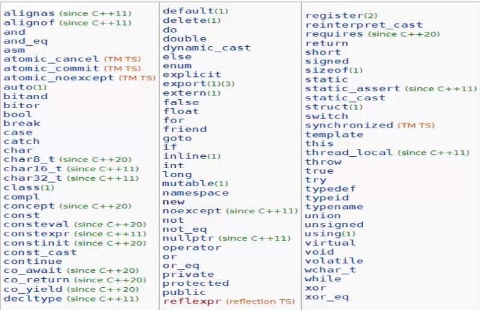

总结：标识符是开发者给一字和下划线来定义，但是数字不能放首位。一般只能使用字母，数字和下划线来定义，但是数字不能放首位。

#### 一些建议

* 不要试图发明最好的命名规贝刂，应该制定一个让大部分成员满意的命名规则，并且在项目组中贯彻执行；
* 标识符应该直观，可以望文知意，尽量使用英文单词组合的方式，不要使用汉语拼音；
* 标识符的长度应当符合'min-length&&max-information'原则，不是长度越长就越好，如maxVal比maxVaueUnitOverflow好；

#### 标识符，关键字——关于标识符，一些建议

* 变量的名字尽量使用"名词"或"形容词+名词"，如value或
  newValue,尽量避免名字中出现数字，如value1，value2等，函数名可以使用"动词+名词"，如DrawGraph;
* 有些著名的命名规则可以参考，如微软的匈牙利命名法，如驼峰式（Camel）命名法，或Pascal命名法；
* 简单说明：
  匈牙利命名法：开头字母用变量类型的缩写，其余部分用变量的英文或英文的缩写，要求单词第一个字母大写，如intiMyAge;Camel命名法：第一个单词首字母小写，后面其他单词首字母大写，如int myAge;
  Pascal命名法：每个单词的第一个字母都大写，如int MyAge;

#### 常量与变量——变量

* 变量：在程序运行过程中，其值可以改变的量为变量；
* 变量在程序的执行中能够赋值，发生变化；
* 变量有一个名字，并在使用之前要说明其类型，一经说明，
  就在内存中占据与其类型相应的存储单元；

#### 变量定义

* 变量定义的基本形式是：首先是一随后紧跟由一个或多个变量名组成的列表，其中变量名以逗号分隔，最后以分号结束。如：intm=1，n=1；

* 当变量在创建时获得了一个特定的值，我们说文个变量被初始化了，用于初始化变量的值可以是任意复杂的表达式。

* 当一次定义了一个或多个变量时，变量的名字随着定义就可以使用了。如：

  int m = 1 , n =1;

  int sum = m + n;

* 常量：在程序运行过程中，其值一直保持不变的量未常量;

* 常量页区分不同的类型 如：

  2、1024 为整型，

  2.0f ,1024.0为实数型

  ‘h’ 为字符类型，
  "hello world" 为字符串类型，
  true,false为bool类型等
  在编辑器中根据其表面形式即可判断其类型；

常量与变量——常量的定义

* C++中有两种简单的定义常量的方法：

  > 1．使用#define,如：#definePI3·1415926；
  > 2．使用const;如：constdoublePI=3．1415926；

注明：

尽量使用const定义变量，#define不会出现在编译器期

#define ASPECT_RATIO 1.653  // 在编译时出错，很难排错

const double ASPECT_RATIO = 1.653 //在编译时出错，可以排错

#### 整数常量

* 整数常可以是十进制、八进制或十六进的常量。
* 前缀指定基数：0x或0X表示十六进制，0表示八进制，不带前缀则默认表示十进制。
* 整数常量也可以带一个后缀，后缀是U和L的组合，U表示无符号整数(unsigned)，L表示长整数(long)。后缀可以是大写，也可以是小写，U和L的顺序任意。

#### 整数常量

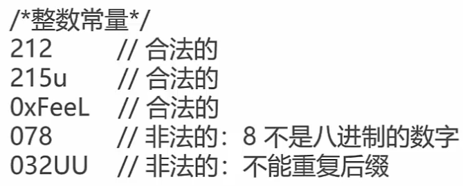

#### 布尔常量

* 布尔常量共有两个，它们都是标准的C++关键字：

  > true值代表真。
  > false值代表假。

#### 字符常量

* 字符常量是括在单引号中。如果常量以L（仅当大写时）开头，则表示它是一个宽字符常量（例如L’x‘），此时它必须存储在wchar_t类型的变量中。否则，它就是一个窄字符常量（例如'×'），此时它可以存储在char类型的简单变量中；
* 字符常量可以是一个普通的字符（例如'x')、一个转义序列（例如'\t'），或一个通用的字符（例如‘\u02C)’）；

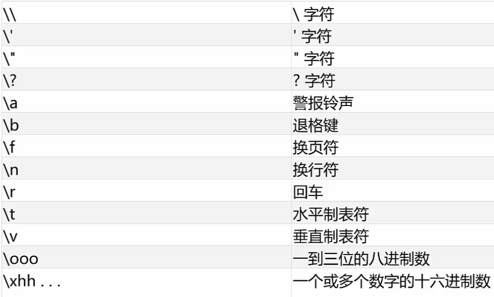

