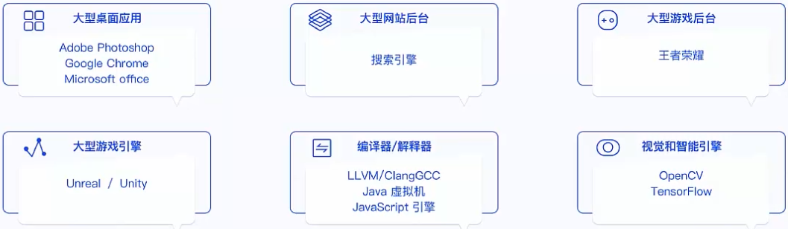

## C++ 概况

#### 语言体现了思考的本质

* 1. 语言把人类和另刂的动物区分了开来
* 2. 在语言学领域，著名的沃尔夫假说(Sapir-Whorfhypothesis)告诉我们：不同的语言可以让说话者产生不同的思想；这也是人类交流障碍的根源之一
* 3. 不同的语言会产生不同的思想，语言体现了思考的本质 ;

#### C, C++发展历史

* C++编程语言的历史可追溯到1979，Bjarne Stroustrup;创立了带类的C。顾名思义，这是C语言的超集；1983，语言的名字真正变成了C++
* C++在最开始可以称作C语言的增强版，但在后来，C++又引入了很多新的功能，逐步增强了c++的可用性1998年伴随着STL标准库的诞生，一堆新的功能和特性的产生，C++标准委员会发布了第一个国际标准；C++ ISO/IEC 1488:称为C++98；

* 在2011年中期，c++标准（称一C++11）完成了新的标准。
  Boost库项目对新标准产生了相当大的影响，一些新模块直接从相应的Boost库中派生出来。
* C++11一之后，C++以每三年一版的频度发布着新的语言标准，每一版都在基本保留向后兼容性的同时，提供着改进和新功能。

#### 为什么C++比C更好

* 当 C++ 被作为C语言的超集诞生时，很多人会问：有什么是C++语言可以做到而C语言做不到的？

* 让我们先看一个简单的C++示例：

  Class Trace {
  Public:

  ​	void print(char* s) {printf("%s",s);

  };

  随着时间的推移，我们需要增加一个新的功能点，比如通过一个状态信息来管理print这个函数的行为；

#### C++的特点

优点：

1. 这让c++语言具备了强大的开发工程能力同时在封装的同时c++取大程度的保留了高性能；
2. 高性能：运行快，快并且占用资源少一直是c++语言的追求；
3. 低功耗：特别适合在各种微型的嵌入式设备中运行高效的程序；

缺点：

1. 语法相对复杂，细节比较多，
2. 需要一些好的规范和范式，否则代码很难维护；

#### C++ 主要用来做什么

*  大型桌面应用程序（如Goog|eChrome和icrosoftOffice)
* 大型网站的后台，如Google的搜索引擎
* 游戏和游戏引擎（如Unity)
* 视觉库和AI引擎（如Opencv和Tensorflow)
* 数据库(Microsoft SQL Server和 Mongodb)
* 其他（如自动驾驶系统，嵌入式设备等）

  

#### C++主要用来做什么

总结：
	总得来说，C++的开发成本比较高；对于内存和CPU要很高，低功耗并且程序被调用非常频繁等场景中，目前来说
C++语占是最合适的语言。