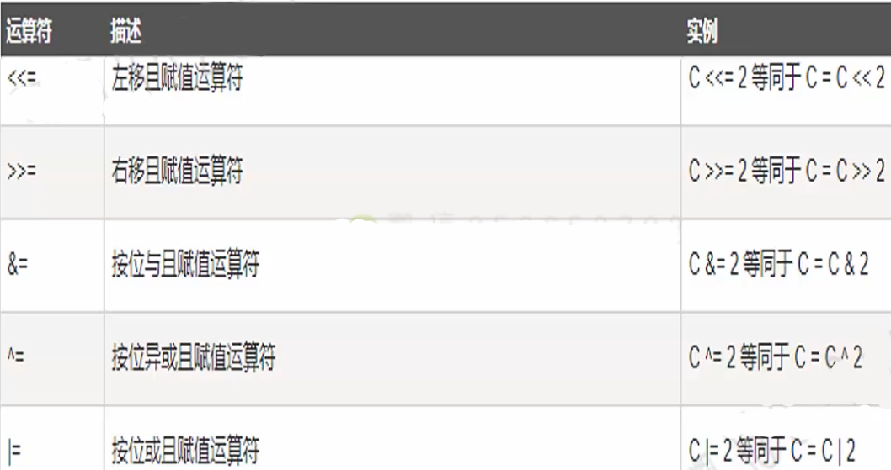

### C++运算符与表达式

* 运算符是一种告诉编译器执行特定的数学或逻辑操作的符号。
  C++内置了丰富的运算符，并提供了以下类型的运算符：

> 算术运算符
> 关系运算符
> 逻辑运算符
> 位运算符
> 赋值运算符
> 杂项运算符

#### 表达式

* 在程序中，运算符是用来操作数据的，因此，这些数据也被称为操作数，使用运算符将操作数连接而成的式子称为：表达式。

表达式具有如下特点:

* 常量和变量都是表达式，例如，常量3.14、变量 i；
* 运算符的类型对应表达式的类型，例如，算术运算符对应算术表达式；
* 每一个表达式都有自己的值，即表达式都有运算结果；

#### 算术运算符

* 假设变量A的值为10，变量B的值为20，则：

### 关系运算符

* 假设变量A的值为10，变量B的值为20，则：

#### 示例

#### 逻辑运算符

* 假设变量A的值为的变量B的值为0，则：

#### 示例

#### 赋值运算符

#### 示例

#### 位运算符

* 位运算符作用于位，并逐位执行操作。&、丨和^的真值表如下所示

  

优先级：
	位"与"、位"或'和位"异或"运算符都是双目运算符，其结合性都是从左向右的，优先级高于逻辑运算符，低于比较运算符，且从高到低依次为&、^、|

#### 示例

* 假设变量A的值为10，变量B的值为20，则：

#### 杂项运算符

#### 实例代码

 

### 运算符优先级

1. 一般来说，一元运算符优先级高于对应的
   二元运算符
2. 屏不清楚优先级，就加括号

### 计算机世界的语言

#### 给人类看的语言--注释

*  程序的注释是解释性语句，您可以在C++代码中包含注释，这将提高源代码的可读性。所有的编程语言都允许某种形式的注释。
* C++支持单行注释和多行注释。
  注释中的所有字符会被C++编译器忽略。

#### 注释的方法

* 单行注释：以//开始，直到行末为止
* 多行注释C++注释以/* 开始，以 */ 终止。

#### 注释的一点原则和建议

* 1好的命名和代码本就是最好的注释；如果代码本身很清楚，不需要额外加注释；
* 2在重要代码段，或复杂代码处先写注释再写代码，这样思路更清晰，同时可以保证代码和注释的一致性；
* 3注释不是越多越好，它是对代码的提示，如果要写就要清楚，并且保证和代码一致，如果更新了代码，请更新相应的注释；

### 补码

#### 机器数和真值

* ##### 机器数：

  一个数在计算机中的二进制表示形式，叫做这个数的机器数。
  机器数是带符号的，在计算机用一个数的最高位存放符号，正数为0，负数为1，
  比如：十进制数+3，就是00000000000000000000000000000011
              十进制数-3，就是10000000000000000000000000000011

  -3补码

  11111111111111111111111111111101

  

* ##### 真值

  真正的数学意义上的数值。
  因为第一位是符号位，所以机器数的形式值就不等于真正的数值，

  00000000000000000000000000000011-> + 3

#### 无符号数的编码

#### 有符号数的补码

#### 另一种计算补码的方法

对正数：直接按位计算权重和

对负数：保留符号位，对后面每位取反+1

#### 补码数值范围举例

#### 节序（Byte Ordering)

一个字（32位机器采用32bits字长4bytes）在内存中

如何以byte来存放的？

两个传统
1，大端法(BigEndian):大多数旧M机器，lnternet传输

 2，小端法(Little Endian): lntel兼容机

#### 观察机器数

 

#### 验证真值

 

 

### 为什么要用补码

我们在设计软件系统时总是希望软件系统尽可能得简单通用。
于是人们希望
在只有加法运算器的情况下设计一种方法能计算减法？

现在是8点，3小时前是5点，9小时以后呢，还是5点
为什么？
因为：8+9一12=5，还是5点，
这里实际上进行了模12操作，还有一个关键点，总共只有12个数，
我们得到一个结论：
8-3和8+9的结果是一样的；
用9去表示-3
然后如果想计算减法8-3，就直接在计算器上输8+9，

### 关于位运算的一点补充说明

* 左移运算比较简单

  

* 右移运算会有两种情况．

  1）逻辑右移：移走的位填充为0；

  

  2）算术右移：移走的位填充与符号亻立有关，负数填充1

   注思：对有符号的数，尽可能不要使用右移运算，因为到底是逻辑右移还是算术右移取决于编译器！

