### C++基础容器

#### 序列型容器--数组

* 概念

  * 代表内存里一组连续的同类型存储
  * 可以用来把多个存储区合并成一个整体

  比如：

  ​          int arr[10] = {1,2,3,4,5,6,7,8};

* 数组声明

  * int arr[10]；
  * 类型名称int表示数纟且里所有元素的举型
  * 名称arr是数组的名称
  * 整数10表示数组里包含的元素个数
  * 数组里元素个数不可以改变

#### 数组

* 使用
  * 每个元素都有下标，通、、下标可以直接访问任意一个元素·
  * 标从0开始到元素个数减一为止
  * 超过下标不可以使用
  * 数组名称和下标一起可以表示数组里的元素 a[4]

* 优点
  * 可以编写循环依次处理数组里的所有元素
  * 循环变量依次代表所有有效下标

* 下标标识了一个数组元素在当前数组容器中的位置

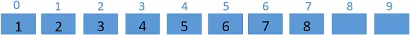


**考虑一个问题**：100米，每10米需要一个栏杆，总共需要多少个栏杆？


#### 数组

* off-by-oneerror（差一错误）

再考虑一个简单的问题：假定整数×满足边界条件×>=16并且×<=37，那么此范围内×的可能取值个数有多少？

我们进行思考时有两个思考问题的原则：

1. 先考虑最简单情况的特例，然后将结果外推；

2. 仔细计算边界；

x的上界与下界重合时，即x>=16&&x<=16，显然个数是1；
假定下界位丨ow,上界位high;当|ow与high重合时，low=high时，个数为1，
据此外推，high-low+1个元素；所以这里37-16+1=22

这里最容易出错就是high-low+1，

是否存在一些编程技巧能避免这种错误呢？


* 使用数学上的左闭右开区间[，）来表示范围

  问题表示位：× >=16 并且 ×<=37->（×>=16&&×<38），
  这样38 - 16=22

* 在C++中，我们一般使用下面的方式对数组进行遍历:

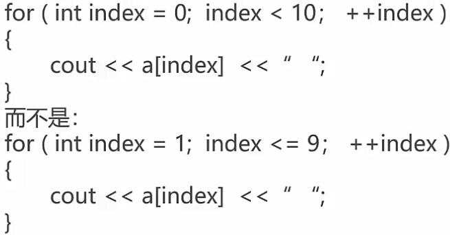


* C语言中设计数组下标的原则：从0开始，使用非对称区间;

  1. 让这个区间是一个非对称的区间[,);

  2. 让下界（左侧）可以取到值，让上界（右侧）取不到值;

  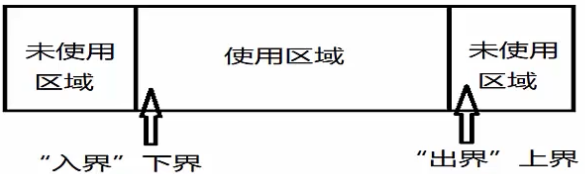

* 这样设计的好处:

  1. 取值范围的大小：上界一下界；
  2. 如果这个取值范围为空，上界值=下界值，
  3. 即使取值范围为空，上界值永远不可能小于下界值；


#### 数组的增删改查

* 数组的增加

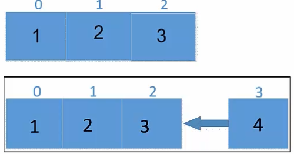

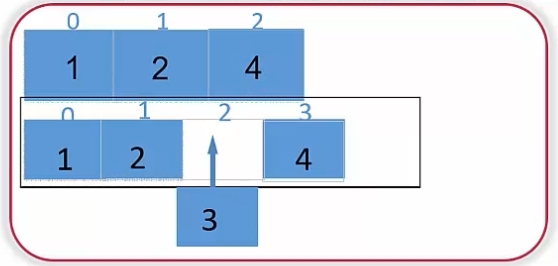

* 数组的删除

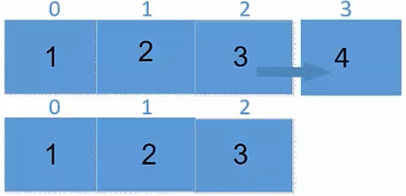

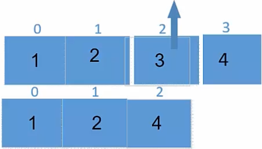

**在尾部添加删除，时间复杂度为O（1）**

**在中间添加删除，时间复杂度为0（n）**


* **数组的访问**

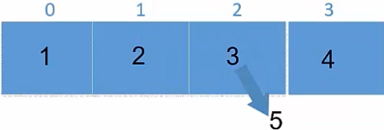

对数组a，
数组下标inde×方式访问：a[2]=5；
指针方式访问．

​					int* p = a;

​					*(p+2) =5 ;

**数组遍历高效,时间复杂度未O(1)**

#### 数组元素的查找

* 寻找第一个值为3的元素下标。

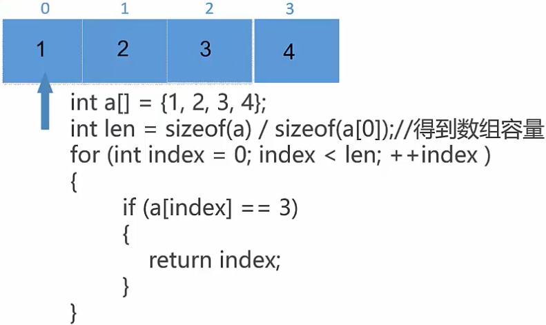


**查找时间复杂度一般为O(n),取决于数组容量**

#### 二维数组

二维数组：包含行列两个维度的数组

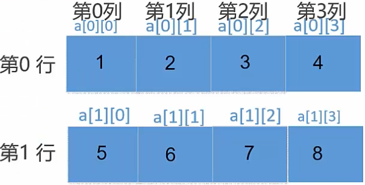

#### 二维数组的访问

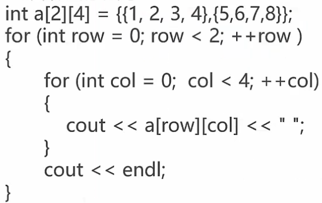

tips: 循环时尽可能要满足"空间局部性"
1．在一个小的时间窗口内，访问的变量地址越接近越好，这样执行速度快；
2，也就是说：一般来说，需要将最长的循环放在最内层，最短的循环放在最外层，以减少CPU跨切循环层的次数；


#### C++中的新型数组-vector简介

* Vector曰面向对象方式的动态数组

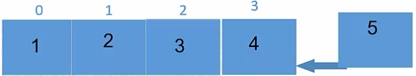

使用最简单的数组，无法实现动态扩容插入元素，因为容量有限

使用Vector容器，轻松实现动态扩容插入元素，传动的C数组，容量有限，vector可以动态管理扩容；

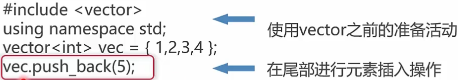

* vector的遍历

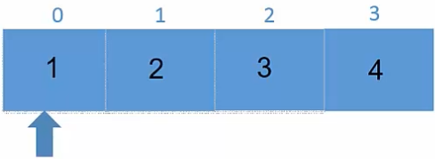
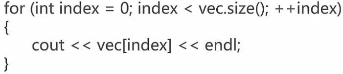

**注意：可以使用vec（的capacity 和size 方法来查看vector当前的容量和已经存储的元素个数；**


C++ 中的新型数组——vector简介

* Vector的插入操作

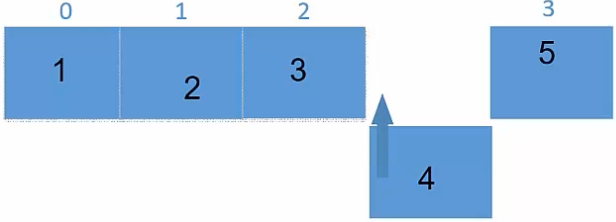

vec.insert(--vec.end(),4);  <--  在中间进行元素插入操作

* Vector的删除操作

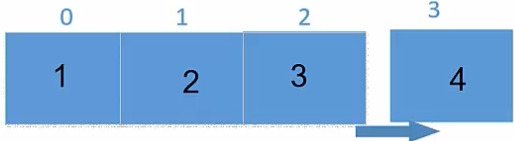

两种方法:

1)  vec.pop_back()

2)  vec.erase(vec.end()-1)

vec.end()最后一个元素的下一个位置

#### 字符串变量与常量

* 字符串变
  * 字符串是以空字符（'\0'）结束的字符数组
  * 空字符'\0'自动添加到字符串的内部表示中
  * 在声明字符串变量时，应该为这个空结束符预留一个额外元素的空间如：char strHeIIoWorId1[11]={"helloworld"}；

* 字符串常量
  * 字符串常量是一对双引号括起来的字符序列
  * 字符串中的每个字符作为一个数组元素存储
  * 例如字符串“helloworld”

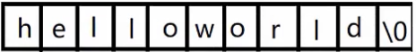

#### 关于字符表示说明

* 0，'\0'与 '0'

  在计算机内部的机器码表示:

  charc1= 0   ;  -> 0x00
  charc2='\0' ;  -> 0x00

  charc3='0'  ;  -> 0x00

* ASCII码表

  ​      ASCII(American Standard Code for lnformation lnterchange, 美国信息交换标准代码）是基于一的一套电脑系统，主要用于显示现代和其他语言。

  ​        它是最通用的信息交换标准，并等同于亠标准丨SO刀EC646。
  ​         ASCII码使用指定的7位或8位一组合来表示128或256种可能的。
  编码表可以参考：https://baike.baidu.com/item/ASCII/309296?fr=aIaddin;
  0×41（十进制65）对应'A'；0X30（十进制48）对应字符'0'
  0×61（十进制97）对应'a'；0×7F（十进制127）对应字符DEL;

* Unicode

  * Unicode编码：最初的目的是把世界上的文字都映射到一套字符空间中；

  * 为了表示Unicode字符集，有3种（确切的说是5种）Unicode的编码方式：

    一. UTF-8:1byte来表示字符，可以兼容ASCI丨码；

    ​       特点是存储效率高，变长（不方便内部随机访问，

    ​        无字节序问题（可作为外部编码）
    二. UTF-16：分为UTF-16BE(bigendian),

    ​                               UTF-16LE    (littIe endian)
    ​        特点是定长（方便内部随机访问），
    ​        有字节序问题（不可作为外部编码）
    三.UTF-32: 分为UTF-32BE(big endian),
    ​                           UTF-32LE(IittIe endian)
    ​       特点是定长（方便内部随机访问），
    ​       有字节序问题（不可亻乍为外部编码）

* 编码错误的根本原因在于编码方式和解码方式的不统一

Windows的文件可能
有BOM(byte order mark),
如要在其他平台使用，可以去掉BOM


#### 字符串的指针表示方法

* 指针表示法：

  ```c++
  char* pStrHeIIoWroId = "helloworld"；
  ```

  指针指向的区域不会更改，

  指针可以指向不同区域

*   char[] 和char*的区别，把握两点：

  * 地址和地址存储的信息；
  * 可变与不可变；

如：

```c++
char strHelloWorld1[11] = {"helloword"};

strHelloWorld不可变， strHelloWorld[index]的值可变；

char* pStrHelloWorld ="helloworld";
```

​     pStrHelloWorld可变，但是pStrHelloWorld[index]的值可变不可变取决于所指区域的存储区域是否可变；


#### 字符串常见操作

* 字符串基本操作1，

  * 字符串长度: strlen(s)

    返回字符串s的长度，不包括'\0'

  * 字符串比较：strcmp(s1,s2)

    如果s1和s2是相同的，则返回0;

    如果s1<s2 则返回值小于0；

    如果s1>s2则返回值大于0；

    两个字符串自左向右逐个字符相比（按ASCII值大小相比较），直到出现不同的字符或遇到'\0'为止。如：“A”<"B" ;"A" <"AB" ; "Apple"<"Banana"; "A"<"a";"compare"<"computer";

    

* 字符串拷贝：strcpy(s1,s2)

  复制字符串s2到字符串s1；

* 字符串基本操作2

  * 复制指定长度字符串：strcpy(s1,s2,n)

    将字符串s2中前n个字符串拷贝到s1中

  * 字符串拼接：strcat(s1,s2)

    将字符串s2接到s1后面

  * 查找字符串：strchr(s1,ch)

    指向字符串s1中的字符ch的第一次出现的位置

  * 查找字符串：strstr（s1,s2）

    指向字符串s1中字符串s2的第一次出现位置

  **注：请使用strnlen_s,strcpy_s,strncpy_s,strcat_s等API函数，更安全!**

#### 字符串操作中的问题

* C中原始字符串的操作在安全性和效率一定的问题：
  举例：

  1. 缓冲区溢出问题举例

     ```c+
     char strHelloWorld1[11] = {"helloworld"};
     
     char strHelloWorld2[11] = {'h','e','l','l','o','w','o','r','l','d','\0'};
     
     strcat(strHelloWorld2,"Welcome to the C++'s world");
     ```

  2. strlen 的效率可以提升: 空间换时间

  **注：调试时预处理可能需要添加：CRT_SECURE_NO_WARNINGS**

* Redis字符串的设计:

  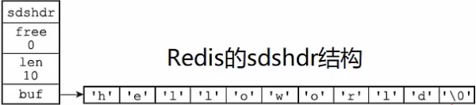

#### C++中的新型字符串-string简介

* c++标准库中提供了string类型专门表示字符串，

  ```c++
  #include<string>
  usingnamespaceStd;
  ```

* 使用string可以更为方便和安全的管理字符串

* 定义字符串变量

  ```c++
  strings ；//定义空字符串
  string s="helloworld"；//定义并初始化
  string s（"helloworld"）；
  string s = string("helloworld"）；
  ```

#### 字符串相关函数

* 获取字符串的长度

  ```c++
  cout<<s1.length()<<endl;
  cout<<s1.size()<<endl;//本质和上面一样
  cout<<s1.capacity()<<endl;
  ```

* 字符串比较：==   !=   >  >=   <   <=

  ```c++
  string s1 = "hello"，s2=“world" ;
  cout<<(s1 == s2) << endl;
  cout<<(s1 !=  s2）<<endl;
  ```

* 转换为C风格的字符串

  ```c++
  const char *c str1 = s1.c_str();
  
  cout << "The C-style string c_str1 is:" << c_str1 <<  endl;
  ```

* 随机访问（获取字符串中某个字符）：[]

  ```c++
  string  s = "hello" ;
  
  s[0] = "h" ; //hello
  ```

* 字符串拷贝：=

  ```c++
  string s1 = "hello" ;
  
  string s2 = s1;
  ```

* 字符串连接：+、+=

  ```c++
  string s1= "hello" , s2= "world" ;
  
  string s3 = s1+s2;   // s3:helloworld
  
  s1+=s2; // s1 : helloworld
  ```

  总结：string结合了C++的新特性，

  使用起来比原始的C风格方法更安全和方便，

  对性能要求不是特别高的常见可以使用。

