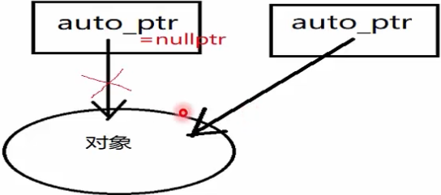

#### C++指针

> 640K ought to be enough for everybod)/.
> ——BillGates

#### 计算机体系中的存储层次

**曲型的Memory Hierarchy**


#### C++中内存单元内容与地址

* 内存由很多内存单元组成。这些内存单元用于存放各种类型的数据。
* 今计算机对内存的每个内存单元都进行了编号，这个编号就称为内存地址，地址决定了内存单元在内存中的位置。
*  记住这些内容单元地址不方便，于是C++语言的编译器让我们通过名字来访问这些内存位置。

举例：

```c++
int a=112，b= -1
float c=3·14；
int* d=&a;
float* e=&c;
```

 

#### 指针的定义和间接访问操作

* 指针定义的基本形式：指针本身就是一个变量，其符合变量定义的基本形式，它存储的是值的地址。对类型T和 T* 是“到T的指针"类型，一个类型为T*的变量能保存一个类型T的对象的地址。

  如： 

  ```c++
  int a = 112; float c = 3.14;
  int* d = &a;float e = &c;
  ```

* 通过一个指针访问它所指向地址的过程称为间接访问（indirection）或者引用指针(dereferencing the point);

  这个用于执行间接访问的操作符是单目操作符*；

如：

```c++
cout << (*d) << endl;
couut <<(*e) << endl;
```


#### C++中内存单元内容与地址

关于变量，地址和指针变脸小结：

* 1. 一个变量有三个重要的信息：

     A. 变量的地址位置；

     B. 变量所存的信息；

     C. 变量的类型；

  2. 指针变量是一个专门用来记录变量的地址的变量；
     通过指针变量可以间接的另一个变量的值，


#### 数组与指针

```c++
intmain()
{
    //定义一个数组
char strHe110WorId[]={"helloworld"};
char* pStrHeIIoWroId="helloworld";
pStrHelloWrold=strHe110WorId;
strHe110WorId=pStrHe110WroId; // 报错，不可变
return 0;
}

```

strHelloWorId不可变，strHelloWorld[index]的值可变；
pStrHelloWrold可变，pStrHelloWrold[index]的值可变不可变
取决于所指区间的存储区域是否可变；

#### 左值与右值

* 概念
  一般说法，编译器为其单独分配了一块存储空间，可以取其地址的，左值可以放在赋值运算符左边，
  右值指的是数据本身；不能取到其自身地址，右值只能赋值运算右边；

* 具体分析：

  左值最常见的情况如函数和数据成员的名字；
  右值是没有标识符、不可以取地址的表达式，一般也称之为"临时对象"。
  比如：a=b+c;
  &a是允许的操作，而&(b+c)不能通过编译，
  因此a是一个左值，而（b+c）是一个右值；

#### 几种C++中的原始指针

* 一般类型指针T

* T是一个泛型，泛指任何一种类型；

  如：

  ```c++
  int i=4；int* iP=&i;cout<<(**iP)<<endl;
  double d=3.14；double* dP=&d ; cout<<（*(dP)<<endl;
  C='a';char* cP=&c; cout<<（*(P)<<endl;
  ```

* 指针的数组（arrayofpointers)与数组的指针(a pointer to an array)：
  指针的数组**T* t[]**
  数组的指针**T (*t) []**

如：

```c++
int* a[4]；
int(*b)[4]  //注意：[]优先级比较高；
```


* const pointer 与 pointer to const

  例子：

  ```c++
  char strHelloworld[] = {"helloworld"};
  char const *pStr1 = "helloworld"
  char* cons tpStr2 = "helloworld"
  char const* const pStr3 = "helloworld"
  pStr1 = strHelloworld;
  //pStr2=strHelloworld;    // pStr2不可改
  //pStr3=strHelloworld;    // pStr3不可改
  ```

* 关于const修饰的部分

  1. 看左侧最近的部分
  2. 如果左侧没有，则看右侧；

  

* 指向指针的指针

  例子：

  ```c++
  int a = 123;
  int* b = &a;
  int** c = &b; 
  ```

* *操作符具有从右向左的结合性
  ** 这个表达式相当于 * (* c)，必须从里
  向外逐层求值，

  * c得到的是c指向的亻立置，即b;
  **  c相当于 * b，得到变量a的值；


| 表达式 | 表达式的值 |
| ------ | ---------- |
| a      | 12         |
| b      | &a         |
| *b     | a,12       |
| c      | &b         |
| *c     | b,&a       |
| **c    | *b,a,12    |

* 未初始化和非法的指针

例子：

```c++
int *a;    // 不知道a指向哪个空间
*a = 12;
```

**运气好的话：定位到一个非法地址，程序会出错，从而终止。**

**最坏的情况：**
**定位到一个可以访问的地址，无意修改了它，**
**这样的错误难以捕捉，引发的错误**
**可能与原先用于操作的代码完全不相干！**

* 用指针进行间接访问之前，一定要非常小心，确保它已经初始化，并被恰当的赋值。

* NULL指针

  一个特殊的指针变量，表示不指向任何东西。

  如：

  ```c++
  int *a = NULL;
  ```

* NULL指针的概念非常有用：

  它给了一种方法，来表示特定的指针目前未指向任何东西。

* 使用的注意事项：

  ​        对于一个指针，如果已经知道将被初始化为什么地址，那么请赋给它这个地址值，否则请将它设置为NULL。

  ​        在对一个指针进行间接引用前，请先判断这个之怎的值是否为NULL；

* 杜绝野指针

  ​       指向“垃圾”内存的指针。if 等判断对它们不起作用，因为没有置NULL；

* 一般有三种情况：

  1. 指针变量没有初始化；
  2. 已经释放不用的指针没有置NULL，如delete和free之后的指针；
  3. 指针操作超越了变量的作用范围；

* 指针使用的注意事项：

  没有初始化的，不用的或者超出范围的指针请把值置为NULL。


* &与*操作符

```c++
char ch='a' ; char* cP = &ch;
```


* & 与* 操作符 

```c++
char ch = 'a';
char* cP =&ch;
```


* ++与--操作符

  ```Char* cp2 = ++cp ;```

```assembly
003716E2 mov eax,dword ptr [cp]
003716E5 add eax,1
003716E8 mov dword ptr [cp],eax
003716EB mov ecx,dword ptr [cp]
003716EE mov dword ptr [cp2],ecx
```

   ```char* cp3 = cp++ ;```

```assembly
003716F1 mov eax,dword ptr [cp]
003716F4 mov dword ptr [cp3],eax
003716F7 mov ecx,doword ptr [cp]
003716FA add ecx,1
003716FD mov dword ptr [cp],ecx
```

```char* cp4 = --cp;```

```assembly
09417000 mov eax,dword ptr [cp]
00941703 sub eax,1
00941706 mov dword ptr [cp],eax
00941709 mov ecx,dword ptr [cp]
Q094170C mov dword ptr [cp4],ecx
```

```char* cp5 = cp---;```

```assembly
0094170F mov eax,dword ptr [cp]
00941712 mov dword ptr [cp5],eax
00941715 mov ecx,dword ptr [cp]
00941718 sub ecx,1
0094171B mov dword ptr [cp],ecxc
```

* ++操作符进一步说明


* 关于++++, ----等运算符：

  ​        编译器程序分解成符号的方法是：一个字符一个字符的读入，如果该字符可能组成一个符号，那么读入下一个字符，一直到读入的字符不再能组成一个有意义的符号。这个处理过程称为"贪心法"。

  例如：

  ```c++
  int a = 1 , b =2 ,c;
  c = a+++b;   // 相当于a++ + b
  d = a++++b;  // 相当于a++ ++b , error
  ```


.cpp 反汇编 查看 ，汇编源码


#### 栈和队列


举例：

```c++
int a = 0;   // (GVAR) 全局初始化区
int* p1;     //  (bss) 全局未初始化区

int main()    // （text）代码区
{
	int b;            //  (stack) 栈区变量
    char s[]="abc";   //  (stack) 栈区变量 
    int* p2;          //  (stack) 栈区变量 
    char *p3 = "123456";   // 123456\0在常量区，p3在（stack）栈区
    static int c = 0;    //(GVAR) 全局(静态)初始化区
    p1 = new int(10);  // (heap) 堆区变量
    p2 = new int(20);  // (heap) 堆区变量
    
    return 0;         //(text)代码区
}
```

先填高&b地址 --> 再填低地址p2


#### 代码和数据在C++程序中的存储


#### 堆heap

* 动态分配资源——堆（heap）：

  1. 从现代的编程语言角度来看，使用堆，或者说使用动态内存分配，是一件很自然不过的事情。

  2. 动态内存带来了不确定性：内存分配耗时需要多久？失败了怎么办？在实时性要求比较高的场合，如一些嵌入式控制器和电信设备。

  3. 一般而言，当我们在堆上分配内存时，很多语言会使用new这样的关键字，有些语言则是隐式分配。在C++中new的对应词是delete,因为C++是可以让程序员完全接管内存的分配释放的。

程序通常需要牵涉到三个内存管理器的操作：

1. 分配一个某个大小的内存块；
2. 释放一个之前分配的内存块；
3. 垃圾收集操作，寻找不再使用的内存块并予以释放；
   这个回收策略需要实现性能、实时性、额外开销等各方面的平衡，很难有统一和高效的做法；
   C++做了1，2两件事；而Java则做了1，3两件事；

#### 资源管理方案--RAII

RAII(Resource Acquisition ls lnitialization):

* C++所特有的资源管理方式。有少量其他语言，如D、Ada和Rust也采纳了RAII,但主流的编程语言中，（++是唯一一个依赖RAII来做资源管理的。
* RAII依托栈和析构函数，来对所有的资源一包括堆内存在内进行管理。对RAII的使用，使得C++不需要类似于Java那样的垃圾收集方法，也能有效地对内存进行管理。RAII的存在，也是垃圾收集虽然理论上可以在C++使用，但从来没有真正流行过的主要原因。
* RAII有些比较成熟的智能指针代表：如std::auto_ptr和boost: shared_ptr

#### 栈和堆中的变量对比


全局静态存储区和常量存储区的变量对比


#### 内存泄漏（Memory Leak）问题

* 令什么是内存泄漏问题．
          指程序中己动态分配的堆内存由于某种原因程序未释放或无法释，造成系统内存的浪费，导致程序运行速度减慢甚至系统崩溃等严重后果。
* 内存泄漏发生原因和排查方式
  1. 内存泄漏主要发生在堆内存分配方式中，即"配置了内存后，所有指向该内存的指针都遗失了"。若缺乏语言这样的垃圾回收机制，这样的内存片就无法归还系统
  2. 因为内存泄漏属于程序运行中的问题，无法通过编译识别，所以只能在程序运行过程中来判别和诊断。

#### 比指针更安全的解决方案

使用指针是非常危险的行为，可能存在空指针，野指针问题，
并可能造成内存泄漏问题。
可指针又非常的高效，所以我们希望以更安全的方式来使用指针。

* 一般有两种典型的方案
  1. 使用更安全的指针一智能指针，
  2. 不使用指针，使用更安全的方式一引用，

#### C++ 的智能指针

* C++中推出了四种常用的只能指针:

  unique_ptr、shared_ptr、weak_ptr、和C++11中已经废弃(deprecated)的auto_ptr ,在C++17中被正式删除；

* 这里，我们从应用方面来分析这几种智能指针：
  1，应用场景

  ​    A. 对象所有权，
  ​    B. 生命周期，
  2．性能分析；


* auto_ptr:

  大括号，作用范围，出了括号，就失效



由new expression获得对象，在auto_ptr对象销毁时，他所管理的对象也会自动被delete掉。


所有权转移：不小心把它传递给另外的智能指针，原来的指针就不再拥有这个对象了。

拷贝/赋值过程中，会直接剥夺指针对原对象对内存的控制权，转交给新对象，然后再将原对象指针置为nullptro


* unique_ptr

  

unique_ptr是专属所有权，所以unique_ptr管理的内存，只能被一个对象持有不支持复制和赋值。
移动语义:unique_ptr禁止了拷贝语义，但有时我们也需要能够转移所有权，于是提供了移动语义，即可以使用std::move()进行控制所有权的转移。

 

* shared_ptr:

  

  shared_ptr通过一个引用计数共享一个对象。

  shared_ptr是为了解决auto_ptr在对象所有权上的局限性，在使用引用计数的机制上提供了可以共享所有权的智能指针，当然这需要额外的开销。

  当引用计数为0时，该对象没有被使用，可以进行析构。

* 循环引用: 引用计数会带来循环引用的问题


循环引用会导致堆里的内存无法正常回收，造成内存泄漏。


* weak_ptr：

  

weak_ptr被设计为与shared_ptr共同工作，用一种观察者模式工作。

作用是协助shared_ptr工作，可获得资源的观测权，
像旁观者那样观测资源的使用情况。
观察者意味着weak_ptr只对shared_ptr进行引用，而不改变其引用计数，
当被观察的shared_ptr失效后，相应的weak_ptr也相应失效。


C++ 的引用

* 引用是什么?

  是一种特殊的指针，不允许修改的指针。

使用指针有哪些坑：

1. 空指针；
2. 野指针；
3. 不知不觉改变了指针的值，却继续使用，

使用引用，则可以

1. 不存在空引用，
2. 必须初始化；
3. 一个引用永远指向它初始化的那个对象，


* 引用的基本使用：可以认为是指定变量的别名，

  使用时可以认为是变量本身；

  如：

  ```c++
  int×=1，×2=3；
  int&rx=×；
  rx=2；
  cout<<x<<endl;     // 2
  cout<<rx<<endl;    // 2
  rx=×2；
  cout<<x<<endl;      //3
  cout<<rx<<endl;     //3
  ```

  

* 有了指针为什么还需要引用？

  BJarne Stroustrup的解释：

  ​	为了支持函数运算符重载；

* 有了引用为什么还需要指针?

  BjarneStroustrup的解释
      为了兼容C语言；

* 补充，关于函数传递参数类型的说明：

  1. 对内置基础类型（如:int ,double等）而言，

     在函数中传递时 pass by value 更高效；

  2. 对OO面向对象中自定义类型而言
     在函数中传递时pass by reference to const更高效；


