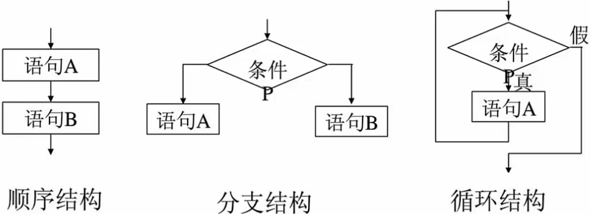
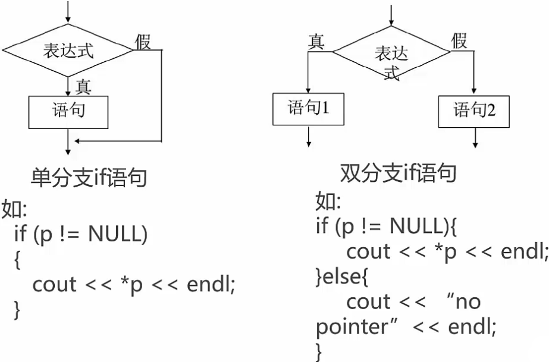
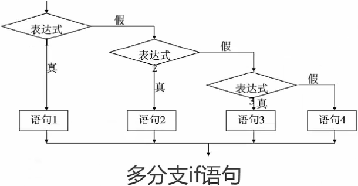
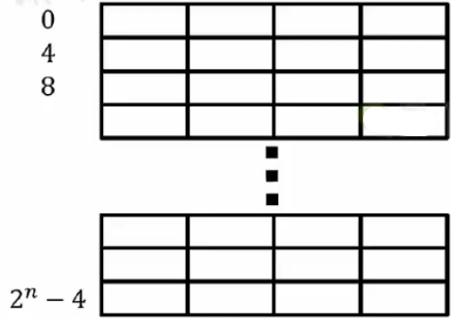
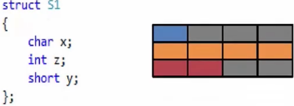
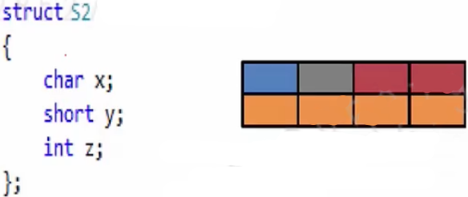
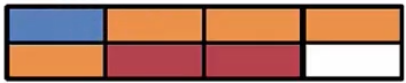
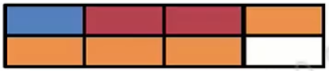
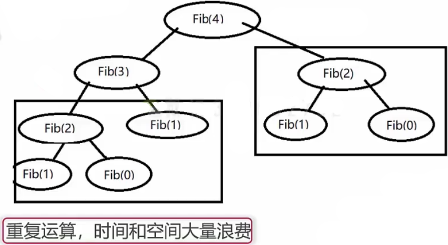

### C++ 基础句法

> A man provided with paper,pencil,and rubber and subject tostrict discipline, is in effect a universal Turing Machine.
> ——AIanMathisonTuring

#### 顺序，分支和循环



#### if分支语句

* 复合语句：
  单一语句：在任何一个表达式后面加上分号(;）
  如：c=a+b;cout<<"helloworld"<<endl;
  复合语句：用一对花括号{}括起来的语句块，在语法上等效于一个单一的语句。

* if语句：

  if语句是最常用的一种分支语句，也称为条件语句。
  如：

  ```c++
  if (p != NULL)
  {
  	cout<< *p << endl;
  }
  else 
  {
      ;
  }
  ```





如：

```c++
if(today==''星期六"）{
//todosomething;
}
else if(today=="星期日"）{
//todosomething2;
}
else if(today=="星期一"）{
//todosomething3;
}
else{//todootherthings;
}
```

判断一个年号是不是闰年：

```c++
return year%400 || (year%4 && !year%100);
```

判断一个整数是否是另一个整数的倍数

```c++
return (a!=0) && b%a ==0;
```

* if 小例子

  ```c++
  typedef enum __COLOR {
  RED,
  GREEN,
  BLUE,
  UNKOWN
  } color;
  
  color color0;
  color0 = BLUE;
  if (color0 == RED) {cout<<"red"<<endl;}
  else if（cplor==GREEN){cout<<"green"<<endl;}
  else if（color == BLUE){cout<<"blue"<<endl;}
  else{cout<<"unknown color"<<endl;}
  ```

  

#### 另一种分支语句 -- switch

* switch小例子

```c++
color color1;
color1=GREEN;
switch(color1)
{
  case RED:
        cout<<"red"<<endl;
        break;
   case GREEN:
        cout<<"green"<<endl;
        break;
	case BLUE:
        cout<<"blue"<<endl;
        break;
    default:
        cout<<"unknown color"<<endl;      
        break;
}
```


* switch 的一般形式：

  ```c++
  switch(表达式）
  {
  case 常数1：语句1；break;
  case常数2：语句2；break;
  case常数n：语句n；break;
  default:语句n+1;
  }
  ```

#### switch分支与if分支都比较

* 使用场景
  1. switch只支持常量值固定相等的分支判断；
  2. if还可以判断区间范围，
  3. 用switch能做的，用if都能做，但反过来则不行；
* 性能比较：
  1. 分支少时，差另刂不是很大；分支多时，switch性能较高；
  2. if开始处几个分支效果高，之后效率递减，
  3. switch所有case的速度几乎一样；

#### 自定结构——枚举

* 使用#define和const创建符号常量，使用enurn不仅能够创建符号常量，还能定义新的数据类型；
* 枚举类型enum(enumeration)的声明和定义：
  例如：enum wT {Monday, Tuesday, Wednesday, Thursday, Friday, Saturday, Sunday};
  wT weekday;

* 使用细节，
  1．枚举值不可以做左值；
  2．非枚举变量不可以赋值给枚举变量;
  3．枚举变量可以赋值给非枚举变量;

#### 自定义结构——结构体与联合体

* 使用strcut定义的是结构体：
  例如：

  ```c++
  struct Student
  {
      char name[6];
      int age;
      Score s;
  };
  ```

* 使用union定义的联合体:

  例如：

  ```c++
  union Score
  {
  	double sc;
      char level;
  };
  ```

#### 结构体数据对齐问题

* 结构体的尺寸：

  ```c++
  struct s1 
  {
  	char x;
      int z;
      short y;
  };              // sizeof(s1)->12
  struct s2 
  {
      char x;
      short y;
      int z; 
  };              // sizeof(s2)->8
  ```

#### 结构体内存布局

* 结构体的内存布局

  32位CPU眼中的内存布局






**char** 一个字节也会被当做四个字节存储

S1共12字节



S2共8字节


```c++
union Score
{
    double ds;
    char level;
}

struct Student 
{
	char name[6];
    int age;
    Score s;
}

Student s1;
strcpy_s(s1.name,'lili');     // s1.name = 不能直接等
s1.s.ds = 95.5;
s1.s.level = 'A';
s1.s.level='A';

cout << sizeof(Student) << endl;


```


结构体数据对齐——缺省对齐原则

* 32 位CPU:

  char : 任何地址

  short: 偶数地址

  int: 4的整数倍地址

  double: 4的整数倍地址

* 修改默认编译选项：

  Visual C++:
  			#pragma pack(n)
  g++ :

  __ attribute __ ( aligned(n) )
  __ attribute  __ (  __ packed __ )


#### #pragma pack(1)

```c++
struct S1
{
    char x;
    int z;
    short y;
}
```



```c++
struct S1
{
    char x;
    int z;
    short y;
}
```



####  循环语句

* C++中提供了三种循环语句：while, do while 和 for

* 三个循环的编写方式：

  ```c++
  while(表达式) 
  {
  //循环体 
  }
  
  do{
      //循环体语句
  } while(表达式)；
      
  for(表达式1；表达式2；表达式3) 
  {
     // 循环体语句
  }    
  ```

  vs工具

  调试

  右键转到汇编


#### 多层循环的小例子

* 例子：输出所有形如aabb的四位完全平方数。

```c++
// math.h
const static int length = 10;
//aabb 的 完全平方数
int n= 0;
for(size_t i = 0 ; i < length ; i++) 
{
    for(size_t j=0 ; j < length ; j++) 
    {
        n = a*1100+b*11;
        m = sqrt(n); // 4.0
        if((m - int(m)) < 0.000000001 )
        {
        	cout << n <<endl;
        }  
    }    
}
// 平方根的操作速度很慢，会丢失精度


int high,low;
// aabb的完全平方数
for(size_t index =33 ; ; index++) {
    n = index*index;
    if(n<1000)
        continue;
    if(n>9999)
        break;
    high = n/100;
    low = n %100;
    if((high/10 == high%10)&& (low/10 && low%10) 
      cout << n << endl;  
}
```

#### 函数

* 一个C++程序是由若干个源程序文件构成，而一个源程序是
  若干个函数构成，函数将一段逻辑封装起来，便于复用；

* 从用户角度看，函数分成：

  库函数:     标准函数，由C++系统提供；

  ​                  比如：strcpy_s等，

  用户自定义函数:    需要用户定义后使用；
                                   比如：自定义的判断闰年函数isLeapYear;

函数所有组成部分:

1. 返回类型： 一个函数可以返回一个值;
2. 函数名称：这是函数的实际名称，函数名和参数列表一起构成了函数签名，
3. 参数：参数列表包括函数参数的类型、顺序、数量。参数是可选的，也就是说，函数可能不包含参数；


* 函数重载overload 与C++ Name Mangling:

  int test(int a);

  int test(double a);

  int test(int a, double d);


#### 指向函数的指针与返回指针的函数

* 每一个函数都占用一段内存单元，它们有一个起始地址，指向函数入口地址的指针称为函数指针。

  一般形式：数据类型（ * 指针变量名）惨数表）；
  举例：int( *p)(int);

* 注意与返回指针的函数之间区另刂：
  如：
  
  ```c++
int( *p)(int);//是指针，指向一个函数入口地址
  int *p(int);//是函数，返回的值是一个指针
```
  
  再如：
  
  ```c++
  bool ProcessNum(int i,int j,int(*p)(int a,int b));
  char* strcpy(char* dest,const char* src)；
  ```
  
  

#### 命名空间

* 同一个班级，同一个公司，很容易出现同名的人；
  在C++程序种也会出现这样的问题。
* 命名空间这个概念，可作为附加信息来区分不同库中相同
  名称的函数、类、变量等，命名空间即定义了上下文。
  本质上，命名空间就是定义了一个范围。
* 关键词：using和namespace的使用；


#### 函数体

函数的所有组成部分：

4. 函数主体：函数主体包含一组定义函数执行任务的语句；

```c++
intFib(int n)
{
    if(n==0)    
    {
        return0;
    }  
    else if(n===1)
    {
        return1;
    }
    else
    {
        return Fib(n-1）+Fib(n-2);
    }
}

```


#### 内联(inline)函数

如果一个函数是内联的，那么在编译时，编译器会把该函数的代码副本放置在每个调用该函数的地方。

```c++
inline int MaxValue(int×，inty)//求最大数
{
   return (x>y)?x:y; 
}
```

引入内联函数的目的是为了解决程序中函数调用的效率问题；

**空间换时间**

注意：内联函数内部不能有太复杂的逻辑，编译器有时会有自己的优化策略，所以内联不一定起作用；


####  递归与数学归纳法

* 从数学归纳法说起
  数学归缈法证明当n等于任意一个自然数时某命题成立。
  证明步骤分两步：
  1．证明当n=1时命题成立；
  2．假设n=m时命题成立，那么可以推导出在n=m+1时命题也成立(m代表任意自然数);
* 证明世界上所有的人都是秃子：
  我们知道．
  1）0 根头发的人是秃子，有1根头发的人也是秃子；
  2）假设有n根头发的人是秃子，那么有n+1根头发的人也是秃子；所以，所有人都是秃子；

#### 递归问题

* 斐波那契数列递归处理的问题




* 递归的四个基本法则：

  1. 基准肩形：无须递归就能解出:
  2. 不断推进．每一次递归调用都必须使求解状况朝接近基准情形的方向推
  3. 设计法则：假设所有的递归调用都能运行；
  4. 合成效益法则（compound interest rule):求解一个问题的同一个实例时，切勿在不同的递归调用中做重复性的工作；

  由此可见，使用递归来计算诸如斐波那契数列数列并不是一个好主意，


#### 递归(recursion)的缺陷

* 递归是一种重要的编程思想：
  1）很多重要的算法都包含递归的思想；
  2）递归最大的缺陷：
  * A. 空间上需要开辟大量的空间；
    B. 时间上可能需要有大量重复运算，
* 递归的优化：
  1）尾递归：所有递归形式的调用都出现在函数的末尾；
  2）使用循环替代；
  3）使用动态规划，空间换时间

