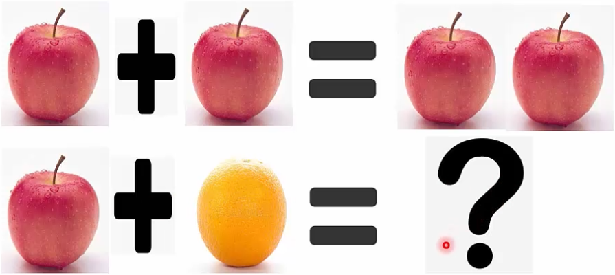
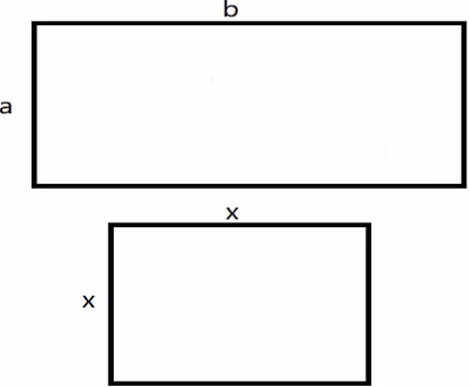
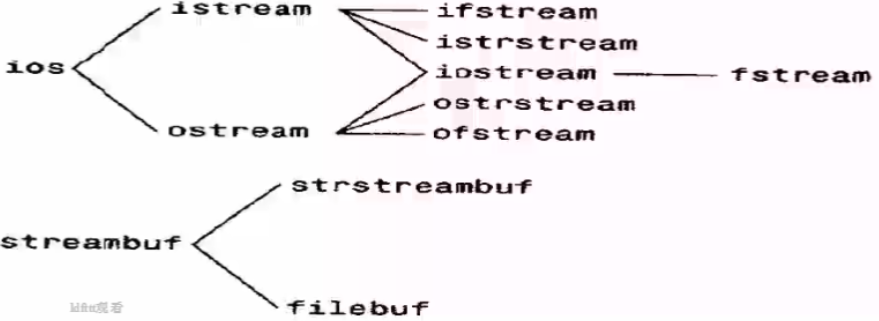
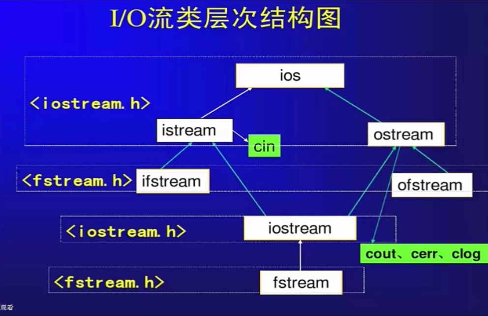
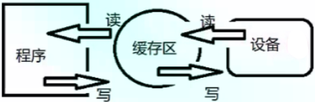
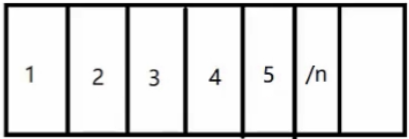
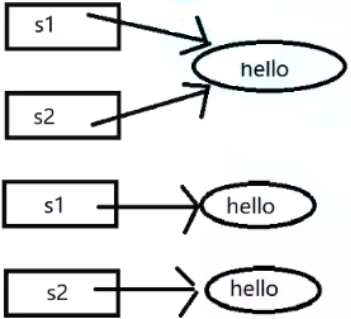
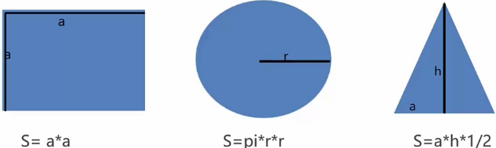

### C++高级语法

#### 抽象是一种认识事物本质的方法



#### 面向对象一类、

* C++使用struct、class来定义一个类：
  struct的默认成员权限是public,
  class的默认成员权限是private,
  除此之外，二者基本无差别；

* 举例 

  **并不是真实世界中的学生，只是一个概念的抽象**

  ```c++
  class Student{
  private://成员变更
  	string name;
  	double score;
  public://成员函数
  	double GetScore(){
      return score;
      }
  }
  ```

#### 面向对象的第一大误区

* 对象是对现实世界中具体物体的反映，继承是对物体分类的反映？

  No!

  

```c++
正方形是一个特殊的长方形？
class rectangle{
virtual void SetLength(double a)
{
    xxx;
}
class square:public rectangle{
virtual void SetLength(double a)
{ 
    yyy; 
}
```

#### 抽象——具体类型

* 让自定义的类像内置类型一样；

  一个int型的变量，可以完成+,-,8,/ ，比较，输出，++等
  一系列操作；

  

  如果现在有一个自定义的复数类型，那么它的操作应该什么样？
  我们希望可以像使用 int 一样自然的使用它，同时它对我们是
  一个黑盒，一种抽象。

```c++
class Complex
{
public:
    Complex(double r,double i);
    Complex operator+(const Complex &c);
    Complex& operator+=(const Complex &c);
    Complex operator-(const Complex &c);
    Complex& operator-=(const Complex &c);
    Complex operator*(const Complex &c);
    Complex& operator*=(const CompIex &c);
    Complex operator/(const Complex &c);
    Complex &operator/=(const Complex &C)；
    bool operator==(const Complex &c);
    bool operator!=(const Complex &c);
    boo1 operator>(const Complex &c);
    bool operator<(const Complex &c);
...
private:
    double _real;       // 复数的实部
    double _image;      // 复数的虚部
}
```

实现略：


I/O流

* 传统的C中I/O有printf,scantgetch,gets等函数，它们的问题是：
  1. 不可编程，仅仅能识另刂固有的数据类型；
  2. 代码的可移植性差，有很多的坑；
* C++中的I/O流istream,ostream等：
  1．可编程，对于类库的而设计者来说很有用，
  2，简化编程，能使得I/O的风格一致，







#### IO缓存区

* 标准IO提供的三种类型的缓存模式：
  1. 按块缓存：如文件系统，
  2. 按行缓存：\n，
  3. 不缓存；



* 缓冲区案例

  


清除缓存区脏数据

```c++
cin.ignore(numeric_limits<std::streamsize>::max(),'\n'); // 清空缓存区脏数据
```


#### 文件操作

* 输入流的起点和输出流的终点都可以是磁盘文件；
* 文件：C++把每个文件都看成是一个有序的字节序列，每个文件都以文件结束标志结束。
* 按照文件中数据的组织形式可把文件分成为：
  1）文本文件：文件中信息形式为ASCI|码文件，每个字符占一个字节；
  2）二进制文件：文件中信息的形式与其在内存中的形式相同；


文件操作步骤，对于文件操作要做以下事情:

1. 打开文件用于读和写open;
2. 检查打开是否成功fail;
3. 读或者写read,write,
4. 检查是否读完EOF(end of file)；
5. 使用完文件后关闭文件close，


文件的打开方式：

​	ios::in         打开文件进行读操作（ifstream默认模式）；

​	ios::out	  打开文件进行写操作（ofstream默认模式）；

​    ios::ate       打开一个已有输入或输出文件并查找到文件尾，

​	ios::app      打开文件以便在文件的尾部添加数据；

​    ios::nocreate   如果文件不存在，则打开操作失败，

​    ios::trunc    如文件存在，清除文件原有内容（默认）；

​    ios::binary   以二进制方式打开；


#### 头文件的重复包含问题

* 为避免同一个文件被include多次，有两种方式

```c++
#ifndef __SOMEFILE_H__
#define __SOMEFILE_H__

...
#endif
/*
使用宏来防止同一个文件被多次包含；
优点：可移植性好；
缺点：无法防止宏名重复，难以排错；
*/
    
#pragma once
使用编译器来防止同一个文件多次包含；
优点，可以防止宏名重复，易排错；
缺点：可移植性不好；
```

**总结：只考虑windows系统可以用方案2，否则用方案1；**


#### 深拷贝与浅拷贝，写时复制

* 浅拷贝：只拷贝指针地址，C++默认拷贝构造函数与赋值运算符重载都是浅拷贝；
  节省空间，但容易引发多次释放；
* 深拷贝：重新分配堆内存，拷贝指针指向
  内容。
  浪费空间，但不会导致多次释放； 



怎么兼有二者的优点？

方案一：引用计数；
方案二：C++新标准的移动语义；


#### 抽象——抽象类型

不同图形的面积计算方法不一样 抽象出——>图形类Shape：




#### 面向对象三大特性

* 封装性；数据和代码捆绑在一起，避免夕卜界干扰和不确定性访问，封装可以使得代码模块化；
* 继承性：让某种类型对象获得另一个类型对象的属性和方法，继承可以扩展已存在的代码；
* 多态性：同一事物表现出不同事物的能力，即向不同对象会产生不同的行为，多态的目的则是为了接口重用；


#### 面向对象到底是什么

* 面向对象是软件工程发展到一定阶段为了管理代码和数据提出的一种方法，它没有解决以前解决不了的问题，不是万能的；

* 面向对象不是对现实世界的映射；但

  它的封装性可以把问题简化，便于抽象，

  它的继承可以减少代码重复，避免重新发明轮子；

  它的多态可以实现灵活的功能扩充，提升开发效率；

* 面向对象为我们便捷的开发出能适应变化的软件提供了可能，但还不够；

