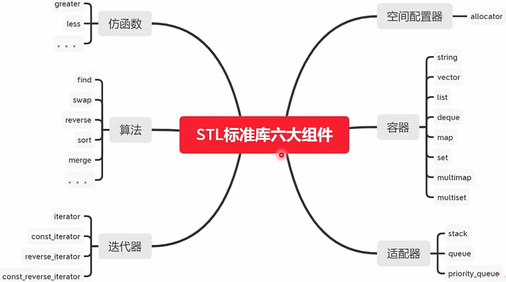

### C++进阶

#### STL(Standard Template Library)

* STL算法是泛型的(generic)，不与任何特定数据结构和对象绑定，不必在环境类似的情况下重写代码；
* STL算法可以量身定做，并且具有很高的效率；
* STL可以进行扩充，你可以编写自己的组件并且能与STL标准的组件进行很好的配合



* 容器用于存放数据；STL的容器分为两大类：

  序列式容器(Sequence Containers):
  	其中的元素都是可排序的（ordered），STL提供了vector,list,deque等序列式容器，而stack, queue, priority_queue 则是容器适配器；

  关联式容器(AssociativeContainers):
  	每个数据元素都是由一个键（key）和值（value）组成，当元素被插入到容器时，按其键以某种特定规则放入适当位置；常见的STL关联容器如：set, multiset, map, multimap;

```c++
#include "stdafx.h"


#include <vector>
#include <list>
#include <queue>
#include <stack>
#include <map>
#include <string>
#include <functional>
#include<algorithm>
#include <utility>
#include <iostream>
using namespace std;


struct Display
{
	void operator()(int i)
	{
		cout << i << " ";
	}
};

struct Display2
{
	void operator()(pair<string, double> info)
	{
		cout << info.first << ":  " << info.second << "  ";
	}
};


//struct cmpMap
//{
//	bool operator()(pair<string, double> a, pair<string, double> b)
//	{
//		return a.first.length() < b.first.length();
//	}
//};

int main()
{
	int iArr[] = { 1, 2,3,4,5 };

	vector<int> iVector(iArr, iArr + 4);
	list<int> iList(iArr, iArr + 4);
	deque<int> iDeque(iArr, iArr + 4);
	queue<int> iQueue(iDeque);     // 
	stack<int> iStack(iDeque);         // 
	priority_queue<int> iPQueue(iArr, iArr + 4);  // 

	for_each( iVector.begin(), iVector.end(), Display() );
	cout << endl;
	for_each(iList.begin(), iList.end(), Display());
	cout << endl;
	for_each(iDeque.begin(), iDeque.end(), Display());
	cout << endl;

	while ( !iQueue.empty() )
	{
		cout << iQueue.front() << " ";  // 1  2 3 4
		iQueue.pop();
	}
	cout << endl;

	while (!iStack.empty())
	{
		cout << iStack.top() << " ";    // 4 3  2  1
		iStack.pop();
	}
	cout << endl;

	while (!iPQueue.empty())
	{
		cout << iPQueue.top() << " "; // 4 3 2 1
		iPQueue.pop();
	}
	cout << endl;

    return 0;
}
```

### 

```c++
#include <string>
#include<map>
#include <algorithm>
#include <iostream>
using namespace std;

struct Display
{
	void operator()(pair<string, double> info)
	{
		cout << info.first << ": " << info.second << endl;
	}
};


int main()
{
	map<string, double> studentSocres;
	studentSocres["LiMing"] = 95.0;
	studentSocres["LiHong"] = 98.5;
	studentSocres.insert( pair<string, double>("zhangsan", 100.0) );
	studentSocres.insert(pair<string, double>("Lisi", 98.6));
	studentSocres.insert(pair<string, double>("wangwu", 94.5));
	studentSocres.insert(map<string, double>::value_type("zhaoliu", 95.5) );
	studentSocres["wangwu"] = 88.5;
	for_each(studentSocres.begin(), studentSocres.end(), Display());
	cout << endl;

	map<string, double>::iterator iter;
	iter = studentSocres.find("zhaoliu");
	if (iter != studentSocres.end())
	{
		cout << "Found the score is: " << iter->second << endl;
	}
	else
	{
		cout << "Didn't find the key." << endl;
	}

	// 
	iter = studentSocres.begin();
	while (iter != studentSocres.end())
	{
		if (iter->second < 98.0)  //
		{
			studentSocres.erase(iter++);  //
		}
		else
		{
			iter++;
		}
	}
	for_each(studentSocres.begin(), studentSocres.end(), Display());
	cout << endl;

	
	for (iter = studentSocres.begin(); iter != studentSocres.end(); iter++)
	{
		if (iter->second <= 98.5)
		{
			iter = studentSocres.erase(iter);  //当前迭代器失效，移动到下一个迭代器
		}
	}
	for_each(studentSocres.begin(), studentSocres.end(), Display());
	cout << endl;

	// find
	//iter = studentSocres.find("LiHong");
	//studentSocres.erase(iter);
	//for_each(studentSocres.begin(), studentSocres.end(), Display());

	//int n = studentSocres.erase("LiHong1");
	//cout << n << endl;
	//for_each(studentSocres.begin(), studentSocres.end(), Display());

	studentSocres.erase(studentSocres.begin(), studentSocres.end());
	for_each(studentSocres.begin(), studentSocres.end(), Display());
	cout << endl;

    return 0;
}
```


### 仿函数(functor)

* 仿函数一般不会单独使用，主要是为了搭配STL算法使用。
* 函数指针不能满足STL对抽象性的要求，不能满足软件积木的要求，无法和STL其他组件搭配；
* 本质就是类重载了一个operator()，创建一个行为类似函数的对象；


```c++
#include <algorithm>
#include <iostream>
using namespace std;

bool MySort(int a, int b)
{
	return a < b;
}
void Display(int a)
{
	cout << a << " ";
}

template<class T>
inline bool MySortT(T const& a, T const& b)
{
	return a < b;
}
template<class T>
inline void DisplayT(T const& a)
{
	cout << a << " ";
}

struct SortF
{
	bool operator() (int a, int b)
	{
		return a < b;
	}
};
struct DisplayF
{
	void operator() (int a)
	{
		cout << a << " ";
	}
};

// C++
template<class T>
struct SortTF
{
	inline bool operator() (T const& a, T const& b) const
	{
		return a < b;
	}
};
template<class T>
struct DisplayTF
{
	inline void operator() (T const& a) const
	{
		cout << a << " ";
	}
};


int main()
{
	// C++ 方式
	int arr[] = { 4, 3, 2, 1, 7 };
	sort(arr, arr + 5, MySort);
	for_each(arr, arr + 5, Display);
	cout << endl;

	// C++  泛型
	int arr2[] = { 4, 3, 2, 1, 7 };
	sort(arr2, arr2 + 5, MySortT<int>);
	for_each(arr2, arr2 + 5, DisplayT<int>);
	cout << endl;

	// C++ 仿函数
	int arr3[] = { 4, 3, 2, 1, 7 };
	sort(arr3, arr3 + 5, SortTF<int>() );
	for_each(arr3, arr3 + 5, DisplayTF<int>());
	cout << endl;

	// C++ 仿函数模板
	int arr4[] = { 4, 3, 2, 1, 7 };
	sort(arr4, arr4 + 5, SortF());
	for_each(arr4, arr4 + 5, DisplayF());
	cout << endl;

    return 0;
}
```


#### 算法(Algorithm)

* STL中算法大致分为四类：包含于 < algorithm >,   < numeric>,  < functional>
  1. 非可变序列算法：指不直接修改其所操作的容器内容的算法；
  2. 可变序列算法：指可以修改它们所操作的容器内容的算法；
  3. 排序算法：包括对序列进行排序和合并的算法、搜索算法以及有序序列上的集合操作；
  4. 数值算法：对容器内容进行数值计算；
* 最常见的算法包括：
          查找，排序和通用算法，排列组合算法，数值算法，集合算法等算法；

```c++
#include <vector>
#include <algorithm>
#include <functional>
#include <numeric>
#include<iostream>
using namespace std;


int main()
{   
	// transform��lambda���ʽ
	int ones[] = { 1, 2, 3, 4, 5 };
	int twos[] = { 10, 20, 30, 40, 50 };
	int results[5];
	transform(ones, ones + 5, twos, results, std::plus<int>()); // 数组元素依次相加并返回
	for_each(results, results + 5,
		[ ](int a)->void {
		cout << a << endl; } ); // lambda表达式，（匿名函数）
	cout << endl;

	// find
	int arr[] = { 0, 1, 2, 3, 3, 4, 4, 5, 6, 6, 7, 7, 7, 8 };
	int len = sizeof(arr) / sizeof(arr[0]);
	vector<int> iA(arr + 2, arr + 6);   // {2,3,3,4}
	//vector<int> iA;
	//iA.push_back(1);
	//iA.push_back(9); // {1, 9}
	cout << count(arr, arr + len, 6) << endl; // 统计6的个数
	cout << count_if(arr, arr + len, bind2nd(less<int>(),  7) ) << endl; // 统计<7 的个数
	cout << binary_search(arr, arr + len, 9) << endl;   // 9 找不到
	cout << *search(arr, arr + len, iA.begin(), iA.end()) << endl; // 

	cout << endl;

    return 0;
}
```


打印全排列

```c++
#include <algorithm>
#include <iostream>
using namespace std;

// 
//
//: "123"   3*2*1 = 3!
//:  123
//          132
//          213
//          231
//          321
//          312
//f(123) = 1+f(23), f(23) = 2+f(3), f(3)  = 3  
void swap(char* a, char* b)
{
	char temp = *a;
	*a = *b;
	*b = temp;
}
void Permutation(char* pStr, char* pPostion)
{
	// 
	if (*pPostion == '\0')
	{
		cout << pStr << endl;
	}
	else
	{
		for (char* pChar = pPostion; *pChar != '\0'; pChar++)
		{
			// 
			swap(*pChar, *pPostion);

			Permutation(pStr, pPostion + 1);

			// 
			swap(*pChar, *pPostion);
		}
	}
}


int main()
{
	char test[] = "132";
	Permutation(test, test);
	cout << endl;

	// 用STL输出全排列
	// 注意：必须要保证数组顺序
	do
	{
		cout << test[0] << test[1] << test[2] << endl;
	} while (next_permutation(test, test + 3));
	cout << endl;

	char test2[] = "321";
	//
	do
	{
		cout << test2[0] << test2[1] << test2[2] << endl;
	} while (prev_permutation(test2, test2 + 3));

    return 0;
}
```


#### 迭代器(iterator)

* 是一种smartpointer,用于访问顺序容器和关联容器中的元素，相当于容器和操纵容器的算法之间的中介；
* 迭代器按照定义方式分成以下四种·
  1. 正向迭代器： iterator;
  2. 常量正向迭代器: constiterator;
  3. 反向迭代器： reverseiterator;
  4. 常量反向迭代器:  const_reverse_iterator;

| 容器           | 迭代器功能   |
| -------------- | ------------ |
| vector         | 随机访问     |
| deque          | 随机访问     |
| list           | 双向访问     |
| set/multiset   | 双向访问     |
| map/mutimap    | 双向访问     |
| stack          | 不支持迭代器 |
| queue          | 不支持迭代器 |
| priority_queue | 不支持迭代器 |

```c++
#include <list>
#include <iostream>
using namespace std;

int main()
{
	list<int> v;
	v.push_back(3);
	v.push_back(4);
	v.push_front(2);
	v.push_front(1);  // 1, 2, 3, 4

	list<int>::const_iterator it;
	for (it = v.begin(); it != v.end(); it++)
	{
		//*it += 1;
		cout << *it << " ";
	}
	cout << endl;

	// 注意迭代器不支持<
	//for (it = v.begin(); it < v.end(); it++)
	//{
	//	cout << *it << " ";
	//}
	cout <<v.front() << endl;
	v.pop_front();  // �Ӷ���ȥ��

	list<int>::reverse_iterator it2;
	for (it2 = v.rbegin(); it2 != v.rend(); it2++)
	{
		*it2 += 1;
		cout << *it2 << " ";                          // 5 4 3
	}
	cout << endl;


    return 0;
}

```


#### 容器适配器（adapter)

* stack堆栈：
  一种"筅进后出"的容器，底层数据结构是使用的deque;
* queue队列：
  一种"先进先出"的容器，底层数据结构是使用的deque;
* priority_queue优先队列：
  一种特殊的队列，它能够在队列中进行排序(堆排序），底层实现结构是vector或者deque,


```c++
#include <functional>
#include <stack>
#include <queue>
#include <iostream>
using namespace std;

int main()
{
	//stack<int> s;
	//queue<int> q;
	priority_queue<int> pq;  // 默认是最大值优先
	priority_queue<int, vector<int>, less<int> > pq2; //  最大值优先
	priority_queue<int, vector<int>, greater<int> > pq3; // 最小值优先
	pq.push(2);
	pq.push(1);
	pq.push(3);
	pq.push(0);
	while (!pq.empty())
	{
		int top = pq.top();
		cout << " top is: " << top<< endl;
		pq.pop();
	}
	cout << endl;


	pq2.push(2);
	pq2.push(1);
	pq2.push(3);
	pq2.push(0);
	while (!pq2.empty())
	{
		int top = pq2.top();
		cout << " top is: " << top << endl;
		pq2.pop();
	}
	cout << endl;


	pq3.push(2);
	pq3.push(1);
	pq3.push(3);
	pq3.push(0);
	while (!pq3.empty())
	{
		int top = pq3.top();
		cout << " top is: " << top << endl;
		pq3.pop();
	}
	cout << endl;

    return 0;
}
```


#### 空间配置器(allocator)

* 《STL源码剖析》侯捷，SGISTL版本的可读性较强;
* 从使用的角度来看，acator隐藏在其他组件中默默工作，不需要关心，但是从理解STL实现角度来看，它是需要首先分析的组件；
* allocator的分析可以体现C++在性能和资源管理上优化思想；

jjalloc.h

```c++
#pragma once
#ifndef _JJALLOC
#define _JJALLOC
#include<new> //for placement new
#include<cstddef> //for ptrdiff_t ,size_t
#include<cstdlib> //for exit()
#include<climits> //for UINX_MAX
#include<iostream> //for cerr

namespace  JJ
{
	template<class T>
	inline T* _allocate(ptrdiff_t size, T*)
	{
		set_new_handler(0);
		T* tmp = (T*)(::operator new((size_t)(size * sizeof(T))));
		if (tmp == 0)
		{
			cerr << "out of memory" << endl;
			exit(1);
		}
		return tmp;
	}
	template<class T>
	inline void _deallocate(T* buffer)
	{
		::operator delete(buffer);

	}

	template<class T1, class T2>
	inline void _construct(T1* p, const T2& value)
	{
		new(p) T1(value);//placement new,invoke constuctor of T1
	}

	template<class T>
	inline void _destroy(T* ptr)
	{
		ptr->~T();
	}

	template<class T>
	class allocator {
	public:
		typedef T value_type;
		typedef T* pointer;
		typedef const T* const_pointer;
		typedef T& reference;
		typedef const T& const_reference;
		typedef size_t size_type;
		typedef ptrdiff_t difference_type;

		//rebind allocator of type U
		template<class U>
		struct rebind {
			typedef allocator<U> other;
		};

		allocator()
		{
			return;
		}

		template <class U>
		allocator(const allocator<U>& c)
		{
		}

		
		pointer allocate(size_type n, const void* hint = 0)
		{
			return _allocate((difference_type)n, (pointer)0);
		}

		void deallocate(pointer p, size_type n)
		{
			_deallocate(p);
		}

		void construct(pointer p, const T& value)
		{
			_construct(p, value);
		}
		void destroy(pointer p)
		{
			_destroy(p);
		}
		pointer address(reference x) { return (pointer)&x; }
		const_pointer const_address(const_reference x) { return (const_pointer)&x; }

		size_type max_size() const {
			return size_type(UINT_MAX / sizeof(T));
		}
	};
}//#end of namespace JJ
#endif
```

main.cpp

```c++
#include "jjalloc.h"
#include <vector>
using namespace std;

int main()
{
	int ia[5] = { 0, 1, 2, 3, 4 };
	unsigned int i;
	vector<int, JJ::allocator<int> > iv(ia, ia + 5);
	for (i = 0; i < iv.size(); i++)
	{
		cout << iv[i] << " ";
	}
	cout << endl;


    return 0;
}
```


**Source Insight**  看STL源码


#### STL总结

* STL的六大组件给软件编程带来了新的多态和复用，是现代C++语言高效的精髓；
* 泛型和STL的学习路线很陡，建议初学者先学会基本使用和简单扩展；
* 掌握了一定基础的情况下，可以通过进一步学习和分析源码，编写自己的组件来提升能力。


关于Boost库

* Boost库是为C++语言标准库提供扩展的一些C++程序库的总称，由Boost社区组织开发、维护，Boost库可以与C++ 标准库完美共同工作，并且为其提供扩展功能；
* Boost可为大致为20多个分类：
          字符串和文本处理库，容器库，算法库，函数对象和高阶编程库，综合类库等等；
            具体见：https://www.boost.org/
                            htts:dl.bintra.com/boostorg/release/

学习boost库的必要性，使用boost库的必要性？ 

没必要专门去学

```c++
#include <boost/lexical_cast.hpp>
#include <iostream>
using namespace std;
using boost::lexical_cast;

int main()
{
	int i = lexical_cast<int>("123");
	cout << i << endl;

	string s = lexical_cast<string>(1.23);
	cout << s << endl;

	int ii; 
	try
	{ 
		ii = lexical_cast<int>("abcd");
	}
	catch (boost::bad_lexical_cast& e)
	{
		cout << e.what() << endl;
	}

    return 0;
}
```


#### C++多线程

* C++11中Thread的使用，
* mutex等锁的使用；
* 进程与线程，同步与异步；
* 线程的交换与移动；


main.cpp

```c++
#include <thread>
#include <mutex>
#include <iostream>
using namespace std;

mutex g_mutex;
void T1()
{
	g_mutex.lock();
	cout << "T1 Hello" << endl;
	g_mutex.unlock();
}
void T2(const char* str)
{
	g_mutex.lock();
	cout << "T2 " << str << endl;
	g_mutex.unlock();
}
int main()
{
	thread t1(T1);
	thread t2(T2, "Hello World");
	t1.join();
	//t2.join();
	t2.detach();
	cout << "Main Hi" << endl;


    return 0;
}
```


```c++
#include <iostream>
#include <thread>
#include <mutex>
using namespace std;


// 存钱
void Deposit(mutex& m, int& money)
{
	// 锁的粒度尽可能最小化
	for(int index = 0; index < 100; index++)
	{
		m.lock();
		money += 1;
		m.unlock();
	}
}
// 取钱
void Withdraw(mutex& m, int& money)
{
	//  锁的粒度尽可能最小化
	for (int index = 0; index < 100; index++)
	{
		m.lock();
		money -= 2;
		m.unlock();
	}
}

int main()
{
	// 
	//int money = 2000;
	//mutex m;
	//cout << "Current money is: " << money << endl;
	//thread t1(Deposit, ref(m), ref(money));
	//thread t2(Withdraw, ref(m), ref(money));
	//t1.join();
	//t2.join();
	//cout << "Finally money is: " << money << endl;

	//线程交换
	//thread tW1([]()
	//{
	//	cout << "ThreadSwap1 " << endl;
	//});
	//thread tW2([]()
	//{
	//	cout << "ThreadSwap2 " << endl;
	//});
	//cout << "ThreadSwap1' id is " << tW1.get_id() << endl;
	//cout << "ThreadSwap2' id is " << tW2.get_id() << endl;

	//cout << "Swap after:" << endl;
	//swap(tW1, tW2); 
	//cout << "ThreadSwap1' id is " << tW1.get_id() << endl;
	//cout << "ThreadSwap2' id is " << tW2.get_id() << endl;
	//tW1.join();
	//tW2.join();

	//// �߳��ƶ�
	thread tM1( []() { ; } );
	//tM1.join();
	cout << "ThreadMove1' id is " << tM1.get_id() << endl;
	cout << "Move after:" << endl;
	thread tM2 = move(tM1);
	cout << "ThreadMove2' id is " << tM2.get_id() << endl;
	cout << "ThreadMove1' id is " << tM1.get_id() << endl;
	tM2.join();

	return 0;
}
```


 

