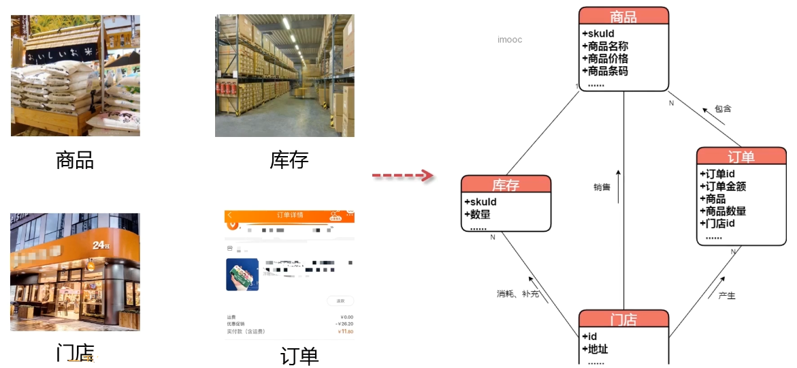
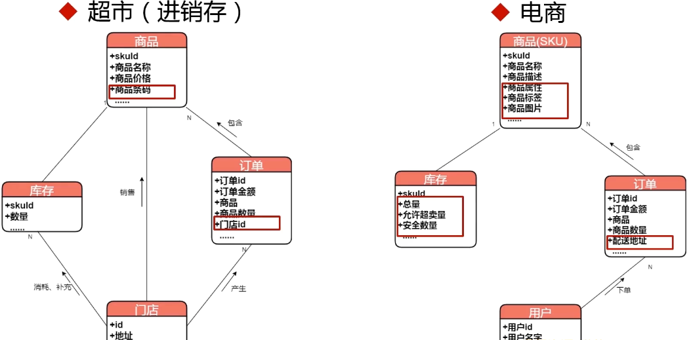
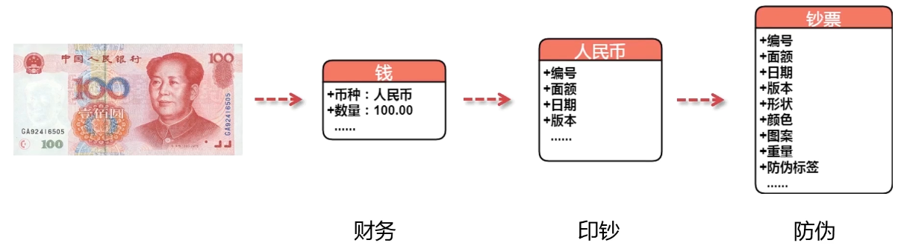
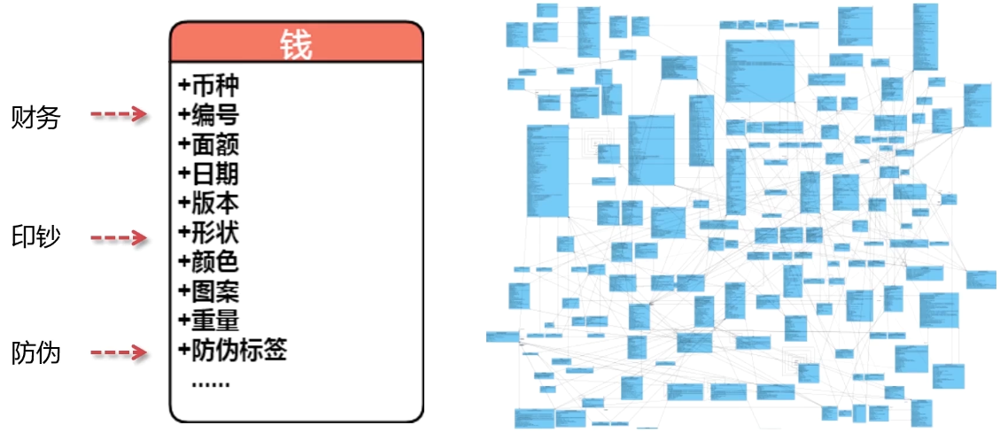
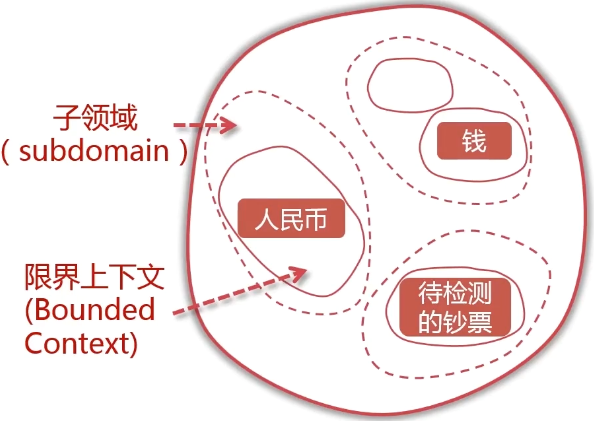
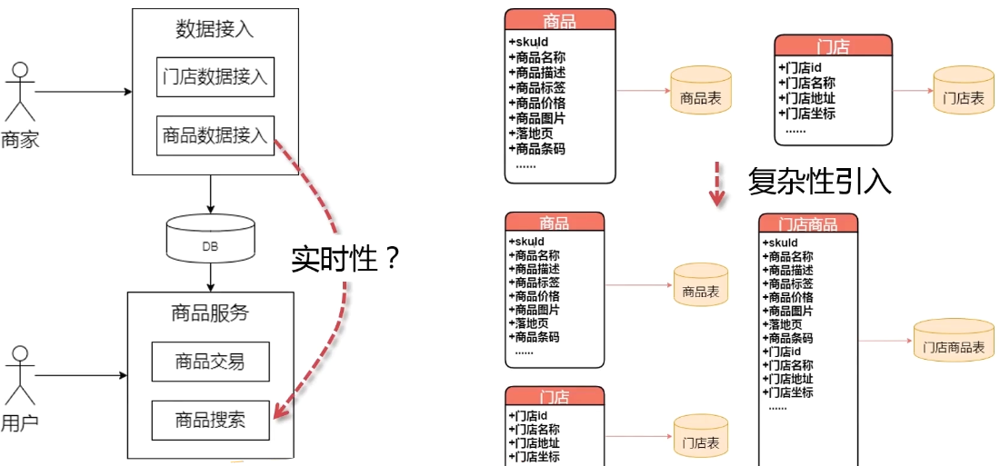
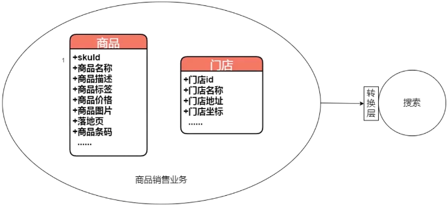

## DDD的核心思想和解决的痛点问题 

* 什么是模型和建模?
* 软件系统的复杂性来自哪里?
* DDD的关键思想以及如何应对多变的复杂性?

模型现实生活的模拟

#### 模型和建模

* 模型是对领域的抽象和模拟
* 建模是针对特定问题建立领域的合理模型

#### 针对领域问题的建模

#### 软件系统复杂性的来源

* 业务复杂性导致模型复杂性
* 技术实现引入额外复杂性

财务和印钞厂，面向不同领域，复杂性就不同

## DDD核心思想一：模型分解

* 领域划分
* 界限上下文

####   技术实现引入额外复杂性

 

## DDD核心思想二：模型驱动设计

* 模型驱动设计(Model Driven Design)

 通过分层架构隔离领域层、仔细选择模型和设计方案等措施，**保持实现与模型的一致**。

#### 小结

* 模 型 是 对 领 域 的 抽 象 / 建 模 是 针 对 特 定 问 题 建 立 领 域 的 合 理 模 型
* 复 杂 性 来 源 于 业 务 本 身 的 复 杂 性 和 设 计 弓 丨 入 的 额 夕 卜 复 杂 性
* 领 域 驱 动 设 计 通 过 分 解 模 型 和 模 型 驱 动 设 计 控 制 复 杂 性
