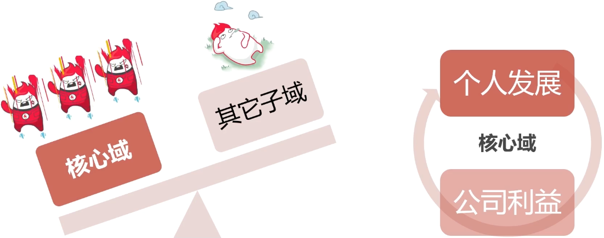
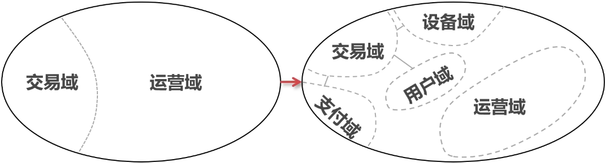
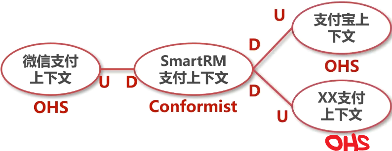

## 智慧零售/新零售

#### 业务背景

-- 面 向 自 动 售 卖 机 的 零 售 SaaS 

  

#### 团队背景

* A 公 司 ： SaaS 公 司 ， 主 要 面 向 零 售 企 业 客 户
* SmartRM 产 品 团 队 ， 一 位 资 深 产 品 经 理 ， 几 位 产 品 策 划
* SmartRM 研 发 团 队 ： 一 位 架 构 师 ， 10 + 开 发 ， 资 深 开 发 3 至 4 位

#### 客户背景

* B集团：零售行 业 某 头 部 商 家
* 全国各地 有 大 量 商 超 和 便 利 店 ， 有 成 熟 的 内 部 系 统和供应链
* 基于自动售卖机的 零 售 业 务 是 新 业 务

#### 案例优势

* 复 杂 度 可 覆 盖 D D D 大 部 分 知 识 点 并 体 现 其 价 值

* 智 慧 零 售 市 场 庞 大 且 场 景 接 近 日 常 生 活

* 有 数 据 分 析 需 求 ， 可 结 合 大 数 据 分 析 场 景

  

## 建模和设计的整体流程

#### 参与人员

#### 用户故事

#### 建立通用语言

* 在讨论模型和定义模型时 ，团队使用的同一种语言 。
* 领域知识需 要 在 团 队 内 部 高 效 流 转 ，模型需要描述。
* 通 用 语 言 要 体 现 在 代 码 里

#### 通用语言

比如：统一售卖机，贩卖机

#### 战略设计

* DDD 中 对 问 题 空 间 和 解 决 方 案 空 间 进 行 分 解 的 过 程
* 目 的 是 分 解 模 型 以 控 制 复 杂 性
* 是 D D D 与 传 统 建 模 和 设 计 方 法 的 核 心 区 别之 一

#### 战术设计

* 对 各 个 BC 的 细 节 设 计 过 程
* B C 内 部 的 模 型 结 构 与 完 整 技 术 方 案

#### 常用建模方法

* Domain Storytelling （ 领 域 故 事 陈 述 法 ）
* Event Storming （ 事 件 风 暴 法 ）
* 4C （ 四 色 建 模 法 ）

#### 小结

##  从用户故事到通用语言

* 用户故事介绍
* 使用DomainStorytelling方法分析用户故事

#### 用户故事

* 代码写好后修改需求？
* 需求文档不细致，矣键点没有？

* 不要拍脑袋定需求
* 基于用户故事讨论

### 1. 用户故事

#### 1.1 什么是用户故事及如何描述

在软件开发中，用户故事是一种对软件系统特性的非正式的自然语言描述，是敏捷软件开发中从终端用户的角度对软件系统特性进行捕捉的一种方式。用户故事描述了不同类型的用户需要什么以及为什么需要，它可以帮助我们创建需求的简单描述。

在软件开发和演讲过程中，随着产品和开发对产品认识的加深，需求总是在不断变化，所以，过早地进入需求细节以及对细节的描述，是一种时间上的巨大浪费。从这一点来说。用户故事提供了一种恰到好处的粒度，使得产品在需求分析阶段能够极大地节约时间，并非使产品和研发人员始终把注意力集中在关键点，表面他们过早地陷入细节被细节所局限，同时给产品功能留出了讨论空间，从而使产品有机会在讨论过程中得到优化。

用户故事的构建一般来说有三个环节：

1. 简单描述用户需求；
2. 围绕简单描述进行讨论；
3. 明确如何验证。

分别对应用户故事的三个元素，也就是3C：Card（卡片）、Conversation(谈话)、Confirmation（验证）。

#### 1.1.1Card(卡片)

卡片，就是指对用户故事的简述（传统上人们通过便利贴在白板上构建用户故事），一个好的用户故事卡片包括三个要素：

1. 谁：谁需要这个功能；
2. 要什么：想通过系统完成什么事情；
3. 为什么：为什么需要这个功能，这个功能带来什么样的价值。

#### 1.1.2Conversation（谈话）

谈话是指用户、领域专家、产品经理、研发之间围绕用户故事进行的讨论，谈话是明确需求细节的必要环节。可以用文字对谈话进行简要记录，此外，也可以基于图形或
其他工具进行讨论。稍后我们会介绍相关工具可以对用户故事进行挖掘和细化（[使用Domain Story Telling挖掘用户故事]（#2．使用Domain Story Telling掘用户故事））。

#### 1.1.3Confirmation（验证）

验证代表了验收测试，描述了客户或者产品owner怎样确定用户故事己经被实现，且能够满足需求。一般可以用如下模板写Confirmation
假设我是<角色>，在xxx情况下，
当我<操作>，
那么<结果>。

### 1.2使用用户故事收集和梳理SmartRM的需求

当SmartRm立项之后，我们开天辟地要做的第一件事情，就是梳理出最顶层的用户故事。在团队中，撰写用户故事的一般是产品经理。在SmartRM案例中，我们的产品经理梳理出来以下这些最主要的顶层用户故事，迈开了系统分析和建模工作的第一步，为我们的后续工作打下了基础。（所有用户故事的详细描述，都是建立通用语言的关键资料，因此，我们将其收录进SartRM通用语言文档）

#### 1.售卖机支付物

###### 。卡片

​     作为用户，
​     我希望在售卖机上通过手机扫码支付购买商品，
​     以便快速便捷地购物。

###### 。谈话

​     详见S“RM通用语言文档

###### 。验收标准

​    假设我是一名用户，货道售卖机屏幕的商品列表上有商品A, B，C，
​    当我在售卖机屏幕上选择了商品A，并扫描展示的二维码完成支付后，
​    那么商品A就会从售卖机中弹出，我可以拿到商品A。

#### 2．柜口机免费购物

###### 。卡片

​	作为用户，
​	我希望在支持自动结算免密支付的柜门机上扫码开门后拿到商品，关门就可以结束购物，系统后台可以自动结算并且扣费，以便在柜门机上能更快捷地进行购物。

###### 。验收标准

​	假设我是一名用户，柜门机里有商品A,  B，C
​	当我打开柜门，从柜门机拿走商品A并且关闭柜门，
​	那么后台会自动完成结算和支付，从用户账户扣除商品A的价格，并且锁定柜门。

其他顶层用户故事还包括：

###### 售卖机投放

###### 售卖机撤销

###### 补货

###### 经营分析

些处我们仅对用户故事的描述方法进行示例，所有用户故事的详细描述，请参见SmartRM通用语言文档，

### 2. 使用DomainStoryTelling分析用户故事

学会一种语言的最好方式是听别人说这种语言，尝试重复他们所说的并留意他们的反馈。

#### 2.1 什么是Domain Story Telling?

S单e朊是一种领域分析建模方法，通过这种方法，产品和研发人员可以利用语言学习的相同原理建立或者学习一个领域的通用语言，并且建立领域模型。

#### 2.2 domainsto单elling图和相关工具

在Story Telling过程中，一方（通常是架构师）聆听另一方（通常是产品经理或者领域专家）以主谓宾的句型（谁做了什么）讲述用户故事的流程，进行问答和讨论，并以图
形的方式快速复述出来。

使用在线工具domain-story-modeler(https://github.com/WPS/domain-story-modeler)，可以在线实践domain story Telling.

#### 2.3 对SmartRM的用户故事进行story telling

#### 2.3.1 售卖机扫码支付购物

顶层用户故事的story telliong描述了顶层用户故事的整体框架，但是其中对部分活动的描述并不够，为了更深入的了解领域，我们对这些部分可以进一步展开，进行下一层用户故事的storytelling。例如这里我们对“用户选择商品”（图中(1)、'货道售卖机弹出支付二维码”（图中02）两个子用户故事进一步进行了story telling。

#### 用户选择商品

#### 货道售卖机展示支付二维码

#### 柜门机免密支付

为了充分建立通用语言并且使我们接下来要进行的战略设计能够精准合理，我们对所有顶层用户故事以及必要的子用户故事进行了story telling，由于domain story telling 是建立通用语言之前的重要环节，是建立通用语言的有效手段之一，因此我们也将其结果完整收录进了SmartRM通用语言文档，其它几个顶层用户故事（售卖机投放、售卖机撤销、补货、经营性分析）及其子用户故事的story telling结果果具体请参见该文档。

### 3. 建立通用语言

* 一种描述模型且基于模型的语
* 团队在进行所有交流时都使用它
* 代码中也要体现
* 类和操作的名称
* 施加于模型之上的规则和约束

我们对用户故事进行story telling，其实就是建立领域通用语言的过程，story telling 的输出结果（上述的story telling 图）也就包含了领域通用语言的完整语句，对象、角色、活动、以及体现它们相互作用的完整语句，在图中都可以一览无余。这里我们可以更进一步，将通用语言中的词汇提炼出来，将其中英文都列在通用语言词汇表中，这些词汇将会贯穿整个建模和设计过程，最终也会体现在代码中，因此团队中所有成员，都需要明确理解其含义，并且在相关讨论、模型、以及代码中使用它们。这个表格的样例如下所示，完整表格较长，具体请参见SmartRM通用语言文档。

| 类型 | 中文                       | 英文                    | 上下文                     |
| ---- | -------------------------- | ----------------------- | -------------------------- |
| 对象 | 商品                       | commodity               | 用户选择商品               |
| 对戏 | 支付                       | payment                 | 用户完成支付               |
| 对象 | 货道售卖机                 | slot vending machine    | 货道售卖机展示支付二维码   |
| 对象 | 支付二维码                 | payment QR code         | 货道售卖机展示支付二维码   |
| 系统 | 手机支付平台               | mobile payment platform | 用户在手机支付平台完成支付 |
| 对象 | 柜门机（无人货柜、货柜机） | cabinet vending machine | 柜门机解锁柜门             |
| 对象 | 柜门机二维码               | cabinet QR code         | 用户扫描柜门机二维码       |
| ...  | ...                        | ...                     | ...                        |

####  4. 领域划分

* 什么是领域划分和子域
* 为什么要进行领域划分
* 基于用户故事分解的领域划分方法

##### 什么是领域划分

* 领域划分是以分离关注点为原则对问题空间的划分
* 子域是领域中某个方面的问题和解决它所涉及的一切

##### 为什么要进行领域划分-传统模式的问题

​	

 

#### 基于故事分解的领域划分

#### 交易域拆分结果

#### 整体划分

​	领域划分是对问题空间的划分，原则是分离关注点，目的是将系统的建模和设计工作分而治之，进行简化，并为寻找限界上下文提供依据，打下基础。
​	用户故事是从用户的角度对需求的描述，也就是领域问题的描述，是与实现方案无关的。我们可以借助用户故事进行领域划分。顶层用户故事能够让我们对系统有一个全局性的认识，但是并不包含太多细节，其中的每个活动，可能较复杂，也可能包含了多个子领域的信息。如果我们要深入利用用户故事进行战略和战术设计，需要将它分解成子用户故事，将用户故事中模糊的部分逐层分解，直至清晰和聚焦。

##### 4.1 分界用户故事

   

##### 4·2基于用户故事进行领域划分

对于分解之后的用户故事，我们可以按照分离关注点的原则将其进行分类，将关注同一细分领域的用户故事分为一组，将这些用户故事形成的小组命名，即可得到各个子领域，同时根据用例之间的层次关系，也能得到各个子领域之间的关系。

### 核心域和精炼

#### 子域的类型

####  核心域和研发力分配

#### 精炼

#### 案例的核心域

### 5.限界上下文的识别和上下文映射

####  什么是限界上下文

​	限上下文是一种语义上的上下文边界。意思是在这个边界里的软件模型组件都有它特定的含义并且做特定的事。一个限界上下文内的组件都是上下文特定的并且语义明确的。

各个场景语义不同

#### 为什么需要限界上下文

* 自然语言具有模糊性
* 同一个事物面向不同场景有不同模型
* 软件系统需要分解模型以控制复杂性
* 限界上下文是分工的单位

​	理想条件下，子域和限界上下文是一一对应的。子域属于问题空间，限界上下文属于解决方案空间。

#### 如何划分限界上下文

* DomainStoryTeIIing（领域故事陈述法）
* EventStorming（事件风暴法）
* 基于子域概念提取

* 运营上下文
* 交易上下文
* 配送上下文

#### Domain storytelling中边界特征

* 单向练习
* 语义区别
* 活动的触发方式不一样

#### 子域和限界上下文

#### 限界上下文和微服务

 

##### 5.1寻找限界上下文

通过分别从各子领域的用户故事中提取关键概念，审视它们之间的关系，以及与外部系统之间的关系，我们可以梳理出系统中的限界上下文。如下图所示：

融合了领域划分和限界上下文的全局系统概览如下图所示:

##### 5.2上下文映射(Context Mapping)

* 上下文映射是指限界上下文之间的模型映射关系
* 描述团队之间的协作关系以及上下文之间的集成关系
* 决定上下文之间如何集成以及如何设置防腐层

调用关系只是一方面，更重要的是模型和模型的映射关系

#### 上下文映射模式

##### 开放主机服务模式

* 服务提供方为所有消费方提供一套公共的API
* 针对通用的功能和模型

##### 顺从者模式

* 没有模型到模型的转换
* 一个上下文沿用另一个上下文的部分模型

##### 大泥球模式

* 由混杂的模型构成的糟糕系统，模型不稳定且难于维护
* 与大泥球合作的上下文要确保自身不被污染，设置防腐层

##### 防腐层模式

* 把上游上下文的模型转换成自己上下文的模型
* 是下游上下文中访问外部模型的一个代理层

##### 共享内核模式

* 两个上下文共享部分模型
* 包括但不限于代码、jar包、．so、数据库表等等
* 慎用，仅当团队紧密合作且共享部分稳定

##### 合伙人模式

* 技术无关，是一种团队协作关系
* 两个团队之间可以随时互通有无，协同变更

##### 客户/供应商模式

* 下游上下文可以向上游上下文提需求
* 一般用于核心域与非核心域之间的协作

##### 分道扬镳

* 两个上下文无协作，各自独立
* 当两个上下文之间的集成成本过高

旧系统是个大泥球，新系统放弃集成，重新开始

##### 公开语言

* 标准化与协议化的模型
* 所有上下文都可以与公开语言中的模型进行转换
* 对接了公开语言的上下文之间可以实现组件化对接

##### 公开语言的例子

* 蓝牙协议、tcp/ip
* Java生态的jdbc、jvm等
* SQL

​		确定上下文之间的关系，绘制上下文映射图，是战略设计中非常重要的一步。

##### 5.2.1 SmartRM上下文映射

通过明确直4之间的关系，决定应用到上下文之间的协作模式，并且在必要的地方引入防腐层（ACL)。我们得到下面的上下文映射图：

#### 建立分层架构

* 为什么要隔离领域模型
* DDD传统四层架构和洋葱(六边形)架构
* 如何建立分层架构

#### 模型驱动设计和分层架构

* 严格按照领域模型来编写代码
* 建模和实现中都有破坏该原则的因素
* 架构分层能够避免模型在实现过程中被省略或者污染

#### 架构分层是一种古老的技术传统

#### 代码层级结构

client 客户调用

#### 传统模式的问题

* 领域模型易被省略，变成贫血模型
* 容易演变成基于数据的设计，一切从表结构开始
* 领域模型与技术实现混杂，易被技术实现绑架

#### DDD传统四层架构

####  DDD 传统四层架构解决了什么问题

* 分离关注点
* 让领域模型层更独立
* 单向依赖

#### DDD传统四层结构的缺项

* 领域层对基础设施层仍然有感知，领域模型和技术实现耦合

#### 洋葱（六边形）架构优势

* 保持领域层的纯粹性，不受其他因素干扰
* 便于践行模型驱动设计，代码跟随模型
* 便于把团队精力集中到领域模型

#### 依赖倒置和洋葱（六边形）架构

## SmartRM通用语言文档

#### 1·用户故事详细文档

##### 	1、售卖机扫码支付物

##### 	。卡片

​		作为用户，
​		我希望在售卖机上通过手机扫码支付购买商品，
​		以便快速便捷地购买商品。

##### 	。验收标准

​		假设我是一名用户，货道售卖机屏幕的商品列表上有商品A,B，C,
​		当我在售卖机屏幕上选择了商品A，并扫描弹出的二维码完成支付后，
​		那么商品A就会从售卖机中弹出，我可以拿到商品A。

##### 	。谈话

​		[Conversation 01](#4.1.1 Conversation 01)

#### 2.  柜门机免密购物

##### 。卡片

​	作为用户，
​	我希望在支持自动结算免密支付的柜门机上扫码开门后拿到商品，关门就可以结束购物，系统后台可以自动结算并且扣费。
​	以便在柜门机上能更快捷地进行购物。

##### 。验收标准

​	假设我是一名用户，柜门机里有商品A, B，C
​	当我打开柜门，从柜门机拿走商品A并且关闭柜门，
​	那么后台会自动完成结算和支付，从用户账户扣除商品A的价格，并且	锁定柜门。

##### 。谈话

[Conversation02]（#4.1.2 Conversation02）

#### 3. 售卖机投放

##### 	。卡片

​		作为运营人员，
​		我希望按照我的要求把特定型号的售卖机投放到指定的点位，
​		以便通过售卖机销售商品产生利润。

##### 	。验收标准

​		假设我是一名运营人员，
​		当我在系统上指定投放地点和型号并确认投放，
​		那么投放申请会发送给企业的E系统，在P系统的实施流程界面可以看到该申请及其状态。

##### 	。谈话

​		[Conversation03]（#4.1.3 Conversation03）

#### 4．售卖机撤销

##### 	。卡片

​	作为运营人员，

​	我希望按照我的要求撤销指定的售卖机，
​	以便节约成本，提升整体利润

##### 	。验收标准

​	假设我是一名运营人员，
​	当我在系统中申请撤销指定的售卖机，
​	那么系统会发送售卖机撤销申请到企业的E系统，在E系统的实施流程界面可以看到该申请及其状态。

##### 	。谈话

​	[Conversation]（#4.1.4Conversation）

5．补货

##### 	。卡片

​	作为运营人员，
​	我希望按照特定的运营策略，对售卖机中的商品进行及时补充，
​	以便售卖机中的商品始终处于可购买状态。

##### 	。验收标准

​	假设我是一名运营人员，
​	当我在系统中提交了售卖机A的库存计划，设定了它的商品B最大库存是x，安全库存是Y，
​	那么系统会按照我的库存计划生成配送申请并发送到配送中台系统，售卖机A中的商品B库存低于Y时，第二天配送人员会对售
​	卖机A中的商品B进行补货，使其库存达到x。

##### 	。谈话

​	[Conversation05]（#4.1.5Conversation 05）

#### 6，经营分析

##### 	。卡片

​	作为运营人员，
​	我希望能及时查看经营分析报表，
​	以便确定和调整运营策略，包括决定和调整库存计划，决定投放和撤销售卖机的等等。

##### 	。验收标准

​	假设我是一名运营人员
​	当我从系统中选择指定查看点位X的销售报表时，
​	那么相关界面会弹出，并且通过图表的方式展示该点位的销售指标。

##### 	。谈话

​	[Conversation]（#4.1.6Conversation 06）

#### 2·domain story telling

##### 	2·1售卖机扫码支付购物

顶层用户故事的story telling描述了顶层用户故事的整体框架，但是其中对部分活动的描述并不够，为了更深入的了解领域，我们对这些部分可以进一步展开，进行下一层用户故事的story telling。例如这里我们对；佣户选择商品"（图中(1)、'货道售卖机弹出支付二维码"（图中02）两个子用户故事进一步进行了story telling。

#### 2·1.1用户选择商品

##### 2·1.2货道售卖机弹出支付二维码

##### 2·2柜门机免密购物

##### 2.3 售卖机投放

##### 2.4 售卖机撤销

##### 2.5 补货

##### 2.5.1 制定库存计划

##### 2.5.2 执行库存计划

##### 2.6 经营数据分析

#### 3. SmartRM 通用语言词汇表

| 类型 | 中文         | 英文                    | 上下文                     |
| ---- | ------------ | ----------------------- | -------------------------- |
| 角色 | 用户         | user                    | 用户选择商品               |
| 活动 | 选择         | select                  | 用户选择商品               |
| 对象 | 商品         | sku                     | 用户选择商品               |
| 活动 | 完成         | finish                  | 用户完成支付               |
| 对象 | 支付         | payment                 | 用户完成支付               |
| 对象 | 货道售卖机   | slot vending machine    | 货道售卖机弹出支付二维码   |
| 对象 | 展示         | display                 | 货道售卖机弹出支付二维码   |
| 对象 | 支付二维码   | payment QR code         | 货道售卖机弹出支付二维码   |
| 活动 | 弹出         | pop out                 | 货道售卖机弹出商品         |
| 系统 | 手机支付平台 | mobile payment platform | 用户在手机支付平台完成支付 |
| 活动 | 扫描         | scan                    | 用户扫描支付二维码         |
| 对象 | 柜门机二维码 | cabinet QR code         | 用户扫描柜门机二维码       |
| 对象 | 柜门机       | cabinet vending machine | 柜门机解锁柜门             |
| 活动 | 解锁         | unlock                  | 柜门机解锁柜门             |
| 活动 | 锁定         | lock                    | 柜门机锁定柜门             |
| 对象 | 柜门         | cabinet door            | 柜门机锁定柜门             |
| 对象 | 订单         | order                   | 柜门机订单结算             |
| 活动 | 结算         | settle                  | 柜门机订单结算             |
| 活动 | 授权         | authorize               | 用户授权免密支付           |
| 对象 | 免密支付     | password-free payment   | 用户授权免密支付           |
| 活动 | 拿取         | take                    | 用户拿取商品               |
| ...  | ...          | ...                     | ...                        |

## 附录

#### 4.1 谈话记录

##### 4.1.1 Conversation 01

P:用户在设备屏幕上选择商品后，设备展示支付二维码，用户使用微信扫描二维码，完成支付后，设备完成出货，交易结束，设备屏幕上回到商品列表界面。
D：这里的设备是指自动售卖机吗？
P：是的。
D:那么我们以后统一用"售卖机；这个词吧？英文用Vending Machine
P：没问题。
D:如果用户支付失败，会怎么样？
P:售卖机会等待一段时间，然后取消交易，回到商品列表界面。
D:售卖机出货会失败吗？
P：有可能，不过我们还是要找懂这套售卖机的人了解下。
D：是的，我把运营人员O拉进来聊下。
P:O，我们在对SmartRM系统进行建模，想咨询一些售卖机相关的问题。售卖机出货会失败吗？

O：我们应用的售卖机主要包括自动称重式柜门机、弹簧货道售卖机、蛇形货道售卖机。其中，称重式柜门机特点是售卖的商品类型多，不会卡货，主要用于办公楼、商超、小区等室内外公共场所的饮料、零食、生鲜等商品的售卖；弹簧货道售卖机的特点是成本低，售卖商品类型多，卡货概率高，主要用于室内外等公共场所的饮料、零食的售卖；蛇形货道售卖机的特点是体积一般较大、库存容量大、卡货概率低、省电，但是只能用于饮料的售卖，主要放在体育场、工厂、学校、公园等室内或室外公共场所用于饮料售卖。目前我们有一部分存量弹簧货道售卖机，后面大部分室内的会替换成自动称重柜门机，但是仍然会保留一部分。我们的售卖机可靠性很优秀，但是还
是会有几种出货失败的情况。比较常见的出货失败的情况有以下几种：1)卡货；2）售卖机网络问题；3）库存错误

##### 4.1.2Conversation 02

P：柜门机的购物流程是这样的：
1.用户扫码，第一次扫码时授权免密支付
2．扫码成功后，柜门解锁
3．用户打开柜门，拿走想要的商品，关上柜门
4．售卖机后台触发结算，生成订单，从用户微信支付账号扣取货款

##### 4.1.3 Conversation 03

 P：当我们的运营人员发现新的点位并与点位的相关管理人员达成初步意向时，可以在4系统提交售卖机的投放申请。Smart会把申请转发到商家的企业ERP，接下来会经过商务沟通、合同签订、部署安装等环节，在这个流程中，运营人员可以随时查看售卖机投放的进展和状态。
D:投放成功后我们应该做什么？
P：投放成功后，运营人员可以正常地管理这台售卖机，为它制定补货计划。并且查看它的运营效率。
D:投放有可能失败吗？
P:一般不会，因为我们的商务人员会提前与点位的控制者达成一致，当然，如果合同签订环节出现无法解决的问题，则法务人员会在ERP中终止流程，此外，合同签订以前，运营人员也可以随时在SmartRM系统中终止或暂停申请。

##### 4.1.4 Conversation 04

P：当我们发现售卖机无法盈利时，需要把它撤销。
D:如何确定一台售卖机无法实现盈利呢？
P：我们从售卖机的经营数据可以看出端倪。但是，现在先让我们把售卖机撤销这件事情的流程讲清楚吧。
P:当我们决定撤销售卖机时，我们在4系统提交撤销申请，4系统会提交相应申请到E系统，此后，同样会经历商务沟
通、合同解除、设备回收等环节，流程中，运营人员同样可以随时查看售卖机撤销的进展和状态。
D:撤销成功后，还需要在系统中看到它吗？
P：不需要了。
D:撤销有可能失败吗？
P:不可能。

##### 4.1.5  Conversation 05

P：库存计划是最重要的运营策略之一，制定库存计划的最终目标是最大化整体运营利润，整体运营利润由销售毛利润减去运营成本得到，因此补货计划需要尽量增大每台售卖机的销售毛利润，并且尽可能减少平均单机运营成本。其中，单机运营成本的配送成本是可以通过优化补货频率、补货路线来降低的。我们的配送人员，每个人会负责固定的一批售卖机，人员成本会均摊到每台售卖机，而售卖机的补货频率、补货路线，会影响每个人能够负责的售卖机数量。
D：所以运营人员制定库存计划的过程是怎么样的？会希望从系统获得哪些帮助呢？
P：对于新上线的售卖机，运营人员会根据点位的特征和售卖机的型号，使用模板生成库存计划；
P：对于己有的售卖机，运营人员会查看商品销售报表，调整不同商品的计划库存比例，使得不同商品的补货周期趋于一致，这样可以使得单台售卖机的补货频率最小化。
P：当然，最重要的是，我们要确保商品的销售保持在最佳水平，也就是说让每台售卖机销售最热卖的商品。这一点，我们可以从商家现有的商品中台获得帮助，商品中台保存了商家现存的所有可销售商品，以及不同商品的销售数据、商品画像等信息。商品中台提供公共API,外部系统可以通过指定搜索词、特征等参数获取销售最好的商品。当我们发现售卖机现有库存计划中的某个商品销售情况不好时，
可以选择新的商品代替它。
D:运营人员需要分别针对每台售卖机按上述过程操作吗？
P:事实上，运营人员需要决定的是每台售卖机的库存计划，补货计划最好是能由系统自动生成。而当库存计划偏离上述目标时，系统应该能够提示运营人员进行调整。

##### 4.1.6 Conversation 06

P：我们会分析决定不同售卖机销售的商品种类和数量，以确定库存计划。
D：所以我们需要针对每台售卖机从商品池里选择适合销售的商品是吗？
P：是的，我们的目标是选择最优的商品搭配，以使得运营利润最大化。
D：运营利润的定义是什么呢？
P：运营利润：毛利润·运营成本；毛利润：商品销售收入·商品进价成本
D：我们怎么知道一台售卖机的运营成本和毛利润是多少呢？
P：运营成本由很多因素构成，主要包含售卖机的硬件成本（折旧均摊到每个月）、点位租金、电费、维修成本等等，我们会从商家的企业ERP系统直接获得每台售卖机的运营成本。运营收入目前只包含商品的销售收入，我们的系统可以自己根据订单数据得到，同时ERP系统里也会根据财务数据得到一份，在系统无误的情况下，两边的数据应该是一致的，但是我们也需要每个月进行对账。 
