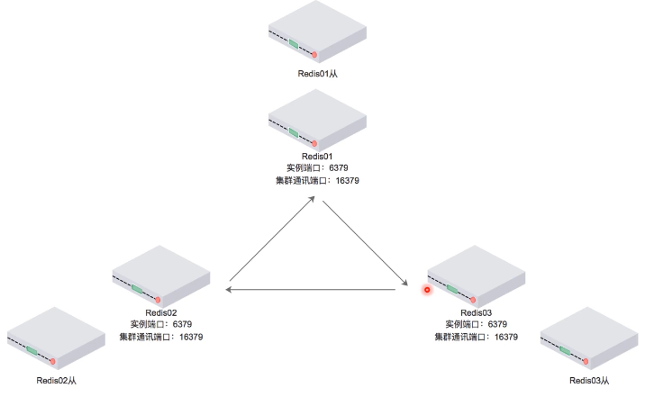
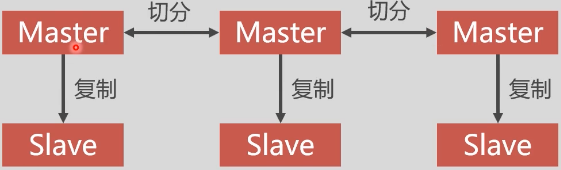

## Docker搭建Redis集群

#### 高速缓存

* 高速缓存利用内存保存数据，读写速度远超硬盘
* 高速缓存可以减少/O操作，降低/O压力

#### Redis集群介绍

*  Redis目前的集群方案分为以下几种：

  1. RedisCluster:官方推荐，没有中心节点

  2. Codis:中间件产品，存在中心节点

  3. Twemproxy:中间件产品，存在中心节点

#### Redis Cluster

* 无中心节点，客户端与redis节点直连，不需要中间代理层
* 数据可以被分片存储
* 管理方便，后续可自行增加或摘除节点



#### 主从同步

* Redis:集群中的数据库复制是通过主从同步来实现的
* 主节点(Master)把数据分发给从节点(Slave)
* 主从同步的好处在于高可用，Redis节点有冗余设计

#### Redis集群高可用

* Redis:集群中应该包含奇数个Master,至少应该有3个Master
* Redis集群中每个Masteri都应该有Slave



spring程序里已经实现了redis的负载均衡，所以不需要专门设置负载均衡

#### 搭建Redis集群

```bash
docker pull redis镜像
docker run -it -d --name r1 -p 5001:6379 --net=net2 --ip 172.19.0.2 redis bash
```

#### 配置Redis节点

```bash
#redis.conf
daemonize yes #以后台进程运行
cluster-enabled yes #开启集群
cluster-config-file nodes.conf #集群配置文件
cluster-node-timeout 15000 #超时时间
appendonly yes #开启AOF模式
```

#### 安装redis-trib.rb

基于Ruby的Redis集群命令行工具

```bash
docker exec -it r1 bash
cd /usr/redis/
mkdir cluster
cd src
cp redis-trib.rb ../cluster
cd ../cluster
# --replicas 1 表示为每个主节点创建一个从节点
./redis-trib.rb create --replicas 1
172.19.0.2:6379 172.19.0.3:6379 172.19.0.4:6379
172.19.0.5:6379 172.19.0.6:6379 172.19.0.7:6379
```


 

