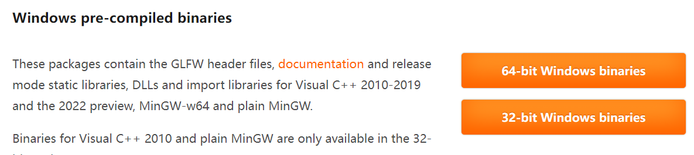
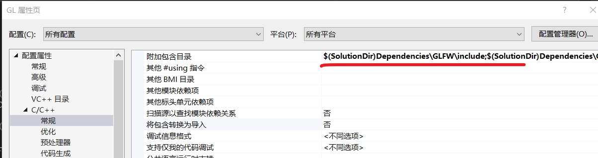
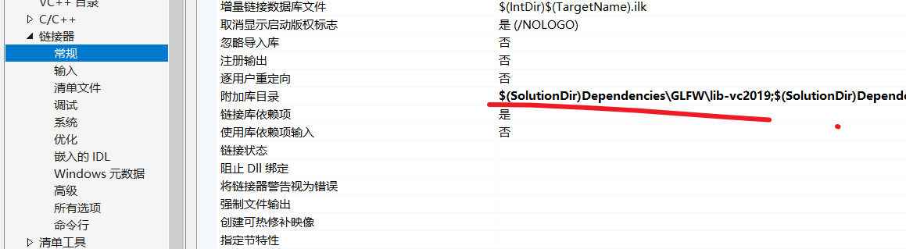
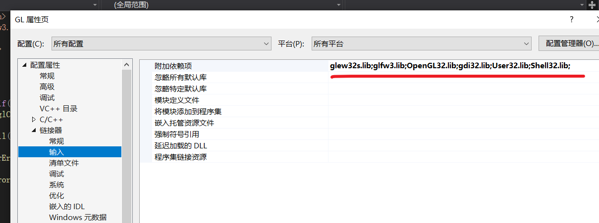

## Setting Up OpenGL

Download [glfw](https://www.glfw.org/download.html)



copy the glfw example code

```c++
#include <GLFW/glfw3.h>

int main(void)
{
    GLFWwindow* window;

    /* Initialize the library */
    if (!glfwInit())
        return -1;

    /* Create a windowed mode window and its OpenGL context */
    window = glfwCreateWindow(640, 480, "Hello World", NULL, NULL);
    if (!window)
    {
        glfwTerminate();
        return -1;
    }

    /* Make the window's context current */
    glfwMakeContextCurrent(window);

    /* Loop until the user closes the window */
    while (!glfwWindowShouldClose(window))
    {
        /* Render here */
        glClear(GL_COLOR_BUFFER_BIT);

        /* Swap front and back buffers */
        glfwSwapBuffers(window);

        /* Poll for and process events */
        glfwPollEvents();
    }

    glfwTerminate();
    return 0;
}
```

Unzip the glfw.zip downloaded before


Copy the 'include' and 'lib-vc2015' to the vs project, include and link them in the vs project c/c++ genneral and linker General input








download glew as glfw


Project Structure

```bash
OpenGL/
      |_Dependencies
      |             |_GLFW
      |             |_GLEW
      |_GL\
      	  |_res\
      	  |_src\
```


