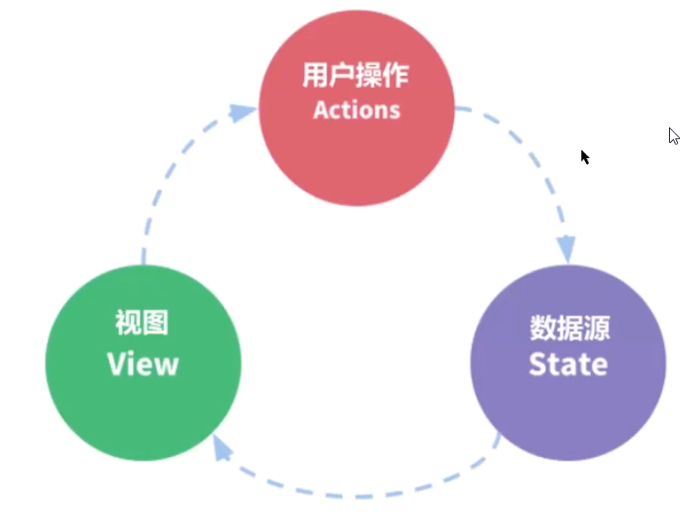

### vuex学习笔记


父子组件传值：

:data=“ ”

@event=“ ”

非常脆弱，不便于维护。


vuex，全局状态管理模式的库，可以用来全局状态管理

把多个组件之间的公用的数据抽离出来，通过一个单例模式进行管理。



创建store.js

```javascript
// 1 导入
import Vue from 'vue';
import Vuex from 'vuex';
import search from './modules/search';

// 2 安装vuex插件
Vue.use(Vuex)

// 创建store实例
const store = new Vuex.Store({
    //模块
    modules: {
        search
    }
});

export default store;
```


导入store实例

```javascript
import store from './store';
 
//挂载
const app = new Vue({
    store
})
```


单独模块search.js

```javascript
export default {
    //独立命名空间
    namespace： true
    //通过state声明
    state:()=> {
      return {
      	 msg: 'hello'   
      };
    }
// 更改state中数据的唯一方式是：提交一个mutations
	mutations: {
        addmsg(state, val) {
            if(!val) {
                state.msg+=val
            }
        },
        // 内部方法调用
        func() {
            this.commit('search/addmsg','vuex')
        }
    } 
}
```


组件中使用: 

```html
<template>
    <view>
        <div>
            {{msg}}
        </div>
    </view>
</template>  

<script>
//导入mapState 函数
// 导入mapMutations函数，处理mutation问题
import {mapState，mapMutations    } from 'vuex';

export default {
    computed: {
        //mapState(模块名,['字段名'，'字段名'，'字段名'])
        ...mapState('search',['msg'])
    },
    methods: {
        ...mapMutations('search',['addmsg'])，
        
        //本地方法直接调用
        localMethods(){
    		this.addmsg(' world');
		}
    }
}
</script>
```

