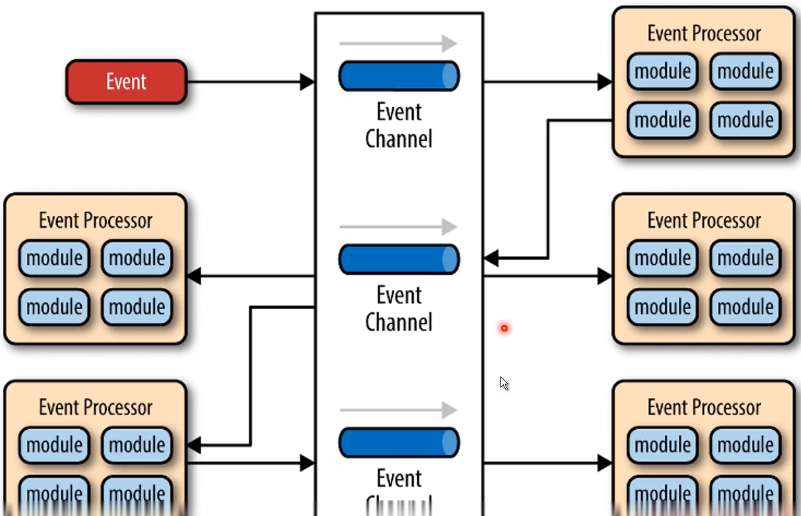

## 一个SQL语句如何执行

#### 有了电子表格，为什么还要数据库？

* 数据量-数据库无上限，分库分表
* 数据库有完备的结构化查询语言（SQL）
* 数据库面向软件，提供软件接口
* 数据库事务是关系型数据库的核心优势
* 数据库具有主备复制、高可用、分布式等形态

 

#### 数据库软件的典型架构是怎样的？

##### 分层架构

##### 时间驱动架构

##### 管道过滤器架构

##### 微核架构

#### MySQL软件架构

语法，词法分析

语句执行计划

转化成文件系统的读和写

#### 总结

* 软件工程当中有很多经典的架构设计
* 大型软件往往不是使用单一的架构设计，而是多种混合
* 研究问题要有清晰的视野，分清楚微观和宏观
* 理论要灵活实践，不要死读书

#### 客户端是怎么连接数据库的

* TCP/IP连接
* 命名管道
* 共享内存
* UNIX域套接字

#### TCP/IP连接

* TCP/IP连接是MySQL在任何平台上都提供的连接方法
* TCP/IP是目前互联网最主流的网络连接方式

#### MySQL TCP通讯协议

* 三次握手建立TCP连接
* 认证连接
* 认证通过之后，客户端开始与服务端之间交互
* 断开MySQL连接
* 四次握手断开TCP连接

#### MySQL Tcp通讯协议一认证连接

* 服务端一>客户端：发送握手初始化包
* 客户端一>服务端，发送验证
* 服务端一>客户端：认证结果氵肖息

#### MySQL TCP通讯协议一命令执行

* 客户端一>服务端，发送命令包(Command Packet)
* 服务端一>客户端·发送回应包

#### MySQL TCP通讯协议一断开连接

* 客户端一>服务器：发送退出命令包

#### MySQL TCP报文格式

* 消息头：3字节报文长度、1字节序号
* 消息体．1字节指令、其余为参数
* 指令举例：切换数据库（0x02）、查询命令（0x03）

wireshark loopback 查看网络请求

#### 客户端与MySQL的连接方式

* TCP/IP连接
* 命名管道
* 共享内存
* UNIx域套接字

#### 命名管道

* 命名管道：同一台服务器通讯(Windows)
* 命名管道开启方式：--enable-named-pipe

#### 共享内存

* 服务端：配置—shared-memory
* 客户端，配置—protocol=memory

#### UNIXI域套接字

* 服务端：配置—socket=/tmp/mysql.sock
* 客户端：配置-S=/tmp/mysql.sock

#### 总结

* TCP/IP连接是MySQL最常用的连接方式
* TCP/IP连接报文可以作为其他C/S架构的参考
* 其他连接方式均限于本机连接，使用范围有限

#### 一个SQL语句是怎么执行的？

 

连接器监听客户端的请求，把客户端的语句转发给缓存或分析器

#### 查询缓存

* 之前执行过的语句会KV的形式缓存在内存中
* 查询之前先查找之前执行过的相同语句
* 不推荐使用缓存：数据表修改后，会删除所有相关缓存

* MySQL8.0以后缓存功能已经去掉

#### 分析器

* 分析器的作用是知道你要"干什么"
* 先做词法分析，识别SQL语句中的关键字
* 再做句法分析，判断SQL语句是否符合语法

#### 优化器

* 优化器的作用是要知道"怎么做"
* 优化器的主要工作是决定如何使用索引

#### 执行器

* 执行器的主要工作是校验权限、调用存储引擎
* 执行器首先校验此用户对目标数据有无权限
* 执行器会以行为粒度，调用存储引擎，执行SQL
* 在没有索引的情况下，执行器会循环查询所有行

#### 总结

* SQL语句执行的过程涉及到了MySQL几乎所有的模块
* 一个SQL语句是按照分析一优化·执行一落盘的步骤执行的
* MySQL8.0之后已经停用了缓存功能

#### 存储引擎

* 存储引擎的任务是将执行器的指令落实在数据文件上
* 不同存储引擎的原理和执行方法有很大不同

#### 四种常见的MySQL存储引擎

* lnnoDB
* MyISAM
* Memory
* Archive

#### MyISAM

* MySQL5，5·5之前的默认存储引擎
* 插入数据快
* 空间利用率高
* 不支持事务

#### lnnoDB

* MySQL5，5·5之后的默认存储引擎
* 支持事务、外键
* 支持崩溃修复能力和并发控制

#### Memory

* 所有的数据都在内存中，速度快
* 数据安全性差

 （临时表）

#### Archive

* 数据压缩、空间利用率高
* 插入速度快
* 不支持索引，查询性能差

（磁带）

#### 总结

* InnoDB是目前最主流的存储引擎，适合各种互联网业务
* 查询效率要求非常高的可以考虑MyISAM
* 日志信息归档可以考虑Archive
* 临时表可以考虑MEMORY

