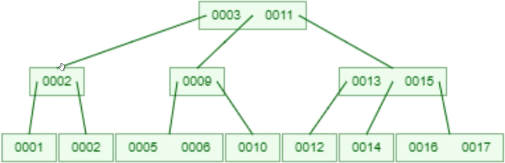
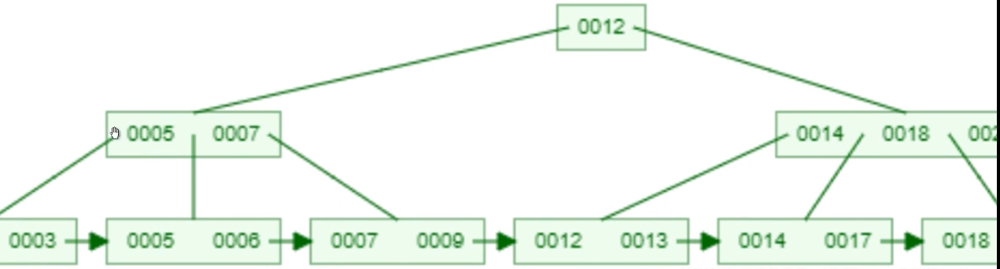
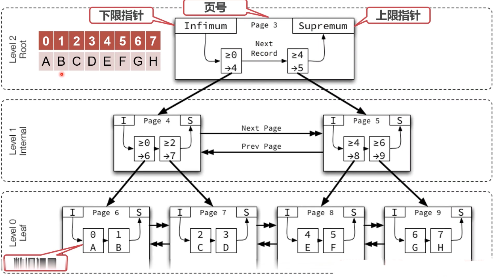
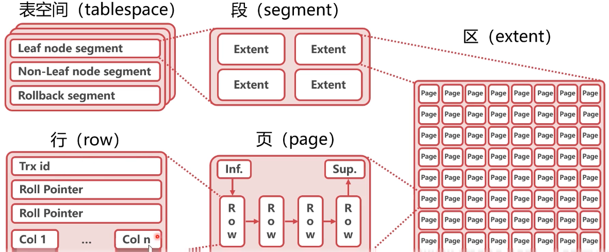
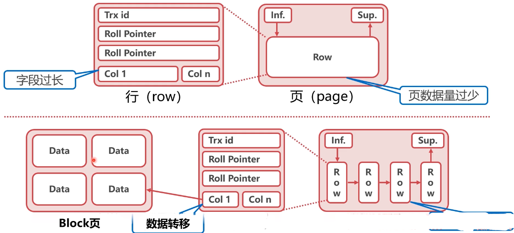
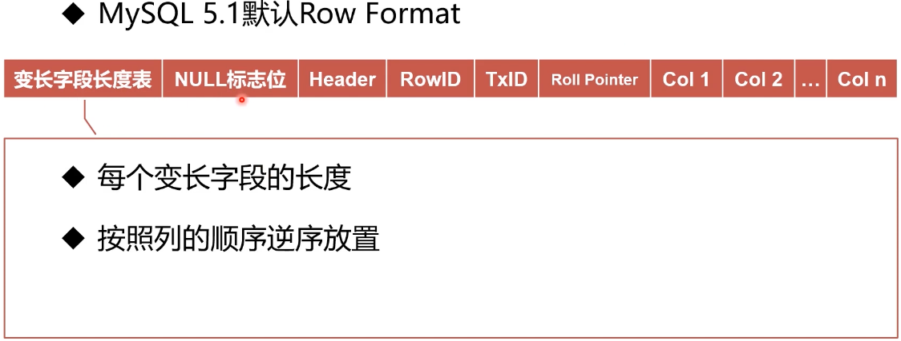
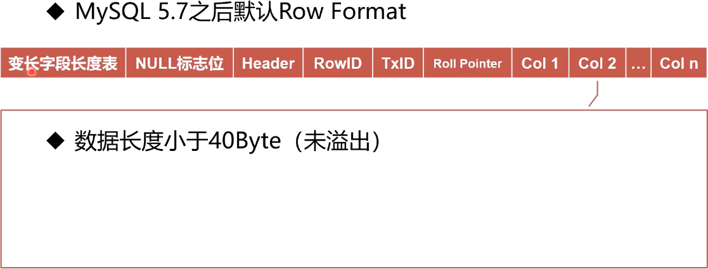
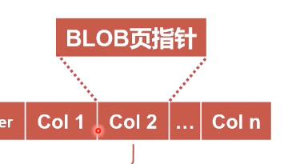
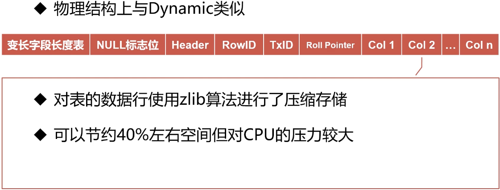
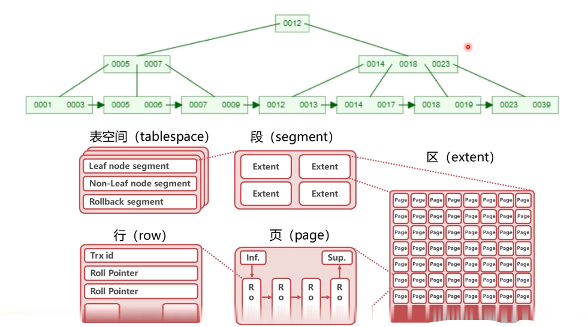

## 如何建表更符合业务

### 什么叫索引组织表？

#### 索引组织表(lndex Organized TabIe)

* 今索引组织表不是一种"组织表"
* 令索引组织表是由索引"组织起来的"表
* 令lnnoDB中，表都是根据**主键**顺序组织存放的 

#### 索引(lndex)

* 索引是数据库中对某一列或多个列的值进行预排序的数据结构
* 索引可以理解为数据的"目录"
* lnnoDB中，主键是一个特殊索引字段

#### 主键(PrimaryKey)

* InnoDB存储引擎表中，每张表都有一个主键:
* 若表中有一个非空唯一索引(Unique NOT NULL)，即为主键
* 若有多个非空唯一索引，选择第一个定义的索引
* 若无，InnoDB自动创建一个6字节的指针，作为主键


#### 下面的SQL建表语句中，哪一列是主键？

```sql
CREATE TABLE Z
(a INT NOT NULL,
b INT NULL,
c INT NOT NULL,
d INT NOT NULL,
UNIQUE KEY (b),
UNIQUE KEY (d),
UNIQUE KEY (c)
 );
```

在没生命主键时，d是主键，先声明

#### 总结

* |nnoDB数据表均为索引组织表
* 索引组织表中的数据，被主键的索引组织起来


### B+树的“B“是什么意思？

#### 主流索引查找算法

* 线性查找LinearSearch
* 二叉查找树BinarySearchTree
* B树BTree
* 二分查找BinarySearch
* 令平衡二叉树AVLTree
* B+树B+Tree

####  二分查找BinarySearch

* 时间复杂度O(logN）
* 拿出有序数列中点位置作为比较对象
* 根据中点数据大小，选取一半数据作为新的数列
* 每次可以将数据量减小一半

#### 二叉查找树BinarySearchTree

* 时间复杂度O(logN）
* 使用经典的二叉树数据结构
* 由根节点开始查找
* 可能退化为线性查找

左旋右旋

#### 平衡二叉树AVL Tree

* 查找时，与二叉搜索树相同
* 增删改时，通过旋转操作，维护树的平衡
* AVL树可以保证不会退化成线性查找

数据块，至少4k，要么凑，要么空

#### B树B Tree

* B树是线性数据结构和树的结合
* B树通过多数据节点大大降低了树的高度
* B树不需要旋转就可以保证树的平衡

 

3前面一个指针（指向小于3的节点），3和11之间一个指针，11后面一个指针

缺点，找5,6,7,8，9，连续数据，有问题

范围操作

 

#### B+树B+Tree

* B+树是由B树发展而来的一种数据结构
* B+树的所有数据均在叶子节点
* B+树的所有数据形成了一个线性表




#### 总结

* B+树是目前最主流的数据库索引算法
* B+树由线性表、二叉树、B树发展而来
* B+树集成了线性表、平衡二叉树的优势

### 为什么说InnoDB索引即数据？

* InnoDB使用B+树作为索引的数据结构
* B+树的高度一般为2-4层，查找速度非常快
* InnoDB索引分为聚簇索引（主索引）和辅助索引

#### 聚簇索引Clustered lndex

* 根据表的主键构造一个B+树
* 叶子节点直接存放行数据，而不是指针
* 索引组织表中，数据也是B+树的一部分



#### 辅助索引Secondarylndex

* 每张表可以有多个辅助索引
* 叶子节点并不包含行数据
* 叶子节点记录了行数据的主腱，用来扌旨示数据位置

#### 总结

* InnoDB索引分为聚簇索引（主索引）和辅助索引
* 在同层B+树节点之间，为双向链表
* 在B+树节点之内，数据条目之间为单向链表


### InnoDB数据表是如何存储的？

#### InnoDB逻辑存储结构



#### 表空间(tablespace)

* 表空间指的是数据表在硬盘上的存储空间
* 默认，所有表的数据都存在共享表空间
* 每个表的数据也可以放在独占表空间(ibd文件）

#### 段(segment)

* 数据段：B+树的叶子节点
* 索引段：B+树的非叶子节点
* lnnoDB中，段由存储引擎自动管理

#### 区(extent)

* 区是由连续页组成的空间，大小为1MB
* 一次从磁盘申请4~5个区
* 一般来讲含有64个页(Page)

#### 页(page)

* 页是InnoDB中磁盘读写的最小逻辑单位，默认16KB
* 一个数据页就是一个B+树的节点()+TreeNode)
* 页的大小充分考虑了机械硬盘和SSD的最小单元（512B和4KB)

#### 总结

* InnoDB的逻辑存储结构为表空间、段、区、页、行
* InnoDB的逻辑存储结构充分考虑了以基于B+树的表结构
* InnoDB中的页是|nnoDB自身的逻辑概念，与硬件的页无关

#### 思考

* 为什么页不能太大，比如16MB？
* 为什么页不能太小，比如16B？


1. 每次读的页大，浪费的大，可能只需要一小部分数据，读出来的是链表结构，遍历查询起来没B+树快。
2. 机械硬盘、SSD最小的读写单位都比较大，16B太小了不能完整的用完硬盘的一个块，要么数据浪费，要么和别的页拼一块写进去，逻辑更复杂。

### InnoDB数据行长什么样？

* InnoDB中的变长列长度不固定的数据类型：
  VARCHAR、VARBINARY、BLOB、TEXT

* 占用空间大于768Byte的不变长类型：
  CHAR

  (超过自动变成变长列)

* 变长编码下的CHAR（utf8 每个字符它占空间是不一样的）

#### 行溢出数据

* 由于InnoDB每个数据页容量有限，导致数据字段也是有限的
* 当数据字段过大时，InnoDB会使用行溢出机制
* 行溢出机制会把超长字段放入单独开辟的数据页



**BLOB页**

#### InnoDB 行记录格式 Row Format

* InnoDB行记录格式主要分为两个时代：
* Redundant/Compact (Antelope文件格式）
* Dynamic/Compressed (Barracuda文件格式）

#### Redundant(冗余)

* MySQL5.0之前的默认Row Format


 **Header**

* 列数量、字段偏移表的单位、下一行记录的指针等信息

**RowID**

* 没有可用主键时，使用Row ID作为隐藏主键

**TXID**、**RoIIPointer**

* TransactionID：事务ID
* RoIIPointer:回滚指针

**Col1、Col2... Col n**

* 数据（未溢出）
* 溢出，数据存到block页


溢出数据在BLOB页

字段偏移列表，即记录了变长字段起始位置，也记录了定长 的起始位置。从后往前偏移量。


#### Compact（紧凑）



**NULL标志位**

* 指示行记录中的NULL值
* 每个bit代表一个字段

**Header**

* 列数量、下一行记录的指针等信息

**RowID**

* 没有可用主键时，使用RowID作为隐藏主键

**TxID、Roll Pointer**

* TransactionID：事务ID
* RoIIPointer：回滚指针


**Col 1 ...**

* 数据(溢出) 、未溢出 和Redundant一样


#### Dynamic





#### Compressed



#### 总结

* Inn0DB行记录格式经历了两个时代、四种类型
* 行记录格式进化的核心需求是节约行记录空间
* 节约行记录空间从而增加每个页的数据行数，提高查询效率

#### 联合索引

* 使用两个或以上字段生成的索引
* 联合索引也可以加速"最左前缀"的查询
* 联合索引可以代替最左侧字段的单独索引
* “带头大哥不能死，中间兄弟不能丢”


辅助索引记录的值只有主键值

回主索引搜索其他字


#### 字符串的前缀索引

* 如果字符串过长，可以考虑使用前缀索引节约空间
* 如果前缀区分度太小，可以考虑两种变通方法
  * 倒序存储
  * 新建Hash字段
  * alter table user add index index2 (email(6))


#### 字符串like

* (like％关键字％）(like％关键字）会使索引朱效
* (like关键字％）左模糊才可以使用索引


数据量小，用全模糊也是可以的，数据量上来了就得用搜素引擎，类似于ES


#### 总结

* MySQL有很多"左侧用法"
* 联合索弓|可以代替最左侧字段的单独索引
* 字符串的前缀索引可以节约硬盘空间
* 字符串左模糊可以有效利用索引


### 如何约束数据？

#### InooDB约束数据的方法

* Primary Key / Unique Key
* Foreign Key
* DefauIt / NOT NULL
* 触发器


#### Primary Key / Unique Key

* 通过将数据字段设置为索引，约束数据内容
* PrimaryKey：唯一，不为NULL
* UniqueKey：唯一
* 唯一约束插入时的性能开销较大


#### Foreign Key

* 外键可以对数据的正确性实现约束


#### DefauIt / NOT NULL

* Default：数据默认值
* NOT NULL: 数据不为空


#### 触发器

* 插入、修改数据时，使用触发器校验数据
* 容易干扰业务，使用很少


#### 总结

* |nnoDB有多重约束数据方法
* 将数据设置为索引字段可以约束数据的唯一性，但开销较大
* 外键可以对数据有效性进行校验
* NOT NULL的行为可能受到sql_mode参数的影响


### 如何使用不存在的数据表？

#### 视图view

* 使用视图可以创建不存在的虚拟表
* 视图的原理是预设一个SELECT语句
* SELECT语句的查询结果作为虚拟表的数据

#### 视图算法的选择

* MERGE,将视图SQL合并到主查询SQL中
* TEMPTABLE,将视图作临时表（中间结果）来处理
* 一般来讲，MERGE的性能优于TEMPTABLE

#### 无法使用MERGE的SQL

* 聚集函数
* GROUPBY
* UNION,UNIONALL
* DISTINCT
* HAVING
* 子查询

#### 总结

* 视图可以在不改变原有数据的情况下，创建虚拟表
* 尽量使用MERGE算法，并避免无法使用MERGE的SQL


####  中心思想

* 本章从以下两个方向探索了InnoDB数据表
* 抽象数据结构(B+树）
* 物理存储结构（空间、段、区、页）
* 两种结构的联系：B+树节点=页



B+树的每个节点都是一个页，都是磁盘。


#### InnoDB行记录格式

* 目前默认使用Dynamic,由Compact发展而来


* 行溢出数据：把超长字段放入单独开辟的数据页


