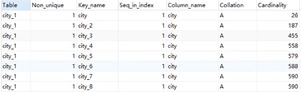
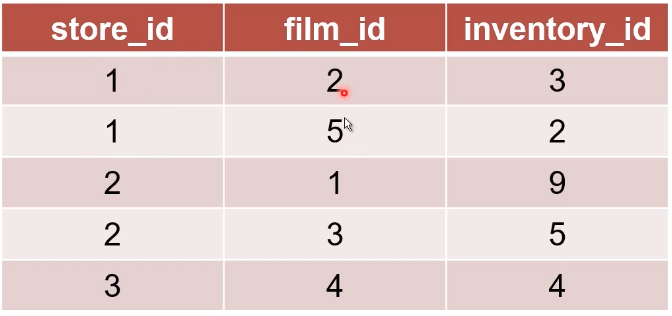

### 怎么查询速度更快？

#### Sakila-db

* Sakila是MySQL中的一个示例数据库(sample database)
* Sakila展示了一个电影DVD租赁公司的后台管理系统
* 很多国外教程都使用了saki|a作为案例
* https://downloads.mysql.com/docs/sakila-db.zip
* https://downloads.mysql.com/docs/sakila-db.tar.gz


### WHERE询太慢，怎么办？

#### 覆盖索引

* 覆盖索引指的是，查询语句从执行到返回结果均使用同一个索引
* 覆盖索引可以有效减少回表
* 复制inventory数据表，去掉夕卜键、联合索引

```sql
CREATETABLE `inventory_l`(
`inventory_id`、mediumint unsigned NOT NULL AUTO_INCREMENT,
`filmid` smallint unsigned NOT NULL,
`storeid` tinyint unsigned NOT NULL,
`last_update` timestamp NOT NULL DEFAULT CURRENT_TIMESTAMP ON UPDATE CURRENT_TIMESTAMP,
PRIMARY KEY ('inventory_id'),
KEY 'idx_fk_film_id`(`film_id`)
) ENGINE=InnoDB DEFAULT CHARSET=utf8;
```


```sql
INSERT INTO inventory_1 SELECT * FROM inventory;
```

explain 执行计划

#### 查询以下语句

```sql
SELECT store_id,film_id FROM sakila.`inventory_1`、where store_id=1;
```

```sql
SELECT store_id,film_id FROM sakila.`inventory` where store_id=1;
```

```sql
SELECT inventory_id,store_id,film_id FROM sakila.`inventory` where store_id=1;
```

```sql
SELECT inventory_id, store_id, filmid, last_update FROM sakila.`inventory` where
 store_id=1;
```


#### 总结

* 覆盖索引通过取消回表操作，提升查询效率
* 若数据的查询不只使用了一个索引，则不是覆盖索引
* 可以通过优化SQL语句或优化联合索引，来使用覆盖索引


### 有更合适的索引不走，怎么办？

#### 如何确定用哪条索引

* 令MySQL在选取索引时，会参考索引的基数(Cardinality)
* 令基数是MySQL估算的，反映这个字段有多少种取值
* 选取几个页算出取值的平均值，再乘以页数，即为基数

#### 基数的应用

* 令使用以下SQL建立测试表

```mysql
CREATE TABLE VARCHAR(50) NOT NULL);
INSERT INTO sakila.city_l SELECT city FROM sakila.city;
INSERT INTO sakila.city_l SELECT city FROM sakila.city;
INSERT INTO sakila.city_l SELECT city FROM sakila.city;
INSERT INTO sakila.city_l SELECT city FROM sakila.city;
INSERT INTO sakila.city_l SELECT city FROM sakila.city;
UPDATE sakila.city_l set city = (SELECT city from sakila.city ORDER BY RAND() LIMIT 1);
```

存5次

#### 基数的应用

* 增加以下前缀索引

```mysql
ALTER TABLE sakila.city_l ADD key(city(1));
ALTER TABLE sakila.city_l ADD key(city(2));
ALTER TABLE sakila.city_l ADD key(city(3));
ALTER TABLE sakila.city_l ADD key(city(4));
ALTER TABLE sakila.city_l ADD key(city(5));
ALTER TABLE sakila.city_l ADD key(city(6));
ALTER TABLE sakila.city_l ADD key(city(7));
ALTER TABLE sakila.city_l ADD key(city(8));
```

#### 基数的应用

* 今查看各个索引的基数

show index from city_1

* 结果

  


#### 强制使用索引

* 使用force inde×可以强制使用索引

#### 优化索引

* analyze table可以重新统计索弓丨信息
* 重新统计索引信息时，会重新计算索引的基数

#### 总结

* 根据索引基数，可以判断索引性能的好坏
* 令使用force inde×可以强制使用索引
* 令analyze table可以重新统计索引信息，修复基数信息


### COUNT这么慢，怎么办？

##### MySQLcount()函数

* MySQL count()函数用来统计结果集中不为null的数据个数
* 首先存储引擎查询出结果集
* server层逐个结果判断是否为null，不为null则加1

#### count（非索引字段）

* count（非索引字段）时，server层需要判断每个数据是否为null
* 而且查询本身无法使用覆盖索引，理论上最慢

```mysql
select count(first_name) from sakila.customer
```

#### count (索引字段）

* count(索引字段），可以覆盖，依然需要每次判断字段是否为null

```sql
select count(last_name) from sakila.customer
```

* count(主键），同理

```sql
select count(customer_id)from sakila.customer
```

####  count(1)

* count（1）只有扫描索引树，没有解析数据行的过程，理论更快

* 但Server层依然每次需要判断"1是否为null"

  ```sql
  select count(1) from sakila.customer
  ```

#### count(\*)

- count（\*）一般用来返回数据表行数
- MylSAM的count（\*）直接返回数据库中记录的数据表行数
- 由于InnoDB支持事务，数据库中不记录数据表行数
- MySQL专门优化了count（*）函数直接返回索引树中数据的个数


#### 总结

* count（非索引字段）：无法使用覆盖索引，最慢
* count(索引字段）：可以使用覆盖索引但依然要取出数据判空
* count(1):不需要取出数据，但需要判断"1是否为null"
* count(*)：经过专门优化，不需要判空，理论最快


#### ORDER BY这么慢，怎么办？

 ```sql
SELECT * FROM WHERE film id > 80 ORDER BY title
 ```

* 根据WHERE等条件查询
* 将查询结果放入sort_buffer
* 对中间结果集按照ORDER字段排序
* 回表生成完整结果集（若需要）


#### 1条件查询

给查询字段加索引，可以改善条件查询速度

```sql
SELECT * FROM WHERE film id > 80 ORDER BY title
```


####  2．中间结果集

* 中间表比较小时，直接放在内存中
* 中间表大于sort_buffer_size时，放在硬盘中
* 若需要优化内存占用，减小sort_buffer_size
* 若需要优化排序查询时间，增大sort_buffer_size


#### 3、回表生成完整结果集

* 当行小于max_length_for_sort_data时，生成全字段中间表
* 大于阈值时，只生成排序字段+主键中间表，需要回表
* 卜调大阈值并不一定改善效率，因为太大的结果集排序效率低


####  最高效·索引覆盖

* 索引覆盖可以跳过生成中间结果集，直接输出查询结果
* ORDER字段需要有索引（或在联合索引左侧）
* 其他相关字段（条件、输出）均在上述的索引中

```sql
SELECT film_id,title FROM `film` ORDER BY title
```


#### 总结

* MySQL排序一般需要生成中间结果集、排序、回表的过程
* 索引覆盖是最高效的处理排序的方式


### 随机选取这么慢，怎么办？

#### ORDER BY RAND()原理

```sql
SELECT title, description FROM `film` ORDER BY RAND() LIMIT 1;
```

1. 创建一个临时表，临时表的字段为rand、title、description

2. 从表中取出一行，调用RAND(),将结果和数据放入临时表，以此类推

3. 针对临时表，将rand字段+行位置（主键）放入sortbuffer
4. 对sort buffer排序，取出第一个的行位置（主键）
   查询临时表


#### 为什么会慢？

* SQL执行过程中出现了两次中间结果，都是全长度的

* 仅需要一个随机结果，却经历了不必要的排序（虽然优化过）
* 调用了很多次RAND()


#### 解决方法·临时方案

```sql
select into @M,@N from film ,
set @X= floor((@M-@N+1)*rand() + ON);
select title, description from film where film_id >= @X limit 1;
```


* 选取数据中最大的ID和最小的ID
* 使用RAND( )随机选取一个ID
* 直接查询此ID的数据条目


#### 解决方法·业务方案

* 查询数据表总数total
* total范围内，随机选取一个数字r
* 执行以下SQL：

```sql
select title, description from film limit r, 1
```


#### 总结

* ORDER BY RAND() 凵MIT 1是效率很低的随机查询方式
* 原因主要是，上述方法有两次中间结果，还有排序过程
* 可以通过修改SQL，选取随机主键方式，提升性能
* 最好还是在业务中处理，尽量减少复杂SQL


#### 索引下推

* 用下列方式建表

```sql
CREATE TABLE`inventory_3`(
`inventory_id` mediumint unsigned NOT NULL AUTO_INCREMENT,
`film_id` smallint unsigned NOT NULL,
`store_id` tinyint unsigned NOT NULL,
`last_update` timestamp NOT NULL DEFAULT CURRENT_TIMESTAMP ON UPDATE CURRENT TIMESTAMP,
PRIMARY KEY(`inventory_id`),
KEY `idx_store_id_film_id`(`storeid`,`filmid`)
)ENGINE=InnoDB AUTO_INCREMENT=101 DEFAULT CHARSET=utf8;
```

```sql
INSERT into inventory_3 SELECT * from inventory
```


#### 索引下推

```sql
SELECT * FROM `inventory_3` WHERE store_id in (1, 2) and film_id =3;
```



主排序，次排序

* 为什么扫描行数非常少？
* MySQL5.6之前，需要先使用索引查询storeidin（1，2）再全部回表验证filmid=3
* MySQL5.6之后，如果索引中可以判断，直接使用索引过滤


#### 松散索引扫描

```sql
SELECT film_id FROM `inventory_3` WHERE film_id=3
```

* 带头大哥不能死，中间兄弟不能丢？为什么不管带头大哥了？
* MySQL8.0新特性


#### 总结

* 联合索引可以加速一些特殊查询场景
* 索引下推可以大大减少回表次数
* 松散索引扫描可以打破"左侧原则" 解决带头大哥丢失的问题


### 明明有索引，是不走，怎么办？

#### 尝试一下这个SQL

```sql
select * from film WHERE film_id + 1 = 100
```

* MySQL中，对索引字段做函数操作，优化器会放弃索引


#### 时间函数

```sql
SELECT * FROM `rental` WHERE month(rental_date) = 5
```

* 使用month()函数后，无法使用索引

* 需要去掉month()函数，换成between

```sql
SELECT * FROM `rental` WHERE rental_date BETWEEN '2005-5-1' AND '2005-6-3' OR renta l_date BETWEEN '2006-5-1' AND '2006-6-1'  
```

#### 字符串与数字比较

* MySQL中若出现字符串与数字比较，会将字符串转换为数字

```sql
select * from tl where f1=6;
```

如果tl表中fl字段为varchar类型，则此SQL相当于：

```
select * from tl where CAST(f1 AS signed int)=6;
```

 如果字段为int类型，6和'6'分别会是什么情况？

```sql
CREATE TABLE `t1`(
`f1` varchar(32) NOT NULL,
`f2` int NOT NULL,
KEY `idx_f1` (`f1`),
KEY `idx_f2` (`f2`)
) ENGINE= InnoDB DEFAULT CHARSET=utf8mb4;
```

#### 隐式字符编码转换

* 新建t2表，并执行以下语句·

```mysql
CREATE TABLE (
`f1` varchar(32) NOT NULL,
`f2` int NOT NULL,
KEY `idx_f1` (`f1`)
KEY `idx_f2` (`f2`)
) ENGINE=InnoDB DEFAULT CHARSET=utf8;
```

```mysql
select t2.* from tl, t2 where tl.fl = t2.f1 and tl.f2=6;
```

* MySQL中，utf8与utf8mb4字段比较时，会把utf8转为utf8mb4

* 上一页的SQL相当于：

```sql
select t2.* from tl, t2 where U.f1=CONVERT(t2.f1 USING utf8mb4) and tl.f2=6;
```

解决方法：将查询条件转换为索引字段的编码

```sql
select t2.* from t1, t2 where CONVERT(t1.f1 USING utf8) = t2.f1 and tl.f2=6;
```

#### 总结

* MySQL中，对索引字段做函数操作，优化器会放弃索引
* 这种情况可能包括：时间函数，字符串转数字，字符编码转换
* 解决方案：时间函数转区间、数字强转字符串、高级编码转低级


### 分页查询这么慢，怎么办？

#### 偏移量大时，效率低

```sql
SELECT film_id, title, description FROM `film` ORDER BY title LIMIT 900, 10;
```

* 先执行黑色部分，再执行红色分页
* 丢弃很多无用数据，效率低下


#### 优化思路

* 先想办法走索引覆盖
* 得到所需数据的D
* 根据所需数据的ID，得到最终结果集


#### 优化SQL

* 得到所需数据的主键

```sql
SELECT film_id FROM `film` ORDER BY title LIMIT 900/10；
```

* 原表与上面的结果连表，获取最终结果

```sql
SELECT f.film_id,f.title,f.description FROM `film` f INNER JOIN (SELECT film_id FROM `film` ORDER BY title LIMIT 900,10) m ON f.film_id=m.film_id;
```


#### 总结

* 排序偏移量大时，会丢弃大量无用数据，导致效率低下
* 可以采取先索引覆盖，再用最终ID回表的方法，优化效率


#### 慢查询的怀疑方向

* 索引设计有问题
* SQL语句有问题
* 数据库选错索引


#### 覆盖索引

* 覆盖索引指的是·查询语句从执行到返回结果均使用同一个索引
* 覆盖索引通过取消回表操作，提升查询效率
* 可以通过优化SQL语句或优化联合索引，来使用覆盖索引


#### 索引基数

* 根据索引基数，可以判断索引性能的好坏
* 使用force inde×可以强制使用索引
* analyze table可以重新统计索引信息，修复基数信息


#### count()函数

* count（非索引字段）：无法使用覆盖索引，最慢
* count(索引字段）：可以使用覆盖索引但依然要取出数据判空
* count(1):不需要取出数据，但需要判断"1是否为null"
* count(*)：经过专门优化，不需要判空，理论最快


#### ORDERBY

* MySQL排序一般需要生成中间结果集、排序、回表的过程
* 索引覆盖是最高效的处理排序的方式


#### 随机选取

* 临时优化：使用SQL语句选出随机主键
* 业务优化：使用业务选出随机偏移量，再用分页查询语法


#### 索引下推

* MySQL5.6之后，如果索引中可以判断，直接使用索引过滤


#### 松散索引扫描

* 松散索引扫描可以打破"左侧原则" 解决带头大哥丢失的问题


#### 字段做函数操作

* MySQL中，对索引字段做函数操作，优化器会放弃索引
* 这种情况可能包括：时间函数，字符串转数字，字符编码转换
* 解决方案：时间函数转区间、数字强转字符串、高级编码转低级


#### 分页查询

* 排序偏移量大时，会丢弃大量无用数据，导致效率低下
* 可以采取先索引覆盖，再用最终ID回表的方法，优化效率
