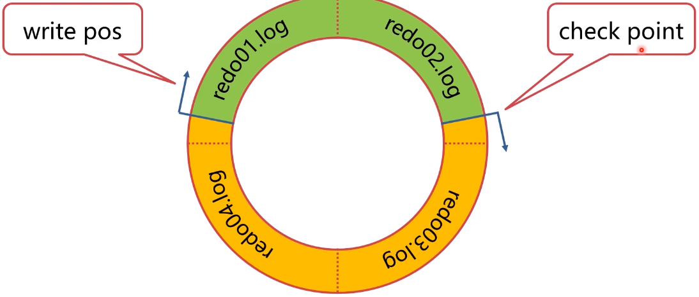
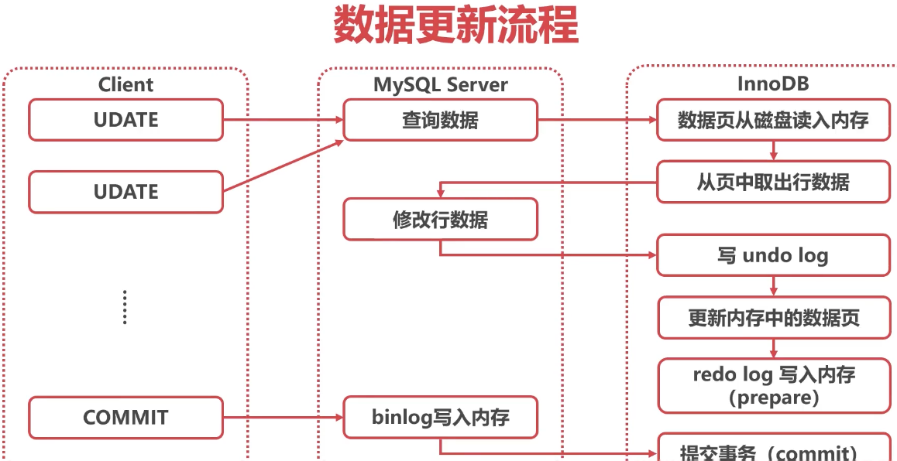
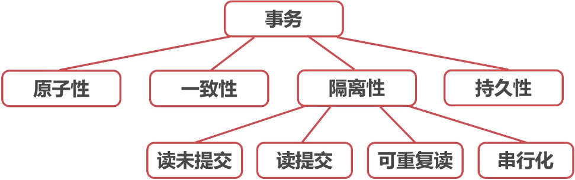
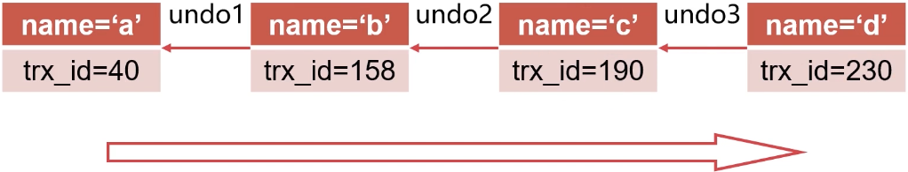
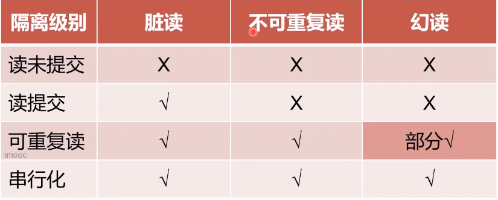
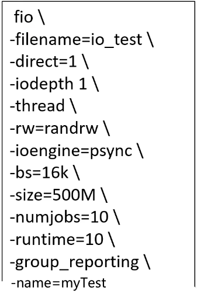

### 如何处理数据更新

#### 数据库“动起来''之后，会发生什么？

##### 产生日志数据

* 数据库在更新时，会产生binlog、redo log、undo log
* binlog: server层产生的逻辑日志
* redo log: InnoDB产生的物理日志，保证持久化
* undo log: InnoDB产生的逻辑日志，保证隔离性、原子性


#### 客户端之间因为锁而互相影响

* 客户端执行SQL时，会产生各种行锁、表锁、元数据锁
* 一个客户端产生的锁，会干扰其他客户端SQL的执行
* 两个客户端之间可能产生死锁


#### 事务造成查询到的数据与磁盘上不一致

* 客户端可能暂时看不到已经更新的数据
* 事务可能产生隐式锁，造成性能问题


#### 总结

* 数据库"动起来"之后，会产生一系列性能问题
* 需要理解日志、锁、事务的底层原理，才能应对问题


### 什么日志不是给人看的？

#### MySQL日志体系

* MySQL为了满足主从复制、事务等，有复杂的日志体系
* Server层产生bin log,用来进行数据复制
* InnoDB产生undo log、redo log,用来实现事务ACID
* MySQL的日志体系不是主要不是用来看的，而是运行必要的


#### binlog归档日志

* Binlog是server层产生的逻辑日志
* 用来进行数据复制和数据传送
* Binlog完整记录了数据库每次的数据操作，可作为数据闪回手段
* Binlog记录在专门的文件中


#### undo log回滚日志

* InnoDB自身产生的逻辑日志，用于事务回滚和展示旧版本
* 对任何数据（缓存）的更新，都先写undo log
* undo log位于表空间的undo segment中
* SQL: UPDATE name ='b' -> undo: UPDATE name = 'a'


#### redo log重做日志

* InnoDB自身产生的物理日志，记录数据页的变化
* lnnoDB"日志优先于数据"，记录redo log视为数据已经更新

* 内存中的数据更新后写redo log,数据被写入硬盘后删除
* binlog储存在4个1 GB文件中，并且循环写入



* write pos是当前日志写入点
* check point是擦除点，数据被更新到硬盘时擦除
* 当write pos追上check point时，事务无法提交，需要等待checkpoint推进

* 只要redo log不丢，数据就不会丢失


#### 数据更新流程




#### redo log刷盘

* innodb_flush_log_at_trx_commit参数控制redo_log刷盘
  * 0：异步每秒刷盘
  * 1：每1个事务刷盘
  * N：每N个事务刷盘
* 建议设置为1，保证数据安全


#### binlog刷盘

* sync_binlog参数控制binlog刷盘
  * 0：自动控制刷盘
  * 1：每1个事务刷盘
  * N：每N个事务刷盘
* 建议设置为1，保证数据安全


#### 持久化分析

* redo log刷盘前系统崩溃
  数据丢失
* redo log刷盘后系统崩溃：
  重启时会对redo log进行重放、重写内存中数据页、重写binlog


#### 为什么redo log在binlog之前

* redo log是系统关键节点，想到于"决断点"
* binlog一旦写入无法撤回，因为可能已经被传送至备库


#### 总结

* MySQL日志主要有binlog、undo log、redo log
* MySQL实行日志优先的策略，日志刷盘，数据就不会丢失


#### MySQL锁的种类

* 按照粒度分，MySQL锁可以分为全局锁、表级锁、行锁
* 全局锁会锁住左右表，整个库无法修改
* 表级锁分为表锁（数据锁）和元数据锁
* 行锁会锁住数据行，分为共享锁和独占锁


#### 全局锁

* FTWRL (FIush tables with read lock)
* 此命令使整个库处于只读状态
* 主要用途是保证备份的一致性
* 不要随意使用，杀伤性极大，要在备库使用


#### 表锁（数据锁）

* 命令：lock tables XXX read/write
* 表锁是非常重的锁，在InnoDB中使用很少


#### 元数据锁(matadata lock)

* 元数据指的是表的结构、字段、数据类型、索引等
* 事务访问数据时，会自动给表加MDL读锁
* 事务修改元数据时，会自动给表加MDL写锁


#### 行锁

* 行锁也有两种类型，有很多种叫法：
  * 读锁/写锁
  * 共享锁/排他锁
  * 共享锁/独占锁
  * s锁/×锁

* S锁不是不让读，而是自己要读，不让别人写
* X锁不只是不让写，而是自己要写，不让别人读写
* 只有S锁和S锁之间可以兼容，其他均不兼容


总结
* 锁是MySQL高效执行事务的必备基础
* 锁会引发很多的性能问题，可能造成等待和死锁
* 锁还会引发很多的功能问题，如脏读和不可重复读等


#### 事务：InnoDB的杀手锏

事务的特性

* 原子性(Atomicity)
* 一致性(Consistency)
* 隔离性(lsolation)
* 持久性(Durability)


#### 原子性(Atomicity)

* 事务中的操作要么全部成功，要么全部失败
* MySQL的两阶段提交保证了事务的原子性
* undo log用来回滚事务的更改


#### 一致性(Consistency)

* 事务必须使数据库从一个一致性状态变换到另外一个一致性状态
* 锁和两阶段提交保证了一致性


#### 隔离性(lsolation)

* 事务不能被其他事务的操作数据所干扰
* 多个并发事务之间要相互隔离
* 锁和undog实现了MYSQL事务的隔离性


#### 持久性(DurabiIity)

* 一个事务一旦被提交，它对数据库中数据的改变就是永久性的
* redo log实现了MySQL事务的持久性


#### 知识图谱




#### 隔离级别

* 读未提交 (READ UNCOMMITTED)
* 读提交(READCOMMITTED)
* 可重复读(REPEATABLE READ)
* 串行化(SERIALIZABLE)


#### 读未提交(READUNCOMMITTED)

* 读、写都不加锁，不隔离
* 每次查询都查询到数据的最新版本
* 性能最好，但是等于没有事务，很少采用


#### 读提交(READ COMMITTED)

* 一般读取时，读取此时已经提交的数据
* 写数据时，加X锁，提交时释放
* Oracle数据据库的默认隔离级别


#### 可重复读(REPEATABLE READ)

* 一般读取时，读取本事务开始时的数据状态
* 写数据时，加×锁，提交时释放
* MySQL数据库的默认隔离级别


#### 串行化(SERIALIZABLE)

* 读加S锁、写加X锁，提交时释放
* 对于一条数据，同时只能有一个事务进行写操作
* 事务隔离性最高，性能太差，很少采用


#### 总结

* 事务是InnoDB最核心的功能点
* 事务也是引发性能问题最多的点
* 读提交和可重复读是如何查询到历史版本的？需要研究


### MVCC是怎么做到干人干面的？

#### 行记录的版本控制

* 由于redo log的存在，可以从最新版本推算之前版本




#### 快照读（一致性非锁定读）

* 不锁定数据的情况下，读取数据的特定历史版本
* 版本由事务的具体需求确定:
  * 读已提交：根据每次SELECT时，其他事务的提交情况
  * 今可持续：根据事务开始时，其他事务的提交情况


#### 当前读（一致性锁定读）

* 读取数据的当前版本，并加锁
* 若当前版本已经被加锁且不兼容，则阻塞等待
* X锁：UPDATE、DELETE、SELECT FOR UPDATE
* S锁：SELECT IN SHARE MODE


#### 隔离问题

* 脏读：读到了其他事务未提交的数据
* 不可重复读：同样的查询读到的数据内容不一样
* 幻读：同样的查询读到了更多的数据


#### MySQL不同隔离级别的问题




#### 如何解决幻读问题

* MySQL在可重复读级别时，通过Next-Key锁解决了幻读问题
* Next-Key锁是行锁+间隙锁


* 间隙锁的功能与行锁相同，只是针对间隙加锁
* 间隙锁不分读写，也可以认为是读锁，不允许在间隙插入
* 可重复读加锁时，将同时锁住数据及其左右间隙


 

#### 总结

* lnnoDB使用undo log实现了行记录历史查询
* 快照读不需加行锁，属于乐观锁的一种思路
* 当前读需加行锁，为了并发控制


#### Next-Key Lock的加锁逻辑

1. 加锁时以Next-Key为基本单位
2. 查找过程中扫描过的范围才加锁
3. 唯一索引等值查询，没有间隙锁，只加行锁
4. 索引等值查询最右一个扫描到的不满足条件值不加行锁
5. 索引覆且只加S锁时，不锁主键索引


#### 示例数据表

表结构

```sql
CREATE TABLE (
INT ( 11 ) NOT NULL,
INT ( 11 ) DEFAULT NULL,
INT ( 11 ) DEFAULT NULL,
PRIMARY KEY (`id`),
KEY `c` ( `c` )
) ENGINE = INNODB;
```

数据

```sql
INSERT INTO t3
VALUES
( 10, 10, 10 ),
( 20, 20, 20 ),
( 30, 30, 30 ),
( 40,40, 40 ),
( 50, 50, 50 );
```


#### 等值查询间隙锁

Tx A

```sql
begin;
select * from t3 where id = 11 for update;
```


TX B

```sql
insert into t3 value(12,12,12);
```

```sql
select * from t3 where id = 20 for update;
```

首先锁（10，20]又因为等值查询最后一个扫描20，不加行锁

主键索引


 


#### 非唯一索引等值锁

Tx A

```sql
begin;
select id from t3 where c = 10 lock in
share mode;
```

Tx B

```sql
select * from t3 where id = 20 for update;
```

```sql
insert into t3 value(12,12,12);
```

* 只涉及辅助索引：首先锁（0，10],向右扫描时锁上（10，20]
* 又因为等值查询最后一个扫描20，20锁解除

辅助索引c


#### 主键索引范围锁

Tx A

```sql
begin;
select * from t3 where id between 20
and 30 for update;
```

Tx B

```sql
select * from t3 where id = 20 for update;
```

```sql
insert into t3 value(12,12,12);
```

* 首先等值查询20，只锁行锁
* 向右扫描至30，锁（20，30]

主键索引


#### 非唯一索引范围锁

Tx A

```sql
begin;
select * from t3 where c between 20
and 30 for update;
```

* 首先等值查询20，不是唯一索引，锁（10，20]
* 向右扫描至30，锁（20，30]
* 向右扫描，锁（30，40）

辅助索引c


#### 非索引字段查询

Tx A

```sql
begin;
select * from t3 where d=20 for update;
```

* 因为字段没有索引，走主键索引扫描，锁全表

主键索引


#### 总结

* 目的，在可重复读的隔离级别下部分预防幻读
* 手段，Next-Key Lock（行锁+间隙锁）
* 特点，规则复杂，个人认为并不优雅
* 注思：当前读时，不要查询没有索引的项目


#### MySQL 也有“垃圾回收"吗？

没有

* MySQL并没有所谓的垃圾回收
* 但是会发现数据库卡几秒，磁盘IO很高
* 此时MySQL正在"刷脏页"


#### MySQL 脏页的产生

* 更新数据时，只更新了内存中的数据页，没有更新磁盘
* 内存中数据页与磁盘中数据页不一致，称为脏页


#### 什么是刷脏

* 将内存中数据页保存至磁盘
* 同时，删除与此页相关的redo log,推进check point


#### 为什么要刷脏

* 1.内存中的脏页太多，内存不足
* 2.redo log文件写满，需要推进check point
* 3.系统空闲，提前刷脏，预防上述情况
* 4.MySQL关闭前，保存数据
* 前两种会产生性能问题，导致MySQL卡住


#### 如何避免被迫刷脏

* 1.正确告nlnnoDB,服务器的硬盘性能
* 2·配置合理的脏页比例上限
* 3·控制"顺便刷脏"策略


#### 服务器IO配置

* 配置项: innodb_io_capacity
* 用来告知服务器的硬盘性能
* 常见IOPS:
  * 7200 rpm SATA,70 IOPS (每秒多少输入输出)
  * 10000 rpm FC, 125 IOPS
  * SSD SATA, 3000~40000 IOPS




#### 配置合理的脏页比例上限

* 配置项:innodb_max_dirty_pages_pct

* 当脏页比例接近此值，会加速刷脏页

* 建议保持默认值75


#### 控制"顺便刷脏"策略

* 配置项: innodb_flush_neighbors
* 传统的磁盘连续写性能最好，尽量刷连续的页
* SSD建议设为0（8·0已经默认0）


#### 总结

* 刷脏可能会导致MySQL卡住，造成性能问题
* 通过告知服务器IO性能，可以控制合理刷脏IO
* 合理的脏页比例上限，建议保持默认

* "顺便刷脏"功能需在SSD下关闭


### 长事务有哪些危害？

#### 主要危害：锁无法释放

* 行级锁长时间无法释放，导致其他事务等待
* 容易产生死锁
* MDL锁hold住大量事务，造成MySQL奔溃


#### 行级锁长时间无法释放

* 当前读会对数据行加锁，事务提交前无法释放
* 其他事务更新相同数据时会等待锁，造成更新性能差


#### 解决方法

* 调整innodb_lock_wait_time out参数
* 默认为50，即等待50秒还未获取锁，当前语句报错
* 如果等待时间过长，可以适当缩短此参数


#### 容易产生死锁

* 长事务的锁长时间不释放，容易与其他事务产生死锁
* 死锁指的是两个事务都依赖对方的锁释放


#### 死锁是如何产生的

Tx A

```sql
begin,
select * from t3 where id=10 fOr update,
```


```sql
select * from t3 where id = 20 for update;
```


Tx B

```sql
begin;
```

```sql
select * from t3 where id = 20 for update;
```

```sql
select * from t3 where id = 10 for update;
```


#### 解决方法

* 主动死锁检测：innodb_dead_lock_detect
* 发现死锁时回滚代价较小的事物
* 默认开启


#### MDL锁

* 事务访问数据时，会自动给表加MDL读锁
* 事务修改元数据时，会自动给表加MDLS锁
* 遇到锁不兼容时，申请MDL锁的事务形成一个队列


#### MDL锁

Tx A

```sql
serect * from t3;
```


Tx B

```sql
alter table t3 ...
```


Tx C

```sql
select * from t3;
```


Tx D

```sql
select * from t3;
```


#### 解决方法

* alter table之前，查看是否有长事务还未提交
* 查看长事务：information_schema库innodb_trx表


#### 如何查看影响性能的锁

* 查看长事务：information_schema库innodb_trx表

* 查看锁：information_schema库INNODB_LOCKS表

* 查看阻塞的事务． 

  information_schema库INNODB_LOCK_WAITS表


#### 如何查看影响性能的锁（8.0）

* 查看锁：performance_schema库data_locks表
* 查看锁等待：performance_schema库data_lock_waits表
* 查看MDL锁：performance_schema库metadata_locks表


#### 业务上的建议

* 控制长事务，没有必要的情况下不开启事务
* 数据修改（当前读）尽量放在事务后部，降低锁时间


#### 总结

* 长事务可能会造成行锁（死锁）、MDL锁等待
* 可以通过参数调整，降低锁影响
* 可以通过系统表识别长事务和锁
* 业务上尽量将加锁的操作后移，降低锁时间


