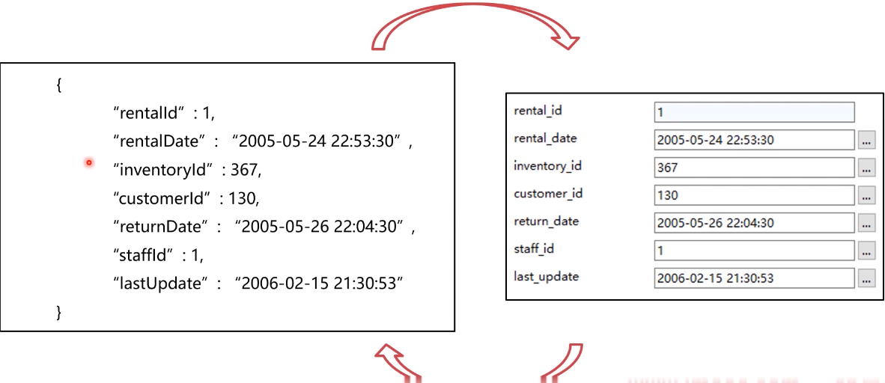
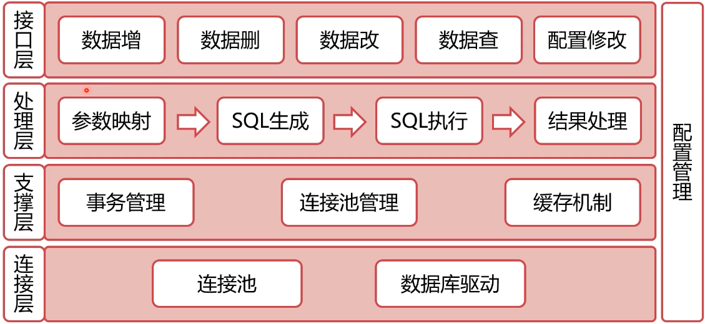

### 什么是ORM框架？

Object ReIationaI Mapping

* 对象(ObJect)
* 关系(Relational)
* 映射(Mapping)
* 对象与关系型数据库的睞射关系


#### 著名的ORM框架

* Java: MyBatis,Hibernate
* Python：DJango,SQLALchemy
* Go:GORM


#### Object ReIationaI Mapping




#### ORM框架的意义

* 将数据库操作与程序编码解耦，提高开发效率
* 自动拼装生成SQL语句，避免SQL注入风险
* 自动管理数据库连接、自动重试、自动回滚等操作
* 自动管理事务


#### 数据库操作与程序编码解耦

```sql
String sql =
"select * from std where age > "
queryAge;
stmt.exec(sql);
Student std = new Student();
std.setName = stmt.get(O);
```

$\downarrow$

```sql
Student std =
studentDao.findByAge(queryAge);
```


#### 避免SQL注入风险

```sql
sqlUtil.checkParam(queryAge);
String sql =
"select * from std where age > '
queryAge;
stmt.exec(sql);
Student std = new Student();
std.setName = stmt.get(O);
```

$\downarrow$

```java
Student std =
studentDao.findByAge(queryAge);
```


#### 自动管理数据库连接

```mysql
stmt.connect();
sqIUtiI.checkParam(queryAge);
Stringsql=
"select*fromstdwhereage>”
queryAge;
stmt.exec(sql);
Studentstd=newStudent();
std.setName=stmt.get(O);
```

$\downarrow$

```java
Student std =
studentDao.findByAge(queryAge);
```


#### 自动管理事务

```mysql
try{
begin();
//business flow
commit();
} catch{
rollback();
```

$\downarrow$

```mysql
@Transactional
{
//business flow
}
```


#### 总结

* ORM框架的作用是程序对象与关系型数据库之间的映射
* ORM框架可以大大降低程序员的代码开发工作量
* ORM框架可以使得代码更安全、更易维护


### ORM 软件架构怎么设计

##### 复习：经典软件架构

分层架构
事件驱动架构
管道一过滤器架构
微核架构


#### ORM框架·架构层次

接口层：向上支持程序调用
处理层：参数映射 -> SQL生成 -> SQL执行 -> 结果处理
支撑层：事务管理、连接池管理
连接层：数据库连接驱动


#### ORM框架·架构设计




### ORM框架有哪些常见问题？

ORM与DAO是什么关系？

* DAO这个概念在Java中比较常见，一般是ORM生成的
* DAO(DataAccessOect）是ORM框架的接口层
* DAO并不等于ORM框架，只是框架的一部分


#### 开发同学和DBA的误会在哪里？

* 在ORM框架的加持下，SQL不是开发同学直接写的
* 开发同学往往更注重业务逻辑，忽视了SQL本身的性能
* 开发同学和DBA都没有写SQL，出了问题都不背锅


#### 如何定位出问题的SQL？

* 业务应用：根据代码推断、查看相关日志
* 数据库：查看慢日志
* 网络：监听数据库端口，解析TCP报文（影响性能）


