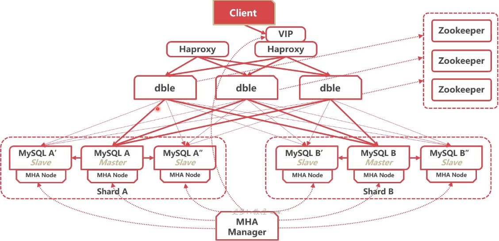

### 如何解决数据库经常宕机问题

#### 切换：保业务还是保数据？

如何进行身份切换

* 停止备库同步
* 配置主库复制从库

#### 可靠性优先策略

* 检查B库seconds_behind_master,不能过大
* A库只读 readonly = true
* 检查B库seconds_behind_master=0

* B库关只读readonly = false
* B库停止复制A库，A库开始复制B库

#### 可靠性优先策略

* 数据无丢失
* 有几秒的时间两个数据库均不可写
* 若一开始未检查seconds_behind_master,不苛角时间无法控制

#### 可用性优先策略

* 取消等待数据一致的过程
* A库只读、B库关只读
* B库停止复制A库，A库开始复制B库

* 系统没有不可写的时间
* 若切换时还有未重放的relay log
* 可能造成数据不一致错误

### 数据库切换了，业务怎么办？

#### 业务切换至新地址

* 业务预留接口，通知新的数据库地址
* 使用微服务框架通知业务

#### 使用内部DNS，通过域名连接

* 自己搭建CoreDNS

#### VIP漂移

* 使用keepalived进行自动VIP漂移

#### 使用代理

* 使用Haproxy等代理组件，将转发地址切换至新库

#### 使用dble时的主备切换

使用dble等分库分表中间件，将数据分片地址切换至新库

### 如何实现自动主从切换？

#### KeepaIived

* 常见的高可用组件
* 可以检测节点状态
* 自动执行切换脚本

* 使用keepalived进行身份切换+自动VIP甲漂移

#### MHA (Master High AvaiIabiIity)

* 常用的MySQL高可用组件
* 支持GTID方式
* binlog来不及传送时会尝试登陆A库传送binlog
* 不能自动漂移VIP

* 从宕机崩溃的master抢救未传送的binlog
* 等待Slave执行中继日志，追赶Master
* 在Slave执行从Master抢救出的binlog
* 提升一个Slave为新Master
* 使用其他的Slave连接新的Master行复制

#### 自研高可用组件

* 完全自主控制

* 研发代价高

  

#### MHA与dbIe联动

#### 高可用了，集群为什么还会挂？

 

#### DRDS (Distributed Relational Database Service)

#### 高并发、高性能、高可用、分布式MySQL集群

