#### 怎样最简单地扩展容量？

* 将InnoDB的一个表分为多个表
* Server层依然看做一个表


#### 什么是分区表

```mysql
CREATE TABLE (
Oftimes datetime NOT NULL,
se int(11) DEFAULT NULL,
KEY (SftimeS)
) ENGINE = InnoDB DEFAULT CHARSET = latinl
PARTITION BY RANGE
PARTITION p_2030
VALUES
LESS THAN (2030) ENGINE = InnoDB,
PARTITION p_2031
VALUES
LESS THAN (2031) ENGINE =
InnoDB,
PARTITION p_2032
VALUES
LESS THAN (2032) ENGINE
= InnoDB,
PARTITION p_others
VALUES
LESS THAN MAXVALUE ENGINE = InnoDB
);
```

#### 指定分区位置

```mysql
CREATE TABLE (
Sftimes datetime NOT NULL,
se int(11) DEFAULT NULL,
KEY ('ftime')
) ENGINE = InnoDB DEFAULT CHARSET = latinl
PARTITION BY RANGE
PARTITION p_2030
VALUES
LESS THAN (2030) ENGINE = InnoDB,
INDEX DIRECTORY = '/datal'
DATA DIRECTORY = '/data2',
PARTITION p 2031
VALUES
LESS THAN (2031) ENGINE
= InnoDB,
PARTITION p 2032
VALUES
LESS THAN (2032) ENGINE
= InnoDB,
PARTITION p_others
VALUES
LESS THAN MAXVALUE ENGINE = InnoDB
```


#### 分区方式

* 范围分区
* Hash分区
* List分区


#### 分区表的优势

* 降低B+树的层级，搜索加速
* 将一个数据表物理上分为多个文件，方便处理


#### 分区表的缺陷

* 第一次需要访问所有分区
* 共用MDL锁
* 分区之后，所有的分区依然位于同一节点


#### 为什么要分库分表？

* 垂直：按照字段分表，一般分为冷热
* 水平：按照行分表，常用范围、Hash切分
* 水平分表类似于分区表，但server层也分了


#### 垂直分表

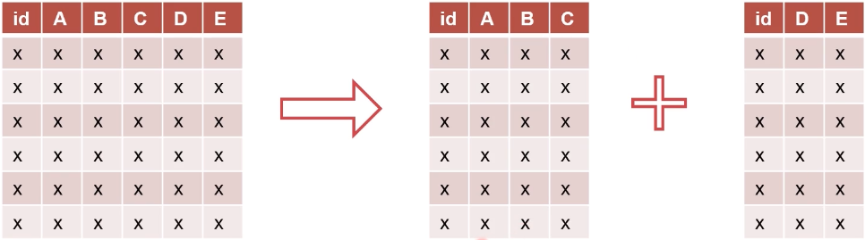


#### 水平分表

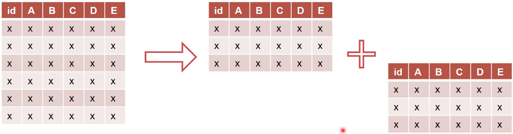


#### 分库

* 垂直：将数据表分散在多个数据库或者多个节点中
* 水平：将所有表水平拆分，每个数据库结构相同


#### 垂直分库

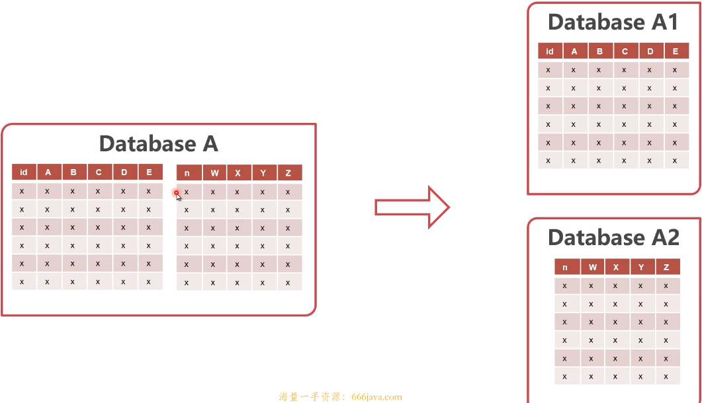

#### 水平分库

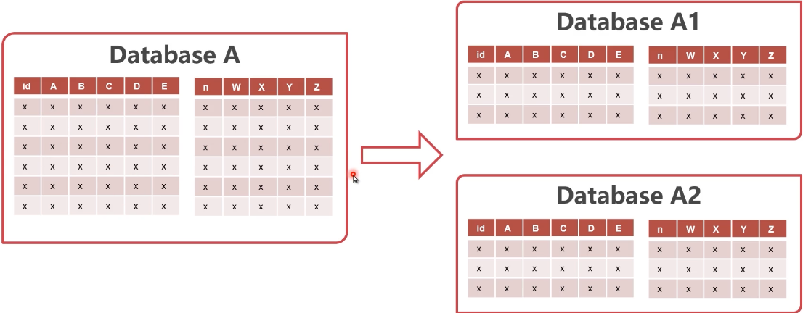


#### 分库分表的优点

* 增加隔离性
* 提升容量与并发性能

* 水平分表类似于分区表，但server层也分了


#### 分库分表的缺点

* 部分失效可能性成倍增加
* 无法使用单点事务
* 垂直切分后无法JOIN

* 范围查询困难


#### 分库分表后的使用方式

* 业务特殊处理
* 业务应用使用中间层

* 使用分库分表中间件


#### dble比MyCat强在哪？

* 分析SQL语句
* 根据SQL语义，将SQL拆分成多个，发送至数据节点
* 将多个数据节点的结果聚集，返回客户端


#### dble

* 高性能、高可用的MySQL分库分表中间件
* 上海爱可生公司开发，国货之光
* 完全开源
* 基于开源项目MyCat


#### dble架构设计

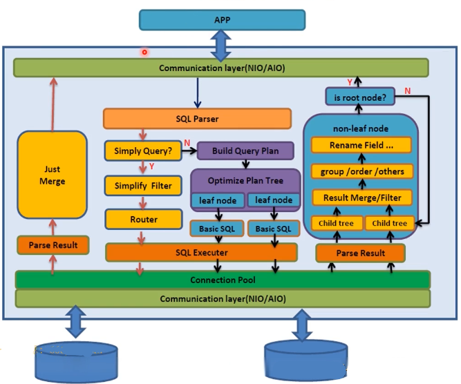

sharding 分片


#### dble对Mat做的增强

* 缺陷修复
* 实现改进
* 功能增强
* 功能裁减


#### dble的基础概念

* schema:虚拟数据库（不同于传统的schema)
* shardingTable：虚拟表（被拆分的表）
* shardingNode：虚拟节点
* dbGroup：实际的MySQL集群
* database：实际的database


####  dble表拆分图示

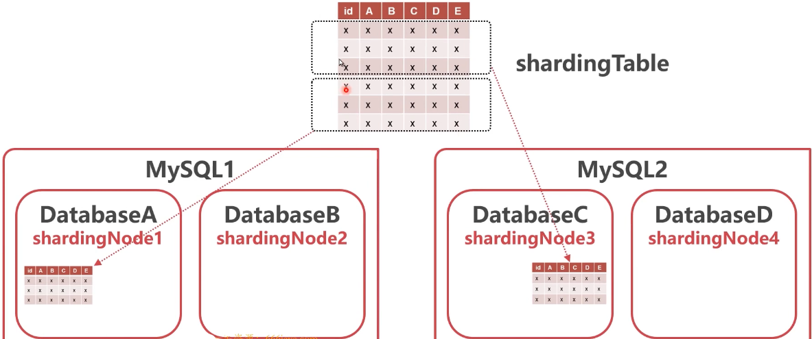


#### dble表的类型

* 全局表：每个节点上有保存表的完整数据
* 拆分表：被拆分的表，存入不同节点
* 非拆分表．不拆分的表，存在单一节点


#### dble最简运行环搭建

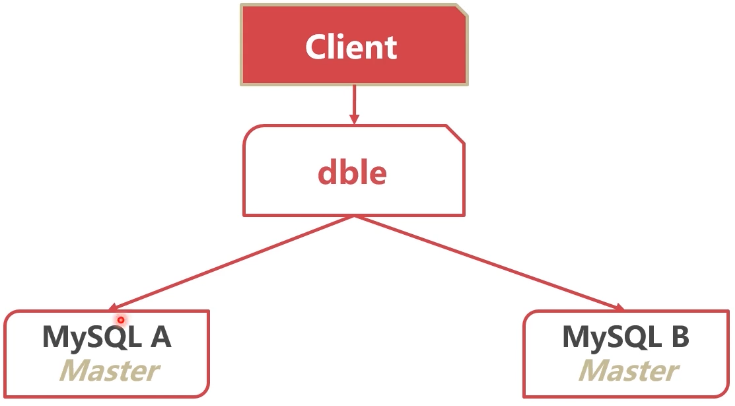


### 怎样提高分库分表架构的可靠性？

#### 复制与分库分表架构的结合

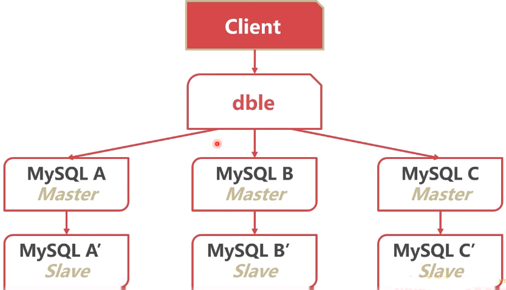


#### 复制与分库分表架构的结合

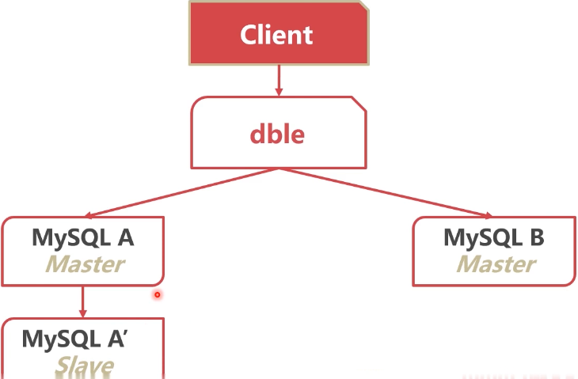


#### 使用dble进行读写分离

* dble分析SQL语义
* 将写语句发送给主节点
* 将读语句发送给从节点


* rwSplitMode=0:   直接分发到主实例
* rwSplitMode=1：读操作必须在所有从实例中均衡
* rwSplitMode=2:   读操作在所有实例中均衡
* rwSplitMode=3：读操作尽量在所有从实例中均衡

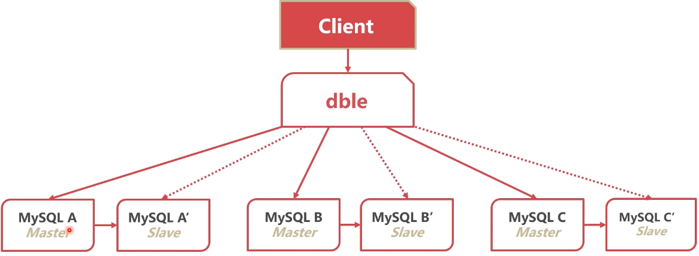


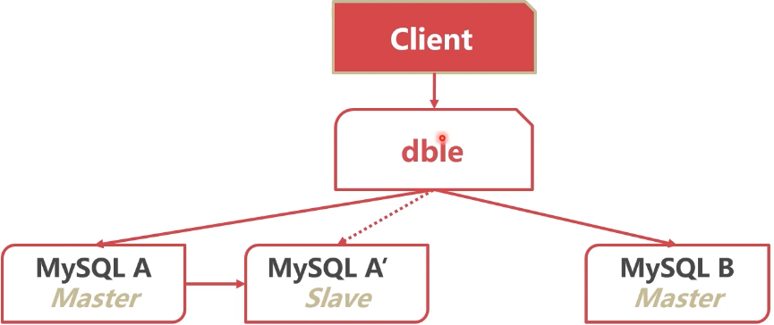


### 分库分表之后性能反而下降，怎么办？

#### 查询语句中尽可能带有拆分字段

* dble根据拆分字段，判断数据在哪个节点
* 若无法判断数据节点，只能遍历全部节点数据


#### 插入语句必须带有拆分字段

* dble根据拆分字段，判断数据在哪个节点
* 新数据若无拆分字段，无法插入


#### 拆分字段尽量等值

* 范围拆分字段会扫描过多节点
* 若使用IN子句缩减IN子句值的数量


#### 减少表的搜索遍历

* 不带拆分字段时
* DISTINCT、GROUPBY、ORDERBY
* 尽量少出现，不要大于一种


#### 减小结果集

* 分布式系统中，节点间有大量的数据交互
* 数据交互会影响查询性能
* 过大的结果集会增大数据氵匚集的网络交互量


#### 跨节点连表

* 经常join的表使用相同的拆分规则
* 使用拆分字段作为join条件
* 尽量对驱动表添加更多的过滤条件
* 尽量少使用跨节点排序、分页等功能
* 复杂语句拆分成多条语句


