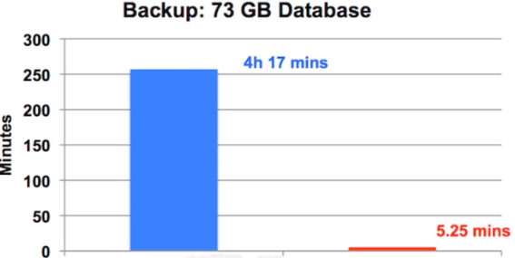

### 怎么给数据上保险

#### 备份的分类维度

* 备份时数据库的状态
* 备份文件的格式
* 备份的内容


#### 备份时数据库的状态

* Hot Backup（热备）：正常运行中直接备份
* Cold Backup（冷备）：完全停止后备份
* warm Backup（温备）数据库只读


#### 备份文件的格式

* 逻辑备份：输出文本或SQL语句
* 物理备份（裸文件）·备份数据库底层文件


#### 备份的内容

* 完全备份：备份完整数据
* 增量备份：备份数据差异
* 日志备份：备份Binlog


#### 工具举例

* mysqldump:逻辑、热、全量备份
* xtrabackup:物理、热、全量+增量备份


#### 如何使用OUTFILE命令进行备份？

* MySQL原生的SQL指令
* 最原始的逻辑备份方式
* 备份的功能和效果取决于如何写SQL语句


#### OUTFILE的使用方式

* 首先查询MySQL的导出路径

  ```mysql
  show variables like '%secure%';
  ```

* 使用into outfile指令将查询结果导出至文件

  ```mysql
  select * into out_file '/var/lib/mysql-files/outfile_test' from Z;
  ```


#### OUTFILE的注意事顶

* 在lnnoDB事务下，可以做到一致性视图
* 修改分隔符：fields terminated by
* 修改换行符：lines terminated by


####  OUTFILE的缺陷

* 输出的文本比较简略
* 很难进行还原，现在往往用来简单导出数据


### 如何使用mysql dump进行备份？

#### OUTFILE如何改进

* 自动发SELECT语句，不需要手动发送
* 自动开始事务
* 输出INSERT语句，可以直接用于还原


#### mysqldump

* 非常常用的MySQL逻辑备份工具
* MySQL Server自带
* 输出的备份内容为SQL语句，平衡了阅读和还原
* SQL语句占空间较小


#### mysqldump原理

* mysqldump使用以下语句对数据进行备份：

  ```mysql
  SELECT SQL_NO_CACHE FROM `t`;
  ```

* SQL_NO_CACHE查询出的数据不会进入SQL缓存


#### mysqldump使用方法

* mysqldump使用以下语句对数据进行备份，

```mysql
mysqldump -uroot -p123456 --databases d1 --single-transaction > test.sql;
```


* 直接执行导出的sq|文件即可进行还原

```mysql
source test.sql;
```


#### mysqldump注意事项

* --single-transaction: 在RR级别下进行(lnnoDB)
* --lock-all-tables：使用FTWRL锁所有表(MylSAM)
* --lock-tables:使用READLOCAL锁当前库的表(MylSAM)
* --all-databases:备份所有库


#### mysqldump缺点

* 导出逻辑数据，备份较慢
* 还原需要执行sql。速度也比较慢


### 如何使用mysqldump增量备份？

#### mysqldump增量备份思路

* binlog忠实记录了MySQL数据的变化
* mysqldump全量备份之后，可以用binlog作为增量
* mysqldump全量备份时，切换新的binlog文件
* 从零还原时，采用全量还原+binlog还原


#### 步骤1．mysqldump全量备份

* mysql dump使用以下语句对数据进行全量备份：

```mysql
mysqldump -uroot -pl 23456 --databases dl --single-transaction --flush-logs --master-data=2 > test.sql;
```

* --flush-logs: 备份后切换binlog文件
* --master-data=2: 记录切换后的binlog文件名


#### 步骤2．binlog增量备份

* 需要增量备份时，切换binlog文件

```mysql
mysqladmin -uroot -p123456  flush-logs
```

* 将所有新增的binlog文件备份


#### 步骤3．还原

* 首先恢复旧的全量备份

```mysql
source test.sql;
```


* 然后将binlog增量还原至数据库

```mysql
mysqlbinlog MySQL-bin.000002 … | mysql -uroot -p123456
```


#### 如何使用XtraBackup物理备份？

* 直接备份InnoDB底层数据文件
* 导出不需要转换，速度快
* 工作时对数据库的压力较小
* 更容易实现增量备份


#### 直接拷贝裸文件可行吗？

* 理论上可行，但有很多问题:
* 要同时备份frm文件、ibd文件、binog文件、redo log文
  件等
* 在不同版本的数据库和操作系统上还原可能有兼容问题
* 必须冷备份，影响业务


####  如何实现 物理+热+全量备份？

思路：利用redo log,备份ibd文件+备份期间的redo log

1. 启动redo log监听线程，开始收集redo log
2. 拷贝ibd数据文件
3. 停止收集redo log

4. 加FTWRL锁拷贝元数据frm


#### 如何实现物理+热+增量备份？

* 思路：与全量级别相同
* 如何确定增量：根据每个页的LSN号，确定变化的页


#### 如何实现物理还原？

* 思路：mysqld crash奔溃恢复流程相似
* 还原ibd文件，重放redo log


#### ibbackUP

* 现名MySQL Enterprise Backup, lnnoDB官方出品
* 实现了上述的功能，性能优秀




#### XtraBackup

* Percona公司开发的开源版本，实现ibbackup所有功能
* XtraBackup 8.0 -> MySQL 8.0
* XtraBackup 2.4 -> MySQL 5.1，5.5，5.6，5.7


#### XtraBackup 安装方法

* 下载

```shell
wget https://downloads.percona.com/downloads/Percona-XtraBackup-2.4/Percona-XtraBackup-2.4.22/binary/redhat/7/x86_64/percona-xtrabackup-24-2.4.22-1.e17.x86_64.rpm
```

* 安装

```shell
rpm-ivh--nodeps--f0rcepercona-xtrabackup-24-2.4.22-1.el7.×86一64.rpm
```


####   XtraBackup 全量使用方法

* 备份

```shell
innobackupex --user=root --password=123456 bakdir/
```


* 数据还原（停掉mysqld)

```shell
innobackupex --copy-back bakdir/XXXX-XX-XX/
```


#### XtraBackup 增量使用方法

* 增量备份

```shell
innobackupex --user=root --password=123456 --incremental bakdir/
--incremental-basedir='/bakdir/XXXX-XX-XX/'
```

* 增量备份合并至全量备份

```shell
innobackupex--apply-logbakdir/XXXX-XX-xx/--incremental-dir=bakdir/YYYY-YY-YY/
```


### MysQL备份工具如何指导我们的创新？

#### mylvmbackup

* 物理、温备
* 利用LVM(Logical Volume Manager)逻辑卷管理器
* 直接备份磁盘数据


####  mydumper

* 跟mysqldump类似的工具
* 实现了多线程并发的备份还原
* 速度更快


#### Zmanda Recovery Manager

* 功能强大的备份恢复管理工具
* 集成了多种备份工具
* 集成binlog分析功能


### 如何防患于未然？

#### 权限隔离

* 给业务应用分配的账号只给DML权限
* 开发同学使用只读账号
* DBA平时使用时使用只读账号，特殊操作时切换账号


#### SQL审计

* DBA在开发环境审计即将上线的SQL语句
* 开发同学修改在线数据，提交给DBA执行
* lnception自动审核工具


#### 伪删表

* 删表之前将表改名，观察业务是否受影响
* 不直接删表，给表明加特殊后缀，用脚本删除


#### 完备流程

* 上线之前备份数据
* 准备生产环境事故预案


