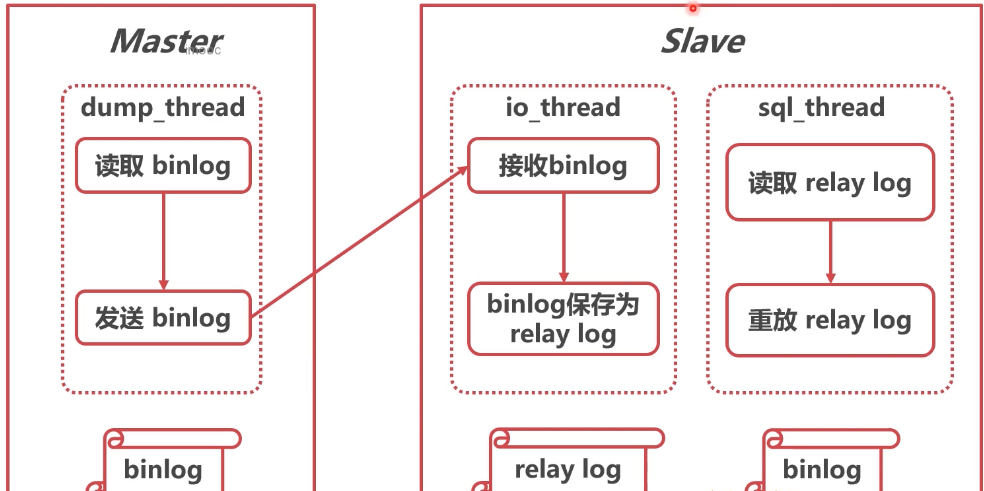
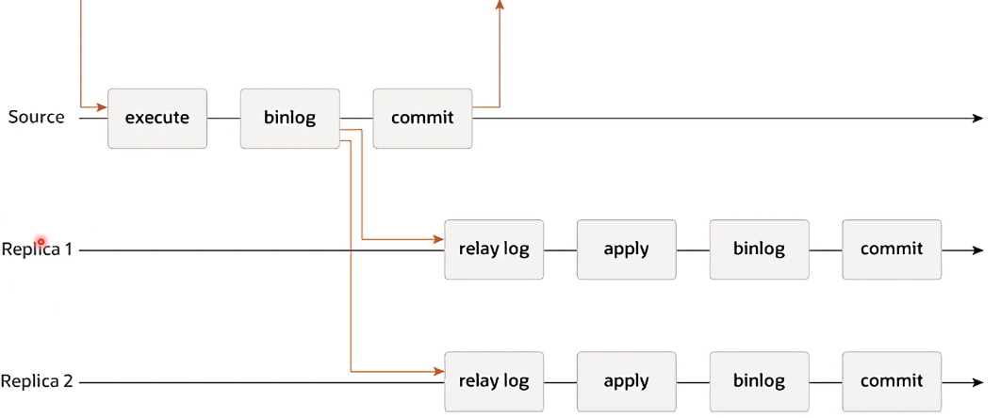
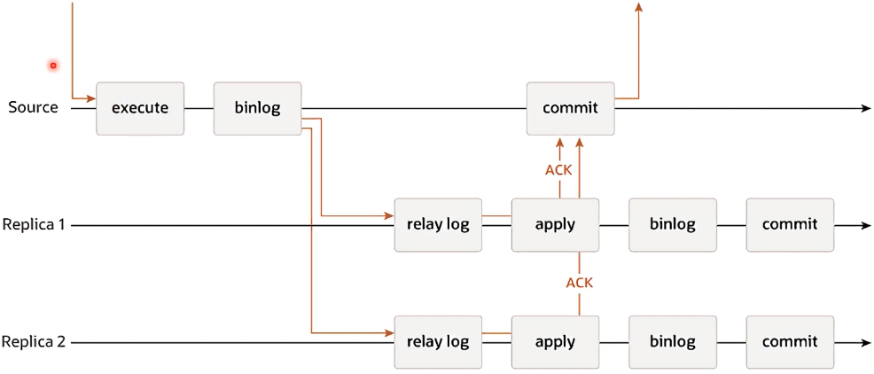
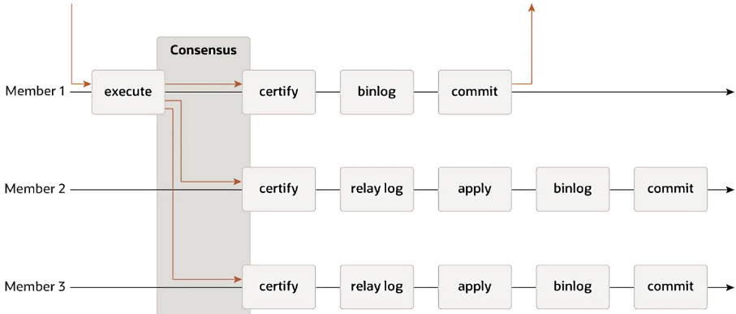
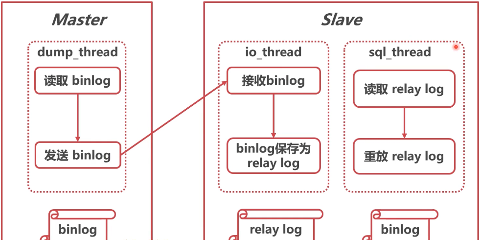
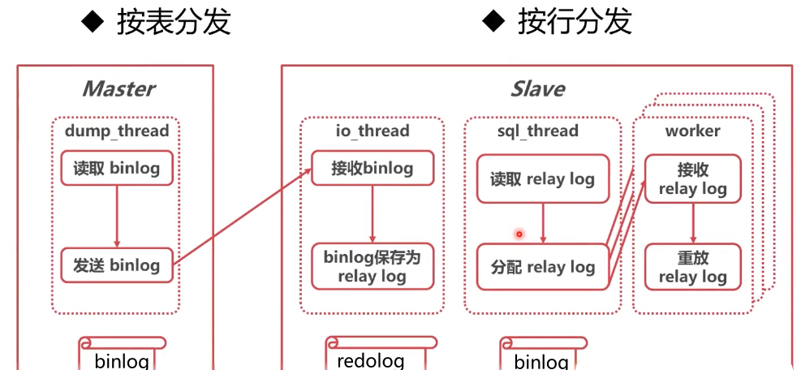
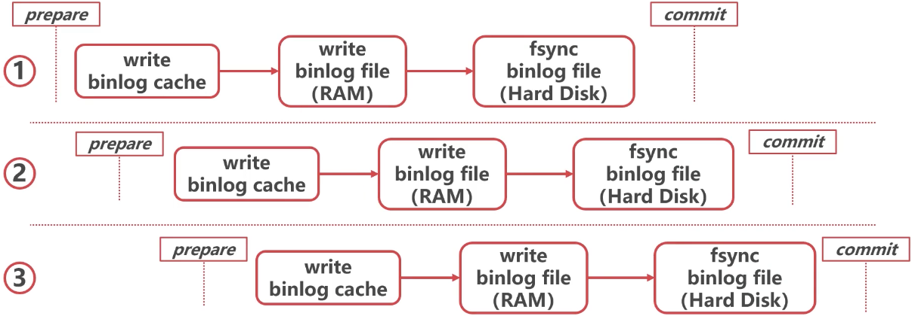
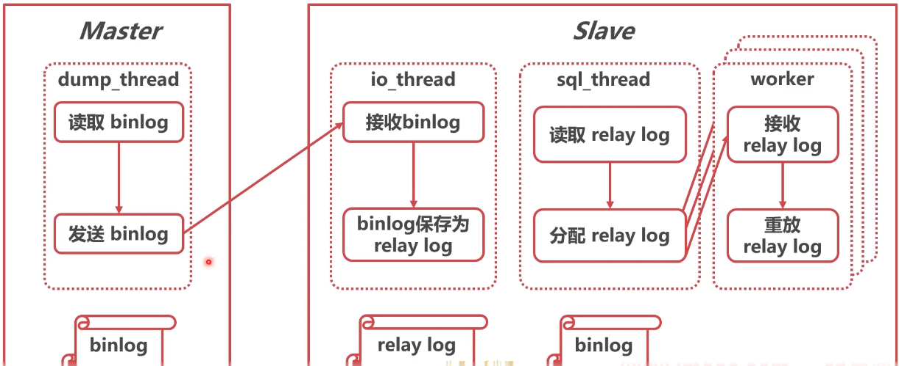
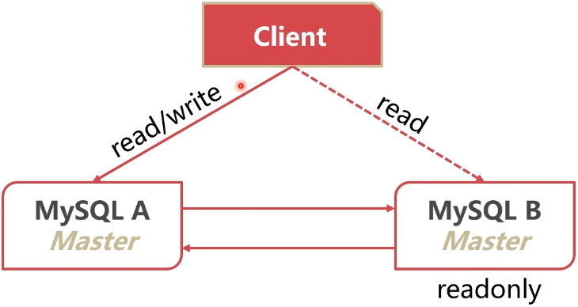
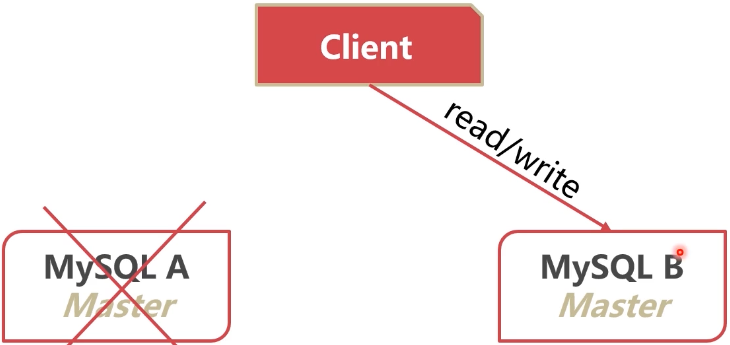

#### 什么是“三高”

* 高并发：同时处理的事务数高
* 高性能：事务/SQL的执行速度高
* 高可用：系统可用时间高


#### 为什么不直接讲“三高“

* “”三高“只是 目的，并不是手段，手段有．
* 复制
* 扩展
* 切换


#### 复制

* 目的：数据冗余
* 手段：binlog传送
* 收获: 并发量提升、可用性提升

* 问题: 占用更多硬件资源


#### 扩展

* 目的：扩展数据库容量
* 手段：数据分片分库、分表
* 收获：性能、并发量的提升
* 问题: 可能降低可用性


#### 切换

* 目的：提高可用性
* 手段：主从身份切换
* 收获：并发量的提升
* 问题：丢失切换时期数据


#### 三高"的实现

* 高并发：通过复制和拓展，将数据分散至多节点
* 高性能：复制提升速度，拓展提升容量
* 高可用·节点间身份切换保证随时可用


### 复制有哪些类型？

复制的基本原理




#### 复制的类型

* 根据复制同步的类型，复制可以分为：
* 异步复制(Asynchronous Replication)
* 半同步复制(Semisynchronous Replication)
* 组复制(Group Replication)


#### 异步复制(Asynchronous RepIication)



* 原理简单
* 对网络延迟要求较小
* 不能保证日志被传送到了备库，可能丢失数据


#### 半同步复制(Semisynchronous RepIication)



* 原理简单
* 对网络延迟有一定要求，最好在同一机房
* 可以保证日志被传送到了备库，不易丢失数据
* rpl_semi_sync_master_timeout参数可以调整脱扣时间


#### 组复制(Group RepIication)



* 原理比较复杂
* 需要依赖共识算法
* 实际应用较少
* 是数据库走向原生分布式的示范


#### 怎样使得复制的配置更方便？

* LOG_FILE+LOG_POS不方便
* 根本原因是，备库不知道应该从哪个log开始复制
* 思路：给每个事务配一个唯一ID


#### GTID (GIobaI Transaction ldentifier)

* MySQL 5.6 版本引入了GTID
* GTID = server_uuid : gno
* server_uuid:节点的UUID
* gno事务流水号（回滚会收回）


#### 如何启用GTID

* gtid_mode=on
* enforce_gtid_consistency=On


#### 使用GTID进行主从复制

```mysql
CHANGE MASTER TO
MASTER_HOST='192·168·57·144'，
MASTER_USER='root',
master_auto_position=1;
```


### 为什么binlog格式会影响复制？

#### statement格式的binlog

* 5·0之前的MySQL默认使用了statement格式的binlog
* binlog记录的是SQL语句原文
* 由于主备库对于SQL的执行不一致，可能有数据安全风险


#### ROW格式的binlog

* 不记录SQL语句原文
* 记录数据行的变化
* 不是物理日志，还是逻辑日志
* 占空间较大


####  mixed格式的binlog

* 两种格式混合使用
* 有数据风险的语句使用ROW
* 无风险的使用statement


#### 基于语句或行的复制

* 基于语句的复制=statement
* 基于行的复制：row


#### 备库延迟太大，怎么办？


#### 备库延迟的原因

* log传送开销较小，主要是消费relay log耗时
* 备库性能不如主库

* 备库承担了很多分析SQL
* 主库的长事务未提交


#### 处理方法

* 主备使用相同配置的机器
* 备库关闭log实时落盘
* 增加从库数量，应对分析SQL
* binlog传送至大数据系统，供分析
* 大事务一分多


#### 依然存在的问题

* 备库对硬件资源利用天然不如主库
* 备库单线程执行
* 主库多线程执行


#### 井行复制的思路







#### MySQL 5.6 并行复制

* MySQL 5.6使用按库并行的策略
* 优点·分发选择快、支持各种log格式
* 缺点: 库粒度太大，很难负载平衡
* slave-parallel-type=DATABASE


#### MySQL 5.7 使用按事务组并行的策略

* binlog刷盘其实是两步动作
* 先把binlog 从 binlog cache中写到内存的 binlog 文件
* 调用 fsync 持久化至磁盘




####  MySQL 5.7 使用按事务组并行的策略

* binlog_group_commit_sync_delay:
  延迟多少微秒后才调用fsync

* binlog_group_commit_sync-no_delay_count:

  累积多少次以后才调用 fsync

* 两个条件是或的关系


* MySQL5·7使用按事务组并行的策略
* 同时处于prepare状态的事务，在备库执行时是可以并行的
* slave-parallel-type=LOGICAL_CLOCK


#### MySQL5.7.22并行复制

* binlog-transaction-dependency-tracking参数:
* COMMIT_ORDER: 按事务组并行（5.7）
* WRITESET: 没有修改相同行的事务可以并行

* WRITESET_SESSION:

  同一个线程先后执行的两个事务不能并行


### 如何在备库读到最新数据？

#### 强制走主库？

#### 如何判断备库已经追上

* 强制延时
* seconds_behind_master=0
* 对比binkog执行位点
* 对比GTID执行情况


#### 备库延迟理论上无法消灭




* binglog传送、中继日志重放需要时间
* 理论上，备库延迟只能减小，无法消灭
* 在备库读取数据时永远面临数据延迟问题


#### 判断具体事务是否已经重放

* 等待binlog位点

  ```mysql
  select master_pos_wait(file, pos[, timeout]);
  ```

* 等待GTID（5.7.6 之后可以返回每次的GTID）

```mysql
select wait_for_executed_gtid_set(gtid_set, 1);
```


### 怎样实现最简单的高可用架构？

#### 主·主复制架构

* 两个节点均为Master
* 两个节点互为slave
* 一个节点出现故障时，无需切换


#### 主-主复制架构






#### 主-主架构的问题

* 数据冲突问题
* 客户端切换
* 循环复制


#### 数据冲突问题

* 两边插入相同|D时，可能出现冲突
* 两边约定好插入不同ID
* 只写一个主，另一个只读
* 有切换过快的数据丢失问题


#### 客户端切换

* 应用自己切换比较麻烦
* 使用keepalived等手段可以完成自动切换


#### 循环复制

* 理论有此问题
* 未开GTID：使用serverlD过滤
* GTID: 天然避免


