### 未来数据库是怎么样的？

#### MySQL8·0有什么新特性？

##### 窗口函数(WindowFunctions)

* 以某个列为分隔，分为多个"窗口"
* 在窗口内执行特定函数

```mysql
SELECT *,
	rank() over (
		PARTITION BY customer id
		ORDER BY
			amount desc
	) AS ranking
FROM
	paymene;
```


#### 隐藏索引

* 暂时隐藏某个索引
* 可以通过隐藏和显示索引，来测试索引的作用

```mysql
show index from `payment`;
```

```mysql
ALTER TABLE payment ALTER INDEX fk_payment_rental INVISIBLE;
```

```mysql
ALTER TABLE payment ALTER INDEX VISIBLE;
```


#### 降序索引

* 8.0之前只有升序索引
* 对于很多本来能走索引覆盖的语句，升序索引无法覆盖
* 降序索引解决了此问题

```mysql
CREATE INDEX idxl ON payment (payment_date desc);
```


#### 通用表表达式（ommonTabIeExpressions CTE)

* 使用CTE表达式预先定义可以复杂语句中反复使用的中间结果
* CTE可以认为是一个临时视图

```mysql
SELECT b, d
FROM (SELECT a,b FROM table1 ) JOIN (SELECT c,d FROM table2)
WHERE  cte1.a= cte2.c;
```

```mysql
WITH
ctel AS (SELECT a, b FROM table1),
cte2 AS (SELECT c, d FROM table2)
SELECT b, d
FROM ctel JOIN cte2
WHERE ctel.a
= cte2.c;
```

#### UTF-8编码

* utf8mb4作为MySQL的默认字符集


#### DDL事务

* 8·0支持DDL事务，元数据操作可以回滚


#### lnnoDB CIuster

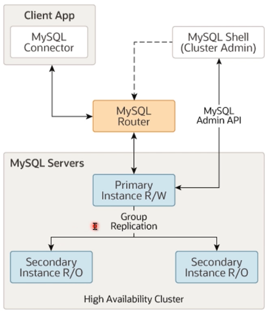


#### Percona XtraDB CIuster

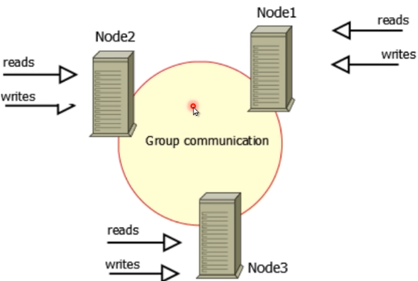


#### 数据库有哪些分类？

* OLTP(Online Transaction Processing)
* OLAP(Online Analytical Processing)
* HTAP(Hybrid Transaction/ Analytical processing)


#### OLTP(OnIine Transaction Processing)

* 在线事务（交易）处理系统
* SQL语句不复杂,大都处于事务中
* 并发量大，对可用性要求高
* MySQL/PostgreSQL


#### OLAP(OnIine Analytical Processing)

* 在线分析处理系统
* SQL语句复杂、数据量大
* 一般以单个事务为单位
* Hive / SparkSQL / GreenPIum


#### HTAP (Hybrid Transaction/AnaIyticaI Processing)

* 混合事务/分析处理
* 混合了两种数据库的特点，实现一种架构多功能


#### 按存储形式分类

* 行存
* 列存
* KV

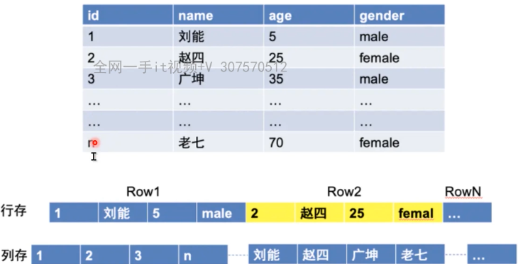


#### 按架构分类

* Shared-Everything

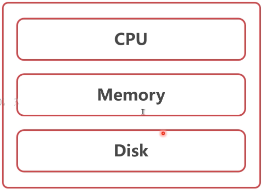

* Shared-Memory

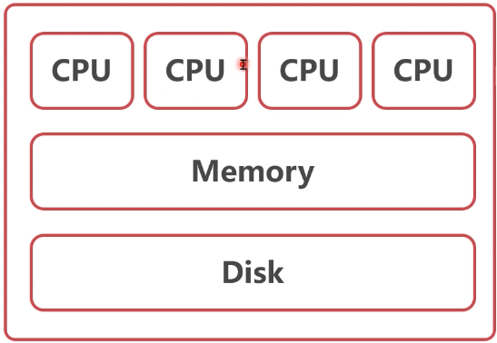

* Shared-Disk

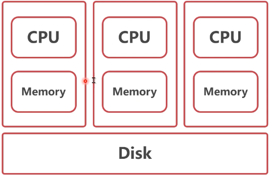

* Shared-Nothing

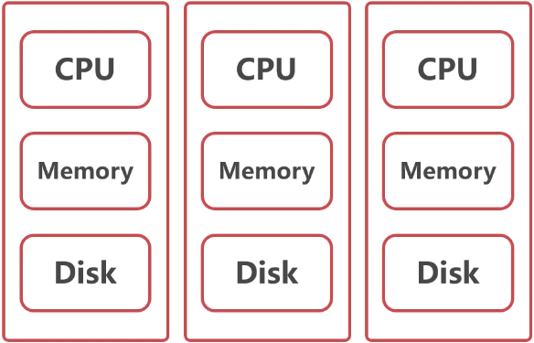


#### 谁是单体数据库之王？

##### PostgreSQL

* 与MySQL类似的功能

* 性能更好、更稳定
* 代码质量更高
* 有超MYSQL的趋势


#### Postgres-XL(OLTP)

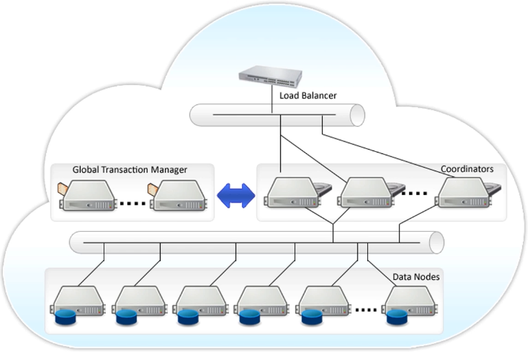

* GTM管理每个事务的执行
* Coordinator解析SQL,制定执行计划，然后分发
* DataNode返回执行结果到Coordinator


#### GreenPIum(OLAP)

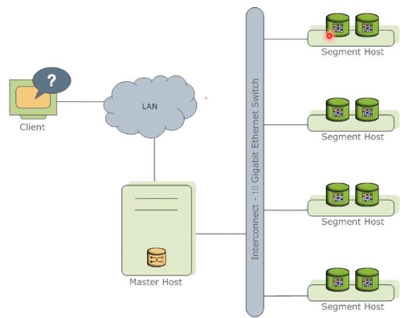

* 高性能SQL优化器：GPORCA
* Slice执行模式


### MySQL能魔改成什么样

#### PoIarDB

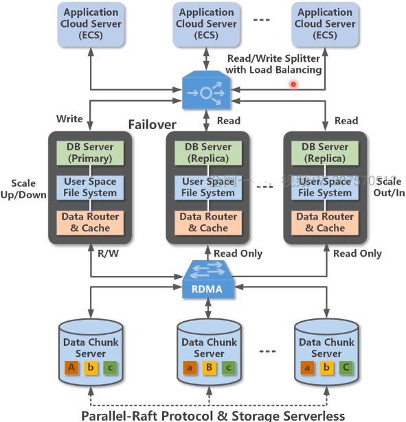


#### 日志传送vs共享存储

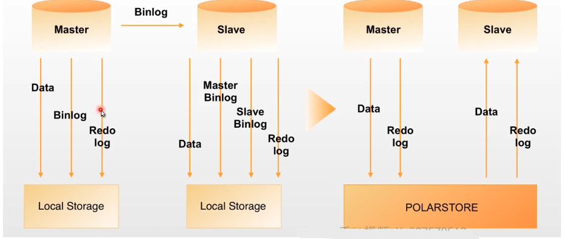


#### 备库如何查询数据

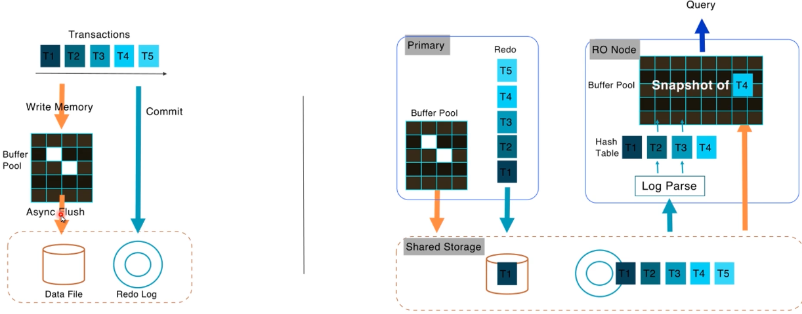


#### 谁在支撑双十一？

#### OceanBase

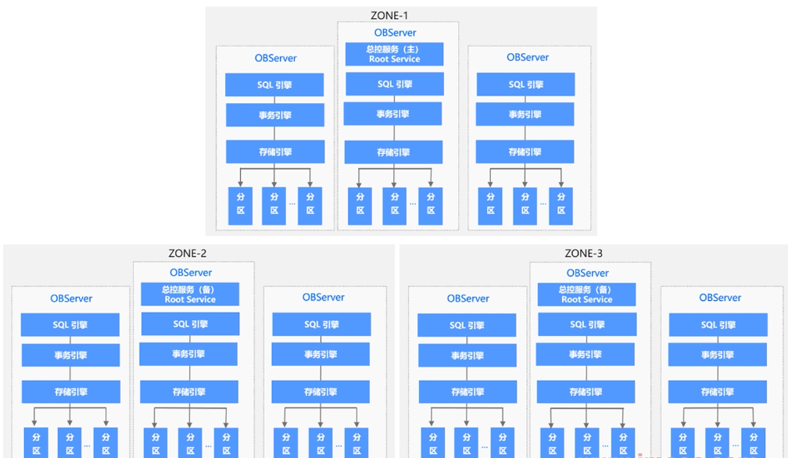


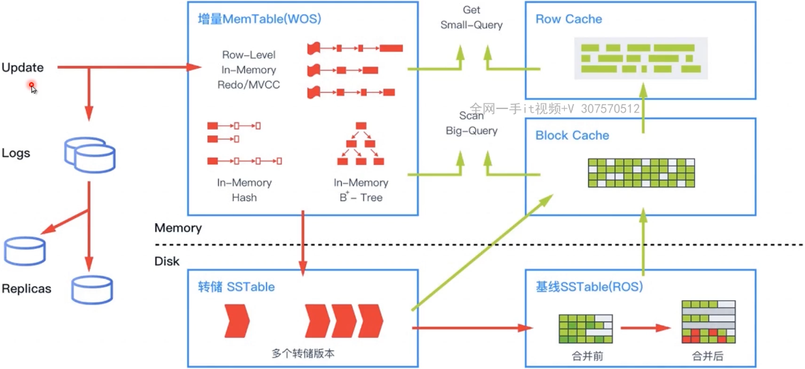


#### TiDB简介

* 一键水平扩容或者缩容
* 金融级高可用
* 实时HTAP
* 云原生的分布式数据库
* 兼容MySQL5，7协议和MySQL生态

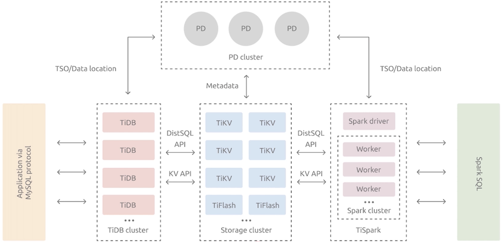

TiDB

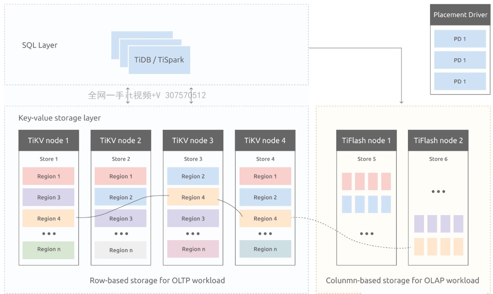


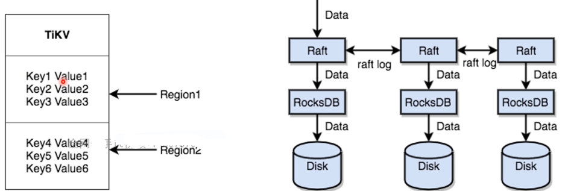


#### CockroachDB

* 2015年启动，由谷歌前员工发起
* 完全开源
* 分布式shared-nothing架构
* 兼容Postgres协议

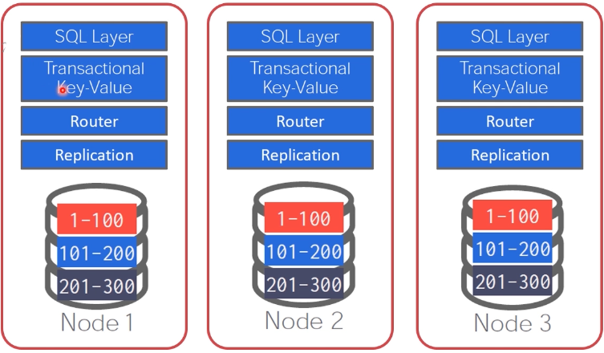

* 分层架构
* 每个节点底层都为RocksDB
* 使用Raft作为共识协议

