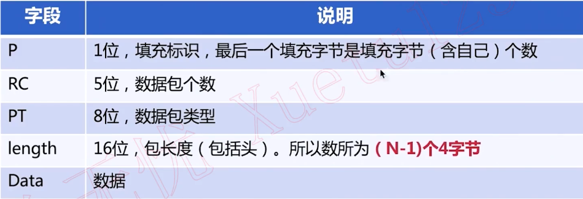

### TCP-IP简介

TCP在实时通信中的作用

指标：连通率， 90%以上才能商用


#### 网络协议

IP协议头


#### MTU

* Maximum Transmission Unit，指在网上可传输数据的最大尺寸。
* 可通过ICMP查询最大传输单元。它通过设置IP层的DF「Don't Fragment」 不分片位，如果将这一比特置1，IP层将不对数据报进行分片。
* 获取MTU的好处是传输过程中不拆包，提高传输效率。以太网MTU默认是1500B (1.5KB)


#### TCP/IP 协议


#### TCP协议头


#### SeqNumber含义

在TCP中，数据不是按包排序的，而是按字节排。每个包的seq
Number代表的是发送字节的起始序号。

发送的第一个包的初始序号是随机的，在创车接的三次握手过程中交换。


#### AckNumber含义

在TCP中，AckNumber代表的是希望对方发送数据的起始位置。

例如，A向B发送了一个数据包，其SeqNumber为1000，其大小为1000字节，则B收到该包后，返回的AckNumber为2001。


#### TCP三次握手


#### TCP四次挥手


#### TCP的ACK机制


#### TCP ACK机制


#### 滑动窗口


#### DeIay ACK


#### UDP与RTP

##### UDP协议


#### RTP


### 实时传输 TCP/UDP协议的选择

####  TCP丢包重传


#### RTP包的使用


#### RTCP协议


#### RTCP Header


#### RTCP Header说明




#### RTCP Type


#### RTCP SR


* Sender lnformation block


#### Sender Info 说明


#### RTCP SR


#### Receive Report block


#### RTCP RR


#### RTCP SDES


#### RTCP SDES


#### SDES item


#### SDES说明

* SC SSRC/CSRC数量
* ltem采用TLV存放数据
* CNAMESSR（的规范名


#### RTCP BYE


#### RTCP APP


#### RTCP FB Type


#### RTCP RTPFB Type


#### RTCP PsFB Type


#### RTCP FB Header


#### STUN协议介绍

* STUN存在的目的就是进行NAT穿越
* STUN是典型的客户端/服务器模式。客户端发送请求，服务端进行响应。


#### RFCSTUN规范

* RFC3489/STUN
  Simple TraversaI of UDP Through NAT
* RFC5389/STUN
  Session Traversal Utilities for NAT


#### STUN协议

* 包括20字节的STUNheader
* Body中可以有 0个或 多个Attribute


#### STUN header 格式


#### STUN Header

* 其中2个字节（16bit）类型
* 2个字节（16bit）消息长度，不包括消息头
* 16个字节（128bit）事务ID，请求与响应事务ID相同


#### STUN Message Type

* 前两位必须是00，以区分复用同一端口时STUN协议
* 2位用于分类，即C0和C1

* 12位用于定义请求/指示


#### C0C1

* 0b00：表式是一个请求
* 0b01：表式是一个指示
* 0b10：表式是请求成功的响应
* 0b11：表式是请求失败的响应


#### STUN消息类型


#### 大小端模式

* 大端模式：数据的高字节保存在内存的低地址中
* 小端模式：数据的高字节保存在内存的高地址中
* 网络字节顺序：采用大端排序方式


#### STUN Message Type


#### Transaction ID

* 4字节，32位，固定值0x2112A442。通过它可以判断客户端是否可以支持某些属性
* 12字节，96位，标识同一个事务的请求和响应


#### STUN Message Body

* 消息头后有0或多个属性
* 每个属性进行TLV编码：Type, Length, VaIue


#### TLV


#### RFC3489 定义的属性


#### Attribute的使用


####  ICE

* ICE，lnteractiveConnectivityEstabIishment
* 需要两端进行交互才能创建连接


#### ICE Candidate

* 每个candidate是一个地址
  每个候选者包括：协议，IP,端口和类型
  例如：a=candidate : ...UDP…192.169.1.21816 type host


#### Candidate类型

* 主机候选者
* 反射候选者
* 中继候选者


#### Candidate关系图

 


#### 收集Candidate

* Host Candidate: 本机所有IP和指定端口
* RefIexive Candidate: STUN/TURN
* RelayCandidate：TURN


#### ICE具体做些什么

* 收集Candidate
* 对Candidate Pair排序
* 连通性检查


#### DTLS巧协议详解

#### 加密解密的基本概念

什么是非对称加密

* 什么是公钥
* 什么是私钥


#### 数字签名

* 数字签名的作用
* 如何使用数字签名


#### 数字证书

* 数字证书的作用
* 如何获取证书


#### 私有证书

```bash
openssl req -x509
-days 3650
-newkey rsa:1024
-nodes
-keyout server.key
-out server.cert
```


#### 常用加密算法


#### OpenSSL

* 什么是OpenSSL
* SSL，Secure Sockets Layer
* TLS，Transport Layer Security


#### TLS协议

* TLS握手协议
* TLS记录协议


#### OpenSSL原理

* SSL_CTX
* SSL：代表一个SSL连接
* SSL_Write/SSL_Read


#### OpenSSL的使用


#### DTLS协议

* TLS是基于TCP协议的
* DTLS基于UDP协议的


#### DTLS握手协议


#### DTLS时序图


#### webRTC安全机制


#### DTLS-SRTP

##### DTLS要解决的问题

* 交换密钥
* 加密算法
* 对数据加密，保证数据安全
* 保证数据完整性


#### SRTP


#### libsrtp


