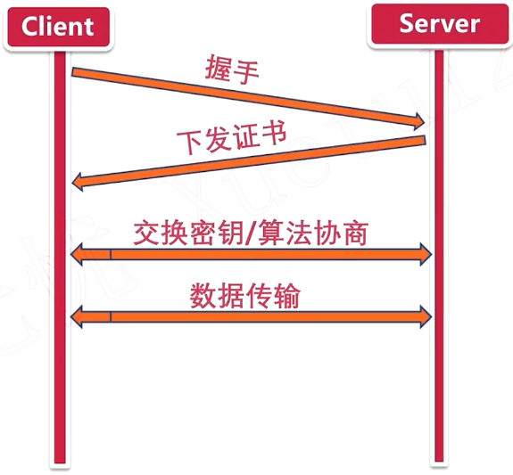
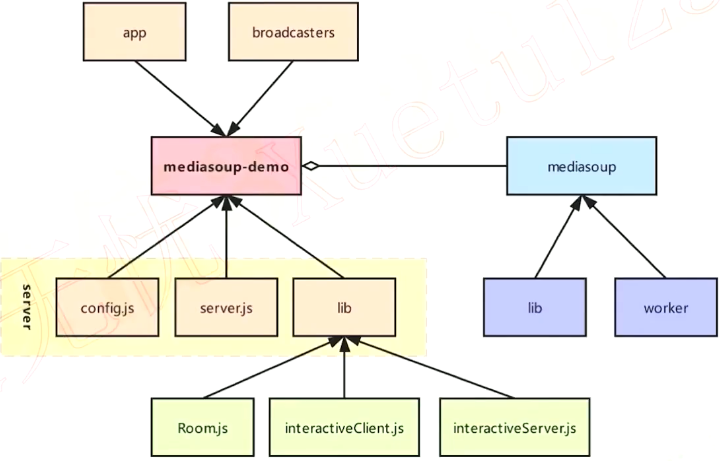
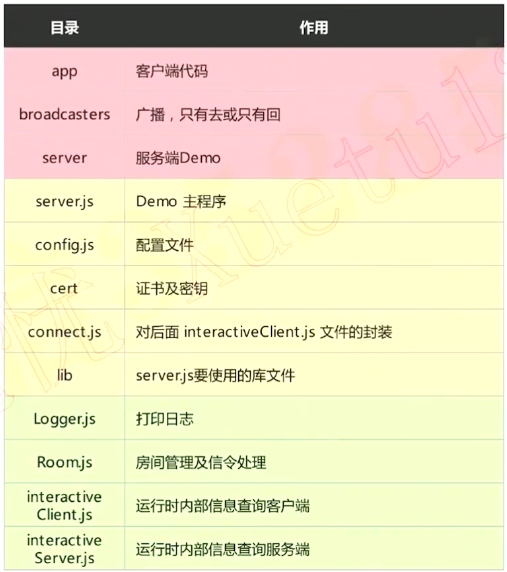

### Mediasoup Demo布署

自行查询安装

#### 服务器环境

* Ubuntu18·04
* Nodejs 10.0以上
* npm6·4·1
* gulp 2.2.0

#### 为什么要使用HTTPS服务

* 个人隐私及安全原因
* https是未来的趋势

HTTPS = HTTP + TLS / SSL

HTTPS基本原理

* 生成HTTPS证书
* 引入HTTPS模块
* 指定证书位置，井创建HTTPS服务

#### 「实战」真正的web服务

* 引用express模块
* 引入serve-index模块
* 指定发布目录

#### Mediasoup Demo分析

####  Demo目录的作用

