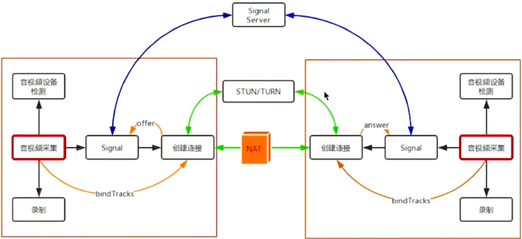
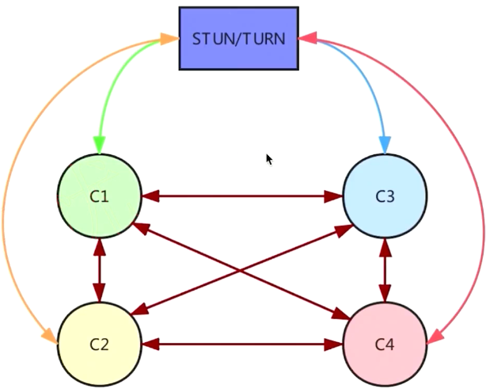
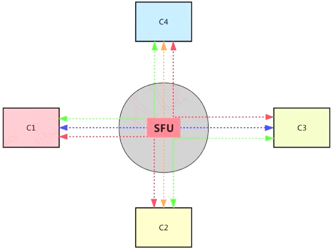
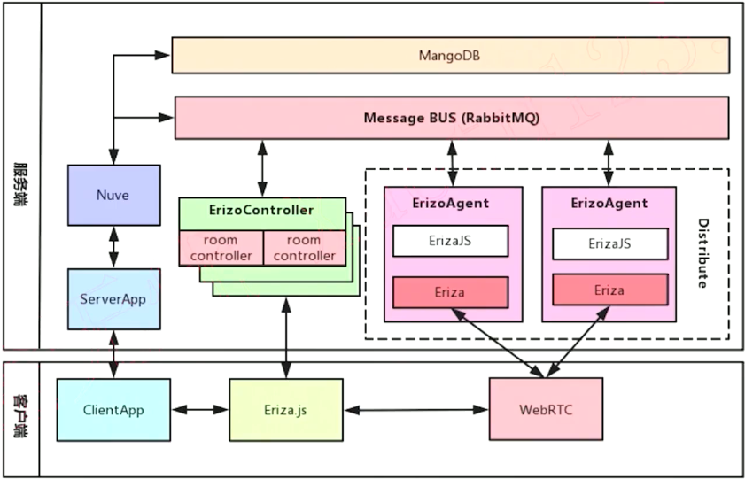
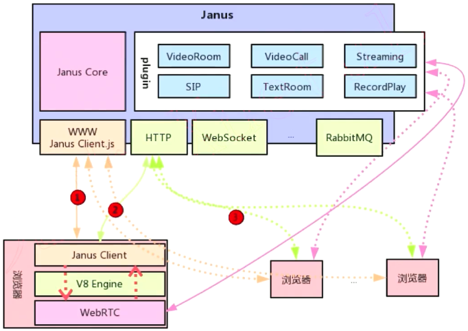
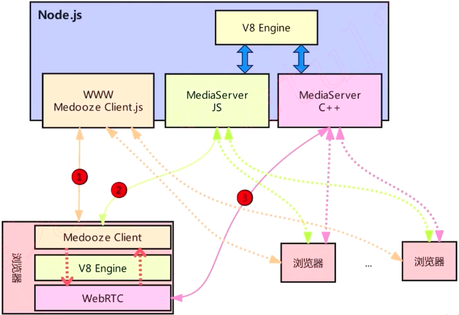
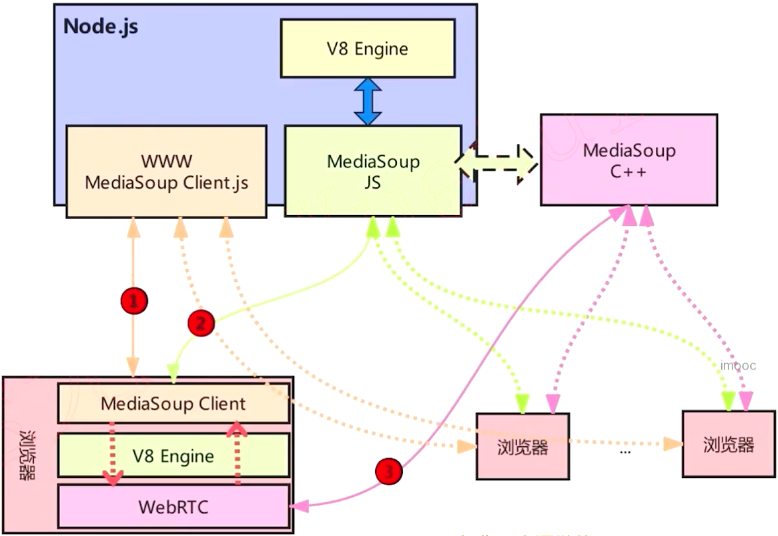

### 各种媒体服务器的比较

#### 多人音视频架构

* Mesh方案
* MCU（MuItipoint Conferencing Unit）方案
* **SFU（SeIective Forwarding Unit**）**方案**

#### 1对1的通信模型

#### Mesh通信模型

#### MCU通信模型

#### SFU通信模型

#### Licode 架构

 

#### Janus SFU 架构

####  Medooze 架构

#### Mediasoup 整体结构

